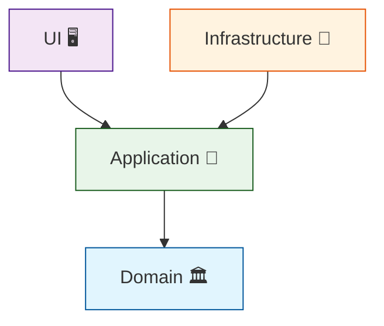

# 第10章：“破れない”最短ルート①：参照を切って守る✂️🚫

この章のゴールはこれだよ〜😊✨
**「うっかり依存関係ルールを破れない状態」を、プロジェクト参照で物理的に作る**こと！💪🧱
ルールを“お願い”じゃなくて“構造”で守るのがポイントだよ〜🚦✨

---

## 1) なんで「参照を切る」が一番強いの？💪🔒

依存関係ルールって、頭では分かってても…
忙しいと **つい** やっちゃうのが人間なんだよね🥹🌀

* Domain から Infra の便利クラスを呼んじゃう😇
* UI から Domain のエンティティを直で触っちゃう😇
* 「一回だけ…」が積み重なって Shared 地獄へ…😇

そこで最強なのがこれ👇
**参照できない＝書きようがない＝破れない** 🧱✨


---

## 2) いまのC#/.NETの“参照のクセ”を知ろう🧠🔗

まず知っておきたい重要ポイント！📌

* **いまの.NET（.NET 5以降）では、ProjectReference が“推移的（transitive）”**
  つまり、`A → B → C` のとき、A から C の型が見えちゃうことがあるよ〜😳
  （.NET Framework時代は基本そうじゃなかった）([Microsoft Learn][1])

そして本章（第10章）のテーマはここ！👇
**「見えちゃう」を“見えない”にして、最短で壊れにくくする**✂️🚫

ちなみに本日時点では **.NET 10 がLTSで、C# 14 が最新**だよ〜✨
（.NET 10 は 2025-11-11 リリース、2026-01-13 時点の最新パッチは 10.0.2）([Microsoft][2])


---

## 3) この章で作る“破れない地図”🗺️🧱

まずは王道の4分割でいこう😊✨

* **Domain**（中心・ルール）🏛️
* **Application**（ユースケース）🧩
* **Infrastructure**（DB/外部API/ファイル等）🧰
* **UI**（Web/API/Consoleなど）🖥️

依存の矢印はこう固定！➡️

* UI ➡️ Application ➡️ Domain
* Infrastructure ➡️ Application（実装で必要なら）
* **Domain は誰にも依存しない**（ここが超重要）🎯

イメージ：



---

## 4) 演習①：まず“参照できない状態”を作る📦🚫✨

### 4-1) プロジェクト構成（例）

* `MyApp.Domain`
* `MyApp.Application`
* `MyApp.Infrastructure`
* `MyApp.UI`（Web APIでもConsoleでもOK）

### 4-2) 参照ルール（いったんこれで）

* Application → Domain ✅
* Infrastructure → Application ✅（Domainにも必要ならOKだけど、後で見直す）
* UI → Application ✅
* **Domain →（何も参照しない）✅**
* **Application → Infrastructure ❌**
* **Domain → Infrastructure ❌**
* **UI → Infrastructure（基本）❌**（やるなら“理由が必要”にする）

---

## 5) 演習②：わざと破って「コンパイルで止まる安心感」を味わう💥😆

### 5-1) 悪い例：Domain から Infrastructure を参照しようとする😈

例えば、Domainで「DB便利クラス」を呼びたくなるやつ…（あるある🥹）

やりたい気持ち：

* Domain の `Order` から `SqlConnection` とか触りたくなる
* もしくは Infrastructure の `OrderRepository` を直接 new したくなる

でも！💡
**Domain プロジェクトが Infrastructure を参照してなければ、そもそも using できない**✨
→ 書けない → 破れない 🧱💕

この「書けないって最高〜」を体験してね😂🎀

---

## 6) “破れない”をさらに強くする：推移参照を切る✂️🚫（ここが本章のキモ！）

さっき言った「推移的に見えちゃう問題」😳
これ、層を守る気持ちが強いほどイヤになるやつ…！

### 6-1) 何が起きるの？（推移参照の例）

* UI が Application を参照
* Application が Domain を参照
* すると UI から Domain の型が見えちゃう（ことがある）😇([Microsoft Learn][1])

これってつまり…

* UI が “本当は触っちゃダメな Domain の型” を触れてしまう
* いつの間にか「UIが業務ルールを直呼び」みたいな事故が起きる💥

```mermaid
graph LR
    UI["UI 🖥️"] --> App["Application 🧩"]
    App --> Dom["Domain 🏛️"]
    UI -.->|"推移的に見えちゃう"| Dom
    note "UIがDomainを知ってしまう！😱"
    style Dom fill:#ffebee,stroke:#c62828
```

### 6-2) 解決策：`DisableTransitiveProjectReferences` を使う✅✨

UI側などの **参照元プロジェクト**に設定すると、
**暗黙的（勝手に）入ってくる ProjectReference を無効化**できるよ！✂️🚫([Microsoft Learn][3])

例：UI の `.csproj` に追加（または共通化でもOK）

```xml
<PropertyGroup>
  <DisableTransitiveProjectReferences>true</DisableTransitiveProjectReferences>
</PropertyGroup>
```

これでどうなる？😊✨

* UI は Application しか見えない
* Domain の型をUIで使いたくなったら、**明示的に参照を追加しないといけない**
* つまり「この依存、ほんとに必要？」をレビューで止めやすくなる🎯

> ドキュメント的にも、この設定は「レガシ（非推移）に近い動作になる」って説明されてるよ〜([Microsoft Learn][3])

### 6-3) 使いどころのおすすめ💡

* **UI には入れる**（強くおすすめ）🖥️✂️
* Application にも入れるかはチーム方針（堅めにしたいならアリ）🧩
* Domain はそもそも参照ゼロが理想なので不要（入れても害は少ないけど）🏛️

---

## 7) ちょい裏ワザ：ビルド順だけ必要で「型は参照したくない」場合🧪🔧

「AはBより後にビルドしたい。でもBの型は使いたくない」
みたいなケース、たまにあるよね（例：コード生成、アセット生成など）👀

そのときに使えるのが `ProjectReference` のメタデータ👇
`ReferenceOutputAssembly=false`（コンパイル参照に入れない）([Microsoft Learn][1])

```xml
<ItemGroup>
  <ProjectReference Include="..\MyApp.Tools\MyApp.Tools.csproj"
                    ReferenceOutputAssembly="false" />
</ItemGroup>
```

こうすると：

* **ビルド順は守る**
* でも **型は参照できない**（＝依存が増えない）✨

※ただし、使いすぎると「なぜ依存してるの？」が分かりづらくなるので、用途は絞ってね🥹📝

---

## 8) 参照の健康診断コマンド🔎🩺（めちゃ便利！）

「いま何を参照してる？」をすぐ見たいとき👇

```bash
dotnet list MyApp.UI/MyApp.UI.csproj reference
```

「推移参照を切ったらどう変わった？」の確認にも使えるよ〜😊✨

---

## 9) AI活用（この章向け）🤖🔎✨

AI導入済み前提なら、ここ超ラクできるよ〜！

### 9-1) 依存の混ざりポイントを見つけさせる

Copilot / Codex にこんな感じで投げる👇

* 「このソリューションで **UIがDomain型を直接触ってる箇所**を列挙して」
* 「Domain が Infrastructure を参照してしまってる箇所がないかチェックして」
* 「今の参照関係から **依存図（矢印）** を作って」

### 9-2) “参照を切る修正案”を出させる

* 「UIからDomain型を排除するために、DTO/UseCase経由に直す案を提案して」
* 「Applicationに置くべきインターフェース候補を抽出して」

> AIの提案は便利だけど、**“依存の向き”だけは人間が最終判断**してね😉🧭

---

## 10) まとめチェック✅🎀

この章をやり切ったら、これが言えれば勝ち〜！🏆✨

* ✅ “参照できない＝破れない” を理解した
* ✅ プロジェクト参照で **Domainを孤立**させられる
* ✅ 推移参照のせいで「見えちゃう問題」が起きうると知った([Microsoft Learn][1])
* ✅ `DisableTransitiveProjectReferences=true` で **暗黙のProjectReferenceを切れる**([Microsoft Learn][3])
* ✅ 必要なら `ReferenceOutputAssembly=false` で「ビルド順だけ」を作れる([Microsoft Learn][1])

---

## 次の第11章へのつながり🔒🧼✨

第10章は「参照を切って物理で守る」だったよね✂️🧱
次の第11章はさらに一段上の守りで、
**public を絞って“漏れ”を防ぐ（公開範囲で守る）**に進むよ〜🔒✨

---

必要なら、この章の演習を **「Web API（UI）＋DB（Infra）＋ユースケース（App）＋ドメイン（Domain）」のミニ題材**で、まるっとサンプル一式（コード＋csproj例＋依存図）にして出すよ😊🧁💻

[1]: https://learn.microsoft.com/en-us/visualstudio/msbuild/common-msbuild-project-items?view=visualstudio "Common MSBuild Project Items - MSBuild | Microsoft Learn"
[2]: https://dotnet.microsoft.com/en-us/platform/support/policy/dotnet-core ".NET and .NET Core official support policy | .NET"
[3]: https://learn.microsoft.com/ja-jp/dotnet/core/project-sdk/msbuild-props "Microsoft.NET.Sdk の MSBuild プロパティ - .NET | Microsoft Learn"
