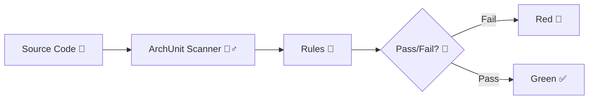

# 第12章：アーキテクチャテスト入門：違反したら検知する🧪🚨

この章は、「依存関係ルール」を**“気合い”じゃなくて仕組みで守る**ための回です💪✨
一度テストを入れると、誰かがうっかり矢印を逆にしても、**自動でブザーが鳴る**ようになります🚨🎺

---

## 1) 今日のゴール🎯💖

* 依存関係ルールを **テストで保証**できるようになる✅
* **最小の“違反検知テスト”を1本**書けるようになる🧫
* 「壊したら赤くなる → 直したら緑」体験ができる🌈✅

---

## 2) アーキテクチャテストってなに？🧠🔍


普通のユニットテストは「計算が合う？」とか「例外になる？」を見ますよね👀
アーキテクチャテストはそれと違って…

> **“構造が守られてる？”（矢印の向き、層の独立、依存の禁止）**を検査します🧭➡️

つまり、「コードの正しさ」だけじゃなくて、
**設計の約束（ルール）**を守れてるかをテストする感じです📐✨



---

## 3) なんで必要なの？（あるある事故）😭💥


* ある日だれかが Domain に Infrastructure を参照追加しちゃう📎😇
* 「一旦動くからOKでしょ〜」で、DbContext とか HttpClient とかが Domain に侵入🧟‍♀️
* 数週間後、「変更が怖い」「テストが重い」「取り返しがつかない」になる😱

だから、**“やっちゃダメ”を自動検知**させます🚨✅

---

## 4) 2026年の“今どき構成”ざっくり🧩✨（最新リサーチ反映）

* .NET は **.NET 10** が現行ライン（ダウンロードページ） ([Microsoft][1])
* Visual Studio は **Visual Studio 2026（18.x）** が出ています ([Microsoft Learn][2])
* 依存関係のアーキテクチャテスト用ライブラリは、

  * **NetArchTest.Rules**は「最新 1.3.2（古め）」 ([NuGet][3])
  * 改良版の **NetArchTest.eNhancedEdition** は「最新 1.4.5」 ([NuGet][4])
  * もう少し強力寄りなら **ArchUnitNET**（xUnit v3拡張もあり） ([NuGet][5])

この章では、**導入が軽くて分かりやすい NetArchTest.eNhancedEdition** でいきます🧁✨

---

## 5) 演習：最小の「違反検知テスト」を1本入れる🧫✅

### 5-1) テストプロジェクトを追加する➕🧪

ソリューションで：

* 右クリック → **追加** → **新しいプロジェクト**
* “xUnit テスト プロジェクト” を選ぶ（名前例：`MyApp.ArchTests`）🧪✨

そしてテストプロジェクトから、次を **プロジェクト参照**します📎
（例：Domain / Application / Infrastructure / UI）

---

### 5-2) NuGet を入れる📦✨

テストプロジェクトに追加するもの（例）：

* `NetArchTest.eNhancedEdition`（アーキテクチャ検査） ([NuGet][4])
* （必要に応じて）xUnit関連・テストSDK

  * `Microsoft.NET.Test.Sdk`（例：18.0.1） ([NuGet][6])
  * `xunit.runner.visualstudio`（例：3.1.5） ([NuGet][7])

> ※VSのテンプレがすでに入れてくれることも多いです😊
> もし動かなければ、上のパッケージを足すのが早いです💨

---

### 5-3) “違反検知テスト”を1本書く✍️🚨

狙いはこれ👇
**「Domain は、外側（Infrastructure/UI）に依存してはいけない」**🧭➡️🚫

テストプロジェクトに `ArchitectureTests.cs` を作って、こんな感じで書きます👇
（プロジェクト名・名前空間はあなたのに合わせて置き換えてね🧸）

```csharp
using System.Reflection;
using NetArchTest.Rules;
using Xunit;

// 例：MyApp.Domain の適当な型を1つ指定して Assembly を取るためのダミー
// ここはあなたの Domain プロジェクトに実在する型名に変えてね！
using MyApp.Domain; 

namespace MyApp.ArchTests;

public class ArchitectureTests
{
    private static readonly Assembly DomainAssembly = typeof(SomeDomainType).Assembly;

    [Fact]
    public void Domain_should_not_depend_on_outer_layers()
    {
        // Domain 内の型たちを対象にして…
        var result = Types.InAssembly(DomainAssembly)
            .That()
            .ResideInNamespaceStartingWith("MyApp.Domain")
            .ShouldNot()
            .HaveDependencyOnAny(
                "MyApp.Infrastructure",
                "MyApp.UI"
            )
            .GetResult();

        // 失敗した型が分かるので、直す場所がすぐ見える✨
        Assert.True(
            result.IsSuccessful,
            "Domainが外側に依存しちゃってるよ〜😭\n" +
            string.Join("\n", result.FailingTypes.Select(t => $"{t.FullName} -> {t.Explanation}"))
        );
    }
}
```

#### ポイント解説🍓

* `DomainAssembly` を取ってきて、その中の型に対してチェックしてます👀
* `HaveDependencyOnAny(...)` のところに **禁止したい依存先**を並べます🚫
* 失敗したら `FailingTypes` と `Explanation` で「何が悪いか」が出ます🔍✨（超親切）

---

### 5-4) わざと壊して、赤くしてみよう❤️‍🔥🚨（超おすすめ）


やることはシンプル👇

1. **（一瞬だけ）Domain → Infrastructure の参照を追加**してみる📎😈
2. テスト実行 → **赤くなる**🚨
3. 参照を消す → **緑に戻る**✅🌿

この「赤→緑」を体験すると、
**“設計が守られてる安心感”**が一気に分かります💖✨

---

## 6) ついでに入れると強い“定番ルール”セット📋✨


最初から全部やるとしんどいので、**上から順に1本ずつ**がオススメです🍰💕

### ルール案A：Application は UI/Infrastructure を知らない🧠🚫

* Application → Domain（OK）
* Application → Infrastructure/UI（NG）

### ルール案B：Infrastructure は “実装置き場”🧰✅

* Infrastructure は Domain/Application に依存してOK
* でも Domain は Infrastructure を知らない（さっきのやつ）🧭

### ルール案C：禁じたい“外側っぽいライブラリ”を Domain から締め出す🔒

例：

* `Microsoft.EntityFrameworkCore`
* `Microsoft.AspNetCore`
* `Microsoft.Extensions.*`（ログ・DI・設定など）

> こういうのが Domain に入った瞬間、設計が汚れやすいです🫧💦

---

## 7) テストが落ちたときの直し方テンプレ🧯✨

1. **FailingTypes の型名**を見る👀
2. `Explanation` を読む（何に依存してるか出る）🔍
3. だいたいはこのどれか👇

   * 置き場所が違う（Domainに置いちゃった）📦
   * インターフェースが外側にある（中心に戻す）🧷
   * 組み立て（new/DI）が中心に混ざった（外側へ移す）🏗️

---

## 8) AI（Copilot / Codex等）に手伝わせるコツ🤖🪄

### 8-1) まず“設計ルール”を文章で渡す📮✨

プロンプト例（そのまま使ってOK）👇

```text
C#のアーキテクチャテストを書きたいです。
ルール：MyApp.Domain は MyApp.Infrastructure と MyApp.UI に依存してはいけません。
NetArchTest.eNhancedEdition と xUnit を使って、失敗した型名と依存理由が分かるメッセージで Assert するテストを1本ください。
```

### 8-2) 出てきたコードは“ここだけ必ず見る”✅

* `Assembly` の取り方があなたのプロジェクトに合ってるか？（型名！）
* `ResideInNamespace...` の条件が広すぎ/狭すぎないか？
* 禁止依存の文字列が正しいか？（名前空間/アセンブリ名）

AIは早いけど、**最後の調整は人間の仕事**です🧑‍🔧💖

---

## 9) まとめ🏁🎀


* アーキテクチャテストは「設計ルールの自動警備員」👮‍♀️🚨
* まずは **1本だけ**入れて「赤→緑」を体験するのが最強🌈✅
* ルールは増やしすぎないで、**守りたい中核から順に**🍰✨

---

次の章（第13章）は **Shared地獄**を避ける話に入ります📦⚠️
アーキテクチャテストがあると、Sharedが増殖しはじめた瞬間も検知しやすくなるよ〜！🧪💖

[1]: https://dotnet.microsoft.com/en-US/download/dotnet/10.0?utm_source=chatgpt.com "Download .NET 10.0 (Linux, macOS, and Windows) | .NET"
[2]: https://learn.microsoft.com/en-us/visualstudio/releases/2026/release-notes?utm_source=chatgpt.com "Visual Studio 2026 Release Notes"
[3]: https://www.nuget.org/packages/NetArchTest.Rules/?utm_source=chatgpt.com "NetArchTest.Rules 1.3.2"
[4]: https://www.nuget.org/packages/NetArchTest.eNhancedEdition?utm_source=chatgpt.com "NetArchTest.eNhancedEdition 1.4.5"
[5]: https://www.nuget.org/packages/TngTech.ArchUnitNET?utm_source=chatgpt.com "TngTech.ArchUnitNET 0.13.1"
[6]: https://www.nuget.org/packages/microsoft.net.test.sdk?utm_source=chatgpt.com "Microsoft.NET.Test.Sdk 18.0.1"
[7]: https://www.nuget.org/packages/xunit.runner.visualstudio "
        NuGet Gallery
        \| xunit.runner.visualstudio 3.1.5
    "
