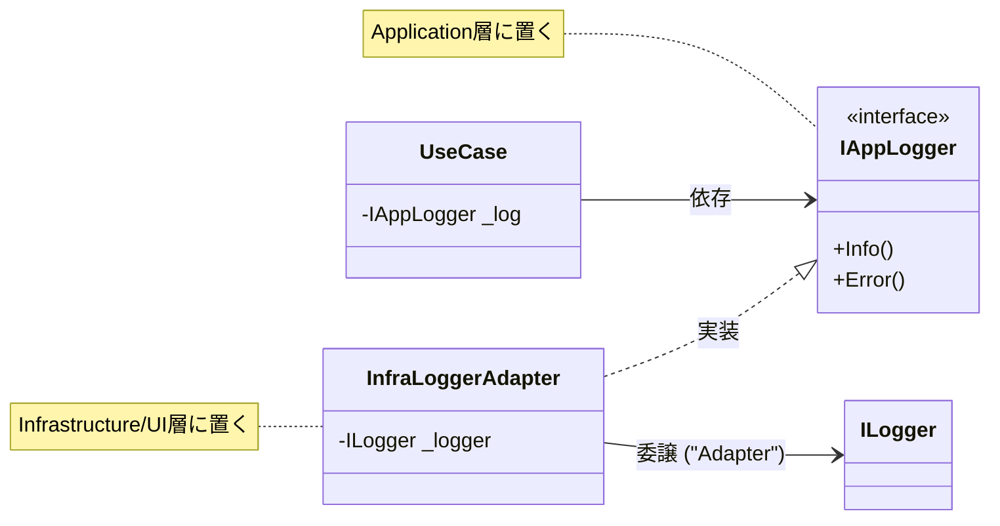

# 第15章：横断関心の扱い：ログ・設定・例外を中心に混ぜない🧼🧩

この章は「Dependency Rule（矢印の向きを固定する🧭➡️）」を守りながら、**ログ📈／設定⚙️／例外💥**みたいな“横断関心”をキレイに扱うコツをまとめるよ〜！😊🎀
横断関心って便利なんだけど、**中心（Domain / Application）に混ざると一気に設計が崩れやすい**のが罠…😇🌀

---

## 15-1 横断関心ってなに？どこが危ないの？🧩⚠️


横断関心 = どの機能にも「横から」関わってくるもの🧵✨
たとえば…

* ログ📈（いつ・誰が・何した？）
* 設定⚙️（上限値、接続文字列、機能ON/OFF）
* 例外💥（落ちた！どう返す？どう記録する？）

### ありがちな事故😱

* Domain が `ILogger` や `IConfiguration` を参照し始める
  → **中心がフレームワーク都合に引っ張られる**（矢印が逆流）🧟‍♀️
* Domain が「HTTP 404 とか 500」とか言い始める
  → **ドメインの言葉が壊れる**（ビジネスの世界にWebの都合が侵入）🫠

ここでの合言葉はこれ👇
✅ **中心は“方針と言葉”だけ**（ビジネスの世界）🧠✨
✅ **外側が“観測・変換・接続”を担当**（ログ・HTTP・DB）🔌🛠️

---

## 15-2 ログ：観測は大事。でも中心を汚さない📈🧼✨

### ログの基本（超ざっくり）📌

ログは “あとで調べるための足あと”👣
ASP.NET Core の標準は `ILogger<T>` で、仕組み（インターフェース＆実装）も整ってるよ〜🧰✨ ([Microsoft Learn][1])

ただし！
**Domain に `ILogger` を持ち込むのは避けたい**🙅‍♀️💦
（Domain は「注文」「在庫」「会員」みたいな“世界のルール”だけで生きたい🌏）

---

### ✅ よくあるNG例（Domain が汚れる）😇🧨

```csharp
// Domain に置いちゃダメ寄り…🥲（フレームワーク都合が混ざる）
public class Order
{
    private readonly ILogger<Order> _logger; // ←汚れポイント
}
```

---

### ✅ OKパターンA：ログは “外側（API/UI）で取る” 🧱➡️📈

**ログを取る場所のおすすめ**はこの3つ👇

1. **入口ログ**（HTTPリクエスト受けた瞬間）🚪
2. **ユースケースログ**（注文作成などの“操作”単位）🧠
3. **出口ログ**（HTTPレスポンス返す瞬間）🚪➡️

入口/出口は **API側（外側）**が一番自然だよ😊✨

---

### ✅ OKパターンB：Application に “自前のログ口（Port）”を置く🧷🎯


「ユースケース単位でログは欲しい。でも `ILogger` 依存は持ち込みたくない」
そんな時は **Application にログ用インターフェースを定義**して、外側で実装（Adapter）するのがキレイ✨



#### ① Application 側：ログの口（Port）を用意🧷

```csharp
// MyApp.Application
public interface IAppLogger
{
    void Info(string messageTemplate, params object[] args);
    void Error(Exception ex, string messageTemplate, params object[] args);
}
```

#### ② Application 側：ユースケースで使う🧠📈

```csharp
// MyApp.Application
public sealed class PlaceOrderUseCase
{
    private readonly IAppLogger _log;

    public PlaceOrderUseCase(IAppLogger log)
    {
        _log = log;
    }

    public void Start(int itemCount)
    {
        _log.Info("PlaceOrder started. ItemCount={ItemCount}", itemCount);
    }
}
```

#### ③ 外側（API/Infra）側：`ILogger` で実装（Adapter）🔌

```csharp
// MyApp.Api など外側プロジェクト
public sealed class AppLogger<T> : IAppLogger
{
    private readonly ILogger<T> _logger;

    public AppLogger(ILogger<T> logger)
    {
        _logger = logger;
    }

    public void Info(string messageTemplate, params object[] args)
        => _logger.LogInformation(messageTemplate, args);

    public void Error(Exception ex, string messageTemplate, params object[] args)
        => _logger.LogError(ex, messageTemplate, args);
}
```

`ILogger` は .NET の標準ロギングで、インターフェースは `Microsoft.Extensions.Logging.Abstractions` にあるよ〜という整理もできる👍 ([Microsoft Learn][1])

---

### 🎯 さらに一段キレイ：Decorator で“横からログ”を足す🧁✨

「本体のユースケースを汚さずにログを追加したい」なら、**Decorator（ラップ）**が超相性いい💕

* `PlaceOrderUseCase` は純粋に処理する🧠
* `LoggingPlaceOrderUseCase` が前後でログ取る📈

（この形にすると、後でメトリクス📊やトレース🧵も同じノリで足せるよ〜）

---

## 15-3 設定：境界で“解釈”して、中心には“値”だけ渡す⚙️🧭✨

設定は便利だけど、中心に `IConfiguration` を注入し始めると地獄😇
**中心は「設定の取り方」を知らない**のが理想だよ〜🍀

### ✅ ルール（覚えやすいやつ）🧠📌

* 設定ファイルや環境変数などの“読み取り”は外側で📥
* 文字列や階層構造の“解釈”も外側で🧩
* 中心には「もう使える形の値」だけ渡す🎁

---

### まずは外側で Options パターン（型付き設定）を作る📦✨


ASP.NET Core には **Options パターン**があって、`Bind` と `ValidateDataAnnotations` で「設定を型に束縛＋検証」できるよ✅ ([Microsoft Learn][2])

#### appsettings.json（例）📝

```json
{
  "OrderPolicy": {
    "MaxItemsPerOrder": 10
  }
}
```

#### 外側：設定用クラス（検証つき）🧷✅

```csharp
using System.ComponentModel.DataAnnotations;

public sealed class OrderPolicySettings
{
    [Range(1, 100)]
    public int MaxItemsPerOrder { get; init; } = 10;
}
```

#### 外側：Program.cs で Bind + Validate⚙️✅

```csharp
builder.Services
    .AddOptions<OrderPolicySettings>()
    .Bind(builder.Configuration.GetSection("OrderPolicy"))
    .ValidateDataAnnotations();
```

`IOptionsMonitor` と `IOptionsSnapshot` みたいな “取得方法の違い”もあるよ（Monitorはシングルトンで常に最新、Snapshotはリクエスト単位など）🧠✨ ([Microsoft Learn][2])

---

### ✅ さらにDependency Rule寄り：中心には “ただの値オブジェクト” を渡す🎁✨


Application に “設定そのもの”を渡すんじゃなくて、**使うための値だけ渡す**のが超キレイ😊

```csharp
// MyApp.Application（中心側）
public readonly record struct OrderPolicy(int MaxItemsPerOrder);
```

```csharp
// MyApp.Api（外側）で Settings → Policy に変換して登録
builder.Services.AddSingleton(sp =>
{
    var settings = sp.GetRequiredService<IOptions<OrderPolicySettings>>().Value;
    return new OrderPolicy(settings.MaxItemsPerOrder);
});
```

この形だと、中心は **「設定の読み方」を一切知らない**のに、ちゃんと設定の恩恵は受けられる💖

---

## 15-4 例外：中心は“ドメインの言葉”で返して、外側が翻訳する🗣️🔁✨

### 例外を2種類に分けよう💡

* ✅ **想定内エラー**（入力ミス、在庫不足など）
  → Result（成功/失敗）で返すのが扱いやすい🎁
* 💥 **想定外エラー**（バグ、DB死んだ、null参照など）
  → 例外として落ちる。外側でまとめて捕まえる🪤

---

### ✅ DomainError + Result を作る（超ミニ）🎁🧱

```csharp
// MyApp.Domain
public readonly record struct DomainError(string Code, string Message);

public readonly struct Result<T>
{
    public bool IsSuccess { get; }
    public T? Value { get; }
    public DomainError? Error { get; }

    private Result(bool isSuccess, T? value, DomainError? error)
        => (IsSuccess, Value, Error) = (isSuccess, value, error);

    public static Result<T> Ok(T value) => new(true, value, null);
    public static Result<T> Fail(string code, string message) => new(false, default, new DomainError(code, message));
}
```

#### Domain は HTTP とか知らないでOK🙆‍♀️🌸

```csharp
// MyApp.Domain
public sealed class Order
{
    public Guid Id { get; }
    public int ItemCount { get; }

    private Order(Guid id, int itemCount) => (Id, ItemCount) = (id, itemCount);

    public static Result<Order> Create(Guid id, int itemCount, int maxItems)
    {
        if (itemCount <= 0)
            return Result<Order>.Fail("order.itemCount.invalid", "個数は1以上にしてね🥺");

        if (itemCount > maxItems)
            return Result<Order>.Fail("order.itemCount.tooMany", $"個数は{maxItems}までだよ〜😵");

        return Result<Order>.Ok(new Order(id, itemCount));
    }
}
```

---

### ✅ 外側で “HTTP に翻訳”する（ProblemDetails が便利）🧾✨


ASP.NET Core では **ProblemDetails（RFC 7807）**でエラー応答を揃えられるよ〜！
`AddProblemDetails()` を呼ぶと、いくつかのミドルウェアが ProblemDetails を生成できるようになる（ExceptionHandlerMiddleware / StatusCodePagesMiddleware など）って整理が公式にあるよ📚 ([Microsoft Learn][3])

#### 例：Minimal API で Result を ProblemDetails にする🗣️➡️🧾

```csharp
app.MapPost("/orders", (int itemCount, OrderPolicy policy) =>
{
    var result = Order.Create(Guid.NewGuid(), itemCount, policy.MaxItemsPerOrder);

    if (result.IsSuccess)
        return Results.Ok(new { orderId = result.Value!.Id });

    // 想定内エラーは 400 で返す（例）
    return Results.Problem(
        title: result.Error!.Value.Message,
        statusCode: StatusCodes.Status400BadRequest,
        extensions: new Dictionary<string, object?>
        {
            ["code"] = result.Error.Value.Code
        });
});
```

---

### 💥 想定外例外は “グローバルに捕まえる”🪤✨


ASP.NET Core には例外ハンドリングの仕組みがあって、`UseExceptionHandler` で例外をまとめて処理できるよ📌 ([Microsoft Learn][4])
さらに **`IExceptionHandler`** を使うと、例外をタイプごとに順番に処理できる（複数登録可）って公式の説明があるよ🧠✨ ([Microsoft Learn][5])

#### 外側：例外ハンドラー（超ミニ）🧯

```csharp
using Microsoft.AspNetCore.Diagnostics;
using Microsoft.AspNetCore.Mvc;

public sealed class GlobalExceptionHandler : IExceptionHandler
{
    private readonly ILogger<GlobalExceptionHandler> _logger;

    public GlobalExceptionHandler(ILogger<GlobalExceptionHandler> logger)
    {
        _logger = logger;
    }

    public async ValueTask<bool> TryHandleAsync(HttpContext httpContext, Exception exception, CancellationToken ct)
    {
        _logger.LogError(exception, "Unhandled exception!");

        var problem = new ProblemDetails
        {
            Title = "サーバー側で問題が起きたよ💦",
            Status = StatusCodes.Status500InternalServerError
        };

        httpContext.Response.StatusCode = problem.Status.Value;
        await httpContext.Response.WriteAsJsonAsync(problem, ct);

        return true; // ここで処理完了✅
    }
}
```

#### 外側：Program.cs 登録🧩

```csharp
builder.Services.AddProblemDetails();
builder.Services.AddExceptionHandler<GlobalExceptionHandler>();

var app = builder.Build();
app.UseExceptionHandler(); // ←これが大事！
```

---

### ✅ ちょい最新ポイント：.NET 10 以降の診断ログの抑制オプション🧠🆕

.NET 10 以降は、例外処理ミドルウェアが「処理された例外」の診断出力をどうするかを `SuppressDiagnosticsCallback` で制御できるよ（必要なら従来挙動にも戻せる）📌 ([Microsoft Learn][6])

---

## 15-5 演習：Result/ドメインエラー → 外側でHTTP/例外変換🔁🧪✨

### お題🎀

「注文を作るAPI」を想定して…

1. Domain：`Order.Create()` を Result で返す🎁
2. 外側：成功なら 200、失敗なら 400（ProblemDetails）🧾
3. 想定外例外は `IExceptionHandler` で 500（ProblemDetails）🧯
4. ログは外側で記録📈（最低でも例外は必ず LogError）

### チェックポイント✅

* Domain は `Microsoft.AspNetCore.*` を一切知らない？🙆‍♀️
* Domain は `ILogger` / `IConfiguration` を知らない？🙆‍♀️
* 失敗の理由は「ドメインの言葉」で表現されてる？🗣️
* HTTP への変換は外側だけでやってる？🔁

---

## 15-6 AI活用コーナー🤖💞（そのままコピペで使える）

### ① 横断関心チェックリスト化✅🤖

「このプロジェクト構成（Domain/App/Infra/API）で、ログ・設定・例外が中心を汚さないためのチェックリストを20個作って。NG例も添えて。」

### ② Result→HTTP変換の設計案🧾🤖

「DomainError(Code/Message) を、HTTPステータスとProblemDetailsにマッピングするルール案を作って。Code別に例も。」

### ③ “汚れ”検出🔎🤖

「このリポジトリの Domain プロジェクトに `Microsoft.Extensions.*` や `System.Net.*` 依存が入ってないか探す観点を出して。見つけたときの直し方も。」

---

## 15-7 まとめ：この章の“合言葉”🧼✨

* ログ📈：**観測は外側**。必要なら Application に Port を作って Adapter でつなぐ🧷🔌 ([Microsoft Learn][1])
* 設定⚙️：**外側でBind/Validate**して、中心には“使える値”だけ渡す🎁 ([Microsoft Learn][2])
* 例外💥：**想定内はResult、想定外はグローバル捕捉**。ProblemDetailsで揃える🧾🧯 ([Microsoft Learn][3])

---

次の章（第16章）では、ここまでの守り方を全部のせして「小さく完成させて、守り続ける」ミニプロジェクトに行くよ〜🏁🎀✨

[1]: https://learn.microsoft.com/en-us/aspnet/core/fundamentals/logging/?view=aspnetcore-10.0 "Logging in .NET and ASP.NET Core | Microsoft Learn"
[2]: https://learn.microsoft.com/ja-jp/aspnet/core/fundamentals/configuration/options?view=aspnetcore-10.0 "ASP.NET Core のオプション パターン | Microsoft Learn"
[3]: https://learn.microsoft.com/ja-jp/aspnet/core/fundamentals/error-handling-api?view=aspnetcore-10.0&utm_source=chatgpt.com "ASP.NET Core API のエラーを処理する"
[4]: https://learn.microsoft.com/en-us/aspnet/core/fundamentals/error-handling-api?view=aspnetcore-10.0&utm_source=chatgpt.com "Handle errors in ASP.NET Core APIs"
[5]: https://learn.microsoft.com/en-us/dotnet/api/microsoft.extensions.dependencyinjection.exceptionhandlerservicecollectionextensions.addexceptionhandler?view=aspnetcore-10.0 "ExceptionHandlerServiceCollectionExtensions.AddExceptionHandler Method (Microsoft.Extensions.DependencyInjection) | Microsoft Learn"
[6]: https://learn.microsoft.com/ja-jp/aspnet/core/fundamentals/error-handling?view=aspnetcore-10.0 "ASP.NET Core のエラーを処理する | Microsoft Learn"
