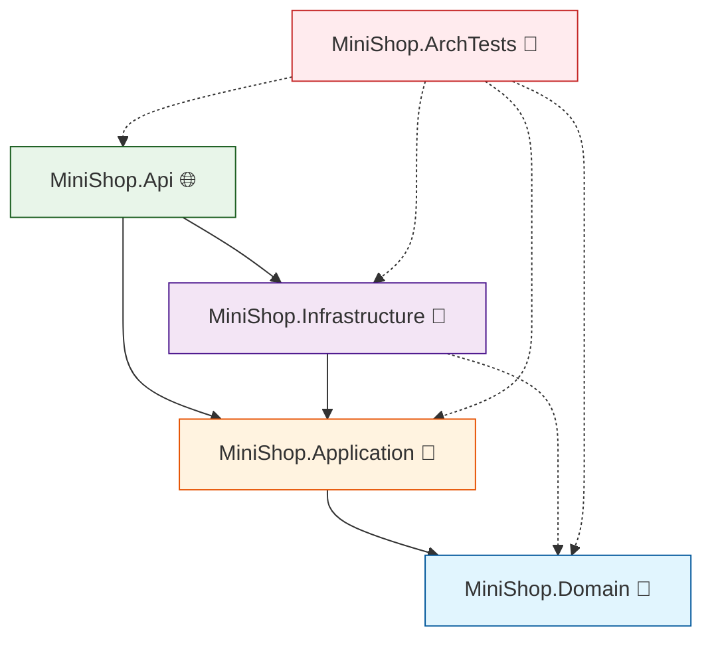

# 第16章：仕上げプロジェクト：小さく作って、守り続ける🏁🎀

この章は「**完成させる**」だけじゃなくて、**完成したあともずーっと壊れにくくする**のがゴールだよ〜！😊💪🌸
（そして今の最新ど真ん中は **.NET 10 / C# 14 / Visual Studio 2026** 世代だよ✨） ([Microsoft][1])

---

## 16.1 今回作るミニ題材：ミニ注文API🛒🍰✨


題材はシンプルに👇😊

* 注文を作る（`POST /orders`）🛒
* 注文を見る（`GET /orders/{id}`）👀
* でも設計はちゃんと「中心が強い」構造にする🧭🧱✨

**4プロジェクト + テスト**に分けるよ〜！📦💕

* `MiniShop.Domain`（中心：業務ルール）🧠
* `MiniShop.Application`（中心寄り：ユースケース）🎯
* `MiniShop.Infrastructure`（外側：DBなど詳細）🧰
* `MiniShop.Api`（外側：HTTP）🌐
* `MiniShop.ArchTests`（守り続けるための仕組み）🧪🚨

依存の矢印はこう！➡️😊

* Domain ← Application ← Infrastructure ← Api
* **中心（Domain / Application）は外側を知らない**🙅‍♀️✨



---

## 16.2 ソリューションを作る📦🛠️✨

### A) クリックで作る（Visual Studio）🖱️💖

1. 新しいソリューション作成（空のソリューション）📁✨
2. `Class Library` を3つ作る：Domain / Application / Infrastructure 📦📦📦
3. `ASP.NET Core Web API` を1つ作る：Api 🌐
4. `xUnit Test Project` を1つ作る：ArchTests 🧪

**参照（Project Reference）**はこう設定するよ🚦➡️

* Application → Domain ✅
* Infrastructure → Application ✅
* Infrastructure → Domain ✅（マッピングで使う場合）
* Api → Infrastructure ✅
* Api → Application ✅
* ArchTests →（全部）✅（監視役だからOK）🕵️‍♀️

---

### B) コマンドで作る（dotnet CLI）⌨️✨

```powershell
mkdir MiniShop
cd MiniShop

dotnet new sln -n MiniShop
dotnet new classlib -n MiniShop.Domain
dotnet new classlib -n MiniShop.Application
dotnet new classlib -n MiniShop.Infrastructure
dotnet new web -n MiniShop.Api
dotnet new xunit -n MiniShop.ArchTests

dotnet sln add .\MiniShop.Domain\MiniShop.Domain.csproj
dotnet sln add .\MiniShop.Application\MiniShop.Application.csproj
dotnet sln add .\MiniShop.Infrastructure\MiniShop.Infrastructure.csproj
dotnet sln add .\MiniShop.Api\MiniShop.Api.csproj
dotnet sln add .\MiniShop.ArchTests\MiniShop.ArchTests.csproj

dotnet add .\MiniShop.Application\MiniShop.Application.csproj reference .\MiniShop.Domain\MiniShop.Domain.csproj
dotnet add .\MiniShop.Infrastructure\MiniShop.Infrastructure.csproj reference .\MiniShop.Application\MiniShop.Application.csproj
dotnet add .\MiniShop.Infrastructure\MiniShop.Infrastructure.csproj reference .\MiniShop.Domain\MiniShop.Domain.csproj
dotnet add .\MiniShop.Api\MiniShop.Api.csproj reference .\MiniShop.Application\MiniShop.Application.csproj
dotnet add .\MiniShop.Api\MiniShop.Api.csproj reference .\MiniShop.Infrastructure\MiniShop.Infrastructure.csproj

dotnet add .\MiniShop.ArchTests\MiniShop.ArchTests.csproj reference .\MiniShop.Domain\MiniShop.Domain.csproj
dotnet add .\MiniShop.ArchTests\MiniShop.ArchTests.csproj reference .\MiniShop.Application\MiniShop.Application.csproj
dotnet add .\MiniShop.ArchTests\MiniShop.ArchTests.csproj reference .\MiniShop.Infrastructure\MiniShop.Infrastructure.csproj
dotnet add .\MiniShop.ArchTests\MiniShop.ArchTests.csproj reference .\MiniShop.Api\MiniShop.Api.csproj
```

---

## 16.3 Domain：業務ルールはここだけ🧠💎✨

### 目標🎯

* 注文の「正しさ」は Domain が守る😊✅
* 外側の都合（HTTP/DB/ログ）を混ぜない🧼✨

`MiniShop.Domain` に追加してね👇

### Order（集約）🛒

```csharp
namespace MiniShop.Domain;

public enum OrderStatus
{
    Draft = 0,
    Placed = 1
}

public sealed record OrderLine(string Sku, decimal UnitPrice, int Quantity)
{
    public decimal LineTotal => UnitPrice * Quantity;
}

public sealed class Order
{
    private readonly List<OrderLine> _lines = new();

    public Guid Id { get; }
    public Guid UserId { get; }
    public OrderStatus Status { get; private set; } = OrderStatus.Draft;

    public IReadOnlyList<OrderLine> Lines => _lines;
    public decimal Total => _lines.Sum(x => x.LineTotal);

    private Order(Guid id, Guid userId)
    {
        Id = id;
        UserId = userId;
    }

    public static Order Create(Guid userId) => new(Guid.NewGuid(), userId);

    // DBから復元したい時用（外側が使う想定）
    public static Order Rehydrate(Guid id, Guid userId, OrderStatus status, IEnumerable<OrderLine> lines)
    {
        var order = new Order(id, userId);
        foreach (var line in lines) order._lines.Add(line);
        order.Status = status;
        return order;
    }

    public void AddLine(string sku, decimal unitPrice, int quantity)
    {
        if (string.IsNullOrWhiteSpace(sku)) throw new ArgumentException("SKU is required.", nameof(sku));
        if (unitPrice <= 0) throw new ArgumentOutOfRangeException(nameof(unitPrice), "UnitPrice must be > 0.");
        if (quantity <= 0) throw new ArgumentOutOfRangeException(nameof(quantity), "Quantity must be > 0.");

        _lines.Add(new OrderLine(sku.Trim(), unitPrice, quantity));
    }

    public void Place()
    {
        if (_lines.Count == 0) throw new InvalidOperationException("Order must have at least 1 line.");
        Status = OrderStatus.Placed;
    }
}
```

📝ポイント😊

* **正しさのチェック**は Domain の責任✅
* 例外は「中心の言葉」っぽいままでOK（外側で翻訳するよ）🗣️🔁

---

## 16.4 Application：ユースケース（やりたいこと）を固定する🎯🧩✨

`MiniShop.Application` に追加するよ〜😊

### Port（I/F）＋ UseCase 🧷🛠️

```csharp
using MiniShop.Domain;

namespace MiniShop.Application;

public interface IOrderRepository
{
    Task AddAsync(Order order, CancellationToken ct = default);
    Task<Order?> FindAsync(Guid id, CancellationToken ct = default);
}

public sealed record PlaceOrderLine(string Sku, decimal UnitPrice, int Quantity);
public sealed record PlaceOrderCommand(Guid UserId, IReadOnlyList<PlaceOrderLine> Lines);

public sealed class PlaceOrderHandler
{
    private readonly IOrderRepository _orders;

    public PlaceOrderHandler(IOrderRepository orders)
    {
        _orders = orders;
    }

    public async Task<Guid> HandleAsync(PlaceOrderCommand cmd, CancellationToken ct = default)
    {
        var order = Order.Create(cmd.UserId);

        foreach (var line in cmd.Lines)
        {
            order.AddLine(line.Sku, line.UnitPrice, line.Quantity);
        }

        order.Place();

        await _orders.AddAsync(order, ct);
        return order.Id;
    }
}
```

🎀ここが「中心寄り」な感じだよ😊

* 何をするか（注文を作る）を **ここで固定**🎯
* DBの事情は知らない🙅‍♀️🧼

---

## 16.5 Infrastructure：詳細は差し替え可能に🧰🔁✨

今回は「ちゃんとDBっぽい」達成感も欲しいので、**SQLite + EF Core**でいくよ〜！🐣➡️🐥✨
EF Core は **10.0.2** 世代が最新ラインだよ〜 ([NuGet][2])

### パッケージ追加📦✨

```powershell
dotnet add .\MiniShop.Infrastructure\MiniShop.Infrastructure.csproj package Microsoft.EntityFrameworkCore
dotnet add .\MiniShop.Infrastructure\MiniShop.Infrastructure.csproj package Microsoft.EntityFrameworkCore.Sqlite
```

### DB用の型（Row）＋ DbContext 🗄️✨

`MiniShop.Infrastructure` に追加👇

```csharp
using Microsoft.EntityFrameworkCore;

namespace MiniShop.Infrastructure;

internal sealed class OrderRow
{
    public Guid Id { get; set; }
    public Guid UserId { get; set; }
    public string Status { get; set; } = "Draft";
    public List<OrderLineRow> Lines { get; set; } = new();
}

internal sealed class OrderLineRow
{
    public int Id { get; set; }
    public Guid OrderId { get; set; }
    public string Sku { get; set; } = "";
    public decimal UnitPrice { get; set; }
    public int Quantity { get; set; }
}

public sealed class ShopDbContext : DbContext
{
    public DbSet<OrderRow> Orders => Set<OrderRow>();
    public DbSet<OrderLineRow> OrderLines => Set<OrderLineRow>();

    public ShopDbContext(DbContextOptions<ShopDbContext> options) : base(options) { }

    protected override void OnModelCreating(ModelBuilder modelBuilder)
    {
        modelBuilder.Entity<OrderRow>(b =>
        {
            b.ToTable("Orders");
            b.HasKey(x => x.Id);
            b.Property(x => x.Status).HasMaxLength(32);

            b.HasMany(x => x.Lines)
             .WithOne()
             .HasForeignKey(x => x.OrderId)
             .OnDelete(DeleteBehavior.Cascade);
        });

        modelBuilder.Entity<OrderLineRow>(b =>
        {
            b.ToTable("OrderLines");
            b.HasKey(x => x.Id);
            b.Property(x => x.Sku).HasMaxLength(64);
            b.Property(x => x.UnitPrice).HasPrecision(18, 2);
        });
    }
}
```

### Repository（I/Fの実装）🔁🧩

```csharp
using Microsoft.EntityFrameworkCore;
using MiniShop.Application;
using MiniShop.Domain;

namespace MiniShop.Infrastructure;

public sealed class EfOrderRepository : IOrderRepository
{
    private readonly ShopDbContext _db;

    public EfOrderRepository(ShopDbContext db)
    {
        _db = db;
    }

    public async Task AddAsync(Order order, CancellationToken ct = default)
    {
        var row = new OrderRow
        {
            Id = order.Id,
            UserId = order.UserId,
            Status = order.Status.ToString(),
            Lines = order.Lines.Select(l => new OrderLineRow
            {
                Sku = l.Sku,
                UnitPrice = l.UnitPrice,
                Quantity = l.Quantity,
                OrderId = order.Id
            }).ToList()
        };

        _db.Orders.Add(row);
        await _db.SaveChangesAsync(ct);
    }

    public async Task<Order?> FindAsync(Guid id, CancellationToken ct = default)
    {
        var row = await _db.Orders.AsNoTracking()
            .Include(x => x.Lines)
            .FirstOrDefaultAsync(x => x.Id == id, ct);

        if (row is null) return null;

        var status = Enum.TryParse<OrderStatus>(row.Status, out var s) ? s : OrderStatus.Draft;
        var lines = row.Lines.Select(l => new OrderLine(l.Sku, l.UnitPrice, l.Quantity));

        return Order.Rehydrate(row.Id, row.UserId, status, lines);
    }
}
```

💡ここが気持ちいいポイント😊

* Application の `IOrderRepository` を **Infrastructure が実装**する
* Domain / Application は **EF Core を知らない**🙅‍♀️✨

---

## 16.6 Api：Composition Root（組み立て）をここに集約🏗️🌐✨

`MiniShop.Api` の `Program.cs` を整えるよ😊

```csharp
using Microsoft.EntityFrameworkCore;
using MiniShop.Application;
using MiniShop.Infrastructure;

var builder = WebApplication.CreateBuilder(args);

// DB
builder.Services.AddDbContext<ShopDbContext>(opt =>
    opt.UseSqlite("Data Source=shop.db"));

// DI（外側で組み立てる！）
builder.Services.AddScoped<IOrderRepository, EfOrderRepository>();
builder.Services.AddScoped<PlaceOrderHandler>();

var app = builder.Build();

// 起動時にDB作成（学習用にサクッと）
using (var scope = app.Services.CreateScope())
{
    var db = scope.ServiceProvider.GetRequiredService<ShopDbContext>();
    db.Database.EnsureCreated();
}

// DTO（境界の箱）📦
record CreateOrderRequest(Guid UserId, List<CreateOrderLineRequest> Lines);
record CreateOrderLineRequest(string Sku, decimal UnitPrice, int Quantity);

app.MapPost("/orders", async (CreateOrderRequest req, PlaceOrderHandler handler, CancellationToken ct) =>
{
    var cmd = new PlaceOrderCommand(
        req.UserId,
        req.Lines.Select(x => new PlaceOrderLine(x.Sku, x.UnitPrice, x.Quantity)).ToList()
    );

    try
    {
        var id = await handler.HandleAsync(cmd, ct);
        return Results.Created($"/orders/{id}", new { id });
    }
    catch (Exception ex)
    {
        // 学習用：中心の例外を外側の言葉に翻訳するイメージ
        return Results.BadRequest(new { message = ex.Message });
    }
});

app.MapGet("/orders/{id:guid}", async (Guid id, IOrderRepository repo, CancellationToken ct) =>
{
    var order = await repo.FindAsync(id, ct);
    if (order is null) return Results.NotFound();

    return Results.Ok(new
    {
        order.Id,
        order.UserId,
        order.Status,
        order.Total,
        Lines = order.Lines.Select(l => new { l.Sku, l.UnitPrice, l.Quantity, l.LineTotal })
    });
});

app.Run();
```

🧡ここで大事なのはこれ！

* **DI登録・DB設定・HTTP**は全部外側（Api）に押し込む🏗️✨
* 中心はスッキリ保つ🧼🌸

---

## 16.7 動作チェック（わーい動いた！）🎉🧪✨

### 注文を作る🛒

```powershell
curl -X POST http://localhost:5000/orders ^
  -H "Content-Type: application/json" ^
  -d "{\"userId\":\"00000000-0000-0000-0000-000000000001\",\"lines\":[{\"sku\":\"CAKE-001\",\"unitPrice\":450,\"quantity\":2}]}"
```

返ってきた `id` を使って👇

### 注文を見る👀

```powershell
curl http://localhost:5000/orders/{id}
```

---

## 16.8 守り続ける：アーキテクチャテストで「破れない」状態にする🧪🚨🧱

ここがこの章の本番だよ〜！🔥😊
「気をつける」じゃなくて、**破ったら落ちる仕組み**にする✅

### パッケージ追加（NetArchTest）📦

NetArchTest はテストで依存ルールを縛れるやつだよ〜🧪✨ ([NuGet][3])

```powershell
dotnet add .\MiniShop.ArchTests\MiniShop.ArchTests.csproj package NetArchTest.Rules
```

### 依存ルールをテストにする🚦➡️

`MiniShop.ArchTests` に追加👇

```csharp
using NetArchTest.Rules;
using Xunit;

namespace MiniShop.ArchTests;

public class DependencyRuleTests
{
    [Fact]
    public void Domain_should_not_depend_on_outer_layers()
    {
        var asm = typeof(MiniShop.Domain.Order).Assembly;

        Assert.True(
            Types.InAssembly(asm).ShouldNot().HaveDependencyOn("MiniShop.Infrastructure").GetResult().IsSuccessful,
            "Domain must not depend on Infrastructure"
        );

        Assert.True(
            Types.InAssembly(asm).ShouldNot().HaveDependencyOn("MiniShop.Api").GetResult().IsSuccessful,
            "Domain must not depend on Api"
        );
    }

    [Fact]
    public void Application_should_not_depend_on_outer_layers()
    {
        var asm = typeof(MiniShop.Application.PlaceOrderHandler).Assembly;

        Assert.True(
            Types.InAssembly(asm).ShouldNot().HaveDependencyOn("MiniShop.Infrastructure").GetResult().IsSuccessful,
            "Application must not depend on Infrastructure"
        );

        Assert.True(
            Types.InAssembly(asm).ShouldNot().HaveDependencyOn("MiniShop.Api").GetResult().IsSuccessful,
            "Application must not depend on Api"
        );
    }
}
```

✨これで何が嬉しいの？😊

* うっかり Domain に EF Core を混ぜたら… **テストが落ちる**💥
* つまり「気合」じゃなくて「仕組み」で守れる🧱✅

---

## 16.9 PRテンプレ（レビュー観点）をAIに作らせて運用へ🤖📝✨

ここからは「継続の勝ち」だよ〜🏆😊

### AIに投げるプロンプト例💬✨

* 「このソリューションの依存関係ルールを、PRレビュー用チェックリストにして。Domain/Applicationが外側に依存してないか、I/Fの置き場所、Composition Root、DTO境界も含めて」🤖✅
* 「`MiniShop.ArchTests` に追加すべきテストケースを提案して。違反例も1つ入れて」🧪🧠
* 「`Program.cs` が肥大化しそう。責務ごとに拡張メソッドで整理しても依存関係ルールが壊れない構成を提案して」🧹✨

---

## 16.10 最終チェックリスト（自己レビュー用）✅🎀

リリース前に、これだけ見ればOK〜！😊✨

* [ ] Domain が **Infrastructure / Api** を参照してない？🙅‍♀️
* [ ] Application が **Infrastructure / Api** を参照してない？🙅‍♀️
* [ ] I/F（Port）は中心側（Application）にある？🧷
* [ ] DIの組み立てが Api に集約されてる？🏗️
* [ ] HTTPのDTOが Domain に漏れてない？📦🫧
* [ ] アーキテクチャテストがある？（落ちて守れる）🧪🚨

---

## 16.11 おまけ：今の世代の「軸」メモ🗓️✨

* .NET 10 の最新SDKは **10.0.2（2026-01-13）** ([Microsoft][1])
* C# は **C# 14** が最新ライン ([Microsoft Learn][4])
* Visual Studio は **Visual Studio 2026**（1月更新 18.2.0 が 2026-01-13） ([Microsoft Learn][5])
* .NET 10 は LTS として 3年サポート枠の案内があるよ ([GitHub][6])

---

ここまでできたら、もう「依存関係ルール」を**知ってる**じゃなくて、**使って守れてる**状態だよ〜！🏁🎀✨

次にやるならおすすめは👇😊💡

* `Program.cs` のDI登録を「モジュール化」してもルールが壊れないように整理🧹
* ArchTestsに「UIはDomainを直接参照しない」みたいな追加ルールも入れる🧪✨
* 例外翻訳をもう少し丁寧に（ドメインエラー → HTTP 400の形を固定）🗣️🔁

[1]: https://dotnet.microsoft.com/en-US/download/dotnet/10.0?utm_source=chatgpt.com "Download .NET 10.0 (Linux, macOS, and Windows) | .NET"
[2]: https://www.nuget.org/packages/microsoft.entityframeworkcore?utm_source=chatgpt.com "Microsoft.EntityFrameworkCore 10.0.2"
[3]: https://www.nuget.org/packages/NetArchTest.Rules/?utm_source=chatgpt.com "NetArchTest.Rules 1.3.2"
[4]: https://learn.microsoft.com/en-us/dotnet/csharp/whats-new/csharp-14?utm_source=chatgpt.com "What's new in C# 14"
[5]: https://learn.microsoft.com/en-us/visualstudio/releases/2026/release-notes?utm_source=chatgpt.com "Visual Studio 2026 Release Notes"
[6]: https://github.com/dotnet/core/blob/main/release-notes/10.0/README.md?utm_source=chatgpt.com "core/release-notes/10.0/README.md at main · dotnet/ ..."
