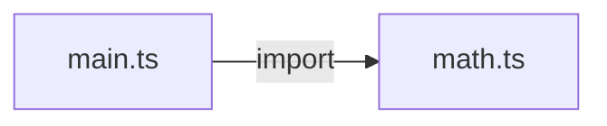
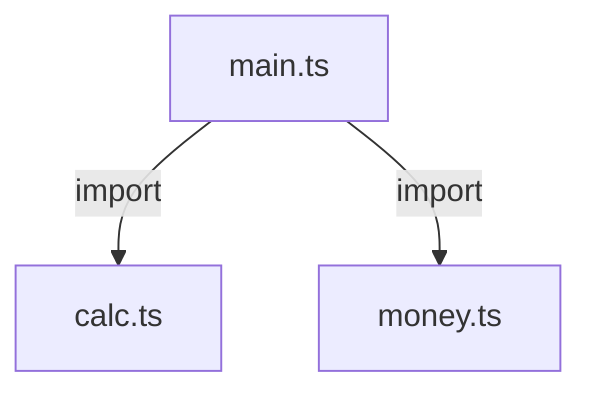
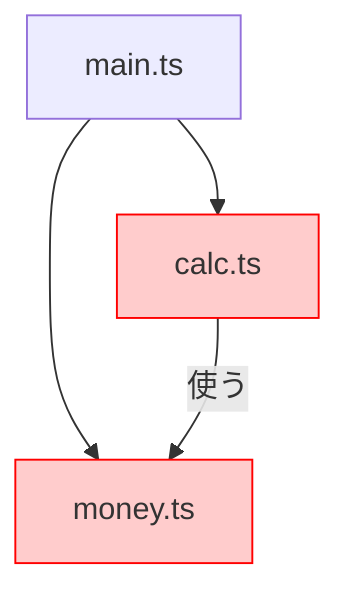

# 第01章：あたり“1テーマ”で消化できる

## この章のゴール🎯✨

* 「依存」＝**矢印➡️**って感覚で言えるようになる
* どのファイルがどれに依存してるか、**ざっくり地図🗺️**にできるようになる
* `import/export` が増えると起きる「変更の波🌊」を体験する

---

## 1) まず「依存」ってなに？🧠🔗


超ざっくり言うと…

**AがBに依存してる**＝
Aが動く/コンパイルするために **Bの存在・名前・形** を知ってないといけない状態👀

TypeScriptだと、一番よくある依存の発生源はコレ👇

* `import { something } from "./b"`
  → **A → B** の矢印ができる➡️

## 依存は「悪」じゃない🙅‍♀️✨

依存そのものは普通に必要！
ただし、依存の矢印が増えすぎると…

* 変更したときの影響範囲が読めない😵‍💫
* 直したいだけなのに修正が連鎖する🧨
* “どこ見ればいいの？”が増える📚💥

…ってなりがち。ここを体感するのがこの章だよ😊🫶

---

## 2) TSの依存は「ファイル＝モジュール」から始まる📄📦


TS/JSの基本はこれ！

* **1ファイル = 1モジュール（部品）** 📦
* `export` で外に出す🚪
* `import` で他の部品を使う🧩

---

## 3) まずは超ミニで `export/import` を触ろう👩‍💻✨

## 3-1. ミニプロジェクトを作る（Windows / VS Code向け）🪟🧰

PowerShellでOKだよ💡

```bash
mkdir deps-ch01
cd deps-ch01
npm init -y
npm i -D typescript
npx tsc --init
```

次に `tsconfig.json` をちょこっとだけ整えるよ（最小セット）👇
（初心者向けに、まずは動かしやすさ優先！）

```json
{
  "compilerOptions": {
    "target": "ES2022",
    "module": "CommonJS",
    "rootDir": "src",
    "outDir": "dist",
    "strict": true,
    "noEmitOnError": true
  }
}
```

`package.json` にスクリプトも追加しよ👇

```json
{
  "scripts": {
    "build": "tsc",
    "start": "node dist/main.js"
  }
}
```

---

## 3-2. まずは1ファイルで完成させる🧁

`src/main.ts` を作ってこれ👇

```ts
function add(a: number, b: number) {
  return a + b;
}

console.log("合計:", add(10, 32));
```

動かす👇

```bash
npm run build
npm run start
```

OKなら準備完了〜！🎉😊

---

## 4) 分割してみよう：importが「依存の矢印」になる➡️📦

次は、さっきの `add` を別ファイルに分けるよ✂️

## 4-1. ファイルを分ける🗂️

`src/math.ts`

```ts
export function add(a: number, b: number) {
  return a + b;
}
```

`src/main.ts`

```ts
import { add } from "./math";

console.log("合計:", add(10, 32));
```

これで依存関係はこう👇

* `main.ts` → `math.ts` ➡️

## 4-2. “矢印”を手で描く練習📝🗺️



ノートでもテキストでもOK！

* main → math
  （これだけで「依存」を体感できて偉い👏✨）

---

## 5) `import/export` の最低限セット（この章で使うぶんだけ）📌✨


## 5-1. 名前つきexport（いちばん使う）🧡

```ts
// math.ts
export function add(a: number, b: number) { return a + b; }
```

```ts
// main.ts
import { add } from "./math";
```

## 5-2. default export（好み分かれる）🍩

```ts
// greeting.ts
export default function hello() { return "hi"; }
```

```ts
import hello from "./greeting";
```

> 最初は「名前つき export」だけでもぜんぜんOKだよ😊👍

## 5-3. typeだけimport（ちょい上級だけど便利）🧊

```ts
import type { User } from "./types";
```

ポイントはこれ👇

* 実行時のJSには消える（=ランタイム依存は増えにくい）
* でも「設計としては依存」になることが多い（型を知ってるから）🧠

---

## 6) `import` が増えると何が起きる？💥🌊（変更の波を体験）


ここからが本番😎✨
「分割したらキレイ」だけじゃなくて、**波及**も増えることを体感するよ！

## 6-1. もう少しだけ分割する（3ファイル）🧩

こんな構成にする👇

* `src/money.ts`（表示）
* `src/calc.ts`（計算）
* `src/main.ts`（入口）

`src/money.ts`

```ts
export function formatYen(value: number) {
  return `${value.toLocaleString("ja-JP")}円`;
}
```

`src/calc.ts`

```ts
export function calcTotal(price: number, taxRate: number) {
  return Math.floor(price * (1 + taxRate));
}
```

`src/main.ts`

```ts
import { calcTotal } from "./calc";
import { formatYen } from "./money";

const total = calcTotal(2980, 0.1);
console.log("お会計:", formatYen(total));
```

依存の矢印はこうなるよ👇🗺️



* main → calc
* main → money

---

## 6-2. 変更の波🌊をわざと起こす（ミニ事故実験🧪）

`calc.ts` の関数名を変える！

`calc.ts` をこう変えてみて👇

```ts
export function calcTotalWithTax(price: number, taxRate: number) {
  return Math.floor(price * (1 + taxRate));
}
```

はい、ここでビルド👇

```bash
npm run build
```

たぶん `main.ts` がエラーになるはず！😱
これが「変更の波及」🌊

**ポイント✨**

* `calc.ts` を変えたのに、`main.ts` を直さないと通らない
* 依存（import）の矢印がある方向に、変更が伝わることが多い➡️

---

## 7) VS Codeで「依存の把握コスト」を減らす🧭✨


分割したら、**探す力**が超大事！👀💨

よく使うやつだけ覚えよ〜👇

* 定義へ移動：`F12` 🏃‍♀️💨
* 参照を探す：`Shift + F12` 🔍
* 名前変更（安全に一括）：`F2` 🪄✨

さっきの関数名変更も、**F2のRename**でやると事故りにくいよ😊🫶

---

## 8) ミニ演習👩‍💻：分割 → import増加 → 影響範囲をメモ📝✨

## 演習A：依存マップを作る🗺️


今の状態で、これを書いてみて👇

* main → calc
* main → money

次に、`calc.ts` が `money.ts` を使う形に変えてみる（わざと依存を増やす）😈

例：`calc.ts`

```ts
import { formatYen } from "./money";

export function calcTotal(price: number, taxRate: number) {
  const total = Math.floor(price * (1 + taxRate));
  // ※表示を返す設計は、あとで「層が混ざる」話につながるよ🤫
  console.log("calc側ログ:", formatYen(total));
  return total;
}
```

このときの依存はこう👇



* main → calc
* main → money
* calc → money

✅メモしてね：
「矢印が1本増えた」＝「影響の伝播ルートが増えた」かも、って感覚が大事🧠✨

---

## 9) AI🤖にやらせると超ラク：依存を箇条書き＋簡易図🗺️

そのままコピペで使えるプロンプト置いとくね💌✨

## 9-1. 依存リストを出してもらう

「このプロジェクトの各ファイルのimport一覧を出して、依存の矢印（A→B）も箇条書きにして」

## 9-2. ASCIIで依存図を描いてもらう

「import関係をもとに、テキストだけで依存グラフを描いて（例：main -> calc）」

## 9-3. “変更の波”が大きいところを指摘させる

「依存が集中してる（矢印が多い）ファイルを見つけて、理由と改善案を3つ出して」

---

## 10) ちょい最新メモ（2026年1月時点）🆕✨

* Node.js は v24 が **Active LTS（Krypton）** として扱われてるよ🟩 ([nodejs.org][1])
* TypeScript は 5.9 系が最新タグとして案内されていて、モジュール設定に **`node20`** みたいな“安定した基準”も用意されてるよ🧭 ([GitHub][2])
* TypeScript向けのESLint連携（typescript-eslint）は 2026-01-12 に最新リリースが出てる（毎週更新スタイル）📦 ([GitHub][3])

> この章は「依存＝矢印の体感」が主役なので、設定はまずシンプルにしたよ😊🫶
> でも“新しめの選択肢がどうなってるか”は、ここだけ押さえればOK👌✨

---

## まとめ🎀✨（この章で覚えたいこと3つ！）

1. `import` した瞬間に **依存の矢印➡️** が生える
2. 矢印が増えると「変更の波🌊」が広がりやすい
3. VS Codeの **参照検索🔍 / リネーム🪄** は、依存時代の必須スキル

---

## 次の章チラ見せ👀✨

次は「中心（方針）を外側（詳細）から守る」っていう、Dependency Ruleの核🧭🎯に入るよ〜！
「どこを中心にして、何を外側にするの？」を、例でスパッと分けられるようにしていくね😊🌸

[1]: https://nodejs.org/en/about/previous-releases?utm_source=chatgpt.com "Node.js Releases"
[2]: https://github.com/microsoft/typescript/releases "Releases · microsoft/TypeScript · GitHub"
[3]: https://github.com/typescript-eslint/typescript-eslint/releases?utm_source=chatgpt.com "Releases · typescript-eslint/typescript-eslint"
