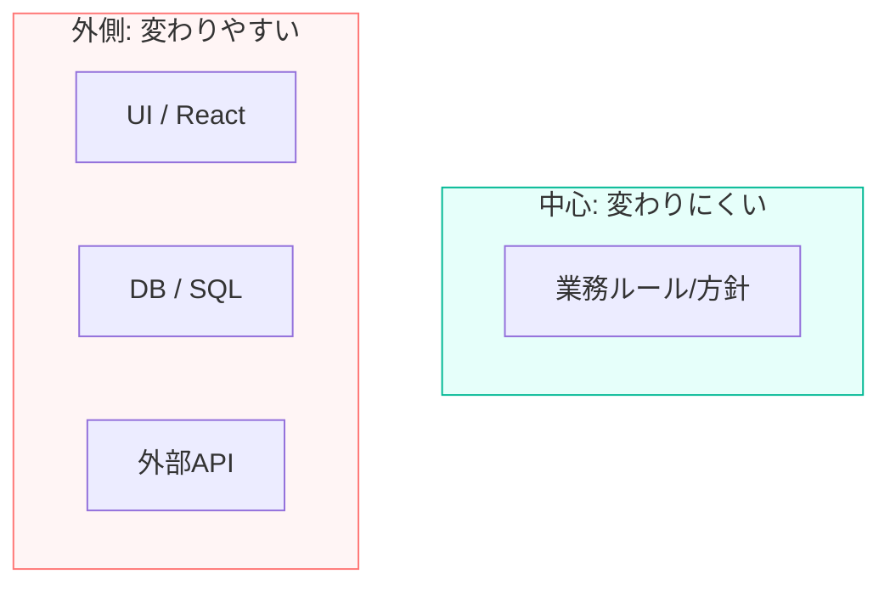
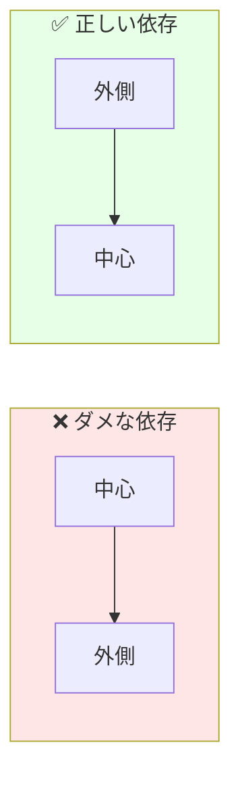
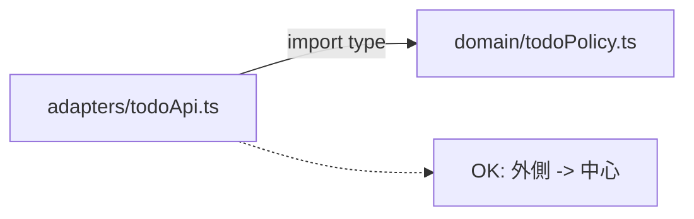
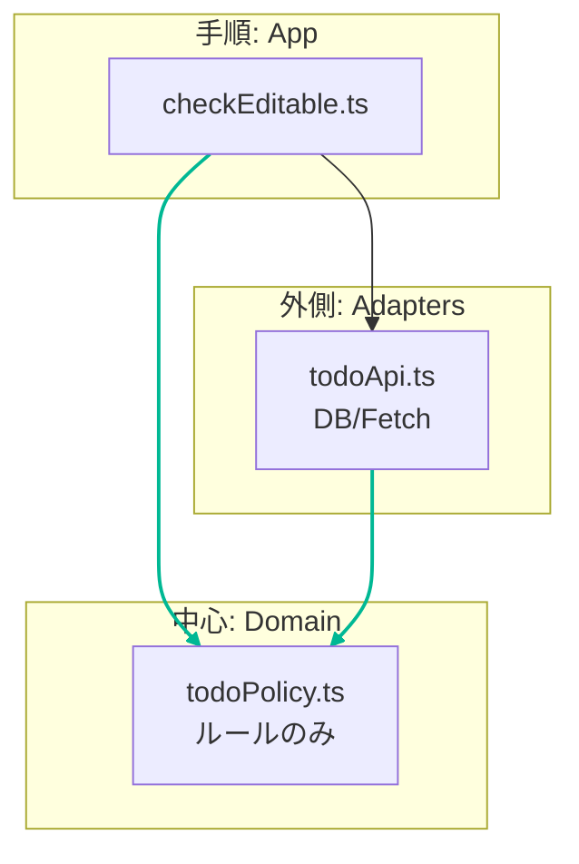

# 第02章：Dependency Ruleのコア：「中心（方針）」を「外側（詳細）」から守る🧭🎯

## 0) この章のゴール🏁


この章が終わったら、あなたがこう言えるようになるのがゴールだよ😊💕

* 「Dependency Ruleって何？」→ **一言で説明できる**✨
* コードを見て「これは中心？外側？」って **仕分けできる**🗂️
* 「中心が外側に支配されてる事故」を **匂いで気づける**🐶💡

（ちなみに最新のTypeScriptは 5.9.3 が安定版として出ていて、次の大きな節目として 6.0/7.0 系の話も進んでるよ〜！でもこの章のルールは、バージョンが進んでもずっと効く“設計の基本”🧡） ([GitHub][1])

---

## 1) まず一言で言うと？📣✨

Dependency Rule を超ざっくり言うと…

**「変わりやすい外側（UI/DB/HTTP/ライブラリ）が、変えたくない中心（業務ルール）を支配しないようにするルール」**🛡️✨

これだけ覚えてOK！🙆‍♀️💕

---

## 2) 「中心」と「外側」ってなに？🧅💭


### ✅ 中心（方針 / Policy / コア）🧠💎

「アプリが提供したい価値」「業務ルール」「やりたいことの本体」だよ！

* 例：ToDoなら

  * 「完了済みは編集できない」
  * 「締切が過ぎたら警告する」
  * 「タイトルは1〜50文字」
    みたいな **ルール**📏✨

### ✅ 外側（詳細 / Details）🌍🧰

中心を動かすために必要だけど、**入れ替わりやすい道具**たち！

* DB（SQLite/Postgres/ORMなど）🗄️
* HTTP（fetch/axios/サーバーFW）🌐
* UI（React/Vue/CLI）🖥️
* SDK・外部API（決済、地図、認証）🔑
* 便利ライブラリ（ログ、日付、バリデーション）📦

外側はね、**「流行・都合・環境」でコロコロ変わる**のが普通なの😵‍💫



---

## 3) なぜ「中心を守る」のが正義なの？💪✨（変更の波🌊）


外側って、こんな理由でよく変わるよね👇

* UIを変えたい（デザイン刷新）🎨
* DBを変えたい（性能/コスト）💸
* API仕様が変わった（外部要因）📡
* ライブラリのメジャーアップデートで壊れた（あるある）💥

ここで中心が外側にくっついてると…

* DB変更しただけなのに、業務ルールまで修正…😱
* UIの都合で、中心の型や設計が歪む…😵
* 変更が怖くなって、開発速度が落ちる…🐢💦

だから **「中心は落ち着いてて、外側だけが付け替え可能」** が理想なんだ🧘‍♀️✨

---

## 4) 依存の“矢印”ルール➡️（ここがコア！）


Dependency Rule の超重要ポイントはこれ👇

**依存（import）の矢印は、外側 → 中心 に向ける**🧲✨
**中心 → 外側 に向けない**🚫

イメージ図（ざっくり）👇

```text
[ UI / HTTP / DB / Framework ]  ----->  [ Domain / UseCase / Policy ]
        外側（変わりやすい）                   中心（変えたくない）
```

中心が「外側の都合」に引っ張られた瞬間に、設計が崩れやすくなるよ〜！😵‍💫💥



---

## 5) よくある「事故の匂い」🐽💥（中心が汚染されてるサイン）


### 🚨 サインA：中心に “DBの型” が出てくる

例：「ドメインの中で Prisma の型を使ってる」みたいなやつ。

* 中心がDBの都合を背負う → DB変更が地獄👿

### 🚨 サインB：中心が “fetch/axios” を直接呼んでる

* 中心がHTTPの都合を背負う → API変更が地獄👿

### 🚨 サインC：中心の関数が「画面の都合の引数」を持ち始める

* 例：`isModalOpen` とか `selectedTab` とか、UIの状態が中心に入ってくる
  → 中心がUIに引っ張られる😵

---

## 6) ちいさな例で体感しよ🧪✨（ダメ🙅‍♀️→OK🙆‍♀️）


### ❌ ダメ例：中心（domain）が外側（fetch）を知ってる😱

```ts
// src/domain/todoPolicy.ts （中心のつもり…なのに外側に依存してる😭）
export async function canEditTodo(todoId: string): Promise<boolean> {
  const res = await fetch(`/api/todos/${todoId}`); // ← 外側（HTTP）に依存！😱
  const todo = await res.json();
  return !todo.completed;
}
```

これだと、APIのURL変えたら中心が壊れるし、テストもやりにくいよ〜🥺💦

### ✅ OK例：中心は「ルール」だけ、外側は「取りに行く」だけ🏆

```ts
// src/domain/todoPolicy.ts（中心：純粋にルールだけ✨）
export type Todo = { id: string; completed: boolean };

export function canEdit(todo: Todo): boolean {
  return !todo.completed;
}
```

```ts
// src/adapters/todoApi.ts（外側：HTTPで取ってくる役🌐）
import type { Todo } from "../domain/todoPolicy";

export async function fetchTodo(todoId: string): Promise<Todo> {
  const res = await fetch(`/api/todos/${todoId}`);
  return await res.json();
}
```



```ts
// src/app/checkEditable.ts（手順：つなぐ役🔗）
import { canEdit } from "../domain/todoPolicy";
import { fetchTodo } from "../adapters/todoApi";

export async function checkEditable(todoId: string): Promise<boolean> {
  const todo = await fetchTodo(todoId);
  return canEdit(todo);
}
```

この形だと、HTTPの都合が変わっても **直すのは adapters 側だけ**になりやすい✨
中心は “ルールのまま” で落ち着いていられる🧘‍♀️💕



---

## 7) ミニ演習：中心/外側を色分けしてみよ🎨📝（超だいじ！）


次の要素を「中心」「外側」に仕分けしてみてね👇（頭の中でOK！）

* A. `Todo` 型（タイトル・完了フラグ）
* B. 「完了済みは編集不可」ルール
* C. `fetch("/api/todos")`
* D. DBのテーブル設計（カラム名とか）
* E. 画面のボタン配置
* F. 「締切を過ぎたら警告」ルール
* G. 外部APIのレスポンスJSON

✅ 答え（ざっくり）

* **中心**：A, B, F
* **外側**：C, D, E, G

ポイントは「中心は価値・ルール」「外側は入れ替わる道具」だよ😊✨

---

## 8) 今日から使えるチェックリスト✅🧡

コード見た瞬間に確認するやつ👇

* 中心（domainっぽい場所）で **fetch/axios/DB/SDK** を import してない？🚫
* 中心の型に **DBカラム名やAPIレスポンスの都合**が混ざってない？🧼
* UIの状態（タブ、モーダル等）が中心に侵入してない？🖥️🚫
* 「ルール（中心）」と「手順（つなぐ）」と「外部I/O（外側）」が分かれてる？🧅✨

---

## 9) AI🤖に頼むと超はかどるプロンプト集💌✨


（CopilotでもCodex系でも、だいたい効くよ！）

### 🧭 分類してもらう

* 「このファイル一覧を“中心/外側”に分類して、理由も一行ずつ書いて」📌

### 🕵️‍♀️ 依存の違反を見つけてもらう

* 「domain 配下から外部I/O（fetch/DB/SDK）に依存してる import を指摘して」🔎

### 🔧 修正案を出してもらう

* 「中心にある外側依存を adapters に移すリファクタ案を、手順で出して」🛠️

---

## まとめ💐✨

* **中心（業務ルール）を、外側（UI/DB/HTTP/SDK）から守る**のが Dependency Rule🛡️
* **import の矢印は 外側 → 中心** が基本➡️
* 事故の匂いは「中心にfetch/DB/UI都合が入ってくる」こと😱
* この章ができると、次の「境界を作る（フォルダ分け）」がめちゃ楽になるよ📁✨

次章は「まずはフォルダ境界でOK！」ってやつに進むよ〜😊📦🧱

[1]: https://github.com/microsoft/typescript/releases "Releases · microsoft/TypeScript · GitHub"
