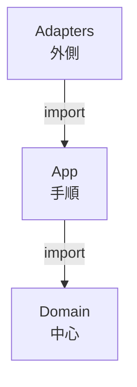
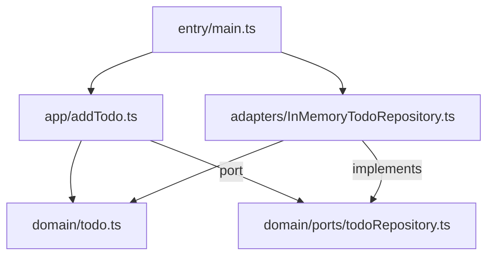

# 第03章：“境界”の作り方入門①：まずはフォルダ境界でOK📁🧱

今日は「設計っぽいこと、最初の一歩」をやるよ〜！😊🌸
**“正しいフォルダ分け”を作って、混ざらない約束（境界）をスタート**します💪🧡

---

## 1) この章のゴール🎯✨

* ✅ **迷わないフォルダ地図（構造）**を作れる
* ✅ 「これはどこに置く？」の判断ができる（最低限でOK）
* ✅ 依存の向き（importの向き）を**フォルダで矯正**できる📌➡️

> ここでは“完璧な設計”じゃなくて、**まず事故らない土台**が目的だよ😊🧱

---

## 2) “境界”ってなに？🤔🧱

境界はカンタンに言うと…

**「混ぜない約束」🤝✨**

たとえば、こういう“混ざり”が起きると地獄が始まる…😵‍💫🌀

* 画面の都合で、業務ルールがねじ曲がる😇
* DBの都合で、処理の手順が歪む😇
* 直したら別の場所が壊れる（変更の波及）💥
* どこを読めばいいか分からない（把握コスト）📚💣

だから最初にやるのが、**「置き場所の線引き」＝境界**なんだよ〜📏🧡

---

## 3) まずは“3つ”に分ければ勝ち！🧅✨（最小スタート）


第3章はここが本題！
最初はこれでOK👇

* `src/domain`：中心（ルール・用語・概念）🧠💎
* `src/app`：手順（ユースケース・アプリの進め方）🧭🧩
* `src/adapters`：外側（DB・HTTP・UI・SDKとか）🌐🧰

依存の向きはこう👇（**外→内**に向けて寄せる）

`adapters` ➡️ `app` ➡️ `domain`



この形にしておくと、**中心が守られる**の😊🛡️✨

（ちなみに最近の Node は v24 が Active LTS で、TypeScript 側も Node 前提の設定がどんどん整ってるよ〜📦✨）([nodejs.org][1])

---

## 4) “置いていいもの / ダメなもの”早見ルール📌🧠

### ✅ `domain/` に置くもの💎

* 業務ルール（例：料金計算、状態遷移、制約）
* ドメインの型（Entity/Valueっぽいもの）
* 例外じゃなくて「ドメインとしてのエラー」
* 外側にお願いするための **契約（interface/type）**（※後で超重要）📜✨

### ❌ `domain/` に置いちゃダメ🙅‍♀️

* DBクライアント、HTTP、SDK、UI
* `fetch` / `axios` / ORM
* フレームワーク固有のもの（React/Next/Express など）

---

### ✅ `app/` に置くもの🧭

* ユースケース（例：ToDo追加、購入確定、ログイン）
* 「何をどの順番でやるか」
* domainのルールを呼び出して“進行”させる

### ❌ `app/` に置いちゃダメ🙅‍♀️

* DBの具体実装
* HTTPの具体実装
* UI都合の整形（それは境界で）

---

### ✅ `adapters/` に置くもの🌐

* DB実装（Repositoryの実体）
* APIクライアント、HTTPハンドラ
* 外部I/Oとの変換（DTO→domain など）

---

## 5) まずは“地図だけ”作ろう🗺️📁（ミニ演習①）

ここは **中身ゼロでOK**！まずフォルダと空ファイルだけ作るよ😊✨

こんな形にする👇

```text
src/
  domain/
    todo.ts
    ports/
      todoRepository.ts
  app/
    usecases/
      addTodo.ts
  adapters/
    todoRepository/
      inMemoryTodoRepository.ts
  entry/
    main.ts
```

ポイントはこれ！📌✨

* `entry/` は「組み立て場所」用（あとで超効く🏗️）
* `ports/` は「外側にお願いする契約置き場」📜

---

## 6) ちっちゃいコードで“境界”を体感しよ🧪🧡（ミニ演習②）

この章では「動く」より「守れる」が大事だけど、
ミニで動くと気持ちいいので、最低限だけ書くね😊✨

### `src/domain/todo.ts` 💎

```ts
export type Todo = {
  id: string;
  title: string;
  done: boolean;
};

export function createTodo(id: string, title: string): Todo {
  if (!title.trim()) throw new Error("title is empty"); // ※後で改善する（今は最小）
  return { id, title, done: false };
}
```

### `src/domain/ports/todoRepository.ts` 📜

```ts
import type { Todo } from "../todo";

export interface TodoRepository {
  save(todo: Todo): Promise<void>;
  nextId(): string;
}
```

### `src/app/usecases/addTodo.ts` 🧭

```ts
import { createTodo } from "../../domain/todo";
import type { TodoRepository } from "../../domain/ports/todoRepository";

export async function addTodo(repo: TodoRepository, title: string): Promise<void> {
  const id = repo.nextId();
  const todo = createTodo(id, title);
  await repo.save(todo);
}
```

### `src/adapters/todoRepository/inMemoryTodoRepository.ts` 🌐

```ts
import type { Todo } from "../../domain/todo";
import type { TodoRepository } from "../../domain/ports/todoRepository";

export class InMemoryTodoRepository implements TodoRepository {
  private data: Todo[] = [];
  private seq = 1;

  nextId(): string {
    return String(this.seq++);
  }

  async save(todo: Todo): Promise<void> {
    this.data.push(todo);
  }

  // デバッグ用（本番なら隠す）
  dump(): Todo[] {
    return [...this.data];
  }
}
```

### `src/entry/main.ts` 🏗️

```ts
import { addTodo } from "../app/usecases/addTodo";
import { InMemoryTodoRepository } from "../adapters/todoRepository/inMemoryTodoRepository";

async function main() {
  const repo = new InMemoryTodoRepository();
  await addTodo(repo, "レポート出す📄✨");
  await addTodo(repo, "ゼミ準備する📚💨");

  console.log(repo.dump());
}

main().catch(console.error);
```

✅ ここで大事なのはこれ👇

* `domain` は外側を知らない🙈
* `app` も外側の実装を知らない🙈
* `adapters` が実装を持ってきて差し込む🧩✨
* `entry` が組み立てる🏗️✨



---

## 7) “境界が壊れた！”あるある😱🧨（最初に知っとくと強い）

### あるある①：domain が adapters を import しちゃう💥

「ちょっと便利だから…」で `domain` から DB/HTTP を触り始めると終了😇
→ **domain は“概念とルール”だけ**にする💎

### あるある②：app が HTTP レスポンスの形に引っ張られる😵‍💫

→ 変換は **adapters（境界）**でやる（第10章でガッツリ）🚪🔁

### あるある③：置き場が分からなくて “misc / utils” が増殖🕳️

→ 第14〜15章の「shared沼回避」につながるやつ！今は作らないでOK🙅‍♀️🌸

---

## 8) VS Codeで“境界チェック”するコツ👀🔎✨

* `domain/` で検索：`from "../adapters"` が出たら即アウト🚨
* `app/` で検索：`from "../adapters"` が出ても基本アウト（entryで組む）🚨
* import を見て「矢印が内向きか？」だけ確認すればOK➡️🧡

---

## 9) AIの使い方（この章で効くやつ）🤖✨

### ① フォルダ地図を作らせる🗺️

* 「ToDoアプリを domain/app/adapters に分けたフォルダ構成案を出して。各フォルダの責務も1行で」

### ② 置き場所レビューをさせる🕵️‍♀️

* 「このファイルは domain/app/adapters のどれ？理由つきで。もし置き場が悪いなら移動案も」

### ③ 依存矢印を文章化させる➡️

* 「今の import 関係を“外→内”になるように説明して。違反があれば指摘して」

---

## 10) （チラ見せ）“お願い”じゃなく“仕組み”で守る未来🛡️✨

第16章でやる「自動で守る」に繋がるけど、今どきは **境界をESLintで縛れる**よ！
たとえば `eslint-plugin-boundaries` は、フォルダ境界のルールを定義して違反importを検出できる系のやつ😊🧱🛡️([GitHub][2])

あと、依存関係の可視化で **循環**とかを見つけるなら `madge` や `dependency-cruiser` みたいな定番もあるよ〜📈🌀([GitHub][3])

（lint周りも TypeScript 対応が継続的に更新されてるよ、たとえば typescript-eslint は 2026-01-12 に v8.53.0 が出てる〜📦✨）([GitHub][4])

---

## まとめ😊🌸

この章でできたことはコレ👇✨

* ✅ `domain / app / adapters` の**境界フォルダ**を作った📁🧱
* ✅ importの矢印が **外→内** になる“土台”ができた➡️🧡
* ✅ 「混ぜない約束」が始まった🤝✨

次（第4章）で「パッケージ化やmonorepoっていつ必要？」に進むと、
この境界がさらに強くなるよ〜📦💪✨

[1]: https://nodejs.org/en/about/previous-releases?utm_source=chatgpt.com "Node.js Releases"
[2]: https://github.com/javierbrea/eslint-plugin-boundaries?utm_source=chatgpt.com "javierbrea/eslint-plugin-boundaries"
[3]: https://github.com/pahen/madge?utm_source=chatgpt.com "pahen/madge: Create graphs from your CommonJS, AMD ..."
[4]: https://github.com/typescript-eslint/typescript-eslint/releases?utm_source=chatgpt.com "Releases · typescript-eslint/typescript-eslint"
