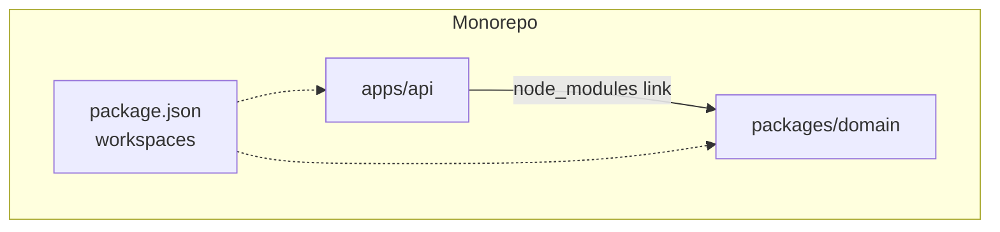
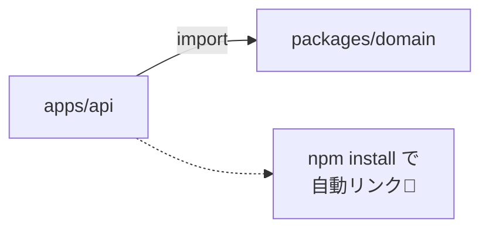

# 第04章：“境界”の作り方入門②：パッケージ/monorepoはいつ必要？📦✨

## 0) 今日のゴール🎯

「フォルダ分け（第3章）」だけで十分な場面と、**workspaces/monorepo（複数パッケージ構成）**に進むべき場面を、怖がらずに判断できるようになるよ😊✨

---

## 1) まず言葉の整理📚🧩

### ✅ パッケージってなに？📦

`package.json` を持っている“ひとまとまり”だよ。
「これは何者で、何に依存して、何を外に公開するか」を **はっきり書ける箱**って感じ😊

### ✅ workspacesってなに？🧺

1つのリポジトリの中で、複数パッケージをまとめて管理する仕組みだよ✨
npmのworkspacesは、複数パッケージをまとめて扱えて、`npm install` のタイミングで **リンク（symlink）を自動で作ってくれる**から、手動の `npm link` が基本いらないよ〜っていう立ち位置🪄
（「ローカルの複数パッケージを、1つのルートから管理する機能群」って説明されてるよ） ([docs.npmjs.com][1])

### ✅ monorepoってなに？🏠

**1つのリポジトリ（Git）に、複数のパッケージ/アプリを同居**させる運用のことだよ📦📦📦
workspacesは、そのmonorepoをやりやすくする“道具”って感じ😊

---

## 2) Dependency Ruleと、なにが嬉しいの？🧭➡️

Dependency Ruleはざっくり言うと、

* **中心（方針・ルール）** は
* **外側（DB/HTTP/UI/SDKなど変わりやすい詳細）** に
* 依存しないようにする

だったよね🧅✨

ここでパッケージ化が効く理由はこれ👇

### ✅ “物理的に”依存の向きをそろえやすい✂️➡️


* フォルダ分けだけだと、気を抜くと `import` が横入りしがち😵‍💫
* パッケージに分けると、`package.json` の依存関係として「誰が誰を使っていいか」が見えやすい👀✨
* workspacesだと、ローカルパッケージも `npm install` で自動リンクされるので、同じリポジトリ内でも“別物”として扱いやすいよ ([docs.npmjs.com][1])



---

## 3) いつ必要？「進化の目安」早見表🧭✨

### 🐣 まずはフォルダ境界でOK（パッケージ化はまだ早い）

こんな感じなら、まずは第3章のフォルダで十分🙆‍♀️

* アプリが1つ（APIもWebも“だいたい同じ塊”）
* 共有コードが少ない
* 変更頻度がそこまで高くない
* 「分けたい気持ち」より「作るスピード」が大事🏃‍♀️💨

👉 **理由：分けるコスト（設定・ビルド・運用）が先に来て、だるくなりやすい**😇

---

### 🌱 workspaces/monorepoを考え始めるサイン（ここが本章の主役！）

次のうち **2つ以上** 当てはまったら、検討しどき✅

* アプリが2つ以上（例：`api` と `web`、`batch`、`cli` など）📱🌐
* “共有ライブラリ”が増えてきた（例：domain、validation、contracts）📜
* 変更の影響範囲が読めなくなってきた😵
* チームや将来の拡張で、境界を守る圧が必要になってきた🛡️
* 「テスト用だけの実装」や「本番用実装」を差し替えたい（DIが効く）🔁

---

### 🌳 さらに先：パッケージの独立運用（公開/別リポジトリ）も視野

* ライブラリを社内/公開で配布したい
* バージョン管理・リリースを別にしたい
* リポジトリの権限や運用を分けたい

この領域は“必要になったら”でOK。焦らなくて大丈夫😊🌸

---

## 4) メリット/デメリット（正直にいくよ😎✨）

### 👍 メリット（嬉しい）

* 依存の向きが見えやすい👀📌
* 共有コードを“ちゃんとした形”で再利用できる♻️
* 複数アプリを同じPRで直せる（整合性が取りやすい）🧩
* npmのworkspacesだと、`npm install` でローカルパッケージのリンクを自動化できる ([docs.npmjs.com][1])
* pnpmもworkspacesが公式でサポートされてるよ ([pnpm.io][2])
* Yarnもworkspaces中心に設計されてるよ ([yarnpkg.com][3])

### 👎 デメリット（しんどい）

* 設定ファイルが増える（`package.json` が複数）📄📄
* ビルド順や型の出力など、運用の“作法”が必要になる🧪
* 「今は1アプリなのにmonorepo」だと、ただの重りになることがある（YAGNI🐣）

---

## 5) 判断をミスらないチェックリスト✅📝

### ✅ 今すぐmonorepoにしない方がいい（待て！）🚦

* まだ要件がふわふわ（構造が固まってない）🌫️
* 共有コードがほぼない
* 一人開発で、とにかく早く作って試したい🏃‍♀️💨

### ✅ monorepoにすると楽になる（GO！）🚀

* 複数アプリがあり、同じ修正が同時に入る
* `shared/` が育ちすぎて“なんでも屋”になってきた🕳️
* 境界を守る仕組みを入れたい（後の章でESLint強制へ🛡️）
* 依存の向き（中心→外側だけ）を、構造でも守りたい🧭➡️

---

## 6) ミニ演習①：「将来パッケージ化するなら？」妄想メモ📝💭✨

ToDoアプリ（例）を想像して、まずは3つに色分けしてみてね🎨

* 🧠 **Domain**：ToDoのルール（完了/期限/重要度など）
* 🧰 **Application**：ユースケース（追加する、完了にする、一覧取得など）
* 🚪 **Adapters**：DB、HTTP、UI、外部API

### やること（5分）⏱️

1. 機能を10個くらい箇条書き
2. それぞれに 🧠🧰🚪 を付ける
3. 「これは別パッケージになってたら嬉しいな」を1つ丸で囲む⭕️

---

## 7) ミニ演習②：超ミニ monorepo を“体験”してみよう👩‍💻✨

ここでは **npm workspaces** で「ローカルパッケージが自動リンクされる感じ」を味見するよ🧁
（npm workspacesは `npm install` がリンクを自動で作る、って公式にも書かれてるよ） ([docs.npmjs.com][1])

### ① フォルダ構成（最小）📁

* `packages/domain`：中心（ルール）
* `apps/api`：外側（使う側）

```text
my-monorepo/
  package.json
  packages/
    domain/
      package.json
      src/
        index.ts
  apps/
    api/
      package.json
      src/
        main.ts
```

### ② ルートの `package.json`（workspaces宣言）🧺

```json
{
  "name": "my-monorepo",
  "private": true,
  "workspaces": [
    "packages/*",
    "apps/*"
  ]
}
```

### ③ `packages/domain/package.json`（中心）🧠

```json
{
  "name": "@my/domain",
  "version": "0.0.0",
  "main": "src/index.ts",
  "type": "module"
}
```

`packages/domain/src/index.ts`

```ts
export function isValidTitle(title: string): boolean {
  return title.trim().length >= 3;
}
```

### ④ `apps/api/package.json`（使う側）🚪

```json
{
  "name": "@my/api",
  "version": "0.0.0",
  "type": "module",
  "dependencies": {
    "@my/domain": "0.0.0"
  }
}
```

`apps/api/src/main.ts`

```ts
import { isValidTitle } from "@my/domain";

console.log(isValidTitle("  a  ")); // false
console.log(isValidTitle("Buy milk")); // true
```

### ⑤ インストールして動かす🪄

```powershell
cd my-monorepo
npm install
```

ここで npm が **workspaces内のパッケージを node_modules に自動でリンク**してくれるイメージだよ（手動 `npm link` を避けられる、って説明されてる） ([docs.npmjs.com][1])



---

## 8) 「パッケージ化した後」に出てくる、よくある悩み💡😵‍💫

### 😵 つらみ：ビルドが遅い/順番が面倒

大きくなってきたら **TypeScriptのProject References** が助けになることがあるよ✨
公式にも「プロジェクトを小さく分けて、ビルドやエディタ体験を改善したり、論理的分離を強められる」って書かれてるよ ([typescriptlang.org][4])

（このへんは“必要になったら”でOK！今すぐやらなくて大丈夫😊）

---

## 9) パッケージマネージャ、どれがいいの？（さらっと）🧁✨

* **npm**：Node同梱で始めやすい。workspacesも公式サポート ([docs.npmjs.com][1])
* **pnpm**：workspaces公式。2025年に“セキュリティモデル”を大きく変えて、ライフサイクルスクリプトをデフォで止める方向に進んでる（サプライチェーン攻撃対策） ([pnpm.io][5])
* **Yarn**：workspaces中心の思想で、monorepo用途に強いよ ([yarnpkg.com][6])

「どれが正解」より、**今の自分が扱えるコスト**で選ぶのがいちばん勝ち🫶✨

---

## 10) AI🤖に頼むと爆速になるやつ💨✨

### ✅ 判断チェックリスト化（そのまま貼ってOK）

```text
依存関係ルールを守りたいTypeScriptプロジェクトです。
workspaces/monorepoに移行すべきか判断したいので、
「移行すべきサイン」「まだ早いサイン」「移行するなら最小構成」を
チェックリストで出して。前提は小〜中規模、アプリが1〜3個の想定。
```

### ✅ 分割案の提案（クラス/関数の仕分け）

```text
この機能一覧を Domain / Application / Adapters に分類して、
迷いやすいものは「判断基準」も添えて提案して。
（機能一覧：ここに貼る）
```

### ✅ “将来パッケージ化する単位”の提案

```text
将来workspaces化するとしたら、最初にパッケージとして切り出すべき単位を3つ提案して。
それぞれ「切り出すメリット」「切り出しコスト」「依存の向き」を書いて。
```

---

## まとめ🎀✨

* workspaces/monorepoは **依存の向きを“構造で守れる”** ようになるのが強い📦➡️
* でも早すぎると重いので、**複数アプリ/共有コード増加**が来てからでOK🐣
* 迷ったら「当てはまるサイン2つ以上」で検討、が安全😊✅

次の章（第5章）で、Domain / Application / Adapters を決めて、さらに迷わなくしていこうね🧅💖

[1]: https://docs.npmjs.com/cli/v8/using-npm/workspaces/ "workspaces | npm Docs"
[2]: https://pnpm.io/workspaces "Workspace | pnpm"
[3]: https://yarnpkg.com/features/workspaces?utm_source=chatgpt.com "Workspaces"
[4]: https://www.typescriptlang.org/tsconfig/?utm_source=chatgpt.com "TSConfig Reference - Docs on every TSConfig option"
[5]: https://pnpm.io/blog/2025/12/29/pnpm-in-2025 " pnpm in 2025 | pnpm"
[6]: https://yarnpkg.com/ "Home page | Yarn"
