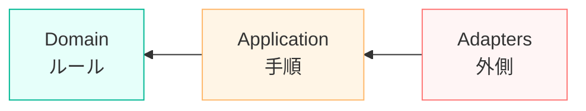
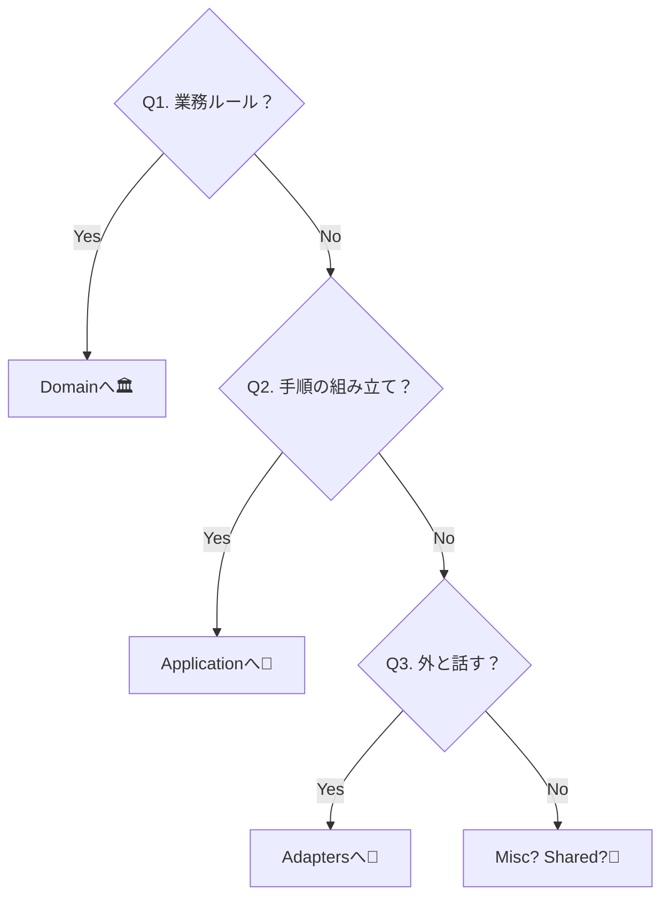
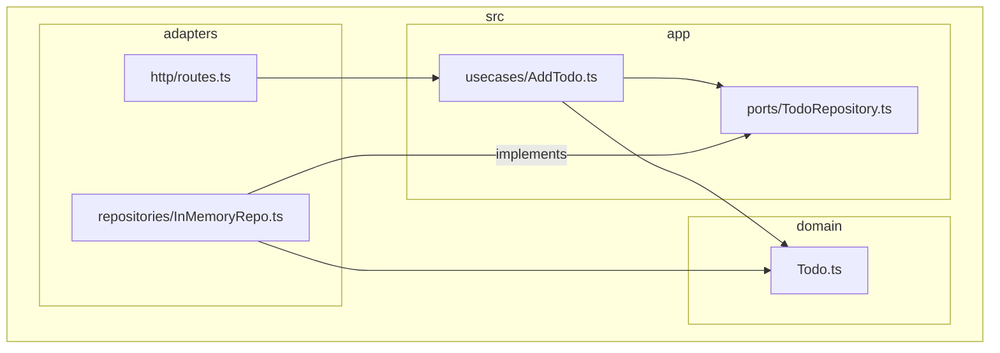

# 第05章：迷わない層モデル：Domain / Application / Adapters を決めよう🧅🗺️

「このファイル、どこ置けばいいの…？😵‍💫」ってなる瞬間、あるよね。
この章はそれを**ほぼ迷わなくするための“置き場所ルール”**を作る回だよ〜！🧡

---

## 1) この章のゴール🎯✨

読み終わったら、こうなれるのが目標だよ👇

* 「これは Domain？Application？Adapters？🤔」を**3秒で判定**できる⏱️✨
* 置き場所に迷ったとき、**判断の質問セット**で決められる🧠💡
* “名前”じゃなくて、**依存の向き➡️**で層が決まる感覚がつかめる🧭

---

## 2) まずは一言で覚えよっ📌💕


層モデルって、難しそうに見えるけど、実はコレだけ👇

* **Domain = ルール** 🏛️⚖️

  * “業務の決まり”とか“絶対こうあるべき”の世界
* **Application = 手順** 🧾🧑‍🍳

  * ルールを使って「どう進める？」を組み立てる世界
* **Adapters = 外と話す** 🌍🔌

  * DB / HTTP / UI / 外部APIなど、外界との会話係

そして一番大事なのがコレ👇

### 依存の向きは「外 → 内」➡️🧅

(外)           (手順)         (ルール)



「Domainが外部ライブラリに引っ張られてブレる」事故を防ぐために、**内側を守る🛡️**のがDependency Ruleのノリだよ〜！

---

## 3) 具体例：ToDoアプリで“置き場所”を固める📝✨

ここでは超ミニのToDoを想像するよ😊
やることはこんな感じ👇

* ToDoを追加する➕
* 一覧を見る📋
* 完了にする✅

---

### A. Domain（ルール）って何を置くの？🏛️💕


**Domainに置くのは「業務として守りたい決まり」**だよ。

たとえばToDoなら…

* タイトルは空じゃダメ🙅‍♀️
* 完了済みにしたら、もう未完了には戻せない（仕様なら）🔒
* ToDoの形（Entity）や、IDの型（Value Object）🎁

```ts
// src/domain/todo/Todo.ts
export type TodoId = string;

export class Todo {
  constructor(
    public readonly id: TodoId,
    public readonly title: string,
    public readonly isDone: boolean,
  ) {
    if (title.trim().length === 0) {
      throw new Error("Title must not be empty"); // ※後でドメインエラーにするのが理想✨
    }
  }

  complete(): Todo {
    if (this.isDone) return this;
    return new Todo(this.id, this.title, true);
  }
}
```

✅ **ポイント**
Domainは「ルール」だから、ここに **HTTP** とか **DB** の都合が入ってくるとブレるの…😢
なので Domain はなるべく **素のTypeScriptだけ**で完結させるイメージだよ🧼✨

---

### B. Application（手順）って何を置くの？🧾🧡


Applicationは「ルールを使って、処理の流れを作る」係！🧑‍🍳✨
よく **UseCase（ユースケース）** って呼ばれるよ。

* 「ToDoを追加する」手順
* 「一覧表示する」手順
* 「完了にする」手順

さらにここが超重要👇

✅ **Applicationは “外界の能力” を interface で要求する**（＝契約/ポート）📜✨
DBに保存したいなら「保存できる人だれかお願い〜🙏」って、**能力だけ約束**する感じ。

```ts
// src/app/ports/TodoRepository.ts
import { Todo, TodoId } from "../../domain/todo/Todo";

export interface TodoRepository {
  save(todo: Todo): Promise<void>;
  findById(id: TodoId): Promise<Todo | null>;
  list(): Promise<Todo[]>;
}
```

そしてUseCase（手順）👇

```ts
// src/app/usecases/AddTodo.ts
import { Todo } from "../../domain/todo/Todo";
import { TodoRepository } from "../ports/TodoRepository";

export class AddTodo {
  constructor(
    private readonly repo: TodoRepository,
    private readonly newId: () => string, // 例：ID生成も“外の能力”として注入✨
  ) {}

  async execute(title: string): Promise<{ id: string }> {
    const todo = new Todo(this.newId(), title, false);
    await this.repo.save(todo);
    return { id: todo.id };
  }
}
```

✅ **ポイント**
Applicationは「手順」だから、**HTTPステータス**や**SQL**は知らないでOK🙆‍♀️
「成功/失敗」や「結果」だけを返すのがスッキリするよ〜✨

---

### C. Adapters（外と話す）って何を置くの？🌍🔌


Adaptersは、Applicationの「お願い（interface）」を実装したり、HTTPとやり取りしたりする層だよ📮✨

* DB実装（例：SQLite / PostgreSQL / Prisma etc）🗄️
* APIルート（HTTPハンドラ）🌐
* 外部サービス（決済、メール、SNS）📩

例：インメモリ実装（テストや開発用）👇

```ts
// src/adapters/repositories/InMemoryTodoRepository.ts
import { Todo, TodoId } from "../../domain/todo/Todo";
import { TodoRepository } from "../../app/ports/TodoRepository";

export class InMemoryTodoRepository implements TodoRepository {
  private readonly map = new Map<TodoId, Todo>();

  async save(todo: Todo): Promise<void> {
    this.map.set(todo.id, todo);
  }
  async findById(id: TodoId): Promise<Todo | null> {
    return this.map.get(id) ?? null;
  }
  async list(): Promise<Todo[]> {
    return [...this.map.values()];
  }
}
```

✅ **ポイント**
Adaptersは「外部の都合が全部ある場所」だから、
DTO変換とか、HTTPの事情とか、DBの事情とか、**汚れ役を引き受ける場所**だよ🧤✨

---

## 4) 迷ったときの“判定3問”🧠💡（これでほぼ決まる！）


置き場所に迷ったら、この3つを自分に質問してね👇

### Q1. それって「業務のルール」？⚖️

* Yes → **Domain** 🏛️
* No → 次へ

### Q2. それって「手順の組み立て」？🧾

* Yes → **Application** 🧡
* No → 次へ

### Q3. それって「外（DB/HTTP/UI/外部API）と話す」？🌍

* Yes → **Adapters** 🔌



迷いがちな例も置いとくね👇

* 入力チェック（タイトル空など）

  * **業務ルールならDomain**（例：タイトル空NG）
  * **HTTP都合のバリデーションならAdapters**（例：リクエスト必須項目チェック）
* ID生成、現在時刻

  * Domainに直書きすると“外の都合”になりがち😵
  * **Applicationが「関数/ポート」で受け取る**のが扱いやすい✨
* DTO変換（API型↔ドメイン型）

  * 基本は **Adapters**（境界で翻訳する）🔁✨

---

## 5) フォルダ構成テンプレ（この章の結論マップ🗺️🧅）


```txt
src/
  domain/
    todo/
      Todo.ts
  app/
    ports/
      TodoRepository.ts
    usecases/
      AddTodo.ts
  adapters/
    repositories/
      InMemoryTodoRepository.ts
    http/
    http/
      routes.ts
```



「名前は好みでOK」なんだけど、**この3分割が見える**と迷いが激減するよ😊✨

---

## 6) ミニ演習：仕分けクイズ〜！📝🎀


次の“モノ”はどこに置く？（Domain / Application / Adapters）👇

1. `Todo` クラス（title空NG、complete()あり）
2. `AddTodo.execute(title)`（repo.saveして結果返す）
3. `POST /todos` のHTTPハンドラ
4. `PrismaTodoRepository`（PrismaでDB保存）
5. `TodoRepository` interface
6. `req.body.title` が無いとき 400 を返す処理

### 解答✅✨

* 1 → **Domain**（ルールと状態）🏛️
* 2 → **Application**（手順）🧡
* 3 → **Adapters**（HTTPと会話）🌐
* 4 → **Adapters**（DBと会話）🗄️
* 5 → **Application**（外へ要求する能力＝契約）📜
* 6 → **Adapters**（HTTP都合のエラー）🧯

---

## 7) よくある事故パターン😱💥（これだけ避ければ勝ち！）

### ❌ Domainがaxios/prisma/importしてる

* ルールが外部都合に汚染される😵
* 変更に弱くなる

### ❌ ApplicationがHTTPレスポンスを返す

* 手順がHTTPに縛られて、CLIやバッチに転用しにくい🥲

### ❌ Adaptersに業務ルールが混入

* 「どこが正しいルール？」って迷子になる🌀

---

## 8) AIの使い方🤖✨（この章と相性バツグン！）

そのままコピペで使えるやつ置いとくね🪄💕

### ① 仕分け相談（迷いゼロ化）🧠🧁

```txt
以下のクラス/関数を Domain / Application / Adapters に分類して。
それぞれ「理由」と「依存の向きが正しいか」も説明して。

- （ここにコード or ファイル一覧）
```

### ② 置き場所を直す提案🔧✨

```txt
この構成で依存の向きが崩れている箇所を指摘して、
修正方針（移動先、interface化、変換の置き場所）を提案して。
可能なら変更差分も出して。
```

### ③ 命名案（迷いを減らす魔法）📛🌸


```txt
この責務に合う命名を10個出して。
Domainっぽい名前、Applicationっぽい名前、Adapterっぽい名前に分けて。
```

---

## 9) 章末チェックリスト✅💕（保存版！）

* [ ] DomainにHTTP/DB/外部SDKの都合が入り込んでない？🏛️🚫
* [ ] Applicationは「手順」だけで、外部詳細を知らない？🧡
* [ ] Adaptersが翻訳・接続の役割をちゃんと引き受けてる？🔌
* [ ] 依存の向きが **Adapters → App → Domain** になってる？➡️🧅
* [ ] 「迷ったら判定3問」で置き場所が決められる？🧠✨

---

## 2026年の周辺事情ミニメモ🧷✨（最新リサーチ反映）

* TypeScript は npm 上で **5.9.3** が “Latest” 表示だよ（2025/09/30公開として掲載） ([npmjs.com][1])
* Node.js は **v24 が Active LTS、v25 が Current** として一覧に載ってるよ（2026/01/12更新） ([Node.js][2])
* ESLint は **v10.0.0-rc.0** のリリースノートが 2026/01/09 に出てるよ（v10移行の話題が熱い🔥） ([ESLint][3])
* typescript-eslint は GitHub Releases に **v8.53.0（2026/01/12）** が “Latest” 表示だよ ([GitHub][4])

---

次の章（第6章）では、この層モデルをさらに強くするために **TypeScriptの type/interface を“契約”として使う**やり方をガッツリやって、中心がもっと守れるようにするよ〜📜🧡✨

[1]: https://www.npmjs.com/package/typescript?activeTab=versions&utm_source=chatgpt.com "typescript"
[2]: https://nodejs.org/en/about/previous-releases?utm_source=chatgpt.com "Node.js Releases"
[3]: https://eslint.org/blog/2026/01/eslint-v10.0.0-rc.0-released/?utm_source=chatgpt.com "ESLint v10.0.0-rc.0 released"
[4]: https://github.com/typescript-eslint/typescript-eslint/releases?utm_source=chatgpt.com "Releases · typescript-eslint/typescript-eslint"
