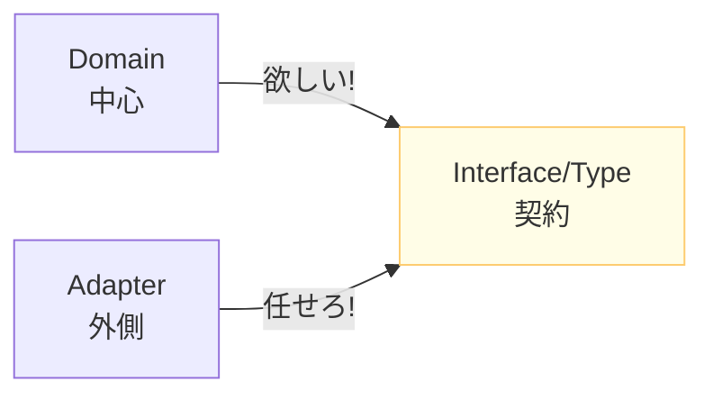
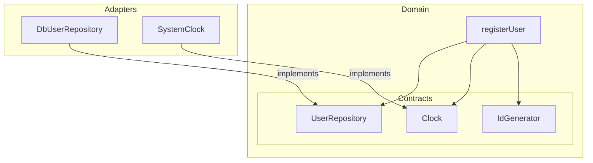

# 第06章：TypeScriptの武器：type/interfaceで“契約”を作る📜🧡

この章はね、「中心（domain/app）が、外側（DB/HTTP/SDK）を直接知らなくても動ける」状態を作るための**超大事な準備**だよ〜！😊✨
そのカギが **“契約（contract）”＝ interface / type** なの🧩🔑

ちなみに2026年1月時点だと TypeScript の最新系は **5.9.x（npm上は 5.9.3）**だよ。([npmjs.com][1])
（でもこの章でやる “契約” の考え方は、バージョンが進んでもずっと使えるやつ！💪）

---

## 6-0. 今日のゴール🎯✨

* ✅ **契約 =「欲しい能力だけ」を言葉にする**って体感する
* ✅ Domain側は **契約だけ import**（= 実装を見ない）にする
* ✅ `interface` と `type` を、迷わず使い分けできるようになる
* ✅ テストで差し替えしやすい “美しい依存” を作れる🧪💞

---

## 6-1. “契約”ってなに？📜 ざっくり言うと…


**契約（contract）**は、

> 「私はこの機能が欲しい！でも“どうやって”は知らない！」

っていう宣言だよ😌🧡

たとえば Domain が欲しいのは「ユーザーを保存できること」であって、
「Prismaで〜」とか「SQLで〜」とかは**外側の都合**だよね？🌀

だから Domain はこう言うの👇

* ✅ `UserRepository`（ユーザーを保存/取得できる）
* ✅ `Clock`（今の時刻がわかる）
* ✅ `PaymentGateway`（課金できる）

こういう “欲しい能力” を **interface/type で定義**しておくと、
Domain は外側に支配されない💪✨

---

## 6-2. TypeScriptの型は「形（shape）」を見る👀🧩


TypeScript は「この値はどんな形？」っていう **構造（shape）**で型チェックするよ。([TypeScript][2])
だから、契約（interface/type）は **“形の約束”**としてすごく相性がいいの😊✨



---

## 6-3. `interface` と `type`、どっち使うの？😵‍💫→こう考えると楽！


結論：**両方使う！** ただし役割で分けると迷いが減るよ🧠✨

### 使い分けの目安🧭

* **interface**：

  * 「サービスっぽい契約」＝ *〜できる*（Repository / Gateway / Clock）に向いてる
  * 後から拡張しやすい（再オープンして追加できる）([TypeScript][3])
* **type**：

  * 「データの形」や「合体/分岐（union/intersection）」に強い
  * `Result` みたいな **成功/失敗の表現**が作りやすい💡

> ざっくり：
> **“振る舞いの契約”は interface、 “データの表現”は type** ✨

---

## 6-4. 契約の命名のコツ📛✨（ここ超大事！）


契約の名前は、「実装の匂い」を消すのがコツだよ🧼💕

### ✅ 良い命名（契約っぽい）

* `UserRepository`
* `PaymentGateway`
* `Clock`
* `EmailSender`
* `Logger`

### ❌ うーん…（実装が漏れてる）

* `PrismaUserRepository`
* `StripePaymentGateway`
* `FetchEmailSender`
* `ConsoleLogger`

実装名は **Adapters側**に閉じ込めるのが正解〜！🚪✨

---

## 6-5. まずは小さい契約を3つ作ってみよ🧪💕

この章のミニ題材は「ユーザー登録」っぽいやつにするね😊
Domain が欲しい能力はこの3つ👇

* `UserRepository`（保存/存在チェック）
* `Clock`（今の時刻）
* `IdGenerator`（ID発行）

### ① 契約を作る（domain側）📜

```ts
// src/domain/contracts/UserRepository.ts
export interface UserRepository {
  existsByEmail(email: string): Promise<boolean>;
  save(user: User): Promise<void>;
}

// src/domain/contracts/Clock.ts
export interface Clock {
  now(): Date;
}

// src/domain/contracts/IdGenerator.ts
export interface IdGenerator {
  newId(): string;
}

// src/domain/User.ts
export type User = {
  id: string;
  email: string;
  createdAt: Date;
};
```

ポイントはこれ👇✨

* Domain は **“できること”だけ**言う
* 具体的なDBもライブラリも一切出てこない😌🧡

---

## 6-6. Domainのユースケースは「契約だけ」見て書く✍️🧅


```ts
// src/domain/registerUser.ts
import type { UserRepository } from "./contracts/UserRepository";
import type { Clock } from "./contracts/Clock";
import type { IdGenerator } from "./contracts/IdGenerator";
import type { User } from "./User";

export type RegisterUserDeps = {
  users: UserRepository;
  clock: Clock;
  ids: IdGenerator;
};

export type RegisterUserInput = { email: string };

export async function registerUser(
  deps: RegisterUserDeps,
  input: RegisterUserInput
): Promise<User> {
  const email = input.email.trim().toLowerCase();

  if (await deps.users.existsByEmail(email)) {
    throw new Error("Email already exists"); // ここは第11章で綺麗にするよ🧯✨
  }

  const user: User = {
    id: deps.ids.newId(),
    email,
    createdAt: deps.clock.now(),
  };

  await deps.users.save(user);
  return user;
}
```

ここが最高にえらいポイント👑✨

* Domain は **契約（interface）しか import してない**
* DBもHTTPも知らない
* なのにちゃんと動く（外側が差し込めばOK）🔄💕



---

## 6-7. “satisfies” で「契約を満たしてる？」を安全にチェック✅🪄


契約を満たしてるかチェックしつつ、**型推論はそのまま**にできるのが `satisfies`！([TypeScript][4])
モックやインメモリ実装でめっちゃ便利だよ〜😊

```ts
// src/adapters/inMemoryUserRepository.ts
import type { UserRepository } from "../domain/contracts/UserRepository";
import type { User } from "../domain/User";

const store = new Map<string, User>();

export const inMemoryUserRepository = {
  async existsByEmail(email: string) {
    for (const u of store.values()) {
      if (u.email === email) return true;
    }
    return false;
  },
  async save(user: User) {
    store.set(user.id, user);
  },
} satisfies UserRepository;
```

`as UserRepository` って書いちゃうと「嘘でも通る」ことがあるけど、
`satisfies` は **満たしてないとちゃんと怒ってくれる**から安心〜！🧯✨

---

## 6-8. 契約の“粒度”ってどう決めるの？🍰📏

初心者のうちは、これだけ守ると失敗しにくいよ😊

### 粒度のルール（まずはこれだけ）✅

* ✅ 1契約 = 1責務（Repository / Clock / Payment みたいに役割で分ける）
* ✅ メソッド名は「何をしたいか」が伝わる動詞にする（`save`, `find`, `charge`）
* ✅ 引数/戻り値は **Domainの言葉**で（DTOやHTTPレスポンス型を入れない）
* ✅ 迷ったら「この契約、テストで差し替えたい？」で判断🧪✨

---

## 6-9. “データ”の契約は `type` が気持ちいい🫧✨（Result型ちょい入門）


エラーを `throw` で投げるの、後で第11章で綺麗にするんだけど…
準備として「成功/失敗」を `type` で表すとこうなるよ👇

```ts
// src/domain/Result.ts
export type Ok<T> = { ok: true; value: T };
export type Err<E> = { ok: false; error: E };
export type Result<T, E> = Ok<T> | Err<E>;

export const ok = <T>(value: T): Ok<T> => ({ ok: true, value });
export const err = <E>(error: E): Err<E> => ({ ok: false, error });
```

`type` は union が得意だから、こういう表現がスルッと書ける🪄✨

---

## 6-10. ミニ演習👩‍💻✨（手を動かすやつ！）

### 演習A：契約を3つ作ろう📜

次の契約を `src/domain/contracts/` に作ってね👇

* `PaymentGateway`：`charge(amountYen: number): Promise<void>`
* `EmailSender`：`send(to: string, subject: string, body: string): Promise<void>`
* `Logger`：`info(message: string): void` / `error(message: string): void`

💡コツ：実装名（Stripe/SendGrid/Console）を絶対入れない！

---

### 演習B：ユースケースを「契約だけ」で書こう🧅

`purchase.ts` を作って、`PaymentGateway` と `EmailSender` を deps に持たせてね😊

* 課金する
* 完了メール送る

---

### 演習C：テスト用の差し替えを `satisfies` で作ろう✅🪄

`fakePaymentGateway` を作って、呼ばれた回数を数えるとかしてみて！
（“ちゃんと呼ばれた？”をテストしやすくなるよ🧪✨）

---

## 6-11. AI活用プロンプト集🤖💌（コピペOK）

### ① 契約の候補名を出してもらう🧠✨

* 「ユーザー登録で必要な外部依存を **契約名だけ** で10個提案して。実装技術名（Prisma/Stripe等）は禁止。」

### ② 契約の粒度レビューしてもらう📏👀

* 「この interface は責務が広すぎる？分割案を3パターン出して。理由も添えて。」

### ③ “実装が漏れてる命名”を直してもらう🧼

* 「`PrismaUserRepository` みたいな名前になっちゃった。契約として自然な名前に直して、なぜその名前が良いか説明して。」

### ④ `satisfies` で安全なモックを作ってもらう🪄✅

* 「この interface を満たす in-memory 実装を `satisfies` を使って作って。テストで呼び出し回数も追跡したい。」

---

## 6-12. まとめ🌸✨（この章で得た最強スキル）

* 🎯 **契約（interface/type）は “中心を守る盾”**
* 🧅 Domain は **契約だけを見る**（実装を知らない）
* ✅ `interface`＝振る舞いの契約、`type`＝データ表現（まずはこの目安でOK）([TypeScript][3])
* 🪄 `satisfies` はモック/差し替えで超便利！([TypeScript][4])
* 👀 TypeScript は “形で見る型” だから、契約設計と相性バツグン！([TypeScript][2])

---

次の第7章で、いよいよこの契約を使って **「中心→外側 import を断つ」**（DIP体験）に突入できるよ〜！🔄🚫💪✨

[1]: https://www.npmjs.com/package/typescript?utm_source=chatgpt.com "typescript"
[2]: https://www.typescriptlang.org/docs/handbook/typescript-in-5-minutes.html?utm_source=chatgpt.com "Documentation - TypeScript for JavaScript Programmers"
[3]: https://www.typescriptlang.org/docs/handbook/advanced-types.html?utm_source=chatgpt.com "Documentation - Advanced Types"
[4]: https://www.typescriptlang.org/docs/handbook/release-notes/typescript-4-9.html?utm_source=chatgpt.com "Documentation - TypeScript 4.9"
