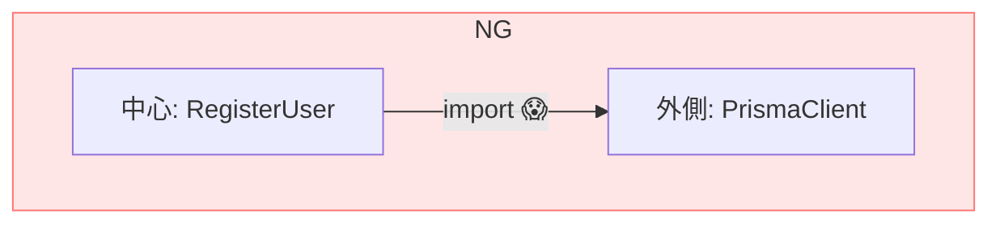
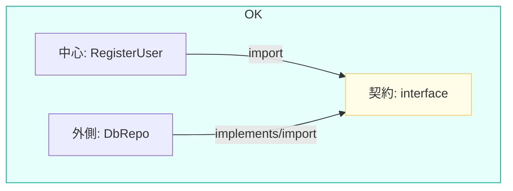

# 第07章：依存逆転（DIP）をTSで体験：中心→外側importを断つ🔄🚫

## この章のゴール🎯

「中心（業務ルール・ユースケース）」が、**DB/HTTP/外部SDKみたいな外側の詳細を `import` しない**状態を作れるようになること💪
そして、**実装（外側）を差し替えられる**気持ちよさを体験します😆🔁

ちなみに本日時点では TypeScript の最新は 5.9.x（npm上で 5.9.3）です🧡 ([npmjs.com][1])
（5.9では `import defer` みたいな“依存の実行タイミング”にも関わる機能が入ってますが、今日はもっと根本の「依存の向き」を直します🧭） ([TypeScript][2])

---

## 1) まず「依存が逆」ってどういう事故？😱🌀


ありがちな事故はこれ👇

* `usecase/RegisterUser.ts` が
  `import { PrismaClient } from "@prisma/client"` みたいに **DBライブラリを直import**
* その結果…

  * DBの都合でユースケースが壊れる💥
  * テストがつらい（DB必要）😭
  * “中心”が“外側”に支配される😵‍💫

イメージ図🗺️（ダメな矢印）

* 中心 → 外側（詳細）に依存しちゃってる



---

## 2) ダメな例（わざと）🚫🧪

```ts
// src/app/RegisterUser.ts  ← 本当は中心側に置きたいのに…
import { PrismaClient } from "@prisma/client"; // ← 外側の詳細を直import 😱

export class RegisterUser {
  private prisma = new PrismaClient();

  async execute(email: string) {
    // DBに直接ベタ書き
    const user = await this.prisma.user.create({ data: { email } });
    return user;
  }
}
```

これ、書きやすいけど「中心が外側に引っ張られる」典型です🥲

---

## 3) DIP（依存逆転）の考え方🔄🧠✨


## 合言葉はこれ🗣️💡

**「中心は“実装”じゃなく“能力（契約）”だけ知る」**

* 中心：`UserRepository` っていう **契約（interface）** だけを見る👀
* 外側：DB版やインメモリ版を **契約に従って実装** する🧰
* 最後に：外側の実装を中心に **差し込む（注入）** 🔁

イメージ図（良い矢印）🧅✨

* 中心（UseCase） → 契約（interface）
* 外側（DB/HTTP） → 契約（interface）を実装

つまり、**中心が外側を見ない**。これが勝ち筋です🏆💕



---

## 4) TSでやってみよう：最小ステップでDIP✅

ここから「リファクタ手順」をそのまま真似すればOKです😊

---

## Step 1: 契約（interface）を中心側に置く📜🧡


```ts
// src/domain/UserRepository.ts
export interface UserRepository {
  create(email: string): Promise<{ id: string; email: string }>;
}
```

ポイント🎀

* **`IUserRepository` みたいな “Iプレフィックス” は好み**（どっちでもOK）
* 大事なのは **「中心が欲しい能力」だけを書く**こと✨

---

## Step 2: ユースケースは契約だけを見る👀✨

```ts
// src/domain/RegisterUser.ts
import type { UserRepository } from "./UserRepository";

export class RegisterUser {
  constructor(private readonly users: UserRepository) {}

  async execute(email: string) {
    // 中心は「作ってね」しか言わない
    const user = await this.users.create(email);
    return user;
  }
}
```

ここでの勝利条件🏁

* `RegisterUser.ts` に **DBライブラリのimportが一切ない** 🙆‍♀️✨

---

## Step 3: 外側で実装する（DB版）🧰🗄️


（例として “Prismaっぽい” 実装にしてます。あなたのDB事情に置き換えてOK🙆‍♀️）

```ts
// src/adapters/db/DbUserRepository.ts
import type { UserRepository } from "../../domain/UserRepository";

// ※ここでは例としてDBクライアントがある想定
type DbClient = {
  user: { create: (args: { data: { email: string } }) => Promise<{ id: string; email: string }> };
};

export class DbUserRepository implements UserRepository {
  constructor(private readonly db: DbClient) {}

  async create(email: string) {
    return this.db.user.create({ data: { email } });
  }
}
```

ポイント🎯

* DBの詳細（クライアントやSQL）は **adapters側に閉じ込める** 🔒✨
* 中心には一切漏らさない😌

---

## Step 4: 外側で実装する（インメモリ版）🧠📦


テストやローカル動作用に超便利です😆

```ts
// src/adapters/memory/InMemoryUserRepository.ts
import type { UserRepository } from "../../domain/UserRepository";

export class InMemoryUserRepository implements UserRepository {
  private seq = 0;
  private store = new Map<string, { id: string; email: string }>();

  async create(email: string) {
    const id = String(++this.seq);
    const user = { id, email };
    this.store.set(id, user);
    return user;
  }
}
```

---

## Step 5: いったん“仮の入口”で差し込む🔁🚪

（組み立て場所の本命は次章でやるやつ✨ ここは最小でOK）

```ts
// src/main.ts
import { RegisterUser } from "./domain/RegisterUser";
import { InMemoryUserRepository } from "./adapters/memory/InMemoryUserRepository";

async function main() {
  const users = new InMemoryUserRepository();
  const registerUser = new RegisterUser(users);

  const created = await registerUser.execute("hello@example.com");
  console.log(created);
}

main();
```

ここまでで、**中心が外側importしてない状態**が完成🎉🎉🎉

---

## 5) 「中心→外側importしてる」を見つけるコツ🔎🕵️‍♀️


VS Codeでこれやると早いです💨

* `src/domain` や `src/app` で検索🔍

  * `from "@prisma/` とか
  * `from "axios"` とか
  * `from "firebase"` とか
* 見つかったら、そのファイルは **“中心なのに外側を見てる”** 可能性大⚠️

---

## 6) よくあるつまずき（ここ超大事）🥺🧯

## つまずき①：interfaceって実行時に無いよね？😳

そう！TypeScriptの `interface/type` は **コンパイル後に消えます**（実行時の型情報にはならない）ので、
「DIコンテナが勝手に型から解決する」みたいなのは、そのままだとできません🙅‍♀️

もし “デコレータ＋メタデータ” 系でDIしたい場合は `emitDecoratorMetadata` などの世界になります（今回は手動DIでOK！） ([Zenn][3])

## つまずき②：契約を細かくしすぎて迷子🌀

最初は **「ユースケースが本当に欲しい操作」だけ** に絞るのがコツ✂️✨
（増やすのは後でいくらでもできるよ😊）

## つまずき③：中心にDTO/DB型が混ざる📦😵

中心は **ドメインの言葉**で話すのが基本！
DBの行型やAPIレスポンス型は “境界” で変換する（第10章あたりで気持ちよく整理するやつ）🌈

---

## 7) ミニ演習（手を動かすやつ）👩‍💻🔥


## 演習A：DB版 ↔ インメモリ版を差し替えてみよう🔁✨

* `main.ts` の `new InMemoryUserRepository()` を `new DbUserRepository(db)` に差し替える
* ユースケース側が一行も変わらないのを確認👀🎉

## 演習B：「Clock」も契約にしてみよう⏰🧡

* `Clock` 契約を作る
* `SystemClock`（本物の日時）と `FixedClock`（テスト固定）を作る
  → テストが一気にラクになります😆

## 演習C：禁止importチェック✅

* `src/domain` に `axios` や `prisma` を import してないか検索
  → 0件なら勝ち🏆✨

---

## 8) AI（Copilot/Codex）に頼むと爆速なところ🤖💨


そのままコピペで使える指示例だよ🪄

## 依存違反を見つける🕵️‍♀️

* 「`src/domain` 配下のファイルから、外部ライブラリ（DB/HTTP/UI）の import を検出して一覧にして。修正方針も添えて」

## 契約の抽出を手伝わせる📜

* 「このユースケースが実際に使っているDB操作を最小の `UserRepository` interface にして。メソッド名と戻り値の型も提案して」

## インメモリ実装を作らせる🧠

* 「`UserRepository` を満たす `InMemoryUserRepository` を作って。連番IDでOK。テスト用途で使いたい」

## テストも作らせる🧪

* 「Vitestで `RegisterUser` のテストを書いて。インメモリ実装を注入して、DB無しで動くことを確認したい」

---

## 9) 章末チェックリスト✅✨

* [ ] ユースケース（中心）がDB/HTTP/SDKを `import` してない🚫
* [ ] 中心は `interface/type` の契約だけ見てる👀
* [ ] 外側に **実装が閉じ込められてる**🔒
* [ ] インメモリ版に差し替えできた🔁🎉
* [ ] テストが “外部無し” で回せる未来が見えた🌈

---

## おまけ：いまのTypeScriptの動き（超ざっくり）📰✨

* 現在の最新は 5.9.x（5.9.3）で、5.9では `import defer` が入っています。 ([npmjs.com][1])
* さらに TypeScript 6.x / 7.x に向けた動きも進んでいて、6.0は2026年初頭を示唆する話も出ています。 ([GitHub][4])
* TS 7 “ネイティブ版” のプレビュー情報も出てます（ビルド高速化系の流れ）。 ([Microsoft Developer][5])

でも！DIPはTSのバージョンが変わってもずっと効く基礎体力なので、ここを押さえるとめちゃ強いです💪💖

---

次の第8章では、この「差し込み場所」を **ちゃんと“組み立て専用の場所”に隔離**して、さらに気持ちよくします🏗️✨

[1]: https://www.npmjs.com/package/typescript?utm_source=chatgpt.com "typescript"
[2]: https://www.typescriptlang.org/docs/handbook/release-notes/typescript-5-9.html?utm_source=chatgpt.com "Documentation - TypeScript 5.9"
[3]: https://zenn.dev/spacemarket/articles/8ddba858aa09c2?utm_source=chatgpt.com "TypeScriptによるDependency Injection入門：DIコンテナを ..."
[4]: https://github.com/microsoft/TypeScript/issues/62785?utm_source=chatgpt.com "Iteration Plan for Typescript 5.10/6.0 ? · Issue #62785 ..."
[5]: https://developer.microsoft.com/blog/typescript-7-native-preview-in-visual-studio-2026?utm_source=chatgpt.com "TypeScript 7 native preview in Visual Studio 2026"
