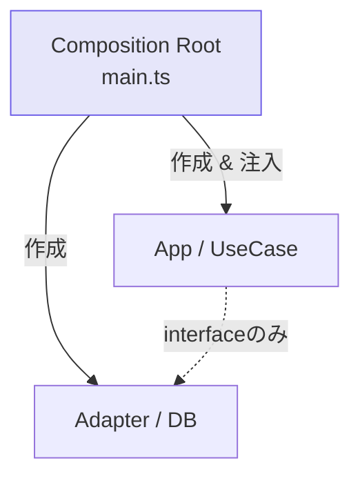
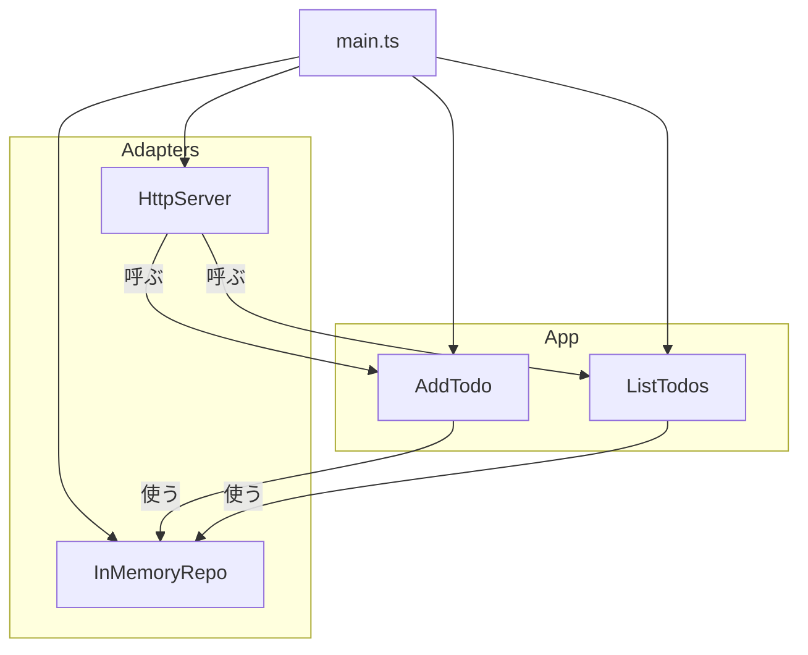

# 第08章：Composition Root入門①：組み立て場所（entry）を決める🏗️📌

## この章のゴール🎯✨

* 「実装をどこで選ぶか？」を **1か所に固定**できるようになる😊
* `domain` / `app` が **外側（DB/HTTP/SDK）を知らない**状態をキープできるようになる🧅🛡️
* `main.ts`（または `server.ts`）に **組み立て（配線）を集約**して、変更に強い形にする💪🔌

---

## 1) Composition Rootってなに？🧩✨


**Composition Root（コンポジションルート）**は、ざっくり言うと…

> アプリの「入口」にある、依存（オブジェクトたち）をぜんぶ組み立てる場所📍

「どの実装を使うか（例：DB版Repo or InMemory版Repo）」を決めて、必要なものを作って、つないで、アプリを起動する…その担当だよ〜！🚀
定義としても「アプリのエントリーポイント付近で、オブジェクトグラフ全体を組み立てる場所」と説明されることが多いよ📌 ([InfoQ][1])



---

## 2) なんで必要なの？（ないと何が困る？）😵‍💫💥

Composition Rootがない（=いろんな場所で `new` してる）と、こんな事故が起きがち👇

* `app` の中で `new SqliteTodoRepository()` とかし始める
  → **中心が外側を知っちゃう**（Dependency Rule違反）🚨🧅
* あちこちで生成してるから「差し替え」が地獄になる
  → テストで InMemory に変えたいのに、探して直して…つらい😭🔁
* 設定（開発/本番）で実装を切り替えたいのに、散らばってて壊れやすい
  → “変更の波及” が増える😱🔗

だから「作る場所を1か所」にして、**選択と配線**をまとめるんだ〜！🏗️✨

---

## 3) Composition Rootはどこに置く？📁📌

基本はこのどれかでOKだよ😊

* `src/main.ts`（CLIっぽい起動・バッチも含め万能）🧠
* `src/server.ts`（サーバー起動が主役ならコレ）🌐
* `src/index.ts`（ただし barrel と混同しやすいので注意⚠️）

そしてルールは超シンプル👇

✅ **Composition Rootだけが “外側の実装” をimportしていい**
✅ それ以外（domain/app）は **契約（interface/type）だけ**を見る👀✨

「DIコンテナを使うなら、コンテナ参照もComposition Rootだけ」って考え方もよく言われるよ📦（この教材では次章で扱うね） ([Stack Overflow][2])

---

## 4) まずは “手動DI” で十分😌🪶

この章では DIコンテナなしでいくよ！
やることはこれだけ👇

* `domain`：型・ルール・エラー（純粋に保つ）🧼
* `app`：ユースケース（必要な契約だけ受け取る）🧩
* `adapters`：外部I/O実装（DB/HTTP/ファイル等）🔌
* `main.ts`：全部を作って、つないで、起動する🏗️🚀

---

## 5) ミニ題材：ToDoを “差し替え可能” にして起動する📝✨

### 5-1. フォルダ構成（地図）🗺️📁

こんな感じでいこう（最小でOK！）😊

* `src/domain/` … ルールと契約🧅
* `src/app/` … ユースケース🧠
* `src/adapters/` … 実装（外側）🔌
* `src/main.ts` … 組み立て＆起動🏗️

---

## 6) コードで体験しよ〜！👩‍💻✨（Composition Rootの本質）

### 6-1. domain：契約（Repository）と型📜

```ts
// src/domain/todo.ts
export type Todo = {
  id: string;
  title: string;
  done: boolean;
};
```

```ts
// src/domain/todoRepository.ts
import type { Todo } from "./todo";

export interface TodoRepository {
  add(todo: Todo): Promise<void>;
  list(): Promise<Todo[]>;
}
```

---

### 6-2. app：ユースケース（契約だけ見てる！）🧠🧩

```ts
// src/app/addTodo.ts
import type { TodoRepository } from "../domain/todoRepository";
import type { Todo } from "../domain/todo";

export type AddTodoInput = { title: string };

export function makeAddTodo(deps: { repo: TodoRepository }) {
  return async (input: AddTodoInput): Promise<Todo> => {
    const todo: Todo = {
      id: crypto.randomUUID(),
      title: input.title.trim(),
      done: false,
    };

    await deps.repo.add(todo);
    return todo;
  };
}
```

```ts
// src/app/listTodos.ts
import type { TodoRepository } from "../domain/todoRepository";

export function makeListTodos(deps: { repo: TodoRepository }) {
  return async () => deps.repo.list();
}
```

ポイント✨
`app` は **repoの実装（DBとか）を一切知らない**よね？最高〜！🧅💕

---

### 6-3. adapters：外側の実装（例：InMemory Repo）🧰

```ts
// src/adapters/inMemoryTodoRepository.ts
import type { TodoRepository } from "../domain/todoRepository";
import type { Todo } from "../domain/todo";

export class InMemoryTodoRepository implements TodoRepository {
  private todos: Todo[] = [];

  async add(todo: Todo): Promise<void> {
    this.todos.push(todo);
  }

  async list(): Promise<Todo[]> {
    return [...this.todos];
  }
}
```

---

### 6-4. adapters：HTTP（超ミニのNode http）🌐✨

フレームワークを増やさず、Composition Rootの説明に集中するために “最小” でいくね😊

```ts
// src/adapters/httpServer.ts
import http from "node:http";

export function createHttpServer(deps: {
  addTodo: (input: { title: string }) => Promise<unknown>;
  listTodos: () => Promise<unknown>;
}) {
  return http.createServer(async (req, res) => {
    try {
      const url = new URL(req.url ?? "/", "http://localhost");

      // GET /todos
      if (req.method === "GET" && url.pathname === "/todos") {
        const todos = await deps.listTodos();
        res.writeHead(200, { "content-type": "application/json; charset=utf-8" });
        res.end(JSON.stringify(todos));
        return;
      }

      // POST /todos
      if (req.method === "POST" && url.pathname === "/todos") {
        let body = "";
        req.on("data", (chunk) => (body += chunk));
        await new Promise<void>((resolve) => req.on("end", () => resolve()));

        const parsed = JSON.parse(body || "{}") as { title?: string };
        const created = await deps.addTodo({ title: parsed.title ?? "" });

        res.writeHead(201, { "content-type": "application/json; charset=utf-8" });
        res.end(JSON.stringify(created));
        return;
      }

      res.writeHead(404, { "content-type": "text/plain; charset=utf-8" });
      res.end("Not Found");
    } catch (e) {
      res.writeHead(500, { "content-type": "text/plain; charset=utf-8" });
      res.end("Server Error");
    }
  });
}
```

---

## 7) ここが本題！main.ts（Composition Root）🏗️📌✨

「作る・選ぶ・つなぐ・起動する」は全部ここ！💪

```ts
// src/main.ts
import { InMemoryTodoRepository } from "./adapters/inMemoryTodoRepository";
import { createHttpServer } from "./adapters/httpServer";
import { makeAddTodo } from "./app/addTodo";
import { makeListTodos } from "./app/listTodos";

function createApp() {
  // 1) 実装を選ぶ（ここが“差し替えポイント”）🔁✨
  const repo = new InMemoryTodoRepository();

  // 2) ユースケースを組み立てる（契約を注入）🧩
  const addTodo = makeAddTodo({ repo });
  const listTodos = makeListTodos({ repo });

  // 3) 外側（HTTP）にユースケースを渡す🌐
  const server = createHttpServer({ addTodo, listTodos });

  return { server };
}

const { server } = createApp();

server.listen(3000, () => {
  console.log("http://localhost:3000 で起動したよ〜🚀✨");
});
```

### ここが超大事ポイント💡🧠

* `domain/app` は **外側をimportしてない**（守れてる！）🧅✨
* `main.ts` は **外側をimportしてOK**（ここが例外の場所）🏗️
* 「差し替え」は `repo = ...` の1行で済む未来が見える👀🔁

---

## 8) “オブジェクトグラフ”ってなに？🕸️✨

雑に絵にするとこんな感じだよ👇

* `main.ts` が全部を作る
* `app` は契約（repo）を受け取る
* `adapters` は app を呼ぶ

つまり「つながりの全体図（グラフ）」を **入口で組み立てる**のが Composition Root！
この考え方は “入口で全体を組む場所” として紹介されてるよ📌 ([InfoQ][1])



---

## 9) よくある失敗あるある😇⚠️（ここで直せるように！）

### ❌ 失敗1：ユースケース内で実装を作っちゃう

```ts
// ダメ例：app内で実装new（外側を知っちゃう）
const repo = new InMemoryTodoRepository();
```

✅ **直し方**：`main.ts` で作って、`makeAddTodo({ repo })` で渡す！🏗️✨

---

### ❌ 失敗2：設定（env）を中心に漏らしちゃう

```ts
// ダメ例：app内で process.env を参照
if (process.env.NODE_ENV === "production") { ... }
```

✅ **直し方**：`main.ts` で判断して “選んだもの” を渡す😊🔁

---

## 10) ミニ演習👩‍💻📝（10〜20分でOK✨）

### 演習A：Repoを2種類にして切り替え🔁

* `InMemoryTodoRepository` に加えて `FileTodoRepository`（ファイル保存）を作った体でOK！📁
* `main.ts` の1か所だけで切り替えられるようにしてみてね✨

ヒント：`main.ts` にこういう “選択行” を作るイメージ👇
（※実装は次章以降で重くしてもOK！）

```ts
const useMemory = process.env.TODO_REPO === "memory";
const repo = useMemory ? new InMemoryTodoRepository() : new FileTodoRepository("todos.json");
```

> Node.jsは2026-01-13に 24.13.0 (LTS) のセキュリティリリースが出てるので、こういう環境変数運用＋更新は意識しておくと安心だよ🛡️✨ ([Node.js][3])

---

### 演習B：「new が散らばってる場所」をmainへ集約🏗️

* プロジェクト内で `new` を検索してみて
* “中心っぽい場所” に `new` がいたら、`main.ts` にお引っ越しさせる🧳✨

---

## 11) AIに手伝ってもらうプロンプト例🤖🪄

そのままコピペで使えるやつ置いとくね💕

* 「このプロジェクト構成で `main.ts` にComposition Rootを作りたい。`repo` を注入して `createApp()` を組むテンプレを作って」🧩
* 「`app` が `adapters` をimportしてる箇所があれば指摘して、`main.ts` 経由の注入に直して」🕵️‍♀️
* 「依存の向きがわかるように、import関係を箇条書き＋簡易図にして」🗺️

---

## 12) 章末チェック✅🌸（できたら勝ち！）

* [ ] `domain/app` が外側（HTTP/DB/FS）をimportしてない🧅🚫
* [ ] “実装の選択” が `main.ts` に1か所で集まってる🔁📌
* [ ] `createApp()` みたいに「組み立て」が見える形になってる🏗️✨
* [ ] テスト用に InMemory を差し替えられそうな匂いがする🧪💕

---

## おまけ：ツール事情（2026の空気だけ）🌤️

TypeScriptは「ネイティブ実装（高速化）」の流れが強くて、開発体験がどんどん良くなってるよ⚡（コンパイル速度など）
ただ、**Composition Rootの考え方はツールが変わっても超安定**なので安心してOK😊✨ ([Microsoft Developer][4])

---

次の第9章では、この “手動DIの配線” を **パターン化**して、もっとスッキリ回す方法（DIコンテナ無しでの型）をやるよ〜🪶🧪✨

[1]: https://www.infoq.com/articles/DI-Mark-Seemann/?utm_source=chatgpt.com "Dependency Injection with Mark Seemann"
[2]: https://stackoverflow.com/questions/6277771/what-is-a-composition-root-in-the-context-of-dependency-injection?utm_source=chatgpt.com "What is a composition root in the context of dependency ..."
[3]: https://nodejs.org/en/blog/release/v24.13.0?utm_source=chatgpt.com "Node.js 24.13.0 (LTS)"
[4]: https://developer.microsoft.com/blog/typescript-7-native-preview-in-visual-studio-2026?utm_source=chatgpt.com "TypeScript 7 native preview in Visual Studio 2026"
