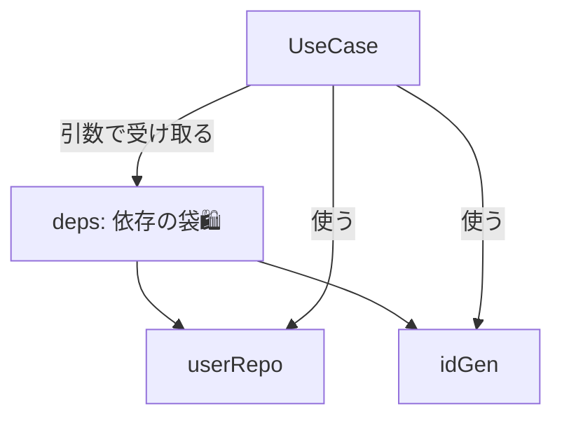
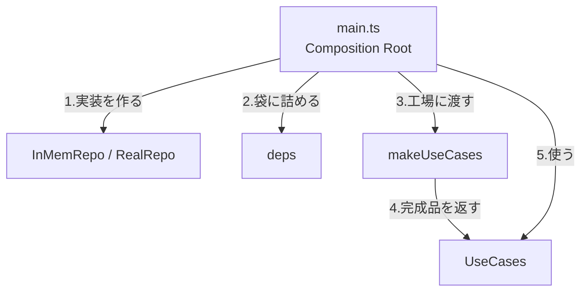

# 第09章：Composition Root入門②：DIコンテナ無しで回す設計パターン🧪🪶

この章はね、「DIコンテナ入れなきゃ設計できないの…？😵‍💫」って不安を、ぜ〜んぶ吹き飛ばす回だよ💨💕
**手動DI（＝自分で組み立てて注入する）だけで、めちゃくちゃ強い構造**が作れるようになるよ💪🌸

---

## 0. 今日の“いまどき”メモ 🧡🗓️

* TypeScript の安定最新版は **5.9.3（npm の latest）**だよ🧡 ([npm][1])
* Node は **v24 が Active LTS**、**v25 が Current**の位置づけ（2026-01-12更新）だよ🔁 ([Node.js][2])
* テストは **Vitest 4.0 系**が出ていて、移行ガイドも用意されてるよ🧪 ([Vitest][3])
* TS 5.9 では **`import defer`**（遅延評価の提案）にも触れられてて、「副作用を遅らせたい」話とも相性いいよ🌀 ([TypeScript][4])

---

## 1. この章のゴール 🎯✨

できるようになることはこれ👇

* **DIコンテナ無し**で、依存をスッキリ注入できる🧩
* **テストで差し替え**が一瞬でできる（モック注入）🧪
* 「どこで組み立てるか」を迷わない（= Composition Root が太らない）🏗️
* “隠れ依存”を作らない（グローバル参照とか）🚫👻

---

## 2. DIコンテナ無しで戦える理由 🥰🧠

DIコンテナって便利なんだけど、最初に入れると…👇みたいになりがち😵‍💫

* 依存が **コード上で見えない**（どこから来たか追いづらい）🕵️‍♀️
* 設定が複雑になって **学習コスト高い**📚💥
* 「とりあえず登録」→ **結局ゴチャる**🧹🌀

だからこの教材では、まずは
**“見える依存”＝引数で渡す** を基本にするよ😊🌸

---

## 3. まず覚える基本形：依存は「袋（deps）」にまとめる 🛍️🧩




### ✅ パターンA：Dependency Bag（依存オブジェクト）

**“必要なもの全部を1つのオブジェクトにして渡す”** だけ！

例は ToDo でも User でも何でもOKだけど、ここでは小さく「ユーザー登録」を例にするね👩‍💻💕

---

### フォルダのイメージ（第5章の3層に沿う）🗺️🧅

* `domain/`：ルール（Entity/VO/Domain Error とか）🧠
* `app/`：手順（UseCase）🪄
* `adapters/`：外部I/O（DB・API）🚪
* `main/`：組み立て（Composition Root）🏗️

---

## 4. 実装してみよう：手動DIの王道テンプレ 🏗️✨

### 4-1. 契約（Contract）を中心側に置く 📜🧡

```ts
// src/domain/contracts/UserRepository.ts
export interface UserRepository {
  save(user: { id: string; name: string }): Promise<void>;
  existsByName(name: string): Promise<boolean>;
}
```

---

### 4-2. UseCase は deps を受け取る（注入）🧩➡️

```ts
// src/app/usecases/registerUser.ts
import type { UserRepository } from "../../domain/contracts/UserRepository";

export type RegisterUserDeps = {
  userRepo: UserRepository;
  idGen: { newId(): string };
};

export function makeRegisterUser(deps: RegisterUserDeps) {
  return async function registerUser(input: { name: string }) {
    const name = input.name.trim();

    if (!name) {
      return { ok: false as const, error: "NAME_REQUIRED" as const };
    }

    if (await deps.userRepo.existsByName(name)) {
      return { ok: false as const, error: "NAME_DUPLICATE" as const };
    }

    const user = { id: deps.idGen.newId(), name };
    await deps.userRepo.save(user);

    return { ok: true as const, user };
  };
}
```

ポイントはこれ〜！🎀

* UseCase は **契約だけを見る**（実装は知らない）👀
* 依存は **引数（deps）からしか来ない**（透明性MAX）✨

---

### 4-3. 「UseCase まとめ工場」を作る 🏭💓

複数のUseCaseが増えてくると、毎回 `makeXxx(deps)` を main で並べるの大変になるよね😵‍💫
そこで “まとめて作る” 👇

```ts
// src/app/makeUseCases.ts
import { makeRegisterUser } from "./usecases/registerUser";
import type { UserRepository } from "../domain/contracts/UserRepository";

export type AppDeps = {
  userRepo: UserRepository;
  idGen: { newId(): string };
};

export function makeUseCases(deps: AppDeps) {
  return {
    registerUser: makeRegisterUser(deps),
    // ここに増やしていく🌱
  };
}
```

---

### 4-4. Composition Root（組み立て場所）で“実装”を選ぶ 🏗️🔁

ここだけが「外側の実装」を知っててOKな場所だよ😊

```ts
// src/main/main.ts
import { makeUseCases } from "../app/makeUseCases";
import { InMemoryUserRepository } from "../adapters/inmemory/InMemoryUserRepository";
import { randomUUID } from "crypto";

const deps = {
  userRepo: new InMemoryUserRepository(),
  idGen: { newId: () => randomUUID() },
};

const useCases = makeUseCases(deps);

// ここから先は、HTTPでもCLIでも好きに呼ぶ🌸
useCases.registerUser({ name: "mika" }).then(console.log);
```

✅ **依存の差し替え**はこの deps を変えるだけ！超ラク！🧡

---

## 5. “DIコンテナ無し”でよく使う設計パターン集 🧰✨

### ✅ パターンB：Factory（環境ごとに deps を作る）🏭🔁

「本番」と「テスト」と「開発」で実装を切り替えたい時に便利😊

```ts
// src/main/makeDeps.ts
import { InMemoryUserRepository } from "../adapters/inmemory/InMemoryUserRepository";

export function makeDepsForDev() {
  return {
    userRepo: new InMemoryUserRepository(),
    idGen: { newId: () => "dev-id" },
  };
}
```

💡この “deps 工場” を複数用意するだけで、切り替えが超明快✨

---

### ✅ パターンC：Provider（遅延で deps を作る）⏳🧩

「起動時に全部作りたくない」「リクエスト単位で作りたい」みたいな時に使うよ😊
（TS 5.9 の `import defer` の話題みたいに、“副作用を遅らせる”方向とも仲良し🌀） ([TypeScript][4])

```ts
// src/main/depsProvider.ts
export function createDepsProvider() {
  let cached: any | undefined;

  return () => {
    if (cached) return cached; // 1回だけ作って使い回す例
    cached = {
      // ここで初期化（DB接続など）してもOK
    };
    return cached;
  };
}
```

---

### ✅ パターンD：引数のデフォルト（小物だけ DI）🧁✨

超小さい依存（時計とか）なら、こういうのもアリだよ〜😊

```ts
export function now(clock = { now: () => new Date() }) {
  return clock.now();
}
```

---

## 6. ここが落とし穴！やりがちなNG集 🚫😱

### ❌ NG1：どこからでも `import { deps } from "./deps"`（グローバルdeps）

* 一見ラクだけど、**依存が隠れる**👻
* テストで差し替えるのが急にめんどくさくなる😵‍💫

### ❌ NG2：Service Locator（取りに行く方式）

* `get(UserRepository)` みたいに “取りに行く” のは、
  結局「依存が見えない」問題が起きやすいよ〜🌀

✅ 基本はずっとこれでOK：
**「必要なものは引数で渡す」** 🧡🧩

---

## 7. テストで“差し替え”してみよう 🧪✨（Vitest 4系）

Vitest は 4.0 系が出ててガイドもあるよ🧪 ([Vitest][3])

```ts
// src/app/usecases/registerUser.test.ts
import { describe, it, expect } from "vitest";
import { makeRegisterUser } from "./registerUser";

class FakeUserRepo {
  private names = new Set<string>();

  async existsByName(name: string) {
    return this.names.has(name);
  }
  async save(user: { id: string; name: string }) {
    this.names.add(user.name);
  }
}

describe("registerUser", () => {
  it("同名がいたら弾く", async () => {
    const repo = new FakeUserRepo();
    await repo.save({ id: "1", name: "mika" });

    const registerUser = makeRegisterUser({
      userRepo: repo,
      idGen: { newId: () => "2" },
    });

    const res = await registerUser({ name: "mika" });
    expect(res.ok).toBe(false);
  });
});
```

🎉 これが「手動DIが強い」最大の理由！
**モック注入が“ただのオブジェクト差し替え”**で終わるの、最高だよね🥰🧪

---

## 8. ミニ演習（30〜45分）🏃‍♀️💨

### 演習1：deps を増やしても壊れない形にする🧩

* `RegisterUserDeps` に `logger`（`info()`だけ）を追加してみよう📣
* 本番は `console`、テストはダミーでOK🙆‍♀️

### 演習2：Factory を2種類作る🏭

* `makeDepsForDev()` と `makeDepsForTest()` を作って切り替え🔁

### 演習3：NG回避チェック✅

* UseCase が `adapters/` を import してないか確認👀✨

---

## 9. AI🤖に頼むと爆速になる指示例（そのままコピペOK）💌✨

* 「この `makeUseCases(deps)` 方式で、UseCaseが増えても散らからない構成案を出して。フォルダ構成もセットで！」🗺️
* 「このUseCase、隠れ依存（グローバル参照）が入り込む可能性ある？危険ポイントを指摘して修正して」🕵️‍♀️
* 「テスト用の Fake 実装（in-memory）を作って。境界を壊さないように！」🧪🧸
* 「deps の型をもっと読みやすくしたい。命名案を10個出して」📛✨



---

## 10. まとめ 🎀🏁

この章で覚えた“手動DI”の型はこれ👇

* **deps（依存の袋）を作る**🛍️
* **makeUseCases(deps)** で組み立てる🏭
* **main（Composition Root）だけが実装を知る**🏗️
* **テストは差し替えるだけ**🧪✨

次の章（第10章）で「DTO/変換をどこに置く？」に入ると、
この “境界の守り方” がさらに効いてくるよ〜🚪📦💕

必要なら、この章のサンプルを **ToDo版**（一覧/追加/完了）にして、もう少し実戦っぽくしたコード一式も作るよ🥰✨

[1]: https://www.npmjs.com/package/typescript?utm_source=chatgpt.com "typescript"
[2]: https://nodejs.org/en/about/previous-releases?utm_source=chatgpt.com "Node.js Releases"
[3]: https://vitest.dev/blog/vitest-4?utm_source=chatgpt.com "Vitest 4.0 is out!"
[4]: https://www.typescriptlang.org/docs/handbook/release-notes/typescript-5-9.html?utm_source=chatgpt.com "Documentation - TypeScript 5.9"
