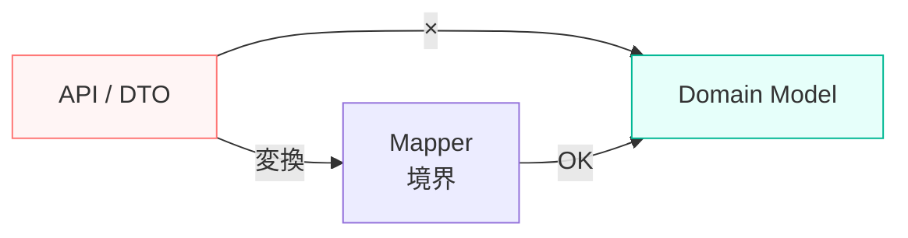
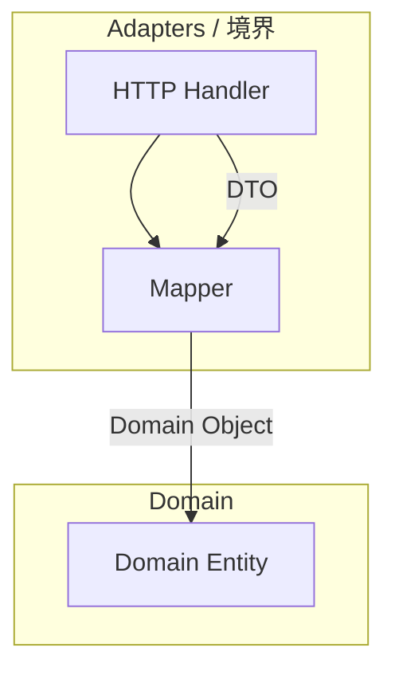

# 第10章：境界の設計①：DTO/変換をどこに置く？🚪📦

（テーマ：**「外の世界の型」と「自分たちの型」を混ぜない**🔥）

---

## 0. 今日のゴール🎯💖

この章が終わったら、こんな状態になれたら勝ちです✌️😆

* APIやDBのデータ型（DTO）を、Domain型と**ちゃんと分けられる**🧼✨
* 変換（マッピング）を置く場所が**迷わなくなる**📌
* 「層が混ざる事故（地獄）」を**未然に防げる**🛡️😇

---

## 1. まず超ざっくり：DTOってなに？🤔📦

DTOは、めっちゃ一言でいうと…

* **外部との受け渡し用の“荷物の箱”**📦🚚

  * HTTPレスポンスのJSON
  * DBのレコード
  * 外部SDKの戻り値
  * などなど…

つまりDTOは「外の都合」に引っ張られがちです😵‍💫
だからDomain（中心の方針・業務ルール）に混ぜると、**中心が外側に支配される**💥

---

## 2. 今日の主役：Domain型 vs DTO型 🧅⚔️

イメージはこう👇✨

* **Domain型**：アプリの“意味”と“ルール”が乗る👑
* **DTO型**：外部から来た/外部へ出すための“形式”📦

たとえばAPIがこう返してくるとするね👇（snake_caseだったり、null混ざってたり…）😇

```ts
// ✅ 外の世界（API）の都合：API DTO
export type UserDto = {
  id: string;
  display_name: string;     // snake_case 😵
  birthday?: string | null; // 文字列だったり null だったり 😵‍💫
};
```

でもDomainはこうしたい👇（意味が分かる名前・扱いやすい型）💖

```ts
// ✅ 中心（Domain）の都合：Domain Model
export type User = {
  id: string;
  displayName: string;      // camelCase ✨
  birthday?: Date;          // Domainで扱いやすい型✨
};
```

---

## 3. いちばん大事な結論📌✨




### DTO→Domain の変換は「境界（Adapters）」に置く！🚪🔁

理由はシンプルで、**変換こそが境界の仕事**だからです💪😊

* DomainにDTOを持ち込む
  → Domainが外の形式に汚染される🫠
* Adaptersで変換してからDomainへ渡す
  → Domainがきれいに保てる🧼✨

---

## 4. “置き場所”のおすすめルール（迷わない版）🗺️📌

フォルダ例（第3〜5章の構造に沿う感じ）👇

* `src/domain/` … Domain型・ドメインルール🧠👑
* `src/app/` … ユースケース（手順）🎬
* `src/adapters/` … 外の世界との接続＆変換🚪🔌

  * `http/` … API（controllers / routes）🌐
  * `db/` … DBアクセス🗄️
  * `mappers/` … DTO↔Domain変換🔁✨ ←ここが超重要！

---

## 5. 変換を置く場所：3パターンで使い分け💡😊




### パターンA：HTTP DTO ↔ Domain（inbound/outbound）🌐🔁

* **HTTPアダプタ内**（or その直下の `mappers/`）に置くのが王道✨
* APIの仕様変更が来ても、被害をアダプタで止められる🛑

### パターンB：DB Record ↔ Domain 🗄️🔁

* **DBアダプタ内**（or `mappers/`）に置く
* DB都合（カラム名、NULL、正規化）をDomainへ漏らさない🧯

### パターンC：ユースケースの入出力モデル（UseCase DTO）🎬📦

ここだけちょい注意⚠️
「HTTPのDTO」ではなく「ユースケースの入力/出力（Request/Response Model）」は `app/` 側に置くこともあります。
でも基本スタンスは同じで、**Domainと混ぜない**が正義です🧼✨

---

## 6. 実戦ミニ例：UserDto ↔ User を作ろう👩‍💻💖

### 6-1. Domain（中心）🧅

```ts
// src/domain/user.ts
export type User = {
  id: string;
  displayName: string;
  birthday?: Date;
};
```

### 6-2. HTTP DTO（外側）🌐

```ts
// src/adapters/http/dtos/userDto.ts
export type UserDto = {
  id: string;
  display_name: string;
  birthday?: string | null;
};
```

### 6-3. 変換（境界の仕事）🔁🚪✨

```ts
// src/adapters/mappers/userMapper.ts
import type { User } from "../../domain/user";
import type { UserDto } from "../http/dtos/userDto";

// DTO -> Domain
export function toDomain(dto: UserDto): User {
  return {
    id: dto.id,
    displayName: dto.display_name,
    birthday: dto.birthday ? new Date(dto.birthday) : undefined,
  };
}

// Domain -> DTO
export function toDto(user: User): UserDto {
  return {
    id: user.id,
    display_name: user.displayName,
    birthday: user.birthday ? user.birthday.toISOString().slice(0, 10) : null,
  };
}
```

### 6-4. ポイント解説🧠✨

* Domainは `UserDto` を一切知らない🙅‍♀️
* 変換は **adapters側** に閉じ込める🚪🧼
* `birthday` の「string/null/undefined」地獄を、境界で吸収してる🧯✨

---

## 7. “境界でバリデーション”すると安定するよ🛡️✨（おすすめ）

外から来たデータは **型が合ってる保証がない**ので、境界で `unknown` → 検証 → DTO化 すると強いです💪😊

最近だと **Zod v4 が安定版**になってて、TSと相性よしです📐✨ ([Zod][1])

（例：超ミニ）

```ts
import { z } from "zod";

const UserDtoSchema = z.object({
  id: z.string(),
  display_name: z.string(),
  birthday: z.string().nullable().optional(),
});

export type UserDto = z.infer<typeof UserDtoSchema>;

export function parseUserDto(input: unknown): UserDto {
  return UserDtoSchema.parse(input);
}
```

---

## 8. よくある事故パターン集🚑💥（これ回避できたら強い）

### 事故①：DomainがDTOをimportしちゃう😇

* “いったん楽”だけど、あとで変更が全部中心へ波及して地獄🔥
  ✅ 対策：DomainはDTOを見ない。変換はadaptersへ。

### 事故②：DTOにDomainの型を混ぜる🌀

* 「DTOの中に `User` 入れちゃえ」みたいなやつ
  ✅ 対策：DTOはDTO、DomainはDomain。橋渡しはMapper。

### 事故③：null/undefined問題でバグる🫠

* APIはnull、TSはundefined、DBはNULL…😵‍💫
  ✅ 対策：境界で統一ルールを作る（例：Domainは `undefined` だけに寄せる）

### 事故④：日付・金額・IDの扱いが崩壊💸📅

* DateがstringのままDomainに入って事故
  ✅ 対策：境界でDomain向け型に変換（Date/Decimal/ValueObjectなど）

---

## 9. ミニ演習🎒✨（15〜30分でOK）

### お題：`TodoDto ↔ Todo` を同じルールで作る📝🔁

1. `TodoDto`（HTTP用）を作る

* `due_date: string | null` みたいに外の都合を入れてOK😇

2. `Todo`（Domain用）を作る

* `dueDate?: Date` にするなど、扱いやすく✨

3. `todoMapper.ts` を作る

* `toDomain(dto)` と `toDto(todo)` を実装💪

4. チェック✅

* DomainはDTOをimportしてない？
* 変換はadaptersに閉じてる？
* null/undefinedの方針は統一できた？

---

## 10. AIに頼むと爆速になるやつ🤖💨✨

コピペで使える指示例👇（そのまま投げてOK）

* 「このDTOとDomain型を渡すので、双方向のMapper関数を作って。null/undefined方針はDomainではundefinedに統一して」🪄
* 「APIのsnake_caseをDomainのcamelCaseに変換する規則を提案して、例も作って」🧭
* 「このMapperのテストケースを境界条件（null/不正日付/空文字）中心に作って」🧪

---

## 11. まとめ🍀✨

今日の一本筋はこれだけです👇

* **DTOは外の世界の箱📦、Domainは中心の意味👑**
* **変換は境界（Adapters）に置く🚪🔁**
* **境界で検証（Zodなど）すると安定🛡️**

---

## （おまけ）2026-01-18時点の“最新まわり情報”🧁📰

* TypeScript の npm 最新版は **5.9.3** として公開されています ([npm][2])
* Node.js は **v24 が Active LTS**、v22 は Maintenance LTS という位置づけです ([Node.js][3])
* VS Code は 2026年1月アップデートが公開されています ([Visual Studio Code][4])
* Zod は **v4 が stable** になっていて、npm 上の latest も v4 系です ([Zod][1])

---

次は第11章で「エラーも境界で翻訳する🧯🔁」に進むと、DTOと同じノリでスッと理解できるはずです☺️✨

[1]: https://zod.dev/v4?utm_source=chatgpt.com "Release notes"
[2]: https://www.npmjs.com/package/typescript?utm_source=chatgpt.com "typescript"
[3]: https://nodejs.org/en/about/previous-releases?utm_source=chatgpt.com "Node.js Releases"
[4]: https://code.visualstudio.com/updates/v1_109?utm_source=chatgpt.com "January 2026 Insiders (version 1.109)"
