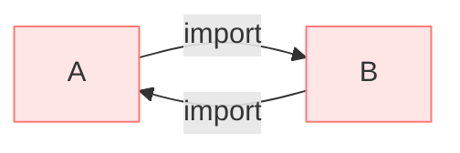
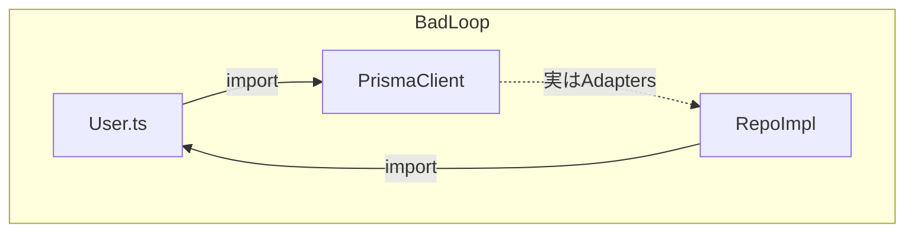

# 第12章：循環参照を倒す①：循環が起きる典型パターン🌀😵‍💫

## この章のゴール🎯✨

この章が終わったら、こうなれるよ〜！😊🌸

* 「循環参照（circular dependency）」を**見抜ける**👀🕵️‍♀️
* どんな時に起きやすいか、**典型パターン**で説明できる📚✨
* 実際にわざと循環を作って、**症状を観察**できる🔬💥
* ツールで「循環っぽい場所」を**あぶり出せる**📈🛠️

---

## 1) 循環参照ってなに？🌀🔗




ざっくり言うと👇

* A が B を import
* B が A を import
* ……で、**ぐるっと輪っか**になっちゃう状態🌀

もうちょい現実寄りだと👇

* A → B → C → A みたいな **3点以上の輪っか**もぜんぜん起こる😵‍💫

---

## 2) なんでヤバいの？💥（“動くけど壊れてる”が一番こわい😱）

循環参照は「必ず即死」じゃないのが怖いところ🥶
でも、次みたいな事故が起きやすいよ〜👇

### よくある事故例💣


* **undefined を import しちゃう**（初期化が終わってない）😇
* **初期化順が環境で変わる**（開発/本番/テストで差が出る）🎭
* **副作用（side effect）が暴れる**（import しただけで何かが動く）🧨
* 「原因が循環」だと気づかず、**謎バグ沼**に沈む🫠🕳️

ESLintの `import/no-cycle` の説明でも、循環は `undefined` を取り込む原因になりがちって明言されてるよ〜📌([Oxc][1])

---

## 3) 症状コレクション👀💥（見たら「あっ…循環かも」ってなるやつ）

循環が絡むと出やすいエラー／挙動はこんな感じ👇

* `ReferenceError: Cannot access 'X' before initialization` 😱
* `TypeError: X is not a constructor` 😵
* `undefined` が混ざって「なんで？」ってなる🫠
* “たまに”だけ壊れる（再現率低い）🎲
* テストだけ落ちる / 本番だけ壊れる 🧪🌋

---

## 4) ミニ実験🔬：わざと循環を作って症状を見る🌀👩‍💻

### 4-1) まずは「即死パターン」💥（初期化順で死ぬ）


以下の3ファイルを作ってね👇

**src/a.ts**

```ts
import { bValue } from "./b.js";

export const aValue = "A";

// ここがポイント：importした値をトップレベルで使う（＝初期化順に依存しやすい）
export const aComputed = `aComputed sees: ${bValue}`;
```

**src/b.ts**

```ts
import { aComputed } from "./a.js";

export const bValue = "B";
export const bComputed = `bComputed sees: ${aComputed}`;
```

**src/main.ts**

```ts
import { aComputed } from "./a.js";
import { bComputed } from "./b.js";

console.log({ aComputed, bComputed });
```

この形は、**トップレベル評価**（import した瞬間に計算が走る）を使ってるから、循環があると死にやすいよ💥🌀

> 「トップレベルでの計算」「トップレベルでの副作用」
> ここは循環の地雷原💣😵‍💫

---

### 4-2) 「即死じゃないけど壊れてる」パターン😇（undefined混入）

次のように “関数で遅延して呼ぶ” 形に変えると、エラーにならずに進むこともあるけど……
**タイミング次第で undefined が混ざる**系のバグが出やすいよ🫠🌀

**src/a.ts**

```ts
import { getB } from "./b.js";

export function getA() {
  return `A sees -> ${getB()}`;
}
```

**src/b.ts**

```ts
import { getA } from "./a.js";

export function getB() {
  return `B sees -> ${getA()}`;
}
```

**src/main.ts**

```ts
import { getA } from "./a.js";
console.log(getA());
```

これ、実行すると **無限再帰**になるよね😇♾️
循環参照は「undefined」だけじゃなくて、こういう **設計の自己参照ループ**も引き起こすのがポイントだよ🌀💥

---

## 5) 循環参照が起きる典型パターン集📚🌀（超重要！）

### パターンA：相互参照サービス（“お互い助け合い”が地獄に）🤝🕳️


* `UserService` が `AuthService` を使う
* `AuthService` が `UserService` を使う
  → だいたいこうなる😵‍💫

**ありがちな匂い**👃

* 「便利だから相手のサービスを呼ぶ」が増える
* “責務の境界”があいまいになっていく🫠


---

### パターンB：ドメインと外側が握手しちゃう（層が混ざる）🧅🤝💥


たとえば👇

* `domain/User.ts` が DBクライアントを import（外側に依存）
* adapter 側は domain を import（内側に依存）
  → **内外で握手して輪っか**🌀



**匂い**👃

* domain のファイルに `fetch` や DBっぽいコードが混ざり始める🌐🗄️

---

### パターンC：設定・DIの置き場ミス（“組み立て”が侵食）🏗️🧩🌀

* `config.ts` が domain を import
* domain が config を import（設定値ほしい〜ってなる）
  → **設定を中心が見ちゃった**系の循環🌀😵

**匂い**👃

* “どこでも使える便利設定”を作った瞬間に起きがち😇

---

### パターンD：shared/utils ゴミ箱化🗑️🕳️（第14章の伏線！）

* `shared/` に何でも入れる
* A も B も shared を使う
* shared も A/B を参照し始める
  → “共有”が中心になって輪っかが爆増🌀💥

**匂い**👃

* shared の中に「業務っぽい名前」が増える（例：`userHelpers` とか）😵‍💫

---

### パターンE：barrel（index.ts）経由の import（便利の代償）📦🌀

これは第13章で本格的にやるけど、**起きがちなので先に匂いだけ**👃✨

* どこでも `from "@/domain"` みたいに import できて便利
* でも `index.ts` が再exportの集合体になる
* その `index.ts` を経由して輪っかができやすい🌀💥

---

## 6) 「型だけ import」のつもりが…実行時 import になってた😅📦

TypeScriptって、**型（type）**は実行時には消えるよね🫶
でも、書き方次第で “実行時 import” が残って循環を作ることがあるの💥

なので、循環が疑わしい時は👇が超おすすめ！

* 型だけなら `import type` を使う✍️✨
* 「これは型専用だよ」ってコードで宣言しておくと事故りにくい🛡️

---

## 7) ツールで「循環してる場所」をあぶり出す📈🛠️✨

### 7-1) Madge（循環検出＆グラフ化）🕸️📊


Madge は「依存グラフ作って、循環も見つける」系の定番ツールだよ〜✨([GitHub][2])

まずは循環だけ出す👇

```bash
npx madge src --extensions ts --circular
```

さらにグラフ画像も欲しいなら（Graphvizが必要なことが多いよ）📸✨

```bash
npx madge src --extensions ts --image dep-graph.svg
```

※ただし、ツールにも限界はあるよ〜！
Madge が「全部の循環を拾えないことがある」って議論もあるので、過信しすぎ注意⚠️([GitHub][3])

---

### 7-2) ESLint の `import/no-cycle`（“書いた瞬間に怒ってくれる”）😠🛡️

`eslint-plugin-import` の `no-cycle` は循環検出ルールだよ📌([GitHub][4])

ただしこれも万能ではなく、ケースによっては検出が難しいことがあるよ⚠️([GitHub][5])

（だからこそ「Madge + ESLint」みたいに、**複数の網で捕まえる**のが強い🕸️🕸️✨）

---

## 8) ミニ演習👩‍💻🏁（“見抜く力”がつくよ！）

### 演習1：循環を作って、症状メモ📝🌀

1. さっきの `a.ts / b.ts / main.ts` を作る
2. どんなエラー／挙動になったかメモ📝
3. 「トップレベル評価が原因っぽい？」って言語化してみる🗣️✨

### 演習2：Madge で循環ルートを特定🕵️‍♀️📈

1. `npx madge ... --circular` を実行
2. 出てきた “輪っか” を紙に書く（A→B→C→A）✍️🌀
3. 典型パターンA〜Eのどれに近いか当てる🎯✨

---

## 9) AIに頼るコツ🤖💬（便利プロンプト集✨）

コピペで使えるやつ置いとくね〜😊🌸

* 「この `--circular` の出力から、循環の最短経路を1つ図解して」🗺️🌀
* 「この循環は典型パターンA〜Eのどれ？理由もつけて」📌🧠
* 「“トップレベル評価”を避けて循環の症状を弱める案を3つ」🧯✨
* 「`import type` にできる箇所を候補として列挙して」📜🩷
* 「依存の矢印が内向きになるように、契約（interface）抽出案を出して」🧩➡️

---

## まとめ🌸✨

* 循環参照は **輪っかの import** 🌀
* 怖いのは「動くけど壊れてる」系（undefined混入・順番依存）😇💥
* 典型パターン（相互サービス、層の混在、config侵食、sharedゴミ箱、barrel）を覚えると見抜ける👀✨
* ツールは **Madge** と **ESLint `import/no-cycle`** の合わせ技が強い🛡️📈([GitHub][2])

---

## 次章予告📦➡️✨（第13章）

次は **barrel（index.ts）** が循環を増やしやすい話と、
「依存方向を整えて、構造で防ぐ」やり方に入るよ〜😊🧹🧭

[1]: https://oxc.rs/docs/guide/usage/linter/rules/import/no-cycle?utm_source=chatgpt.com "import/no-cycle | The JavaScript Oxidation Compiler"
[2]: https://github.com/pahen/madge?utm_source=chatgpt.com "pahen/madge: Create graphs from your CommonJS, AMD ..."
[3]: https://github.com/pahen/madge/issues/447?utm_source=chatgpt.com "Inconsistencies in circular dependency detection · Issue #447"
[4]: https://github.com/import-js/eslint-plugin-import/blob/main/docs/rules/no-cycle.md?utm_source=chatgpt.com "eslint-plugin-import/docs/rules/no-cycle.md at main"
[5]: https://github.com/import-js/eslint-plugin-import/issues/3147?utm_source=chatgpt.com "import/no-cycle does not detect some cycles with side- ..."
