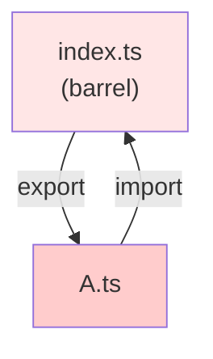
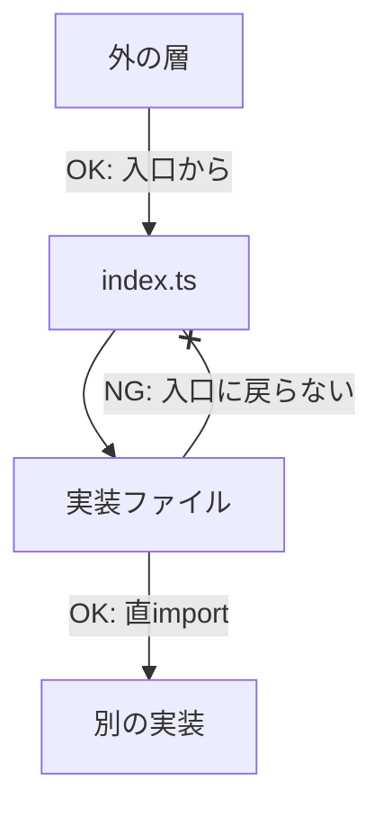

# 第13章：循環参照を倒す②：barrel（index.ts）と依存方向の整え方📦➡️

この章が終わるころには、こんな状態になってるはずだよ〜！🥳🌸

* 「barrel（index.ts）」が**便利だけど危ない理由**を、図で説明できる🗺️
* 循環参照が出たときに、**“どこから壊せばいいか”の型**が分かる✂️
* 「barrelを使う/使わない」の**チームルール**を作れる📏✅
* ツールで循環を見つけて→直して→再発防止までできる🛡️

---

## 0) 2026年1月時点の“前提になる最新事情”だけ先にチラ見👀✨

* TypeScript の npm 最新安定版は **5.9.3**（2026年1月時点）だよ📦 ([npm][1])
* Node.js は **v24 が Active LTS**（2026年1月時点）で、現行の長期運用ラインとして扱いやすいよ🟩 ([Node.js][2])
* そして最近の流れとして「型だけの import はちゃんと型だけとして書こうね」がより大事になってる（後で出てくる「import type」につながるよ）🧡 ([Qiita][3])

---

## 1) まず結論：barrel は “外に見せる出口” にだけ置くのが安全💡🚪

barrel（だいたい index.ts）って、こういうやつだよね👇

* フォルダの中のものをまとめて再 export して
* import を短くできて
* 見た目がスッキリする✨

でも…便利なぶん、**循環参照の温床（結び目）**になりがち😵‍💫
dependency-cruiser のドキュメントでも、循環の“結び目”として **barrel files が絡みやすい**って言及されてるよ🌀 ([GitHub][4])

---

## 2) barrel が循環を呼ぶ “いちばん多い形” 🌀📦


## 🍓事故パターン：同じフォルダ内で「index.ts 経由 import」してしまう

イメージはこれ👇

* components/index.ts が A と B をまとめる
* A.ts が B を使いたくて、つい components/index.ts から import
* すると…「index → A → index」の循環が完成😇

図にするとこう！

* index.ts → A.ts（export してるから）
* A.ts → index.ts（便利だから）
* index.ts → A.ts（export してるから）
* A.ts → index.ts（便利だから）
* **はい循環！🌀**



しかも eslint-plugin-import の import/no-cycle は「依存を辿って戻って来られる経路があるのを禁止」っていうルールだよ🕵️‍♀️ ([GitHub][5])

---

## 3) よくある “barrel地雷” 4選💣📦😇

## 地雷①：フォルダ内コードが自分の barrel を使う（自己参照）🪞


* 「同じ層・同じフォルダ内は “直 import”」にすると一気に減るよ✅

## 地雷②：barrel が “再export以外” をし始める（副作用入り）💥

* 例：index.ts で polyfill を読み込む、初期化する、何か登録する…
  → 依存グラフが読めなくなる😵‍💫

## 地雷③：export * を盛りすぎて “依存方向が見えなくなる” 🌫️

* まとめすぎると「どこからどこへ依存してるか」が隠れる🙈

## 地雷④：型だけ欲しいのに “値 import” になって実行時依存が残る😱

* 型だけなら **import type** が効く！
* 型だけの import はコンパイル時に消えるから、実行時の循環には寄与しない（公式ドキュメントでもそう説明されてる）🧡 ([Angular 日本語版][6])

---

## 4) 今日から使える “barrel運用ルール” テンプレ📏✅✨

ここ、超大事！チームでそのまま採用できる形にするね🫶

## ルールA：barrel は “外向け API” 専用🚪

* ✅ 外の層（別フォルダ）から import する入口として使う
* ❌ 同じフォルダ内のファイルは、そのフォルダの index.ts から import しない

## ルールB：barrel は “再exportだけ” 📦

* ✅ export { … } / export * from … だけ
* ❌ 初期化、登録、副作用のある処理は禁止🙅‍♀️

## ルールC：barrel を置く場所は “少なめ” が正義🥹

おすすめはこのどれか👇

* パターン①：各フォルダに index.ts は置くけど「外部公開専用」
* パターン②：index.ts をやめて public.ts / exports.ts みたいに “意図が伝わる名前” にする
* パターン③：ルート（src/index.ts）だけにする（小〜中規模で強い💪）

## ルールD：型だけの依存は import type で切る✂️🧡

* 型の相互参照があるときは、まずこれを疑う
* 最近は「型だけなら明示してね」がより重要になってるよ🧠 ([Qiita][3])

---

## 5) ミニ演習：barrel でわざと循環を作って、ツールで見つけよう🔬🌀

## 5-1) 検出ツール：Madge を使うよ🕵️‍♀️✨

Madge は「依存グラフを可視化したり、循環参照を見つけたりするツール」だよ📈 ([npm][7])

PowerShell でこれ👇

```powershell
npm i -D madge
npx madge --circular --extensions ts ./src
```

---

## 5-2) サンプル構成（わざと事故る）💥

```text
src/
  ui/
    index.ts
    Button.ts
    Dialog.ts
  app.ts
```

**src/ui/index.ts（barrel）**

```ts
export * from "./Button";
export * from "./Dialog";
```

**src/ui/Button.ts**

```ts
export function Button(label: string) {
  return { kind: "button", label };
}
```

**src/ui/Dialog.ts（ここが罠😇）**

```ts
import { Button } from "./index"; // ← 同じフォルダの barrel 経由 import（危険）

export function Dialog(title: string) {
  const ok = Button("OK");
  return { kind: "dialog", title, ok };
}
```

この状態で madge を回すと、循環を検出できる可能性が高いよ🌀（環境差はあるけど、狙いはここ！）

---

## 6) リファクタ演習：循環を壊す “3つの壊し方” ✂️✨

## 壊し方①：フォルダ内は直 import にする（最速で効く）🚀

**src/ui/Dialog.ts**

```ts
import { Button } from "./Button"; // ← 直 import に変更！

export function Dialog(title: string) {
  const ok = Button("OK");
  return { kind: "dialog", title, ok };
}
```

✅ これだけで「index.ts → Dialog.ts → index.ts」の輪っかが消える！

---

## 壊し方②：型だけ依存なら import type にする🧡✂️


たとえば「Dialog が Button の “型だけ” 欲しい」みたいな場面。

* 型だけの import はコンパイル時に消えるから、実行時循環を減らせるよ💡 ([Angular 日本語版][6])

例👇

```ts
import type { ButtonProps } from "./Button.types";
```

型を別ファイル（Button.types.ts）に逃がすのも強いよ〜🧩

---

## 壊し方③：“契約” を切り出して依存方向を揃える📜➡️


循環って、だいたい
「A が B を知りたい」「B も A を知りたい」
っていう **相互に知り合いすぎ問題**なんだよね🥲

そこで、

* **共通の言葉（契約）**だけを切り出して
* A も B も “契約だけ” を見る

にすると、依存方向がスッと整うよ🧭

イメージ👇

```text
（悪い例）
A → B
B → A

（良い例）
A → Contract
B → Contract
```

---

## 7) “依存方向の整え方” を1枚で覚えるコツ🧠🧭✨




barrel を安全にするコツは、結局ここ👇

## ✅「フォルダの外に見せるもの」だけを barrel に集める

* 外側の層からは barrel で入る（入口）
* 内側の実装どうしは直 import（路地）

## ✅「入口」と「路地」を混ぜない


* 入口（barrel）を路地の中で使うと、迷路になって循環しやすい🌀

---

## 8) AI🤖に頼むと爆速になるプロンプト集🪄💌

コピペで使える形にするね〜！✨

## 🔍循環の原因特定

* 「この import 関係が循環してる可能性がある箇所を特定して、循環パスを文章で説明して」

## ✂️直し方の提案（3案ほしい）

* 「循環参照を壊すリファクタ案を3つ。①直import化 ②契約切り出し ③import type 化 を必ず含めて」

## 📏チームルール化（そのままREADMEに貼れる）

* 「barrel（index.ts）の運用ルールを、短い箇条書き10個で。フォルダ内でbarrelを使わないルールを必ず入れて」

---

## 9) まとめ：この章の “持ち帰りチェックリスト” ✅📦✨

* ✅ 同じフォルダ内で index.ts 経由 import してない？（最優先で疑う！）
* ✅ barrel は再exportだけになってる？（副作用ゼロ！）
* ✅ export * 盛りすぎて、依存方向が見えなくなってない？
* ✅ 型だけ依存は import type にできない？（実行時依存を減らす🧡） ([Angular 日本語版][6])
* ✅ ツールで循環を検出できる？（madge など） ([npm][7])

---

次の第14章は、みんな大好き（？）**shared/utils 沼**を回避する話だよ〜！🕳️🐥✨
「barrelで見えなくなった依存」を、shared がさらにぐちゃぐちゃにしがちなので…ここで整えた方向感がめちゃ効いてくるよ😆💪

[1]: https://www.npmjs.com/package/typescript?utm_source=chatgpt.com "typescript"
[2]: https://nodejs.org/en/about/previous-releases?utm_source=chatgpt.com "Node.js Releases"
[3]: https://qiita.com/tarpan_75/items/b6ea75bfec142ad902e0?utm_source=chatgpt.com "TypeScriptで型をインポートする際にverbatimModuleSyntax ..."
[4]: https://github.com/sverweij/dependency-cruiser/blob/main/doc/rules-reference.md?utm_source=chatgpt.com "dependency-cruiser/doc/rules-reference.md at main"
[5]: https://github.com/import-js/eslint-plugin-import/blob/main/docs/rules/no-cycle.md?utm_source=chatgpt.com "eslint-plugin-import/docs/rules/no-cycle.md at main"
[6]: https://angular.jp/errors/NG0919?utm_source=chatgpt.com "NG0919: Circular Dependency Detected"
[7]: https://www.npmjs.com/package/madge?utm_source=chatgpt.com "madge"
