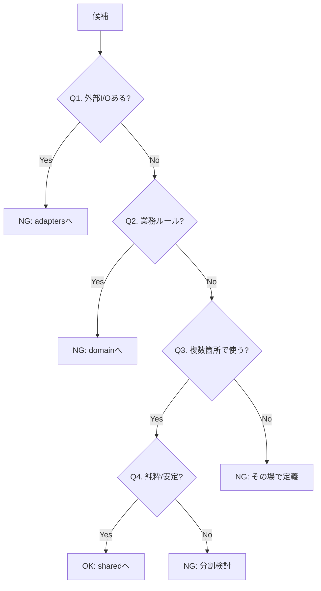
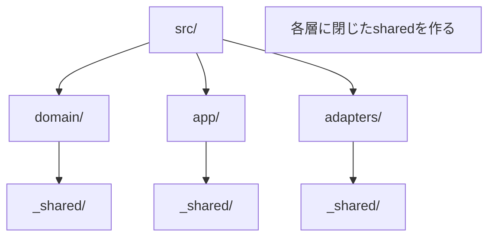

# 第14章：shared/utils沼を回避①：共有していいもの・ダメなもの🕳️🐥

## この章のゴール🎯

「shared」「utils」に何でも放り込む前に、**これは共有してOK？それとも地雷？**をスパッと判断できるようになるよ〜😊✨
（そして依存関係ルールの“矢印➡️”を守ったまま、便利さもゲットする💪）

---

## 1) shared/utils沼ってなに？😵‍💫🗑️


最初はこう始まるの👇

* 「ちょっと便利だから `shared/utils.ts` に置こ〜」🐣
* 「また似たの出た！ `shared` に追加〜」📦
* 「あれ？ここ…業務ルールもDBもHTTPも混ざってない…？😱」

こうなると、sharedは**共有ライブラリ**じゃなくて、**“よくわからない寄せ集め（ゴミ箱）”**になっていくのが定番…🫠

しかも厄介なのは、`shared` はみんなが気軽に参照できるから
**依存の向きがぐちゃぐちゃになりやすい**んだよね🌀

> 「utils/helpers みたいなパッケージ名は、設計上の問題（依存や構造の問題）から生まれがち。可能なら呼び出し元へ戻す／場合によっては少しの重複の方がマシ」みたいな話もあるよ〜💡 ([Dave Cheney][1])

---

## 2) 共有してOKなものの“合格ライン”✅✨（4つのフィルター）




sharedに入れていいか迷ったら、これを順番にチェックしてね🧠🔍

## フィルター①：純粋（Pure）？🧼


* ✅ 入力 → 出力が決まる（同じ入力なら同じ結果）
* ✅ 外部と通信しない（DB/HTTP/FS/環境変数/現在時刻に依存しない）
* ✅ 副作用なし（グローバルを書き換えない）

→ **純粋関数**は shared 候補になりやすい😊

---

## フィルター②：安定（Stable）？🧊

* ✅ 仕様変更が滅多に起きない
* ✅ 変更が起きても影響範囲が読める

たとえば「文字列のトリム」「IDのバリデーション」みたいに
**技術的に安定してるもの**はOK寄り✨

---

## フィルター③：意味が一般的（Generic）？🌍

* ✅ “どの機能でも同じ意味で使える”
* ❌ “ToDoの締切ルール” “注文の割引ルール” ← それ業務ルール！

業務ルールっぽい時点で、sharedに入れると高確率で事故る💥

---

## フィルター④：依存方向を壊さない？➡️🚫


sharedを使うせいで…

* domain が adapters を参照する
* app が UI/HTTP/DB の型を知る
* 便利関数のために外部ライブラリを中心に持ち込む

みたいになるなら、**sharedに入れた瞬間アウト**🙅‍♀️

---

## 3) “sharedに入れていい例”😇📦✨（OKパターン集）

## OK例A：超薄い純粋関数🧼

```ts
// src/shared/string/normalizeSpaces.ts
export function normalizeSpaces(input: string): string {
  return input.replace(/\s+/g, " ").trim();
}
```

理由👍

* 純粋・安定・一般的・どの層でも安全✨

---

## OK例B：小さめの型（薄い契約）📜

```ts
// src/shared/types/Brand.ts
export type Brand<T, B extends string> = T & { readonly __brand: B };
```

理由👍

* これは「型の道具」であって、業務ルールじゃない🧸

---

## OK例C：変換じゃなく“汎用フォーマット”だけ（ただし注意）🧊

```ts
// src/shared/date/formatIsoDate.ts
export function formatIsoDate(date: Date): string {
  const yyyy = date.getFullYear();
  const mm = String(date.getMonth() + 1).padStart(2, "0");
  const dd = String(date.getDate()).padStart(2, "0");
  return `${yyyy}-${mm}-${dd}`;
}
```

注意⚠️

* 「表示用フォーマット」はUI寄りになりがちだから、迷ったら **UI側に寄せる**のもアリ！

---

## 4) “sharedに入れたら危険な例”😈🧨（NGパターン集）

## NG例A：業務ルールが混ざる（domainが痩せる）🍂

```ts
// src/shared/utils.ts  ← こういう所に入りがち…
export function calcInvoiceTotal(items: { price: number; qty: number }[]) {
  // これ、立派な業務ルールだよね…？😱
  return items.reduce((sum, x) => sum + x.price * x.qty, 0);
}
```

これが増えると「ドメインはデータだけ、ロジックは外に散乱」になりやすい…
“ドメインが痩せる問題”は昔からよく語られるテーマだよ〜📌 ([martinfowler.com][2])

---

## NG例B：外部I/Oが混ざる（中心が外側に引っ張られる）🌪️

```ts
// src/shared/http.ts ← sharedに置くと参照が無限に増える😵‍💫
export async function getJson<T>(url: string): Promise<T> {
  const res = await fetch(url);
  return res.json() as Promise<T>;
}
```

これ、便利だけど…

* app/domain からも呼べちゃう
* いつの間にか「中心がHTTP知ってる」状態になる

→ これは **adapters側に閉じ込める**のが安全🧯

---

## NG例C：名前が“何でも屋”👻（増殖のサイン）


* `shared/utils.ts`
* `shared/helpers.ts`
* `shared/common.ts`
* `shared/misc.ts`

こういうファイル、放置すると“モンスター化”しやすいって話があるよ🧟‍♀️ ([Artem Sapegin][3])
（「置き場所に困ったからとりあえず入れた」が永久保存されがち😇）

---

## 5) 判断に迷ったらこれ！🧭✨（超実用フローチャート）

✅ **Q1：それ、外部I/Oする？（HTTP/DB/FS/Env/Clock）**

* YES → shared禁止🚫（adaptersへ）
* NO → Q2へ

✅ **Q2：それ、業務ルール？（割引、締切、状態遷移、判定ルール…）**

* YES → shared禁止🚫（domainへ）
* NO → Q3へ

✅ **Q3：それ、複数の場所で“同じ意味で”使う？**

* NO → sharedに入れない（近くに置く）📍
* YES → Q4へ

✅ **Q4：純粋で安定で小さい？**

* YES → shared OK🎉
* NO → sharedに入れる前に分割・命名・置き場再検討🧠

---

## 6) “sharedをゴミ箱化させない”置き場所ルール🏠✨




おすすめはこれ👇（**sharedは“1個”にしない**作戦！）

* `src/domain/_shared/`（domain内だけで共有）
* `src/app/_shared/`（app内だけで共有）
* `src/adapters/_shared/`（adapters内だけで共有）

こうすると、「どこまで共有していいか」が自然に決まるよ😊
（“境界をまたぐ共有”が起きにくい✂️）

---

## 7) ミニ演習👩‍💻🧪：これ shared 入れていい？（OK/NG/保留）

次の候補を分類してみてね〜📌

1. `normalizeSpaces(text)`
2. `calculateDiscount(cart)`
3. `toUserDto(user)`
4. `getEnv(name)`
5. `sleep(ms)`
6. `parseJwt(token)`
7. `Brand<T, "UserId">` 型

## こたえ合わせ🎉

* 1 ✅OK（純粋・一般的）
* 2 ❌NG（業務ルール→domainへ）
* 3 ❌NG（DTO変換→境界＝adaptersへ）
* 4 ❌NG（環境依存→adapters/entryへ）
* 5 🟡保留（テストや処理制御で使うならOK寄りだけど、用途次第）
* 6 ❌NG（セキュリティ/仕様/ライブラリ依存が強い→閉じ込めたい）
* 7 ✅OK（薄い型道具）

---

## 8) AI🤖にやらせると超ラクなやつ（この章向けプロンプト集）

コピペで使えるよ〜💌✨

## shared監査🕵️‍♀️

* 「`src/shared` の各ファイルを、純粋関数/型ユーティリティ/業務ルール/I-O/その他 に分類して、危険度を3段階で評価して」

## 移設提案🚚

* 「この `shared/utils.ts` の各関数について、最適な移動先（domain/app/adapters）と理由を提案して。移動後のファイル名案もつけて」

## 命名改善📛

* 「`utils.ts` を分割したい。中身を見て、意味が伝わるフォルダ名・ファイル名にリネーム案を出して」

## “重複のほうがマシ？”判定🧠

* 「この関数は共有すべき？それとも呼び出し元に置いて少し重複した方が安全？判断理由も」

（“少しの重複は間違った抽象化より安い”って考え方、こういう時に効くよ〜📌 ([Dave Cheney][1])）

---

## 9) ちょい最新ネタ🍓（依存まわりに関係ある話）

最近の TypeScript では Node.js の挙動に合わせた `--module node20` みたいな安定オプションも出てて、**import/exportの世界がどんどん“現実のNode”に寄ってる**感じだよ〜📦✨ ([TypeScript][4])
だからこそ、**importの向き（依存の向き）を雑にすると後で効いてくる**…ってイメージを持っておくと強い💪

---

## まとめ🎀✨

* sharedに入れていいのは、だいたい
  **「純粋・安定・一般的・依存方向を壊さない」**ものだけ✅
* 業務ルールやI/Oが混ざった瞬間、sharedは事故りやすい💥
* “sharedは1個”より、**層ごとの_shared**で封じ込めるのが超おすすめ🏠✨
* 迷ったら「sharedに入れない」勇気が勝つことが多いよ😌🌸

---

次の第15章では、ここで出てきた「じゃあ共有したい“言葉（契約）”はどこに置くの？」を、**契約（Contract）中心**でスッキリ解決していくよ〜📜🎯✨

[1]: https://dave.cheney.net/practical-go/presentations/qcon-china.html?utm_source=chatgpt.com "Real world advice for writing maintainable Go programs"
[2]: https://martinfowler.com/bliki/AnemicDomainModel.html?utm_source=chatgpt.com "Anemic Domain Model"
[3]: https://sapegin.me/blog/divide/?utm_source=chatgpt.com "Washing your code: divide and conquer, or merge and relax"
[4]: https://www.typescriptlang.org/docs/handbook/release-notes/typescript-5-9.html?utm_source=chatgpt.com "Documentation - TypeScript 5.9"
