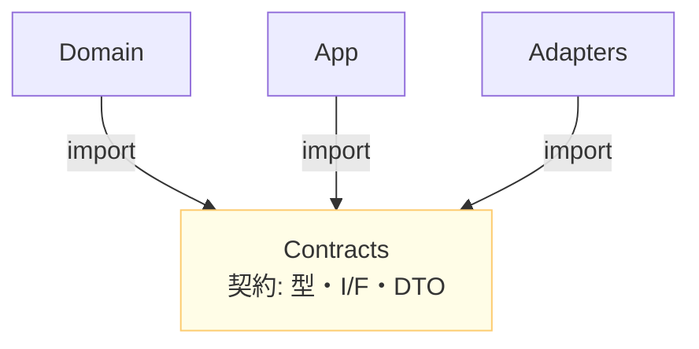

# 第15章：shared/utils沼を回避②：契約（Contract）中心の共有にする📜🎯

> **この章のゴール**：
> 「みんなが使うから shared に入れよ〜🥺」を卒業して、**“共有するなら契約だけ”** に寄せられるようになること💪🌸
> すると、依存が暴れなくなって、変更がラクになって、テストもしやすくなるよ〜！🎉

---

## 1) まず “shared/utils沼” の正体を再確認🕳️😵‍💫

shared や utils が沼ると、だいたいこんな症状が出るよ👇

* **どこからでも import できる**（＝依存が四方八方に飛ぶ）🌀
* **便利関数の名を借りた業務ルール**が混ざる（＝変更が怖い）😱
* **誰がオーナーか不明**（＝直す人がいない）🤷‍♀️
* 「ついでにここも…」が増えて **巨大化** 🐘

そして最悪パターン👇
**domain/app/adapters が “shared” でつながって循環** し始めます🌀💥

---

## 2) “契約（Contract）” ってなに？🤝✨


ここでいう **契約** は、

* **境界をまたぐときの “約束ごと”**（＝共通言語）
* **「欲しい能力」や「やりとりの形」だけ**を定義するもの

って感じ☺️💡

つまり…

✅ 契約は「**型・インターフェース・メッセージの形**」
❌ 契約は「**便利な処理の寄せ集め**」ではない

---

## 3) contracts/ に置いていいもの・ダメなもの🧺✅❌

### ✅ contracts/ に置いていい（置く価値ある）もの🎁

境界を守るための “言葉” だけ✨

* **Ports（外側に頼む能力）**

  * 例：`UserRepository`, `Clock`, `PaymentGateway`
* **DTO（境界を越えるデータの形）**

  * 例：`UserDto`, `TodoDto`, `CreateTodoRequest`
* **Events（イベントの形）**

  * 例：`DomainEvent`, `TodoCreated`
* **Errors（境界で共有するエラー種別）**

  * 例：`AppError`, `ErrorCode`
* **識別子・薄い型**

  * 例：`type UserId = string & { __brand: "UserId" }`（ブランディング）✨
* **設定の形（Configの型）**

  * 例：`DbConfig`, `FeatureFlags`

---

### ❌ contracts/ に置いちゃダメ（沼る）もの🧨

“処理” を置くと一気に shared 化するよ…！

* **業務ロジック**（割引計算、権限判定、料金ルールなど）💸
* **具体ライブラリ依存**（DB/HTTP/SDK/フレームワーク）📦
* **便利関数の詰め合わせ**（format, parse, convert 乱立）🧂
* **domain の中身そのものを外に渡す**（Entity丸出し）🥲

---

## 4) どこに contracts を置く？おすすめ2パターン📁✨




### パターンA：単一リポジトリ（最初はこれでOK）🐣

```
src/
  domain/
  app/
  contracts/    ← ここが「共有の中心」📌
  adapters/
```

依存のイメージはこう👇
**domain/app → contracts ← adapters**
（contracts は “参照される側” になりやすい）

---

### パターンB：monorepo / packages（大きくなったら）📦✨


```
packages/
  contracts/
  domain/
  app/
  adapters/
```

「契約だけのパッケージ」があると、物理的にも依存が切れやすいよ✂️😊
（こういうTSのDDD/ヘキサゴナル構成の実例リポジトリもあるよ）([GitHub][1])

---

## 5) TypeScriptで “契約だけ共有” を成立させるコツ🧠✨

### コツ①：契約は **型中心**（実行コードを増やさない）🧊

契約に実行コードが増えると、

* 「つい便利関数も置くか〜」が始まる
* import した瞬間に副作用が混ざる

ってなりがち😭

最近の TypeScript では、`tsc --init` がより実用的な初期設定になってて、例えば **`verbatimModuleSyntax`** や **`noUncheckedSideEffectImports`** みたいに「importの扱いを安全にする」方向の設定も推されてるよ🛡️✨([TypeScript][2])

---

### コツ②：`import type` / `export type` をクセにする🧡


contracts は「型だけ」で成立することが多いから、

* **実行時依存を増やさない**
* **バンドルや循環の事故を減らす**

のに効くよ😊
（`verbatimModuleSyntax` もこの流れに相性いいやつ）([TypeScript][2])

---

### コツ③：契約の破壊変更を避ける（地味に超重要）🧨


契約は “みんなが触る” から、破壊変更が地獄になりやすい…😱

おすすめルール👇

* **追加はOK**（フィールド追加・Union追加など）✨
* **削除・名前変更は慎重に**（互換性が壊れる）💥
* 必要なら **version を持たせる**（イベントやDTO）🔢

---

## 6) ミニ例：ToDoで「contracts中心」を体験しよう🧪💖

### フォルダ構成（イメージ）📁

```
src/
  contracts/
    todo.ts
    ports.ts
    errors.ts
  app/
    createTodo.ts
  domain/
    todo.ts
  adapters/
    todoRepo.memory.ts
    todoRepo.db.ts
  main.ts
```

---

### 6-1) contracts：境界の言葉だけ置く📜✨

```ts
// src/contracts/todo.ts
export type TodoId = string & { readonly __brand: "TodoId" };

export type TodoDto = {
  id: TodoId;
  title: string;
  done: boolean;
};
```

```ts
// src/contracts/ports.ts
import type { TodoDto, TodoId } from "./todo";

export interface TodoRepository {
  findById(id: TodoId): Promise<TodoDto | null>;
  save(todo: TodoDto): Promise<void>;
}
```

```ts
// src/contracts/errors.ts
export type ErrorCode =
  | "TODO_NOT_FOUND"
  | "TITLE_EMPTY";

export type AppError = {
  code: ErrorCode;
  message: string;
};
```

> ここには **計算・変換・DB処理は置かない** よ！🙅‍♀️

---

### 6-2) app：契約（Port）にだけ依存してユースケースを書く🧅✨

```ts
// src/app/createTodo.ts
import type { TodoRepository } from "../contracts/ports";
import type { TodoDto, TodoId } from "../contracts/todo";
import type { AppError } from "../contracts/errors";

export type CreateTodoInput = { id: TodoId; title: string };

export type Result<T> =
  | { ok: true; value: T }
  | { ok: false; error: AppError };

export async function createTodo(
  repo: TodoRepository,
  input: CreateTodoInput
): Promise<Result<TodoDto>> {
  if (input.title.trim() === "") {
    return { ok: false, error: { code: "TITLE_EMPTY", message: "タイトルが空だよ〜🥺" } };
  }

  const todo: TodoDto = { id: input.id, title: input.title, done: false };
  await repo.save(todo);
  return { ok: true, value: todo };
}
```

ポイント👇
✅ app は **契約しか知らない**（DBもHTTPも知らない）😌✨

---

### 6-3) adapters：外側で実装して差し込む🧰💕

```ts
// src/adapters/todoRepo.memory.ts
import type { TodoRepository } from "../contracts/ports";
import type { TodoDto, TodoId } from "../contracts/todo";

export function createMemoryTodoRepo(): TodoRepository {
  const store = new Map<TodoId, TodoDto>();

  return {
    async findById(id) {
      return store.get(id) ?? null;
    },
    async save(todo) {
      store.set(todo.id, todo);
    },
  };
}
```

---

## 7) ここが大事！「共有＝契約」の判断フロー🧭✨

迷ったらこの順で考えるとラクだよ😊

1. それは **境界をまたぐ “言葉”**？（型・I/F・DTO・イベント）
   → YES ✅ contracts
2. それは **業務ルール**？
   → YES ✅ domain（または app）
3. それは **外部I/Oの都合**？（DB/HTTP/SDK）
   → YES ✅ adapters
4. それは **ただの便利処理**？
   → まず “各層のローカル” に置く（sharedにしない）🧹

---

## 8) ミニ演習：contracts に入れる？入れない？📝🎯

次の候補を「contracts / domain / adapters / ローカル便利」に仕分けしてみてね😊✨

1. `PaymentGateway` interface
2. `formatYen(amount: number): string`
3. `UserDto`（APIで返す形）
4. `DiscountCalculator`（割引ルール）
5. `DbUserRow`（DBのテーブル形）
6. `TodoCreated`（イベントの型）

**答えの目安**👇
1→contracts✅ / 2→ローカル便利（基本sharedにしない）🧹 / 3→contracts✅ / 4→domain✅ / 5→adapters✅ / 6→contracts✅

---

## 9) AI活用コーナー🤖🪄（めちゃ便利！）

コピペで使えるやつ置いとくね💕

* 「この `shared/utils` の関数一覧を、**contracts / domain / app / adapters** に分類して、理由もつけて」
* 「このユースケースが必要とする **Port interface** を提案して（メソッド名・戻り値も）」
* 「`TodoDto` の破壊変更にならない進化案（追加・非推奨）を3パターン出して」
* 「contracts を型だけに保つための **import type 変換案** を出して」
* 「`contracts` が肥大化しそうな兆候チェックリストを作って」✅

---

## 10) よくある事故とリカバリ集🚑💡

### 事故①：contracts に “便利関数” が入り始めた🍲

**対処**：

* 便利関数は **各層のローカル** に戻す
* 本当に共通なら「pureで副作用ゼロ」だけ厳選✨

---

### 事故②：DTOがdomainを丸コピし始めた🫠

**対処**：

* DTOは「外に見せる最小限」だけ
* domainの都合で外が壊れないように、**境界で翻訳** する（第10〜11章の考え方）🔁

---

### 事故③：lintがうるさくて諦めそう🥺

最近は ESLint 側でも設定を型安全にする `defineConfig()` が入ってきてたりするので、将来 “境界ルールを仕組みで守る” ときに楽になるよ🛡️✨([ESLint][3])
（ここは次章の自動化につながるやつ！）

---

## 11) 最後に：この章のチェックリスト✅💖


PR前にこれ見てね😊

* [ ] contracts に **業務ロジック** 入ってない？🧨
* [ ] contracts が **DB/HTTP/SDK** に依存してない？📦
* [ ] app/domain は **契約（Port/DTO）だけ**見てる？🧅
* [ ] `import type` で **実行時依存を増やしてない**？🧊
* [ ] 契約の変更が **破壊変更** になってない？（削除/名前変更）💥

---

必要なら、この章の内容をベースにして、あなたの想定してる題材（ToDo以外でもOK！家計簿とか予約とか📒✨）に合わせた **「contracts設計のテンプレ」** も作るよ〜😊💖

[1]: https://github.com/CodelyTV/typescript-ddd-example "GitHub - CodelyTV/typescript-ddd-example:  TypeScript DDD Example: Complete project applying Hexagonal Architecture and Domain-Driven Design patterns"
[2]: https://www.typescriptlang.org/docs/handbook/release-notes/typescript-5-9.html "TypeScript: Documentation - TypeScript 5.9"
[3]: https://eslint.org/blog/2025/03/eslint-v9.22.0-released/?utm_source=chatgpt.com "ESLint v9.22.0 released"
