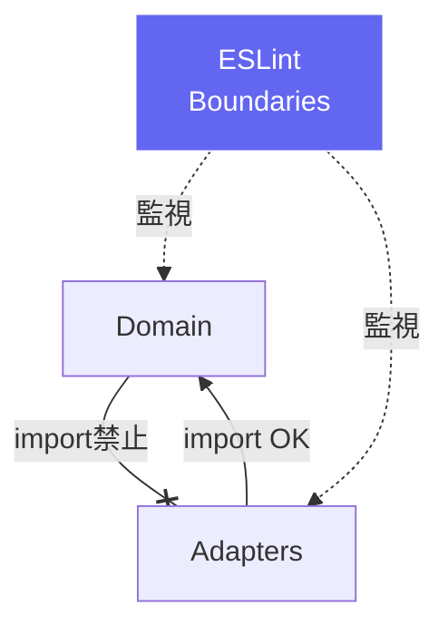

# 第16章：ルールを自動で守る：ESLint境界ルール＋依存の見える化🛡️📈🏁

ここまでで「依存の向き（外→内）を守るのが大事！」って分かってきたと思うんだけど…
**人の注意力だけで守り続けるのはムリゲー**になりがち🥲💦

だから第16章はこうするよ👇

* ✅ **ESLintで“境界ルール”を強制**して、うっかり違反を防ぐ🛡️
* ✅ **依存グラフを“見える化”**して、構造の健康診断をする📈
* ✅ **CIに入れて未来の自分を救う**🤖🏥

---

## 16-0 今日のゴール🎯✨

**「お願い」じゃなくて「仕組み」で守る**状態にするよ💪😊
例：

* `src/domain` が `src/adapters` を `import` したら **即エラー**🚫
* 循環参照（A→B→A）ができたら **即エラー**🌀
* PRで毎回同じ確認をしなくて済むようにする🎉

---

## 16-1 まず“今どきESLint”の前提だけ押さえる🧠⚡

最近のESLintは、**flat config（eslint.config.*）が主流**だよ〜📦✨
そして **ESLint v10**は「古い`.eslintrc`方式を完全に消す」方向で進んでて、2026年に向けてRC段階に入ってるよ（2026-01 時点）🧭([ESLint][1])

なのでこの章は、**flat config前提**で作るね😊

---

## 16-2 使う道具セット🧰✨

### A) ESLintで境界を守る🛡️

* **typescript-eslint**：TSをESLintでちゃんと解析するための公式スタック📘([TypeScript ESLint][2])
* **eslint-plugin-boundaries**：フォルダ（=層）ごとの import 制限ができるやつ🧱🚫([JS Boundaries][3])
* **eslint-plugin-import**：循環参照チェック（`import/no-cycle`）など👀🌀([GitHub][4])

### B) “依存の見える化”📈

* **dependency-cruiser**：依存を解析して、ルール検証やグラフ出力ができる🚢🗺️（循環検出もできるよ）([npm][5])
* **madge**：循環参照の検出＆依存グラフ生成がサクッとできる🕸️([GitHub][6])
* **Graphviz**：`dot`ファイルをSVGとかに変換して“絵”にする🖼️（wingetで入れられる）([Graphviz][7])

---

## 16-3 セットアップ（npmでまとめて入れる）📦✨

ターミナルでこれ👇（devDependenciesでOK）

```powershell
npm i -D eslint typescript-eslint eslint-plugin-boundaries eslint-plugin-import dependency-cruiser madge
```

> ちょい安全メモ🧯
> 2025年に **Windows環境でpostinstall悪用のnpm侵害**が話題になったことがあるから、ロックファイル（package-lock等）と `npm audit` は定期的にね🙏🪪
> （特にPrettier系を追加する時は、変なバージョンを踏まないよう注意⚠️）([SafeDep][8])

---

## 16-4 ESLint：境界（層）ルールを“自動化”する🧱🚫✨




ここではこの層を前提にするよ👇（ロードマップのやつ🧅）

* `src/domain/**` …中心（ルール）🧡
* `src/app/**` …手順（ユースケース）🩵
* `src/adapters/**` …外部I/O（DB/HTTP/SDK）💛
* `src/contracts/**` …層をまたいで参照していい“契約”📜
* `src/shared/**` …小道具（純粋関数とか）🧰

### 16-4-1 eslint.config.mjs を作る📝

プロジェクトルートに `eslint.config.mjs` を作って、こんな感じ👇
（※サンプルなので、最初はコピペで動かしてOK！）

```js
import js from "@eslint/js";
import tseslint from "typescript-eslint";
import boundaries from "eslint-plugin-boundaries";
import importPlugin from "eslint-plugin-import";

export default tseslint.config(
  js.configs.recommended,
  ...tseslint.configs.recommended,

  {
    files: ["**/*.{ts,tsx}"],
    plugins: {
      boundaries,
      import: importPlugin,
    },

    settings: {
      // boundaries が「どのファイルがどの層か」を判定するための設定
      "boundaries/include": ["src/**/*"],

      // どの層がどのパターンか
      "boundaries/elements": [
        { type: "domain", pattern: "src/domain/**/*" },
        { type: "app", pattern: "src/app/**/*" },
        { type: "adapters", pattern: "src/adapters/**/*" },
        { type: "contracts", pattern: "src/contracts/**/*" },
        { type: "shared", pattern: "src/shared/**/*" },
      ],
    },

    rules: {
      // ✅ どのファイルも「どれかの層」に属してね（迷子防止）
      "boundaries/no-unknown-files": "error",

      // ✅ 層（element type）ごとの import ルール
      // デフォルトは「禁止」にして、許可ルールだけ書くのが安全😌
      "boundaries/element-types": [
        "error",
        {
          default: "disallow",
          rules: [
            // domain は「domain / contracts / shared」だけOK
            { from: "domain", allow: ["domain", "contracts", "shared"] },

            // app は「app / domain / contracts / shared」だけOK（adapters禁止）
            { from: "app", allow: ["app", "domain", "contracts", "shared"] },

            // adapters は「なんでも使ってOK」寄り（外側なので）
            { from: "adapters", allow: ["adapters", "app", "domain", "contracts", "shared"] },

            // contracts/shared は広めに許可（ただし“業務ルール”は置かない前提）
            { from: "contracts", allow: ["contracts", "shared"] },
            { from: "shared", allow: ["shared"] },
          ],
        },
      ],

      // ✅ 循環参照を検出（import/no-cycle）
      "import/no-cycle": ["error", { maxDepth: 1 }],

      // ✅ おまけ：importの順序を整える系は好みで追加してね✨
    },
  }
);
```

この境界設定の考え方は `eslint-plugin-boundaries` の基本に沿ってるよ🧱([JS Boundaries][3])
`import/no-cycle` は `eslint-plugin-import` のルールだよ🌀([GitHub][4])

---

### 16-4-2 動作確認（わざと違反してみる😈➡️✅）

例えば `src/domain/todo.ts` から `src/adapters/db.ts` を import してみてね👇
（※この「悪い例」をやるのは今だけね！笑）

```ts
// src/domain/todo.ts
import { db } from "../adapters/db"; // ❌ これは境界違反になる想定

export const x = 1;
```

そして lint 実行👇

```powershell
npx eslint .
```

✅ ここで **“境界違反エラー”が出たら勝ち**🎉🛡️
（出ない場合は、パスやフォルダ名が違ってる可能性が高いよ）

---

## 16-5 「設定できてるか不安…」を救う：Config Inspector🔍🧁

flat configって、設定が合ってるか迷子になりやすいの🥺
そんな時は **ESLint Config Inspector** が超助かるよ✨

```powershell
npx eslint --inspect-config
```

または ESLintが入ってなくても👇

```powershell
npx @eslint/config-inspector
```

ブラウザで設定の“最終結果”を見れるよ👀💓([ESLint][9])


---

## 16-6 依存を“見える化”する📈🗺️（dependency-cruiser / madge）

### 16-6-1 dependency-cruiserで健康診断🚢🩺

dependency-cruiser は「循環参照」「依存の向き」「孤立ファイル」みたいな **構造チェック**に強いよ💪([npm][5])

まずは設定ファイルを用意（例：`.dependency-cruiser.cjs`）

```js
module.exports = {
  forbidden: [
    {
      name: "no-domain-to-adapters",
      severity: "error",
      from: { path: "^src/domain" },
      to: { path: "^src/adapters" },
    },
    {
      name: "no-app-to-adapters",
      severity: "error",
      from: { path: "^src/app" },
      to: { path: "^src/adapters" },
    },
    {
      name: "no-circular",
      severity: "error",
      from: {},
      to: { circular: true },
    },
  ],
};
```

実行👇

```powershell
npx depcruise --validate .dependency-cruiser.cjs src
```

✅ これで **境界違反や循環があったら落ちる** ようになるよ🏁

---

### 16-6-2 グラフを“画像化”する🖼️✨（Graphviz）

Graphviz は winget で入れられるよ📦([Graphviz][7])

```powershell
winget install graphviz
```

そして dot を吐く👇

```powershell
npx depcruise -T dot src > docs/deps.dot
```

SVGに変換👇

```powershell
dot -Tsvg docs/deps.dot -o docs/deps.svg
```

`docs/deps.svg` を開けば、依存が“絵”になるよ〜！📈😍


---

### 16-6-3 madgeで循環参照をサクッと検出🕸️🌀

madge は「循環ある？」を即見たい時に便利✨([GitHub][6])

```powershell
npx madge --circular --extensions ts,tsx src
```

（`tsconfig` を使ってパス解決したいなら `--ts-config` を足すのもアリ👌）

---

## 16-7 package.json に “習慣コマンド”を作る🧠✅

毎回 `npx ...` するの面倒だから、scripts化しよっ☺️

```json
{
  "scripts": {
    "lint": "eslint .",
    "lint:fix": "eslint . --fix",
    "deps:check": "depcruise --validate .dependency-cruiser.cjs src",
    "deps:graph": "depcruise -T dot src > docs/deps.dot && dot -Tsvg docs/deps.dot -o docs/deps.svg",
    "quality": "npm run lint && npm run deps:check"
  }
}
```

これで👇が定番になる✨

```powershell
npm run quality
```

---

## 16-8 CIに入れて“未来の自分”を助ける🤖🛟


GitHub Actions（例：`.github/workflows/quality.yml`）

```yml
name: quality

on:
  pull_request:
  push:
    branches: [ main ]

jobs:
  quality:
    runs-on: windows-latest
    steps:
      - uses: actions/checkout@v4
      - uses: actions/setup-node@v4
        with:
          node-version: "22"
          cache: "npm"
      - run: npm ci
      - run: npm run quality
```

✅ これで「境界違反のPR」は**自動で止まる**よ🛡️✨

---

## 16-9 PRテンプレ（レビュー観点）💌✅


`.github/pull_request_template.md` に置いちゃおう📌

```md
## 変更内容📝
- 

## 依存関係ルールチェック✅
- [ ] domain が adapters を import してない
- [ ] app が adapters を import してない
- [ ] 変換/例外翻訳は adapters 側に置けてる
- [ ] 循環参照が増えてない（npm run deps:check）
- [ ] eslint が通る（npm run lint）

## 補足💬
- 
```

---

## 16-10 AIの使いどころ🤖🪄（この章は相性いい！）

### 境界ルール作りをAIに手伝ってもらう🧱


* 「このフォルダ構成に合わせて boundaries の element-types ルール案を作って。domain→adaptersは禁止で」
* 「domain/app/adapters/contracts/shared の依存許可表を作って」

### 依存グラフの読み解きをAIに頼む📈

* 「deps.svg を見て、循環しそうな塊を3つ指摘して、切り方の案を出して」
* 「この依存の塊を“より内側に寄せる”リファクタ案を提案して」

### ルール違反例を教材用に作る📚

* 「あえて domain→adapters import を作る悪い例と、直した良い例を作って（理由つき）」

---

## 16-11 よくある詰まりポイント集🧯😵‍💫

### ❓ boundaries が効かない

* `boundaries/include` が `src/**/*` になってる？
* `boundaries/elements` の `pattern` が実フォルダと一致してる？
* Config Inspector で「そのファイルにルールが当たってるか」確認しよ🔍([ESLint][9])

### ❓ import/no-cycle が重い

`import/no-cycle` はプロジェクト規模が大きいと重くなりやすい話があるよ🥲

* まず `maxDepth: 1` みたいに軽めから
* きつい時は dependency-cruiser / madge 側で循環チェックを強めるのもアリ🚢🕸️([GitHub][10])

---

## まとめ🏁✨（この章で“完成”したこと）

* ✅ 境界違反を **ESLintで自動ブロック**🛡️
* ✅ 循環参照を **ルールで検出**🌀
* ✅ 依存を **グラフで可視化**📈
* ✅ CIで **壊れる前に止める**🤖
* ✅ PRテンプレで **レビューが楽になる**💌

---

必要なら、今あるあなたのミニプロジェクトのフォルダ構成（`src`配下だけでOK）を貼ってくれたら、**その構成に“ぴったりフィット”する boundaries ルール**に調整した完成版を作るよ😊🧩✨

[1]: https://eslint.org/blog/2026/01/eslint-2025-year-review/ "ESLint's 2025 year in review - ESLint - Pluggable JavaScript Linter"
[2]: https://typescript-eslint.io/getting-started/?utm_source=chatgpt.com "Getting Started"
[3]: https://www.jsboundaries.dev/docs/rules/ "Rules Overview | JS Boundaries"
[4]: https://github.com/import-js/eslint-plugin-import/blob/main/docs/rules/no-cycle.md?utm_source=chatgpt.com "eslint-plugin-import/docs/rules/no-cycle.md at main"
[5]: https://www.npmjs.com/package/dependency-cruiser?utm_source=chatgpt.com "dependency-cruiser"
[6]: https://github.com/pahen/madge?utm_source=chatgpt.com "pahen/madge: Create graphs from your CommonJS, AMD ..."
[7]: https://graphviz.org/download/?utm_source=chatgpt.com "Download"
[8]: https://safedep.io/eslint-config-prettier-major-npm-supply-chain-hack?utm_source=chatgpt.com "eslint-config-prettier Compromised: How npm Package ..."
[9]: https://eslint.org/blog/2024/04/eslint-config-inspector/ "Introducing ESLint Config Inspector - ESLint - Pluggable JavaScript Linter"
[10]: https://github.com/import-js/eslint-plugin-import/issues/3113?utm_source=chatgpt.com "eslint-plugin-import upgrade issues on no-cycle #3113"
