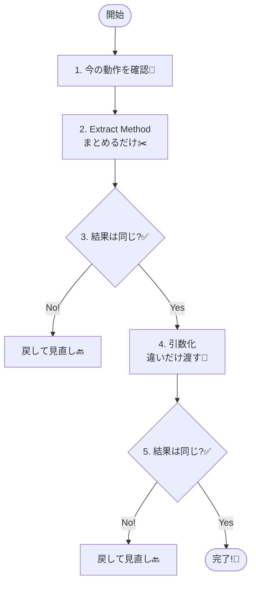

# 第03章：いちばん効く！「メソッド抽出」でDRYは8割いける ✂️🧩

この章は **「小さく安全に“まとめる”」** を身につける回だよ〜！😊✨
DRYって聞くと難しそうだけど、実は **メソッド抽出＋引数化** だけで、かなりの重複が消えるんだ〜🎯

---

## 1) 今日のゴール 🎯🌸

できるようになったら勝ち！😺✨

* コピペや似た処理を **Extract Method（メソッド抽出）** でまとめられる ✂️
* **違いだけ引数** にして、1つのメソッドで回せる 🧩
* **早期return（ガード節）** で分岐の重複＆ネストを減らせる 🚪🌿
* 「読める名前」の付け方のコツがわかる 📛💡

---

## 2) まず大前提：「動作は変えない」🙅‍♀️➡️✅

リファクタで一番やりがちなのが、**まとめたついでに仕様を変えちゃう**こと😵‍💫💦
なので順番はこれ！

1. まず **今の動作を確認**（Console出力でもOK）👀
2. **Extract Method**（まとめるだけ）✂️
3. もう一回 **同じ結果か確認** ✅
4. 次に **引数化**（違いだけ渡す）🧩
5. また確認 ✅

この「小さく→確認→小さく→確認」が最強だよ〜🔁✨



---

## 3) Visual Studioでの「Extract Method」やり方 🛠️✨


### 3-1. 一番よく使うショートカット 🎹💖

* **Ctrl+R → Ctrl+M** で Extract Method ✂️ ([Microsoft Learn][1])
* もしくは **Ctrl+.**（クイック アクション）から Extract Method を選ぶのもOKだよ〜💡 ([Microsoft Learn][1])
  （※キーバインドは設定プロファイルで変わることもあるよ🙆‍♀️） ([Microsoft Learn][1])

### 3-2. 何を選択すればいい？👀

* “まとまり” になってる **連続した数行** を選ぶ
* 「ここは1つの意味だな」って思える単位がベスト✨

---

## 4) VS Codeの場合（使う人向け）🧑‍💻✨

* **Ctrl+.** で Quick Fix / Refactor（リファクタ候補）を出せるよ💡 ([Visual Studio Code][2])
* Refactorだけ見たい時は **Ctrl+Shift+R**（Refactorコマンド）も使える👌 ([Visual Studio Code][2])

---

## 5) 演習の題材：ありがちな「会員/非会員の合計計算」🛒💰

まずは「重複があるやつ」を見てみよ〜😆💦

```csharp
public static class Checkout
{
    public static int CalcTotalForMember(int subtotal)
    {
        // 会員は10%引き（切り捨て）
        int discounted = (int)(subtotal * 0.9);

        // 5000円以上で送料無料
        int shipping = discounted >= 5000 ? 0 : 500;

        return discounted + shipping;
    }

    public static int CalcTotalForGuest(int subtotal)
    {
        // 非会員は割引なし
        int discounted = subtotal;

        // 5000円以上で送料無料（同じルールが再登場）
        int shipping = discounted >= 5000 ? 0 : 500;

        return discounted + shipping;
    }
}
```

このコード、パッと見で **送料ルールが重複** してるよね？👀💦
ここから「動作を変えずに」まとめるよ〜✂️✨

---

## 6) ステップ1：まずはメソッド抽出 ✂️（一番効く！）

### 6-1. 送料計算を抽出してみよう 🚚✨

送料の行を選択して **Extract Method** すると…こうなるイメージ👇

```csharp
public static class Checkout
{
    public static int CalcTotalForMember(int subtotal)
    {
        int discounted = (int)(subtotal * 0.9);
        int shipping = CalcShipping(discounted);
        return discounted + shipping;
    }

    public static int CalcTotalForGuest(int subtotal)
    {
        int discounted = subtotal;
        int shipping = CalcShipping(discounted);
        return discounted + shipping;
    }

    private static int CalcShipping(int discounted)
        => discounted >= 5000 ? 0 : 500;
}
```

🎉 これだけで「送料ルール」は一箇所になった！
この時点でDRYがかなり進むよ〜😺🌸

---

## 7) ステップ2：「違いだけ引数化」🧩✨（DRYが一気に進む）


今の2メソッド、まだ似てるよね？👀
違うのは **割引の有無** だけ！

### 7-1. まず “違い” を言葉にする 📝✨

* 会員：`subtotal → 10%引き`
* 非会員：`subtotal → そのまま`

じゃあ「割引率」を引数にできそうだよね😊

### 7-2. “違い” を引数にして共通化 💖

```csharp
public static class Checkout
{
    public static int CalcTotalForMember(int subtotal)
        => CalcTotal(subtotal, discountRate: 0.9);

    public static int CalcTotalForGuest(int subtotal)
        => CalcTotal(subtotal, discountRate: 1.0);

    private static int CalcTotal(int subtotal, double discountRate)
    {
        int discounted = (int)(subtotal * discountRate);
        int shipping = CalcShipping(discounted);
        return discounted + shipping;
    }

    private static int CalcShipping(int discounted)
        => discounted >= 5000 ? 0 : 500;
}
```

ここまで来ると、**重複はほぼ消えた** ね〜！🎉✨

---

## 8) ステップ3：早期returnで「分岐の重複」を減らす 🚪🌿


早期return（ガード節）は、**ネストが深くなるのを防ぐ**テクだよ😊
たとえばこんな感じのコード👇（ネストがつらい😵‍💫）

```csharp
public static int CalcSomething(int x)
{
    if (x > 0)
    {
        if (x < 100)
        {
            return x * 2;
        }
        else
        {
            return 200;
        }
    }
    else
    {
        return 0;
    }
}
```

これを **入口で弾く** だけでスッキリ✨

```csharp
public static int CalcSomething(int x)
{
    if (x <= 0) return 0;
    if (x >= 100) return 200;
    return x * 2;
}
```

✅ 早期returnのいいところ

* インデントが減って読みやすい📖✨
* 「異常系・例外系」を先に片付けられる🚧
* 条件が散らばってても整理しやすい🧠

---

## 9) 命名のコツ 📛💡（ここで差がつく！）


メソッド抽出で超大事なのが **名前**！😺✨
「何をしてるか」が名前で伝わると、コードが一気に読みやすくなるよ〜📖💕

### 9-1. 命名ミニルール（覚えやすいやつだけ）🌸

* **動詞 + 目的語**：`CalcShipping`, `ApplyDiscount`, `CreateOrderSummary` みたいに✨
* `DoStuff`, `Util`, `Helper` みたいな “なんでも屋” は避ける🙅‍♀️💦
* **ビジネス用語**を使う（送料=Shipping、割引=Discount みたいに）🛒💰
* 長くなってもOK！「正確さ＞短さ」だよ〜😊✨

---

## 10) AI活用（Copilot / Codex）🤖💖：使い方が上手い人になる！


AIはめちゃ便利だけど、**最後に読むのは自分**だよ〜😌🧠✨

### 10-1. おすすめプロンプト例 🗣️✨

* 「このクラスで重複してる処理を列挙して、理由も添えて」🧺
* 「Extract Methodするとしたら、切り出し候補を3つ出して」✂️
* 「この抽出メソッドに良い名前を5案。意図が伝わる順に」📛
* 「違いだけ引数にしたい。引数候補と注意点は？」🧩

### 10-2. AIの提案でよくある落とし穴 🐙⚠️

* 仕様を勝手に変える（丸め/境界/条件が変わる）😱
* 「便利そう」な共通Utilを作りたがる（あとで地獄）🌀
* 命名がふわっとして読めない🥲

なので、**差分を自分の目で確認**が超大事だよ〜👀✅

---

## 11) 章末ミニチェック（できたら合格💮）😆✨


* [ ] 重複してる数行を選んで Extract Method できる ✂️
* [ ] “違いだけ引数” を言葉にして、引数化できる 🧩
* [ ] 早期returnでネストを減らせる 🚪
* [ ] 抽出したメソッド名が「何してるか」読める 📛

---

## 12) おまけ：今後の伏線（次章につながるよ📌）😊✨

今回の例だと、`5000` や `500` って数値が直書き（魔法の数字）だよね👀💦
次の章（定数・設定・ルールの置き場所）で **「値を散らさない」** をやると、もっと強くなるよ〜🗃️📌✨

---

## 参考（操作・仕様の根拠）📚

* Visual Studio の Extract Method とショートカット（Ctrl+R, Ctrl+M / Ctrl+.） ([Microsoft Learn][1])
* Visual Studio 2026 が .NET 10 / C# 14 をサポートしている旨（背景情報） ([Microsoft Learn][3])
* VS Code の refactoring / refactor コマンド（Ctrl+Shift+R など） ([Visual Studio Code][2])

---


[1]: https://learn.microsoft.com/en-us/visualstudio/ide/reference/extract-method?view=visualstudio&utm_source=chatgpt.com "Extract a method refactoring - Visual Studio"
[2]: https://code.visualstudio.com/docs/editing/refactoring?utm_source=chatgpt.com "Refactoring"
[3]: https://learn.microsoft.com/en-us/visualstudio/releases/2026/release-notes?utm_source=chatgpt.com "Visual Studio 2026 Release Notes"
