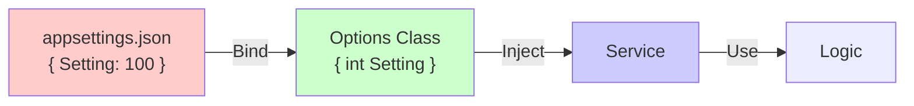

# 第04章：値を散らさない！定数・設定・ルールの「置き場所」問題 🗃️📌

この章はね、DRYの中でも**効果がめちゃ大きい**ところだよ〜！😆💖
「同じ数値」「同じ文字列」「同じID」があちこちに散ってると、**変更が地獄**になるの…🥺💦

---

## この章のゴール 🎯🌸

できるようになること👇✨

* 「魔法の数字/文字列（マジックナンバー/ストリング）」を発見できる👀🔍
* **const / static readonly** を使い分けられる🧊🧱
* **設定ファイル（appsettings など）に出すべき値**を判断できる⚙️📦
* 「ルール（ビジネスの決まり）」の置き場所を迷わなくなる🧠🧩

---

## 1) まず敵を知ろう：散らばった値は“変更コスト爆増装置”💣😇


例えばこういうの、見覚えあるよね？😅

* `5000`（送料無料の閾値）が3箇所に出てくる
* `"PAID"` が文字列で散らばる
* `0.9`（会員割引率）を誰かが `0.85` に変えたいと言い出す

この状態で仕様変更が来ると…
「全部探して直したつもりが、1箇所漏れて事故」💥 が超起きやすいの🥲

---

## 2) “置き場所”の超シンプルな3分類 📦🧭✨

値やルールって、ざっくりこの3つに分けると迷子になりにくいよ〜😊💕

### A. 定数（コードに固定してOK）🧊

* 変わらない・変わって困る（プロトコル、数学定数、固定仕様）
* 例：`TimeSpan.FromSeconds(30)` みたいな「このアプリの内部仕様として固定」でOKなもの

### B. 設定（環境や運用で変えたい）⚙️

* 環境（開発/本番）や運用で変えたい
* 例：送料、送料無料ライン、外部APIのURL、機能フラグ など
* .NETの設定は「構成プロバイダー」でいろんなソースから読めるよ、っていう設計になってるよ〜📚 ([Microsoft Learn][1])

### C. ルール（ビジネスの決まり）📜

* 「計算」や「条件」が意味を持つやつ
* 例：「会員は10%引き」「5000円以上で送料無料」
* これは**“定数ファイルにベタ置き”にすると育ちにくい**ので、ルールとしてまとめる置き場所がほしくなる（章5・6にも繋がる）🧩✨

---

## 3) const と static readonly、どう使い分ける？🧊🧱😵‍💫→😊


ここ、よく事故るポイントだからやさしくいくね〜🌸

### const（コンパイル時定数）🧊

* **コードに埋め込まれる**タイプ
* 数値/文字列/null などに使える
* そして大事なのが👇
  「将来変わる可能性がある情報には const を使わないでね」って公式も注意してるよ⚠️ ([Microsoft Learn][2])

**ありがちな事故**😇💥
共通ライブラリ側で `const int FreeShipping = 5000;` を作る
→ 別プロジェクトがそれを参照してビルドされる（値が埋め込まれる）
→ ライブラリだけ更新しても、参照側を再ビルドしないと値が古いまま…😱

### static readonly（実行時定数っぽく固定）🧱

* 生成時に決まって、その後変わらない
* 値を作るのに計算が必要でもOK
* readonly の性質は公式にこう説明されてるよ📝 ([Microsoft Learn][3])

---

## 4) “魔法の数字/文字列”を消す基本セット 🪄🧼✨

### まずは「名前」を付けよう（意味をラベル化）🏷️

* `500` → `ShippingFeeYen`
* `5000` → `FreeShippingThresholdYen`
* `"PAID"` → `OrderStatusPaid`（※本当は enum 化も検討！）

### 置き場所のおすすめ（初心者向けの型）📁

* `Constants.cs`（変わらないものだけ）
* `Settings` フォルダ（設定クラス）
* `Policies` フォルダ（ルール・計算）

---

## 5) 例：Checkoutの「散らばり」を掃除しよう 🧹🛒✨

### Before（散らばり）😵‍💫

```csharp
public static class Checkout
{
    public static int CalcTotalForMember(int subtotal)
    {
        int discounted = (int)(subtotal * 0.9);
        int shipping = discounted >= 5000 ? 0 : 500;
        string status = "PAID";

        return discounted + shipping;
    }
}
```

「0.9」「5000」「500」「PAID」がバラバラ〜😇💦

---

## 6) Step1：まず“定数”にして、名前を付ける 🧊🏷️✨

```csharp
public static class CheckoutConstants
{
    // 変わらない前提の“コード内仕様”だけ
    public const int ShippingFeeYen = 500;
    public const int FreeShippingThresholdYen = 5000;

    // 変わる可能性があるなら const にしない方が安全なことも多い（あとで設定へ）
    public static readonly decimal MemberDiscountRate = 0.90m;

    public const string StatusPaid = "PAID";
}

public static class Checkout
{
    public static int CalcTotalForMember(int subtotal)
    {
        int discounted = (int)(subtotal * CheckoutConstants.MemberDiscountRate);
        int shipping = discounted >= CheckoutConstants.FreeShippingThresholdYen
            ? 0
            : CheckoutConstants.ShippingFeeYen;

        string status = CheckoutConstants.StatusPaid;

        return discounted + shipping;
    }
}
```

これだけでも「意味」が読めるようになるよね〜！🥰📖✨

でもね、ここで次の疑問が出るはず👇
「送料500円とか、送料無料5000円って…将来変えたくない？」😳

そう！だから次は **設定（appsettings）** に出す判断をするよ⚙️💕

---

## 7) Step2：設定ファイルに出す（appsettings + Optionsパターン）⚙️📦✨

.NET は「設定をどこから読むか」を柔軟に差し替えできる仕組みが用意されてるよ〜📚 ([Microsoft Learn][1])
そして「設定を型で受け取る」王道が **Options パターン**だよ😊 ([Microsoft Learn][4])

### appsettings.json（例）📝

```json
{
  "Shipping": {
    "FeeYen": 500,
    "FreeThresholdYen": 5000
  },
  "Member": {
    "DiscountRate": 0.90
  }
}
```

### 設定クラス（型）🧩

```csharp
public sealed class ShippingOptions
{
    public int FeeYen { get; set; }
    public int FreeThresholdYen { get; set; }
}

public sealed class MemberOptions
{
    public decimal DiscountRate { get; set; }
}
```

### 登録（DIにバインド）🧷

（WebでもConsoleでも同じ考え方でOK）

```csharp
var builder = WebApplication.CreateBuilder(args);

builder.Services.Configure<ShippingOptions>(
    builder.Configuration.GetSection("Shipping"));

builder.Services.Configure<MemberOptions>(
    builder.Configuration.GetSection("Member"));

var app = builder.Build();
app.Run();
```

### 使う側（IOptionsで受け取る）📥

```csharp
using Microsoft.Extensions.Options;

public sealed class CheckoutService
{
    private readonly ShippingOptions _shipping;
    private readonly MemberOptions _member;

    public CheckoutService(
        IOptions<ShippingOptions> shipping,
        IOptions<MemberOptions> member)
    {
        _shipping = shipping.Value;
        _member = member.Value;
    }

    public int CalcTotalForMember(int subtotal)
    {
        int discounted = (int)(subtotal * _member.DiscountRate);
        int shippingFee = discounted >= _shipping.FreeThresholdYen ? 0 : _shipping.FeeYen;
        return discounted + shippingFee;
    }
}
```

これで「送料を変えたい」ってなった時に、**コードいじらず設定変更**で済む世界に近づくよ〜😆💕



---

## 8) じゃあ“秘密情報”はどうするの？（ついでに超重要）🔐😳

APIキーとかパスワードを appsettings に書くのは危険だよ〜💦
開発中なら **User Secrets** が定番！ってMicrosoftがちゃんと言ってる🧠✨ ([Microsoft Learn][5])

```bash
dotnet user-secrets init
```

（この仕組み自体が公式で案内されてるよ📚 ([Microsoft Learn][5])）

---

## 9) ルールの置き場所：定数にしない方がいい“決まり”がある 📜🧠

「割引率」「送料無料条件」みたいなやつは、実は **“値”というより“ルール”**なのね。

だからおすすめは👇😊✨

* 値だけ：Options（設定）
* 条件・計算：Policy（ルールのクラス）

例えば：

```csharp
public sealed class ShippingPolicy
{
    private readonly ShippingOptions _opt;

    public ShippingPolicy(ShippingOptions opt) => _opt = opt;

    public int CalcShippingFee(int discountedSubtotal)
        => discountedSubtotal >= _opt.FreeThresholdYen ? 0 : _opt.FeeYen;
}
```

「ルールが増えた時」にここが強い💪✨
（章5で“if地獄”を止める話に自然につながるよ🌿）

---

## 10) 判断ミニチェックリスト ✅📋✨（迷ったらこれ！）

### これは const にしていい？🧊

* ✅ 変わらない（変わったらアプリ仕様が崩れる）
* ✅ 参照先プロジェクトの再ビルド問題を起こしても困らない
* ❌ 価格・割引・送料みたいに将来変わる可能性がある（それは避けよう） ([Microsoft Learn][2])

### これは設定にする？⚙️

* ✅ 環境（開発/本番）で変えたい
* ✅ 運用で調整したい（機能ON/OFF、閾値、URLなど）
* ✅ 型で持ってまとめたい（Optionsパターンが得意） ([Microsoft Learn][4])

### これはルールクラスにする？📜

* ✅ if/計算が絡む
* ✅ 似たルールが増えそう
* ✅ テストしたくなる（ルールはテストと相性◎）🧪✨

---

## 11) 演習：散らばり掃除チャレンジ 🧹🎮✨

### お題（よくある散らばりセット）📦

* エラーメッセージ `"INVALID_SUBTOTAL"` が3箇所
* ステータス `"PAID" / "CANCELLED"` が散ってる
* 上限 `999999` が突然出てくる
* 送料無料ライン `5000`、送料 `500` が散らばる

### やること（手順）🪜

1. “魔法の値”にマーカー付け（コメントでもOK）🏷️
2. **定数にして名前付け**（意味が読める名前！）📛
3. 「運用で変えたい」ものを **appsettings + Options**へ移動⚙️
4. “条件・計算”が見えたら **Policyクラス**に寄せる📜
5. 最後に検索して、同じ値が残ってないか確認🔍✨

---

## 12) Copilot / AIの使い方（この章向け）🤖💡

おすすめプロンプト例（そのままコピペでOK）👇😆✨

* 「このプロジェクト内のマジックナンバー/文字列を列挙して、意味の候補名も提案して」🕵️‍♀️
* 「この値は const / static readonly / appsettings のどれが適切？理由もセットで」🧠
* 「Optionsパターンで `Shipping` と `Member` を型バインドするコードを生成して」⚙️

※AIはたまに“勢いで共通化しすぎ”提案をするから、**チェックリスト（9章）で止まろう**🛑😉

---

## おまけ：VS 2026 + .NET 10 の開発体験ちょい良くなってるよ 🧑‍💻✨

最近のVisual Studio 2026では、デバッグ起動（F5）の体感改善みたいな話も出てて、普通に嬉しいやつ〜！🚀 ([Microsoft Learn][6])
（リファクタ → 実行 → 確認 の回転が速いのは正義😇✨）

---

## まとめ 🎀

* 値は「定数🧊 / 設定⚙️ / ルール📜」で分けると迷いにくい✨
* const は便利だけど、将来変わるものに使うと事故りやすい⚠️ ([Microsoft Learn][2])
* 設定は Options パターンで “型” にして受け取ると、DRYも読みやすさも爆上がり💖 ([Microsoft Learn][4])
* ルールはルールとしてまとめると、次の章（if地獄対策🌪️）に気持ちよく繋がるよ〜😊🌿

次は第5章「条件分岐のDRY」いこっか？🌪️➡️🌿✨

[1]: https://learn.microsoft.com/en-us/aspnet/core/fundamentals/configuration/?view=aspnetcore-10.0&utm_source=chatgpt.com "Configuration in ASP.NET Core"
[2]: https://learn.microsoft.com/ja-jp/dotnet/csharp/language-reference/keywords/const?utm_source=chatgpt.com "const キーワード - C# reference"
[3]: https://learn.microsoft.com/en-us/dotnet/csharp/language-reference/keywords/readonly?utm_source=chatgpt.com "readonly keyword - C# reference"
[4]: https://learn.microsoft.com/en-us/dotnet/core/extensions/options?utm_source=chatgpt.com "Options pattern - .NET"
[5]: https://learn.microsoft.com/ja-jp/aspnet/core/security/app-secrets?view=aspnetcore-10.0&utm_source=chatgpt.com "ASP.NET Core での開発におけるアプリ シークレットの安全な ..."
[6]: https://learn.microsoft.com/ja-jp/visualstudio/releases/2026/release-notes?utm_source=chatgpt.com "Visual Studio 2026 リリース ノート"
