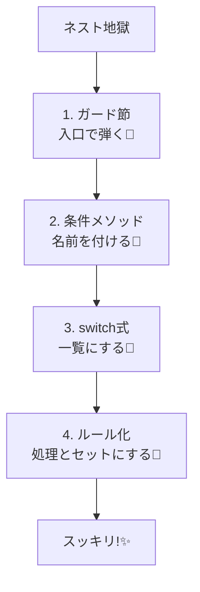

# 第05章：条件分岐のDRY（同じifが増える地獄を止める）🌪️➡️🌿

## 5-1. まず「条件分岐の重複」ってどんな地獄？😵‍💫💦

ありがちなパターンはこれ👇

* **同じ条件チェックが、いろんな場所に散ってる**
  例：`if (isMember)` が3ファイルに登場…😇
* **ifの中でさらにifが増えて、読めなくなる**
  ネスト地獄🕳️🐢
* **分岐が増えるたびに、修正箇所も増える**
  「ルール変更＝全部探して直す」になりがち🔍💣

ここで大事な考え方はこれ✨
**「条件（ifの式）＝知識（ルール）」** だよ📚💡
同じ条件が増えてきたら、それは **“同じ知識を複数に持ってる”** サインです（DRY違反）🏷️

---

## 5-2. まず効く！「ガード節」で入口で弾く🚧✨


### ✨ガード節って？

**最初にNG条件をチェックして、早めにreturn/throwする**やつだよ😊
ネストを減らして、分岐の重複も減りやすくなる🌿

### ❌ネスト地獄の例

```csharp
public static int CalcShippingFee(Order order)
{
    if (order != null)
    {
        if (order.Items.Count > 0)
        {
            if (order.Total >= 5000)
            {
                return 0;
            }
            else
            {
                return 500;
            }
        }
        else
        {
            throw new InvalidOperationException("商品が空です");
        }
    }
    else
    {
        throw new ArgumentNullException(nameof(order));
    }
}
```

### ✅ガード節にするとスッキリ😍

```csharp
public static int CalcShippingFee(Order order)
{
    if (order is null) throw new ArgumentNullException(nameof(order));
    if (order.Items.Count == 0) throw new InvalidOperationException("商品が空です");

    return order.Total >= 5000 ? 0 : 500;
}
```

* 入口で弾くから、**本筋のロジックが見える**👀✨
* これだけで「同じifの入れ子」を作りにくくなるよ👍

---

## 5-3. 次に効く！「条件に名前を付ける」📛✨（＝知識を1か所に寄せる）

同じifが何度も出たら、まずは **“条件に名前”** を付けよう😊
やり方は3段階あるよ👇（軽い順）

### (A) ローカル変数にする（そのメソッド内だけで共通化）🧩

```csharp
bool isFreeShipping = total >= 5000;

if (isFreeShipping) fee = 0;
else fee = 500;

// …別の処理でも同じ条件を使う
if (isFreeShipping) Console.WriteLine("送料無料！");
```

### (B) `private static bool` メソッドにする（再利用できる）♻️

```csharp
private const int FreeShippingThreshold = 5000;

private static bool IsFreeShippingEligible(int total)
    => total >= FreeShippingThreshold;

public static int CalcShippingFee(int total)
    => IsFreeShippingEligible(total) ? 0 : 500;
```

ここがポイント👇

* `IsFreeShippingEligible` みたいに **「ルール名」になる命名**が最高に強い💪💖
* こうすると「送料無料の条件変わった！」が来ても、**直す場所が1か所**になる🎯

※パターンマッチやswitch式でも、条件を読みやすくまとめられるよ（C#は `is` / `switch` でパターンマッチが使える）([Microsoft Learn][1])

---

## 5-4. 「switch式・パターンマッチ」で分岐を読みやすくする🧠✨


if/elseが増えてくると、**“どの条件で何が起きるか”** を追うのが大変😵‍💫
そんな時に **switch式**がめちゃ効くよ🌸

### 例：会員種別で割引率が変わる（if地獄→switch式）💳✨

```csharp
public enum CustomerType { Guest, Member, Premium }

public static int CalcDiscountedTotal(CustomerType type, int subtotal)
{
    decimal rate = type switch
    {
        CustomerType.Guest   => 1.00m,
        CustomerType.Member  => 0.90m,
        CustomerType.Premium => 0.85m,
        _ => throw new ArgumentOutOfRangeException(nameof(type))
    };

    return (int)(subtotal * rate);
}
```

* **分岐が“一覧表”みたいに見える**📋✨
* if/elseより「追加・修正」がやりやすい💡
* `switch` もパターンマッチの一部として説明されてるよ([Microsoft Learn][1])

### 例：金額帯で送料を決める（relational patternっぽく）💰📦

```csharp
public static int CalcShippingFee(int total)
{
    return total switch
    {
        >= 5000 => 0,
        >= 0    => 500,
        _       => throw new ArgumentOutOfRangeException(nameof(total))
    };
}
```

こういう「条件の列挙」は switch に寄せるとDRYになりやすいよ🎯

---

## 5-5. “条件と処理”をセットで近づける📍✨（散らさないコツ）


同じ条件が増える理由って、だいたいこれ👇
**条件だけ別の場所に書かれて、処理も別の場所に書かれて、結果として何回も出てくる**😵‍💫

なので、超入門としてはこの方針が効くよ👇

* 「条件を判定する場所」と「その時やること」を**近くに置く**🧲

### 例：送料ルールを“小さなルール一覧”にする📋✨

```csharp
public record ShippingRule(Func<int, bool> IsMatch, int Fee);

public static int CalcShippingFee(int total)
{
    var rules = new List<ShippingRule>
    {
        new(total => total >= 5000, 0),
        new(total => total >= 0,    500),
    };

    return rules.First(r => r.IsMatch(total)).Fee;
}
```

* ルールが増えても、**一覧に足すだけ**で済みやすい🧩
* 同じifが散らばりにくい🌿
* 「やりすぎ設計」にはしないで、**“増えたら検討”**でOKだよ😊💕

---

## 5-6. 演習：同じifが3回出るコードを「1回だけ」にする🎯🛠️


### 🎮お題：送料条件が散ってる！

次のコード、**送料無料条件**があちこちに出てきます💦
「送料無料の条件を1か所」にして、DRYにしてみてね✨

#### ❌Before

```csharp
public static class Checkout
{
    public static int CalcTotalForMember(int subtotal)
    {
        int discounted = (int)(subtotal * 0.9);
        int shipping;

        if (discounted >= 5000) shipping = 0;
        else shipping = 500;

        return discounted + shipping;
    }

    public static int CalcTotalForGuest(int subtotal)
    {
        int discounted = subtotal;
        int shipping;

        if (discounted >= 5000) shipping = 0;
        else shipping = 500;

        return discounted + shipping;
    }

    public static string ShippingLabel(int total)
    {
        if (total >= 5000) return "送料無料";
        return "送料あり";
    }
}
```

### ✅やること（ゴール）🌟

* `total >= 5000` を **1か所**に集める📦
* メソッド名は「ルール名」っぽくする（例：`IsFreeShippingEligible`）📛
* 動作は変えない✅

#### ✅After例（答えの1つ）

```csharp
public static class Checkout
{
    private const int FreeShippingThreshold = 5000;

    private static bool IsFreeShippingEligible(int total)
        => total >= FreeShippingThreshold;

    public static int CalcTotalForMember(int subtotal)
    {
        int discounted = (int)(subtotal * 0.9);
        int shipping = IsFreeShippingEligible(discounted) ? 0 : 500;
        return discounted + shipping;
    }

    public static int CalcTotalForGuest(int subtotal)
    {
        int discounted = subtotal;
        int shipping = IsFreeShippingEligible(discounted) ? 0 : 500;
        return discounted + shipping;
    }

    public static string ShippingLabel(int total)
        => IsFreeShippingEligible(total) ? "送料無料" : "送料あり";
}
```

🎉これで「送料無料の条件変更」が来ても、直すのは1か所だけ！最高！😍✨

---

## 5-7. Copilot / Codex に頼むときのコツ🤖📝（丸投げ禁止だよ⚠️）


### ✅おすすめプロンプト例

* 「このコードで重複している条件式（ifの条件）を列挙して、**ルール名**を提案して」
* 「`switch` 式を使って読みやすくできる部分がある？変換案を出して」
* 「ガード節にできるチェックを提案して。ネストを減らしたい」

### ✅AIの答えをチェックする観点👀

* **命名が“ルール名”になってる？**（`Check1` とかはNG🙅‍♀️）
* **条件が隠れて読みにくくなってない？**（短いならOK、長いなら分割🧩）
* **例外・境界値（0や負数）** を雑に扱ってない？⚠️

---

## 5-8. まとめチェックリスト📋✨

次のどれかに当てはまったら、第5章の出番だよ😊🌸

* 同じ `if (～～)` を **2回以上**見た👀💦
* ifのネストが深くなって、読めなくなってきた🕳️
* 条件が増えて、`else if` が伸び続けてる📏
* ルール変更が来たとき「どこ直すんだっけ…」ってなった😇

使う順番はこれがおすすめ👇
**①ガード節🚧 → ②条件に名前📛 → ③switch式🧠 → ④条件と処理を近づける📍**



---

### ちょい補足：2026のC# / VSまわりの話🔎✨

* Visual Studio 2026 は .NET 10 / C# 14 を“そのまま”扱える方向で案内されてるよ([Microsoft Learn][2])
* C# のパターンマッチ（`is` / `switch` 式）は、条件分岐を読みやすくするための公式ドキュメントがまとまってるよ([Microsoft Learn][1])
* C# 14 自体の新機能まとめもあるよ（章の理解を邪魔しない範囲でチラ見すると楽しい）([Microsoft Learn][3])

次の章（型でDRY🧱💎）に行くと、「条件を“型の中”に閉じ込める」って技も使えるようになって、さらに散らばりにくくなるよ〜😊✨

[1]: https://learn.microsoft.com/en-us/dotnet/csharp/fundamentals/functional/pattern-matching?utm_source=chatgpt.com "Pattern matching overview - C# | Microsoft Learn"
[2]: https://learn.microsoft.com/en-us/visualstudio/releases/2026/release-notes "Visual Studio 2026 Release Notes | Microsoft Learn"
[3]: https://learn.microsoft.com/en-us/dotnet/csharp/whats-new/csharp-14?utm_source=chatgpt.com "What's new in C# 14"
