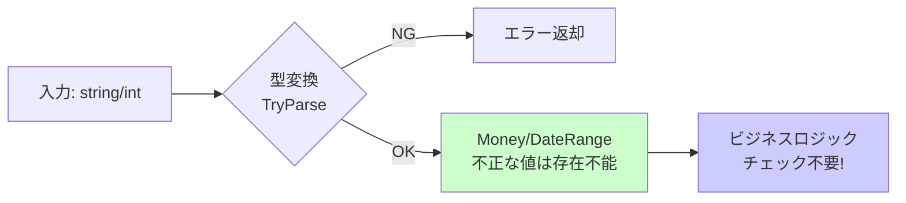

# 第06章：型でDRY（住所・金額・期間を「値オブジェクトっぽく」する）🧱💎

この章はひとことで言うと、**「同じチェックやルールを、あちこちに書かないために “型に閉じ込める”」** です😊✨
（DRYの“最強形態”のひとつ！コンパイラが味方になるやつ〜🛡️）

---

## 6-1. なんで「型」でDRYすると強いの？💪🧠


コピペ削除（メソッド抽出）って、すぐ効くけど…
**ルールが“入力値”にくっついてると、また散りがち**なんだよね🥲

たとえば「金額」ってよくこうなる👇

* 負数NGチェックが3箇所に散る💦
* 表示（¥区切り）があちこちでバラバラ🖨️
* 税計算や割引の丸めルールが複数に増える🧮

そこで登場するのが **値オブジェクト（Value Object）っぽい型**！💎
**「データ＋ルール」を1つにまとめる**ことで、DRYになる✨

---

## 6-2. まずはC#の“record”でイメージを掴もう📘✨


recordは「値っぽい型」を作るのに便利で、**値ベースの等価性（中身が同じなら同じ扱い）**とか、`ToString()` がいい感じに出たりします😊
Microsoftの公式ドキュメントでも、record（record class / record struct）の特徴として説明されています。([Microsoft Learn][1])

ポイントだけふんわり覚えると👇

* **record class**：参照型（クラス）
* **record struct**：値型（構造体）
* **readonly record struct**：基本「不変」で扱えて安心感UP🛡️
* 位置指定（`record ... ( ... )`）のプロパティは、`record struct` だと可変になり得るので、初心者のうちは **readonly寄り**が安全だよ〜😊([Microsoft Learn][1])

---

## 6-3. 値オブジェクトの“作り方テンプレ”🧩📌

小さな型を作るときの型テンプレはこれでOK✨

1. **守りたいルール（不変条件）を1行で言う** 📝
2. **作成時に必ずチェック** ✅（constructor / factory）
3. **中身はできれば不変** 🧊
4. **表示（ToString）や変換（Parse/TryParse）もここに寄せる** 🖨️
5. **計算や比較など“その型っぽい操作”を型に持たせる** 🧮

---

## 6-4. 実例：Money（日本円）で「負数NG」「表示」「計算」を1か所化 💰✨

### よくある “散らばり地獄” 🌀

* `if (amount < 0) ...` が何回も出る
* `amount.ToString("N0")` がいろんな場所で微妙に違う
* 税計算や割引の丸めが揺れる

👇これを **Money型に寄せる**！

```csharp
using System;

public readonly record struct Money
{
    public long Yen { get; }

    public Money(long yen)
    {
        if (yen < 0) throw new ArgumentOutOfRangeException(nameof(yen), "金額は0以上だよ💦");
        Yen = yen;
    }

    public override string ToString() => $"¥{Yen:N0}";

    public Money Add(Money other) => new(Yen + other.Yen);

    public Money Multiply(decimal rate, MidpointRounding rounding = MidpointRounding.ToZero)
    {
        // 例：消費税や割引で使う（丸めルールをここに固定！）
        var v = decimal.Round(Yen * rate, 0, rounding);
        return new Money((long)v);
    }

    public static Money Parse(string text)
    {
        if (!TryParse(text, out var money))
            throw new FormatException("金額の形式が違うよ💦 例: 1200, ¥1,200");
        return money;
    }

    public static bool TryParse(string text, out Money money)
    {
        money = default;
        if (string.IsNullOrWhiteSpace(text)) return false;

        // ざっくり：¥とカンマを除去（実務では要件に合わせてね）
        var cleaned = text.Trim().Replace("¥", "").Replace(",", "");

        if (!long.TryParse(cleaned, out var yen)) return false;
        if (yen < 0) return false;

        money = new Money(yen);
        return true;
    }
}
```

### こうなると何が嬉しい？😊🌸

* もう **負数チェックをコピペしない** ✅
* 画面表示もログも **`money.ToString()` で統一** 🖨️✨
* 税・割引の丸めも **Moneyの中で固定** 🧮
* 間違った値は **作れない（作れにくい）** 🛡️

> 「データを入れた瞬間に、正しい状態が保証される」
> これ、設計初心者が一番ラクになるポイントだよ〜😊💕

---

## 6-5. “型があるとバリデーション重複が消える”の例 ✅🏷️

たとえば、こんなコードがあったとするね👇

* API受信
* DB保存
* 画面入力
  …それぞれで「同じチェック」をしてると、DRYが崩壊💥

でも **Money / PostalCode / DateRange みたいな型**を使えば、

* 入力を受け取った瞬間に型に変換（Parse/TryParse）
* その先は「正しいデータしか流れない」✨

になって、チェックが激減するよ😊



---

## 6-6. もう1個：DateRange（期間）で「開始<=終了」を1か所化 📅✨

```csharp
using System;

public readonly record struct DateRange
{
    public DateOnly Start { get; }
    public DateOnly End { get; }

    public DateRange(DateOnly start, DateOnly end)
    {
        if (end < start) throw new ArgumentException("期間が逆だよ💦（EndはStart以降）");
        Start = start;
        End = end;
    }

    public int DaysInclusive => End.DayNumber - Start.DayNumber + 1;

    public bool Contains(DateOnly date) => Start <= date && date <= End;

    public override string ToString() => $"{Start:yyyy-MM-dd}..{End:yyyy-MM-dd}";
}
```

これで、どこでも「期間の逆転チェック」を書かなくてよくなる😊✨

---

## 6-7. AI活用（Copilot / Codex）で爆速にするコツ🤖⚡

AIはこの章でめっちゃ相性いいよ〜！✨
おすすめの頼み方👇

* 「この `amount` に関する**不変条件**（守るべきルール）を列挙して」🧠
* 「Money型（値オブジェクト）をrecord structで作って。**作成時バリデーション**と**ToString**と**TryParse**も」🛠️
* 「散らばってるチェックを探して、型に寄せるリファクタ案を出して」🔍
* 「境界値テスト（0、最大、空文字、¥付き、カンマ入り）を提案して」🧪

⚠️注意：AIが出すParse系は雑になりやすいので、**要件（許す形式）だけは人間が決める**のが安全😊

---

## 6-8. ミニ演習：散らばった金額チェックを“型に回収”しよう 🎯💰

### お題（よくあるやつ）

* 画面入力 `string priceText`
* あちこちで

  * `if (price < 0)`
  * `ToString("N0")`
  * `int.TryParse(...)`
    が出てくる

### やること（手順）🔁✨

1. いま散ってる「金額ルール」をメモする📝

   * 負数NG？ 上限ある？ 小数OK？ 形式は？
2. `Money` を導入して、入口で `TryParse` ✅
3. 以降のロジックは `Money` だけで回す💪
4. 表示は `Money.ToString()` に統一🖨️✨

### “できた判定” ✅

* `if (price < 0)` がコードから消えた
* 表示フォーマットが1つになった
* 変更する場所が **Moneyだけ**になった

---

## 6-9. よくある落とし穴（初心者あるある）🐙⚠️

* **何でもかんでも型にしすぎる** → まずは「散りやすいルール」からでOK😊
  （金額、住所、期間、ID、ステータス文字列あたりが鉄板🏷️）
* **型の中で勝手に丸めルールを変える** → 丸めは“仕様”なので、引数で選べる形もアリ🧮
* **record structを可変で使ってしまう** → 迷ったら `readonly` 寄りが安全だよ🧊🛡️([Microsoft Learn][1])

---

## 6-10. ちょい最新トピック：C# 14 の extension members って何？🧩✨

C# 14 では **拡張メソッドの進化版**みたいな「extension members」が入り、拡張プロパティや演算子っぽいのも扱える方向が紹介されています。([Microsoft Learn][2])
ただしこの章の結論としては、初心者のうちはまず **「ちゃんと自分の型を作る」**ほうが読みやすくて安全だよ😊（拡張は便利だけど、乱用すると追いづらい🥲）

---

## まとめ：第6章で身につけたい感覚🎁✨

* DRYは「関数にまとめる」だけじゃなくて、**“型にまとめる”**ともっと強い🧱💎
* 値オブジェクトは

  * **不正な状態を作らない**🛡️
  * **チェックの重複を消す**✅
  * **表示・変換のバラつきを消す**🖨️
    の3点セットが激アツ🔥
* AIは「不変条件の洗い出し」「テスト案」で超便利🤖🧪

次の章（第7章）で、このDRYを **テスト＋AI＋IDEで“仕組み化”** していくと、さらに安定するよ〜😊🛠️✨

[1]: https://learn.microsoft.com/en-us/dotnet/csharp/language-reference/builtin-types/record?utm_source=chatgpt.com "Records - C# reference"
[2]: https://learn.microsoft.com/en-us/dotnet/csharp/whats-new/csharp-14?utm_source=chatgpt.com "What's new in C# 14"
