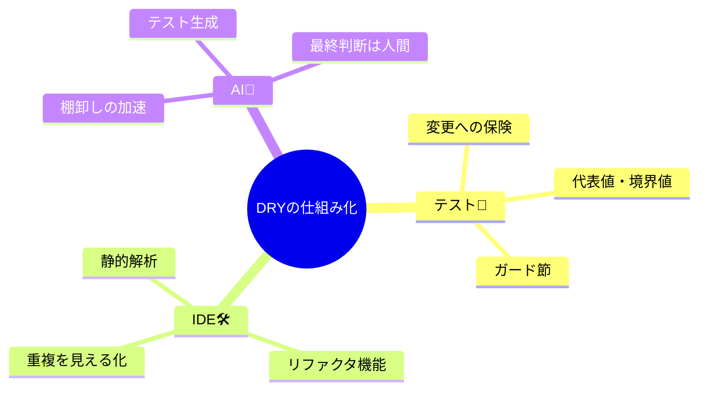

# 第07章：重複を“検知して戻す”仕組み（テスト＋AI＋IDE）🧪🤖🛠️

## 7.1 この章のゴール 🎯✨

DRYって、がんばっても…気づくと戻るんですよね🥲
だからこの章では **「気合」じゃなく「仕組み」** にします💪🌸

ゴールはこの3つ👇

* **重複を消しても壊れない**（＝テストが守ってくれる）🧪✅
* **重複が増えたら早めに気づく**（＝IDEで検知）🛠️👀
* **AIで棚卸し＆テスト生成を加速**（でも鵜呑みはしない）🤖🧠

---

## 7.2 DRYを“仕組み化”する「3点セット」🔁✨


### (A) テスト 🧪：変更しても安心の“保険”

DRYはリファクタが多いので、**テストがあると一気に怖さが減ります**😌
（テストがない状態でDRYすると、だいたい途中でビビって止まるあるある💦）

### (B) IDE 🛠️：重複を“見える化”

* リファクタ機能（メソッド抽出/リネームなど）
* 検索・参照・分析（似たコードに早めに気づく）
* コード品質チェック（アナライザー等）

### (C) AI 🤖：棚卸し＆テスト生成の“加速装置”

* 「同じ意味の処理、複数ない？」を洗い出し🧺
* 「この振る舞いのテスト作って」を高速化🚀
* ただし **最終判断は自分**（ここ大事）🧠✨



---

## 7.3 “最小のテスト”だけでいいよ作戦 🧪🌱


最初から完璧テストはしんどいので、**ミニでOK**です😊

### ✅ まずはこの3種類だけ！

1. **代表値テスト**：よくある入力で期待どおり？🙂
2. **境界値テスト**：しきい値（例：送料無料ライン）ちょうどは？🎯
3. **例外/弾くテスト**：ダメ入力はちゃんと止まる？🚧

> DRYの目的は「まとめること」じゃなくて「ルールを1つにすること」なので、
> テストも“ルールが守られてるか”だけ押さえれば強いです💪✨

---

## 7.4 回すのがラクになると勝ち：Test Explorer ＆ dotnet test 🚀🧪


### 7.4.1 Test Explorer（IDEでポチポチ）🖱️✨

Test Explorer では、テストの一覧・フィルタ・プレイリスト作成・デバッグ実行などができます🧪🔎
さらに（エディションによっては）コードカバレッジ分析もできます📈 ([Microsoft Learn][1])

**超おすすめショートカット感覚**

* 「直す」→「すぐ実行」→「安心して次へ」🔁🌸
  これを回せるとDRYが一気に上達します💨

### 7.4.2 dotnet test（CLIでサクッと）⌨️✨

`dotnet test` は、ソリューションをビルドしてテストを実行します🧪
テスト実行は **VSTest** または **Microsoft Testing Platform (MTP)** を使います ([Microsoft Learn][2])

* VSTest：MSTest / NUnit / xUnit などに対応して動かせる（定番） ([Microsoft Learn][3])
* MTP：より軽量で高速寄り、フィルタ等の体験も変わる（選べる） ([Microsoft Learn][4])

よく使う例👇（まずはこれだけでOK！）

```bash
## ぜんぶ実行
dotnet test

## 失敗したテストだけ追いかけたい時の定番：フィルタ（例）
dotnet test --filter "FullyQualifiedName~Shipping"
```

（フィルタの考え方はランナーで差があるので、困ったら「まずTest Explorerで」でも全然OK😊）

---

## 7.5 AIの使いどころ：①テスト生成 ②重複棚卸し 🤖🧪🧺

### 7.5.1 Copilotで“テスト生成”を時短する 🧪⚡

Visual Studio の Copilot Chat には、テスト生成に特化した使い方があります。
例：チャットで `@test #target` を使うと、ソリューション/プロジェクト/クラス/メンバー単位でテスト生成を始められます🧪🤖 ([Microsoft Learn][5])

イメージ👇

```text
@test #OrderCalculator
```

**注意ポイント（ここが差が出る🥺）**

* 生成されたテストが「仕様」じゃなく「実装のコピー」になってない？👀
* 期待値が雑にベタ書きされてない？（根拠ある？）🧠
* 境界値が入ってる？（送料無料ライン等）🎯

### 7.5.2 Copilot Chatに“前提（文脈）”を覚えさせる 📌🤖

毎回同じ説明を書くの、ダルいですよね😇
Copilot Chat は、コンテキストをファイル等に置いて“自動で含める”考え方が用意されています（カスタム命令/プロンプトファイルの方向）📝 ([Microsoft Learn][6])

→ これをやると「このプロジェクトのルール」に沿った提案が増えやすいです✨

### 7.5.3 “重複棚卸し”のAIプロンプト例 🧺🤖

そのままコピペで使えるやつ👇

```text
このソリューションで「同じ知識（ビジネスルール）」が複数箇所に散ってそうな所を、
(1) 割引ルール (2) 送料ルール (3) 入力バリデーション (4) ステータス文字列
に分類して候補リスト化して。根拠として該当ファイル/メソッド名も添えて。
```

---

## 7.6 IDEで“重複を検知”して戻す 🛠️👀🔁


### 7.6.1 Quick Actions（リファクタの入口）✨

Visual Studio の Quick Actions は、**リファクタ・生成・修正**をワンアクションで出してくれます🪄
（抽出、名前変更、不要using整理…など） ([Microsoft Learn][7])

DRY初心者は特に、

* 「手で直す」より「IDEに安全にやらせる」
  がミスりにくいです😊🛡️

### 7.6.2 コード分析（“怪しい匂い”を早めに）🕵️‍♀️✨

Visual Studio にはコード品質を評価する分析機能がまとまっていて、警告やルールで気づけます🔎 ([Microsoft Learn][8])
“重複そのもの”じゃなくても、**重複が生まれやすい原因（複雑すぎ等）**を早めに潰せます💣➡️🌿

### 7.6.3 コードクローン分析（※使えるなら強い）🧬👀

Visual Studio の「Architecture analysis & modeling tools」系の機能として、**Code clone（コードの重複検出）**は Enterprise で提供される扱いです ([Microsoft Learn][9])
また、テスト/品質改善系のまとめの中でも **code clone analysis** が触れられています ([Microsoft Learn][10])

> もしこの機能が使える環境なら、
> 「似てるコードが増えてきた…」を早めに検知できて便利です😳✨
> （ただし“似てる”＝“同じルール”ではないので、最後は人間が判断🧠）

---

## 7.7 演習：「重複削除→テスト追加→安心してリファクタ」3点セット🌟🧪🔁


ここでは分かりやすく **送料＋割引**の例でいきます💰📦

## ステップ0：まず“仕様メモ”を書く📝✨

* 会員：10%引き（切り捨て）
* 送料：割引後の金額が5000以上なら無料、未満なら500円

→ これが「知識（ルール）」です。ここが複数箇所に散るとDRY違反😵

---

## ステップ1：ミニテストを3本だけ作る🧪🌱

MSTest例（最小）👇

```csharp
using Microsoft.VisualStudio.TestTools.UnitTesting;

[TestClass]
public class CheckoutTests
{
    [TestMethod]
    public void Member_6000yen_DiscountedAndFreeShipping()
    {
        // 6000 * 0.9 = 5400, shipping 0 => 5400
        var total = Checkout.CalcTotalForMember(6000);
        Assert.AreEqual(5400, total);
    }

    [TestMethod]
    public void Member_5000yen_DiscountedAndShippingCharged()
    {
        // 5000 * 0.9 = 4500, shipping 500 => 5000
        var total = Checkout.CalcTotalForMember(5000);
        Assert.AreEqual(5000, total);
    }

    [TestMethod]
    public void Guest_5000yen_FreeShipping()
    {
        // guest no discount => 5000, shipping 0 => 5000
        var total = Checkout.CalcTotalForGuest(5000);
        Assert.AreEqual(5000, total);
    }
}
```

ポイントはこれ👇

* “全部”テストしない🙅‍♀️（今はミニでOK）
* **境界値（5000）**を入れる🎯
* 期待値は「ルールから計算できる数字」にする🧠✨

---

## ステップ2：DRY（重複の核＝ルール）を1箇所に寄せる✂️🧩

次は実装側。例として「割引後金額→送料→合計」を共通化します👇

```csharp
public static class Checkout
{
    public static int CalcTotalForMember(int subtotal)
        => CalcTotal(subtotal, discountRate: 0.9);

    public static int CalcTotalForGuest(int subtotal)
        => CalcTotal(subtotal, discountRate: 1.0);

    private static int CalcTotal(int subtotal, double discountRate)
    {
        int discounted = (int)(subtotal * discountRate);
        int shipping = CalcShipping(discounted);
        return discounted + shipping;
    }

    private static int CalcShipping(int discountedSubtotal)
        => discountedSubtotal >= 5000 ? 0 : 500;
}
```

ここで起きてること👇

* **同じ送料ルール**が `CalcShipping` に集約📦
* 会員/非会員の違いは「割引率」だけに💡
* テストが通る限り、振る舞いは壊れてない✅🧪

---

## ステップ3：すぐテスト実行（安心して次へ）🔁🧪

* Test Explorerで **Run All** でもOK 🖱️ ([Microsoft Learn][11])
* あるいは `dotnet test` でサクッと⌨️ ([Microsoft Learn][2])

テストが通ったら勝ちです🎉
この「小さく直して、すぐ確認」を回せる人がDRY強い💪🌸

---

## ステップ4：AIで“追加の重複”を棚卸し🧺🤖

ここで Copilot Chat に

* 「送料/割引と同じ意味の処理が他にもない？」
* 「このルールに対する足りないテストは？」
  って聞くと、抜けが見つかりやすいです🔎✨
  テスト生成も `@test #Checkout` みたいに投げられます🧪🤖 ([Microsoft Learn][5])

---

## 7.8 よくある事故と回避テク⚠️🛟

* **テストが“実装のコピー”になってる**
  → 期待値はルールから計算する（テスト内で理由を書いちゃうのもOK）📝

* **共通化したけど、引数が増えすぎて読めない**
  → “違い”が2個を超えたら、次章（落とし穴）案件の匂い🐙⚠️

* **AIの提案を丸呑みして、読みづらくなる**
  → 採用基準は「3秒で意図が読める？」⏱️👀

---

## 7.9 まとめ：明日から回すチェックリスト✅💖

* [ ] ルール（知識）を1行で言える？🧠
* [ ] 代表値＋境界値＋弾く、のミニテスト3本ある？🧪
* [ ] リファクタは“小さく”→すぐ実行、できてる？🔁
* [ ] IDEのQuick Actionsで安全に直してる？🛠️ ([Microsoft Learn][7])
* [ ] AIには「棚卸し」と「テスト生成」を頼んで、最後は自分で判断してる？🤖✅ ([Microsoft Learn][5])

---

必要なら、この第7章の「演習」をもう1本増やして、**例外処理（try/catchの重複）＋ログ**のDRYも同じ流れ（ミニテスト→小さくリファクタ→AI棚卸し）で作れます🚨🧪🤖

[1]: https://learn.microsoft.com/en-us/visualstudio/test/run-unit-tests-with-test-explorer?view=visualstudio&utm_source=chatgpt.com "Run Unit Tests with Test Explorer - Visual Studio (Windows)"
[2]: https://learn.microsoft.com/en-us/dotnet/core/tools/dotnet-test?utm_source=chatgpt.com "dotnet test command - .NET CLI"
[3]: https://learn.microsoft.com/ja-jp/dotnet/core/tools/dotnet-test-vstest?utm_source=chatgpt.com "VSTest を使用した dotnet test コマンド - .NET CLI"
[4]: https://learn.microsoft.com/en-us/dotnet/core/tools/dotnet-test-mtp?utm_source=chatgpt.com "dotnet test command with Microsoft.Testing.Platform"
[5]: https://learn.microsoft.com/en-us/visualstudio/test/unit-testing-with-github-copilot-test-dotnet?view=visualstudio&utm_source=chatgpt.com "Generate and run unit tests using GitHub Copilot testing"
[6]: https://learn.microsoft.com/en-us/visualstudio/ide/copilot-chat-context?view=visualstudio&utm_source=chatgpt.com "Customize chat responses - Visual Studio (Windows)"
[7]: https://learn.microsoft.com/en-us/visualstudio/ide/quick-actions?view=visualstudio&utm_source=chatgpt.com "Quick Actions - Visual Studio (Windows)"
[8]: https://learn.microsoft.com/en-us/visualstudio/code-quality/?view=visualstudio&utm_source=chatgpt.com "Visual Studio Code analysis documentation (Windows)"
[9]: https://learn.microsoft.com/en-us/visualstudio/modeling/analyze-and-model-your-architecture?view=visualstudio&utm_source=chatgpt.com "Architecture analysis & modeling tools - Visual Studio"
[10]: https://learn.microsoft.com/en-us/visualstudio/test/improve-code-quality?view=visualstudio&utm_source=chatgpt.com "Overview of testing tools - Visual Studio (Windows)"
[11]: https://learn.microsoft.com/en-us/visualstudio/test/getting-started-with-unit-testing?view=visualstudio&utm_source=chatgpt.com "Get started with unit testing - Visual Studio (Windows)"
