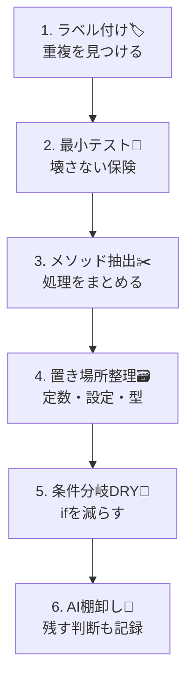

# 第09章：まとめプロジェクト（DRY改善を1周やる）🎯🛠️✨

ここは**いちばん伸びる章**だよ〜！😊🌸
「DRYって知ってる」→「DRYで改善できる（しかも安全に）」に変わる、**総合演習**です💪✨

---

## 9-1. 今日つくるミニアプリ 🎁🛒

題材は **ミニECの「お会計（Checkout）」** にするね🧾💰
ありがち重複が全部入りで、DRYの練習にちょうどいいの🙆‍♀️✨

### 仕様（シンプルだけど地獄の種入り🌱）

* 会員種別：Guest / Member / VIP 👤
* 割引：Memberは10%OFF、VIPは15%OFF（小数切り捨て）🏷️
* 送料：割引後の金額が5,000円以上なら送料無料、未満なら500円🚚
* クーポン：`"SHIPFREE"` なら送料0、`"WELCOME300"` なら300円引き🎟️
* 入力チェック：数量は1以上、単価は0以上、など✅

---

## 9-2. ゴール（成果物）🏁✨

最終的に、次が揃えば合格💮🎉

* Gitで **改善前→改善後の差分** が見える📌
* **消した重複 3つ** を説明できる🏷️✨
* **残した重複 1つ** も「なぜ残したか」を説明できる📝💕
* テストがあって、安心して直せる🧪✅
* AI（Copilot/Codex）を使っても、**鵜呑みにせず検証できる**🤖🔍

---

## 9-3. 進め方（6ステップ固定）🔁✨


この順でやると迷子になりにくいよ😊🌸

1. 重複を見つけてラベル付け 🏷️
2. 先に“最低限のテスト”を置く 🧪（保険！）
3. いちばん効く重複から消す（メソッド抽出→引数化）✂️
4. 値・ルールの置き場所を整える（定数/設定/小さい型）🗃️💎
5. 条件分岐をDRY（同じifを増やさない）🌪️➡️🌿
6. AIで棚卸し＆“残す判断”を書く 🤖📝✨

Visual Studio 2026はデバッグ体験（F5）が強化されてるので、**小さく直してすぐ実行**がやりやすいよ👍✨ ([Microsoft Learn][1])
（「小さく変更→すぐ実行→コミット」を回そう🔁）



---

## 9-4. スタート地点（わざとコピペ地獄なコード）😇🔥

まずは **“改善前”** を作るよ。下のコードをそのまま置いてOK👌
（※ あえて重複＆魔法の数字だらけ🪄💦）

### `Checkout.cs`（改善前）

```csharp
using System;

public enum CustomerType { Guest, Member, Vip }

public static class Checkout
{
    public static int CalcTotal(CustomerType type, int subtotal, string? couponCode)
    {
        // ① 割引（重複の種）
        int discounted = subtotal;
        if (type == CustomerType.Member)
            discounted = (int)(subtotal * 0.9);
        else if (type == CustomerType.Vip)
            discounted = (int)(subtotal * 0.85);

        // ② クーポン（重複の種）
        if (couponCode == "WELCOME300")
            discounted -= 300;

        // ③ 送料（重複の種）
        int shipping = 0;
        if (discounted >= 5000) shipping = 0;
        else shipping = 500;

        // ④ クーポン（送料系がまた別で出る）
        if (couponCode == "SHIPFREE")
            shipping = 0;

        // ⑤ “謎のデータ”が散らばる（重複の種）
        string paidStatus = "PAID";

        // ⑥ 入力チェックがあちこちに生えがち（今回は簡略）
        if (subtotal < 0) throw new ArgumentOutOfRangeException(nameof(subtotal));

        return discounted + shipping;
    }
}
```

---

## 9-5. まずは「重複ラベル」を貼ろう🏷️✨（ここ超大事！）


紙に付箋貼る気持ちで、コメントでもメモでもOKだよ📝😊

* **ルール重複**：割引率、送料無料判定、クーポン適用条件🧮
* **データ重複**：`5000`、`500`、`"SHIPFREE"`、`"WELCOME300"`、`"PAID"`🏷️
* **条件分岐重複**：ifが増えて読みづらい＆追加時に漏れやすい🌪️
* **変更の怖さ**：テストがないから、直すのが怖い😱

---

## 9-6. “保険”の最小テストを入れる🧪🛡️


ここは「完璧なテスト」じゃなくていい！
**“これが壊れたら困る”だけ守る**のが目的だよ😊✨

### テスト例（xUnit想定）

```csharp
using Xunit;

public class CheckoutTests
{
    [Fact]
    public void Member_Subtotal5000_IsFreeShipping()
    {
        var total = Checkout.CalcTotal(CustomerType.Member, 5000, null);
        // member 10% off => 4500, so shipping should be 500 (because discounted < 5000)
        Assert.Equal(5000, total);
    }

    [Fact]
    public void Coupon_SHIPFREE_MakesShippingZero()
    {
        var total = Checkout.CalcTotal(CustomerType.Guest, 1000, "SHIPFREE");
        Assert.Equal(1000, total);
    }
}
```

### AI活用ポイント（ここから使ってOK）🤖✨

Visual Studioには **Copilot Chat** が統合されていて、コード理解・提案・デバッグ支援ができるよ🧠✨ ([Microsoft Learn][2])
さらに **Copilot testing for .NET** は、プロジェクト/クラス単位でテスト生成や実行まで支援してくれる（xUnit/NUnit/MSTest対応）🧪🤖 ([Microsoft Learn][3])

おすすめプロンプト👇

* 「この`Checkout.CalcTotal`の仕様を壊さない“最小テスト”を3本提案して」🧪
* 「境界値（4999/5000、WELCOME300適用前後）のテスト案を出して」🎯

※出てきたテストは、**期待値が正しいか自分で計算**してから採用ね🧮😆

---

## 9-7. 重複を消す（メソッド抽出→引数化）✂️🧩


### 目標：`CalcTotal`の中の「割引」「クーポン」「送料」を分ける✨

* `ApplyDiscount(type, subtotal)`
* `ApplyCouponToSubtotal(subtotal, coupon)`
* `CalcShipping(discountedSubtotal)`
* `ApplyCouponToShipping(shipping, coupon)`

コミットは小さくいこう〜📌💕

#### 例：こう分ける（途中段階OK）

```csharp
public static class Checkout
{
    public static int CalcTotal(CustomerType type, int subtotal, string? couponCode)
    {
        if (subtotal < 0) throw new ArgumentOutOfRangeException(nameof(subtotal));

        int discounted = ApplyDiscount(type, subtotal);
        discounted = ApplyCouponToSubtotal(discounted, couponCode);

        int shipping = CalcShipping(discounted);
        shipping = ApplyCouponToShipping(shipping, couponCode);

        return discounted + shipping;
    }

    private static int ApplyDiscount(CustomerType type, int subtotal)
        => type switch
        {
            CustomerType.Member => (int)(subtotal * 0.9),
            CustomerType.Vip => (int)(subtotal * 0.85),
            _ => subtotal
        };

    private static int ApplyCouponToSubtotal(int subtotal, string? couponCode)
        => couponCode == "WELCOME300" ? subtotal - 300 : subtotal;

    private static int CalcShipping(int discountedSubtotal)
        => discountedSubtotal >= 5000 ? 0 : 500;

    private static int ApplyCouponToShipping(int shipping, string? couponCode)
        => couponCode == "SHIPFREE" ? 0 : shipping;
}
```

この時点で、**可読性が一気に上がる**よね😊✨
でもまだ「文字列/数値が散らばってる」から、次にそこを片付けよ〜🧹🌸

---

## 9-8. 値・ルールの置き場所を整える（定数化）🗃️📌


### まずは“散ってるデータ”を1か所に📦

```csharp
public static class CheckoutRules
{
    public const int FreeShippingThreshold = 5000;
    public const int ShippingFee = 500;

    public const string CouponShipFree = "SHIPFREE";
    public const string CouponWelcome300 = "WELCOME300";
}
```

そしてコード側はこう👇

* `"SHIPFREE"` → `CheckoutRules.CouponShipFree`
* `5000` → `CheckoutRules.FreeShippingThreshold`
  みたいに置き換え🧊✨

---

## 9-9. 型でDRY（ミニ値オブジェクト）🧱💎

「金額」がintのままだと、あちこちで

* マイナス防止
* 値引きの下限（0未満にしない等）
  が散りやすいのね💦

なので、**小さな型に寄せる**練習をするよ😊✨

```csharp
public readonly record struct Money(int Value)
{
    public static Money From(int value)
        => value < 0 ? throw new ArgumentOutOfRangeException(nameof(value)) : new Money(value);

    public Money Minus(int amount)
        => new Money(Math.Max(0, Value - amount));
}
```

これで「0未満にしない」が**1か所の知識**になる👍💎

---

## 9-10. （おまけ）C# 14の新要素で“重複しがちなバリデーション”をスッキリ✨🆕

2026年1月時点だと、C# 14 / .NET 10が最新ラインで、C# 14には `field` を使ったプロパティなど、ボイラープレート削減系の強化があるよ🧠✨ ([Microsoft Learn][4])

たとえば「null禁止」をプロパティで書くとき、重複を減らしやすい👇

```csharp
public class Coupon
{
    public string Code
    {
        get;
        set => field = value ?? throw new ArgumentNullException(nameof(value));
    }

    public Coupon(string code) => Code = code;
}
```

「同じチェックをあちこちに書かない」って、DRYと相性いいんだ〜😊💕

---

## 9-11. AIで棚卸し（“追加の重複候補”を洗い出す）🧺🤖✨

最後にAIで点検して、取りこぼしを拾おう🔍✨
GitHub Copilotには機能ページもあって、IDE内で提案やチャットが使えるよ🧠 ([GitHub Docs][5])
さらにVisual StudioではCopilot統合が案内されてるよ📎 ([Visual Studio][6])

おすすめプロンプト👇

* 「このソリューションで“同じ意図の処理”が重複してる場所を列挙して」🏷️
* 「割引・送料・クーポンのルールを追加したい。変更に強い構造にする改善案を3つ」🧩
* 「“共通化しすぎ危険ポイント”をレビューして」🐙⚠️

---

## 9-12. “残した重複”を書いてOKにする📝💕

DRYって「全部まとめる」じゃないよ😊✨
**残す判断ができたら、むしろ設計力アップ**💪🌸

### 例：残してよい重複（ありがち）

* 今は2か所だけで、今後増える予定も薄い
* 無理にまとめると、引数が増えて読みづらい
* “同じっぽいけど、ルールの意味が違う”

---

## 9-13. 提出物テンプレ（そのままコピペOK）📄✨

* 消した重複①：＿＿＿＿（種類：ルール/データ/条件/エラー）→ どう集約した？
* 消した重複②：＿＿＿＿ → 何が楽になった？
* 消した重複③：＿＿＿＿ → 変更に強くなった点は？
* 残した重複①：＿＿＿＿ → 残した理由：＿＿＿＿
* 自分メモ：次やるならここも直したい：＿＿＿＿

---

## 9-14. 最終チェックリスト✅🌸

* ルール（割引率・閾値・クーポン条件）が散ってない？🧠
* 魔法の数字/文字列が残ってない？🪄
* `CalcTotal`が読み物として分かる？📖
* 追加仕様（例：VIP 20%に変更）を入れる場所が1か所？🎯
* テストが“壊したら気づける最低ライン”になってる？🧪
* コミットが小さく分かれてて、差分が追える？📌

---

必要なら、この章用に

* **改善前プロジェクト一式（ファイル構成）**
* **改善後の完成例（解答例）**
* **Gitコミット例（メッセージ付き）**
  も、まるっと書くよ😊✨

[1]: https://learn.microsoft.com/ja-jp/visualstudio/releases/2026/release-notes?utm_source=chatgpt.com "Visual Studio 2026 リリース ノート"
[2]: https://learn.microsoft.com/en-us/visualstudio/ide/visual-studio-github-copilot-chat?view=visualstudio&utm_source=chatgpt.com "About GitHub Copilot Chat in Visual Studio"
[3]: https://learn.microsoft.com/en-us/visualstudio/test/github-copilot-test-dotnet-overview?view=visualstudio&utm_source=chatgpt.com "Overview of GitHub Copilot testing for .NET"
[4]: https://learn.microsoft.com/ja-jp/dotnet/csharp/whats-new/csharp-14?utm_source=chatgpt.com "C# 14 の新機能"
[5]: https://docs.github.com/en/copilot/get-started/features?utm_source=chatgpt.com "GitHub Copilot features"
[6]: https://visualstudio.microsoft.com/github-copilot/?utm_source=chatgpt.com "Visual Studio With GitHub Copilot - AI Pair Programming"
