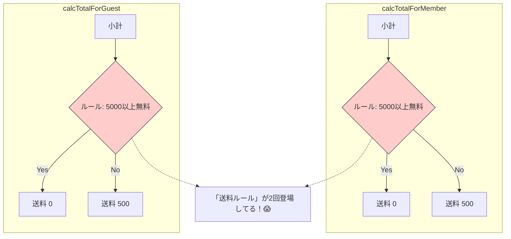

# 第01章：DRYってなに？「コピペ禁止」より大事な話🧻✨

## 1. この章のゴール🎯💖

この章が終わるころには…

* DRYの本当の意味（＝**同じ“知識/ルール”を複数に置かない**）がわかる😊✨
* 「コピペが悪い」じゃなくて、**なにが怖いのか**を言葉にできる🗣️🧠
* WETコード（重複だらけ）を見て「将来ここで事故る…😱」を嗅ぎ分けられる👃💥

---

## 2. DRYって一言でいうと？🧻🧠


DRY = **Don’t Repeat Yourself**（繰り返すな）だけど、ここで言う“繰り返し”は
**「同じコード」だけじゃなくて「同じルール（知識）」の繰り返し**のことだよ〜😊✨

### たとえばこんな“知識”が重複しがち💡

* 送料ルール：「5000円以上で送料無料」🚚
* 割引ルール：「会員は10%オフ（切り捨て）」🏷️
* ステータス：「paid / pending」みたいな文字列🧾
* バリデーション：「メールは必須」「パスワード8文字以上」🔐

これがあちこちに散らばると、**仕様変更1回で直す場所が増殖**して詰む😇💦

---

## 3. よくある事故のストーリー📉😱


（DRYが必要になる瞬間）

ある日、仕様がこう変わったとするね👇

> 「送料無料ライン、5000円→6000円に変えまーす！」📣😆

でもコードの中に「5000」が3〜5か所に散らばってたら…
直し忘れが1か所でもあった瞬間に、**“人によって送料が違う世界”**が爆誕🌍💥

* ユーザー「え？私は送料かかったんだけど？」😡
* 開発「え？こっちの画面では無料なんだけど？」😇
* そしてバグ調査で夜が溶ける🌙🫠

これがDRYが守りたいもの：
**変更を1回にすること**（＝事故を起こしにくくすること）🛡️✨

---

## 4. ミニ演習：WETコードの「怖いところ」を探そう👀🔍📝

まずは“重複だらけ”の例を見てみよ〜！
「どこが怖い？」を日本語で説明できたら勝ち🏆💖

```ts
export function calcTotalForMember(subtotal: number): number {
  // ルール：会員は10%引き（切り捨て）
  const discounted = Math.floor(subtotal * 0.9);

  // ルール：5000円以上で送料無料
  const shipping = discounted >= 5000 ? 0 : 500;

  return discounted + shipping;
}

export function calcTotalForGuest(subtotal: number): number {
  // 非会員は割引なし
  const discounted = subtotal;

  // ルール：5000円以上で送料無料（また出た）
  const shipping = discounted >= 5000 ? 0 : 500;

  return discounted + shipping;
}
```



### 質問（口に出してOK）🗣️💞

1. **同じ“知識（ルール）”**ってどれ？🏷️
2. 「送料無料ラインが6000円に変わった」ら、**どこを直す？何か所？**🔧
3. 直し忘れたら、どんなバグになる？😱

> ✅ポイント：ここで言う“怖さ”は「同じコードがある」じゃなくて
> **“同じルールが複数に書かれてる”**ことだよ〜🧠✨

---

## 5. DRYな考え方のコツ🧠🪄（合言葉3つ）

### 合言葉①：それは“同じルール”？それとも“たまたま似てるだけ”？🤔

* 同じ理由で変わるなら → **DRY候補**✨
* 変わる理由が違うなら → 無理にまとめると地獄（これは第8章でやるよ🐙⚠️）

### 合言葉②：変更回数を1回にできる？🔁➡️1️⃣

「このルール、明日変わったらどこ直す？」って自分に聞く👂
答えが「5か所…」なら、DRYの出番😇💦

### 合言葉③：名前をつけられる？📛✨


ルールに名前をつけられると、一気に“知識”として扱える💖
例：`FREE_SHIPPING_THRESHOLD` とか `calcShipping()` とかね🚚✨
（本格的なまとめ方は第3章・第4章でやるよ✂️🏷️）
 
 ```mermaid
 mindmap
   root((DRYのコツ))
     ルールは同じ？
       似てるだけ？
       変更理由は？
     変更は1回で済む？
       1か所修正でOK
       事故防止
     名前をつけられる？
       知識の抽象化
       意図を語る
 ```
 
 ---

## 6. AI活用🤖💬：「重複っぽい」を見つけるのはAIが得意✨

VS CodeのCopilot Chatは、自然言語で「このコード何してる？」とか「重複ある？」が聞けるタイプだよ💬✨
マルチターンで会話しながら詰められるのも強い🧠（会話履歴が文脈になる）([Visual Studio Code][1])

Copilot自体も、**補完（Inline suggestions）**や**チャット**などの機能がまとまって用意されてるよ🧩✨（VS Code対応）([GitHub Docs][2])

### 使い方イメージ（この章でやるのはここまで）🧸✨

1. 上のWETコードを範囲選択🖱️
2. Copilot Chatにこう投げる💬👇

**おすすめプロンプト例（そのままコピペOK）**📝💖

* 「このコードで“同じルール（知識）の重複”になっている箇所を指摘して。なぜ危険かも説明して」🤖
* 「仕様が“送料無料6000円以上”に変わるとき、修正漏れが起きやすい点を列挙して」🧠
* 「重複を減らす方向性を3案出して。メリット/デメリットも」🧩

> ✅大事：AIの指摘を“採点”するのは自分！
> 「それって同じ理由で変わるルール？」って最後は人間の判断だよ〜😊✨

---

## 7. 章末ミニチェック✅💕（3分でOK）

* [ ] DRYは「コピペ禁止」より **“知識を1か所に”** って説明できる🧻✨
* [ ] 「変更が入ったらどこ直す？」で危険箇所を嗅ぎ分けられる👃💥
* [ ] WETコードを見て「直し忘れバグ」が想像できる😱➡️🛡️

---

## 8. 次章の予告📚👀✨

次は「重複の種類」を見分けるよ〜！
**コードのコピペ**だけじゃなく、**ルール・データ・例外**みたいな“見えにくい重複”も分類できるようにする🧠🏷️✨（ここができると一気に強くなる💪💕）

[1]: https://code.visualstudio.com/docs/copilot/chat/copilot-chat "Get started with chat in VS Code"
[2]: https://docs.github.com/en/copilot/get-started/features "GitHub Copilot features - GitHub Docs"
