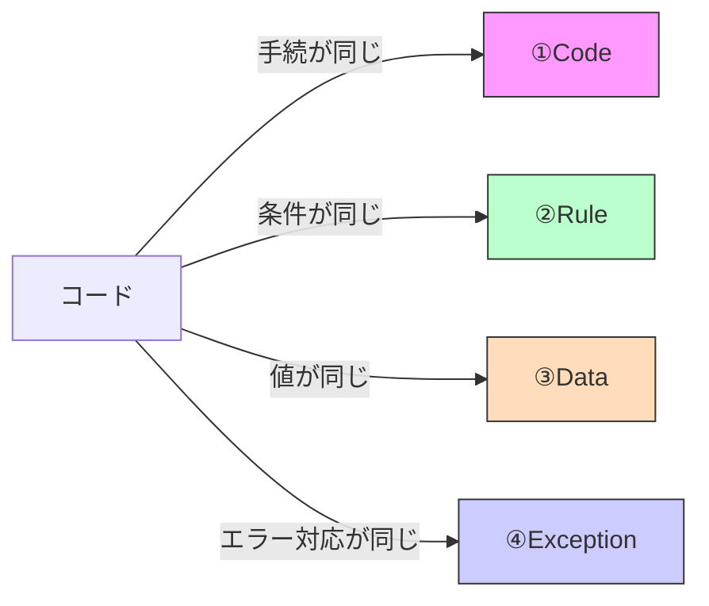

# 第02章：重複の種類を見分けよう👀🔍（コード／ルール／データ／例外）

### この章のゴール🎯💖

* 「これ、重複だ…！」を **4種類に分類**できるようになる✨
* 分類できると、次の章でやる **“正しい直し方”** が選べるようになるよ〜🛠️😊

---

## 0) まず最初に：DRYは「コピペ禁止」じゃない🙅‍♀️📄

DRYで本当に避けたいのは、**同じ“知識（ルール）”が複数箇所に散らばること**だよ🧠✨
だから、見た目が似てる/同じでも「どの種類の重複か？」で危険度も直し方も変わるの！

---

## 1) 重複4種類まとめ🏷️✨

（最初に全体像）

### ① コードの重複（処理コピペ）📄📄

**同じ処理がそのまま複数にある**パターン。

* 例：`calcShipping()`相当の処理を3箇所にコピペ
* 直し方の方向性：関数抽出✂️（第3章でやるよ）

---

### ② ルールの重複（知識の重複）🧠🧮

**同じ条件・計算・業務ルールが複数にある**パターン。
コードが完全一致じゃなくても、**同じ意味**なら重複だよ！

* 例：「5000円以上は送料無料」が、別々の画面/APIに散らばってる
* 直し方の方向性：ルールに名前をつけて1か所へ🧩（関数/設定/辞書）

---

### ③ データの重複（文字列・キー・URL・数値）🏷️🔑

**“値”が散らばる**パターン。いわゆる *魔法の文字列* とか *マジックナンバー* 🎩💥

* 例：`"PAID"` が10箇所、`"/api/cart"` が5箇所、`5000` があちこち
* 直し方の方向性：定数化/辞書化/型で縛る（第4章でやるよ）✨

---

### ④ 例外処理の重複（try/catchコピペ）🚨🧯

**同じエラー整形・同じログ・同じUI通知**が何回も出てくるパターン。

* 例：`try { fetch... } catch { alert...; console.error... }` が3箇所
* 直し方の方向性：ラッパ関数/共通ハンドラ（第7章でやるよ）🛡️

---

## 2) 迷ったらこれ！分類のための質問リスト🧩💡


似たコードを見つけたら、この順番で自問してみてね😊

1. **同じ“処理の手順”がコピペ？** → ①コードの重複📄
2. **同じ“判断基準/計算式/業務ルール”が散らばってる？** → ②ルールの重複🧠
3. **同じ“値（文字列/数値/URL/キー）”が散らばってる？** → ③データの重複🏷️
4. **同じ“例外対応（整形/ログ/通知）”が散らばってる？** → ④例外の重複🚨

※ひとつのコード片に **複数の重複が混ざる**ことも普通にあるよ〜🍹✨

---

## 3) サンプルで体感しよ！🏃‍♀️💨「重複ラベル貼り」演習🏷️😆

### お題：カート合計を出す処理🛒💳

次のコードを読んで、コメントの `TODO` にラベルを貼ってね！
使うラベルはこれ👇

* `[CODE]` ①コードの重複
* `[RULE]` ②ルールの重複
* `[DATA]` ③データの重複
* `[EX]` ④例外の重複



```ts
type UserKind = "member" | "guest";

export async function checkout(userKind: UserKind, subtotal: number) {
  // --- 送料ルール（5000以上送料無料）っぽい処理 ---
  const shippingA = subtotal >= 5000 ? 0 : 500; // TODO: ラベルは？🏷️

  // --- 会員割引（10%引き・切り捨て） ---
  const discounted =
    userKind === "member" ? Math.floor(subtotal * 0.9) : subtotal; // TODO: ラベルは？🏷️

  // --- 支払いステータス文字列 ---
  const status = "PAID"; // TODO: ラベルは？🏷️

  // --- API呼び出し（エラー処理あり） ---
  try {
    const res = await fetch("/api/checkout", {
      method: "POST",
      body: JSON.stringify({ subtotal, discounted, shippingA, status }),
      headers: { "Content-Type": "application/json" },
    });

    if (!res.ok) {
      throw new Error("CHECKOUT_FAILED"); // TODO: ラベルは？🏷️
    }

    return await res.json();
  } catch (e) {
    console.error("[checkout] failed", e); // TODO: ラベルは？🏷️
    return { ok: false, message: "決済に失敗しました" }; // TODO: ラベルは？🏷️
  }
}

export function calcTotalForCartPage(subtotal: number) {
  // カート画面の合計表示用（なぜか似た処理がここにも…）
  const shippingB = subtotal >= 5000 ? 0 : 500; // TODO: ラベルは？🏷️
  return subtotal + shippingB;
}

export function calcTotalForOrderHistory(subtotal: number) {
  // 注文履歴の合計表示用（また同じ…）
  const shippingC = subtotal >= 5000 ? 0 : 500; // TODO: ラベルは？🏷️
  return subtotal + shippingC;
}
```

---

## 4) 解答＆解説✅💖（ここ大事！）

### 送料 `subtotal >= 5000 ? 0 : 500`

* **まず②[ RULE ]**：
  「5000以上で送料無料」っていう **業務ルール**が散らばってる🧠
* **さらに①[ CODE ]**：
  それが **3回コピペ**されてる📄

👉 つまり **ルール重複 + コード重複の合わせ技**だよ〜😆

---

### 会員割引 `Math.floor(subtotal * 0.9)`

* **②[ RULE ]**：
  「会員は10%引き（切り捨て）」は **知識（ルール）**🧠🧮
  （見た目が短くても“ルール”は重複しやすい！）

---

### `const status = "PAID"`

* **③[ DATA ]**：
  文字列が散らばると、いつか `"Paid"` とか `"paid"` が混ざって事故る😇
  → これはデータ重複🏷️

---

### `fetch("/api/checkout" ...)`

* `"/api/checkout"` は **③[ DATA ]**（URLという値）
* `try/catch` の形＆ `console.error` ＆ `{ ok:false, message:... }` は
  **④[ EX ]**（例外処理の重複）🚨
  （別のAPIでも同じことやりがち！）

---

### `throw new Error("CHECKOUT_FAILED")`

* `"CHECKOUT_FAILED"` は **③[ DATA ]**（エラーコード文字列）🏷️
  （次の章以降で「型で縛る」方向にいくと強いよ〜🛡️）

---

## 5) 「分類できる」と何が嬉しいの？🥳✨

分類できると、直すときに迷わない！

* `[CODE]` が主役 → **関数抽出**（第3章）✂️
* `[RULE]` が主役 → **“ルールに名前を付けて”1か所へ**（第3/6章あたりで効く）📛
* `[DATA]` が主役 → **定数・辞書・型**（第4章）🏷️
* `[EX]` が主役 → **エラーハンドリングの共通化**（第7章）🚨

---

## 6) VS Codeで「重複っぽい」を見つけるコツ👀🧰

* まずは **検索**で同じ文字列/数値を探す🔎
* 次に **リファクタ支援**を使う✨
  VS Codeは TypeScript の **Extract function / Extract constant** みたいなリファクタを用意してるよ（選択して電球💡やショートカットで出るやつ）([Visual Studio Code][1])
* **Rename（F2）**で「同じ意味の名前」を揃えるのも超効くよ🧡([Visual Studio Code][1])

---

## 7) AI活用🤖💖（でも“分類”は自分でやる！）

Copilotなどには、まず「分類を手伝って」って頼むのが強いよ〜！
（Copilotはコード提案・チャットなどの機能が用意されてるよ）([GitHub Docs][2])

コピペして使えるプロンプト👇

```txt
次のTypeScriptコードから「重複」を探して、
[CODE] [RULE] [DATA] [EX] のどれかでラベル付けして。
各ラベルごとに「なぜそう判断したか」を1〜2行で説明して。
最後に、直す順番（安全な順）も提案して。
```

さらに一段上げるやつ👇（テスト観点も出させる🧪✨）

```txt
上の重複について、共通化の候補を3案出して。
それぞれのメリット/デメリット、壊れやすい点、追加すべきテスト観点も書いて。
```

---

## 8) 章末ミニ課題🎒✨（10〜15分でOK）

あなたの手元のプロジェクトで、どこでもいいから1ファイル選んで…

1. 同じ文字列 or 数値を **3回以上**使ってる場所を探す🔎
2. それに **[DATA]** ラベルを付ける🏷️
3. 同じ条件（例：`x > 0` とか `status === "paid"`）が散らばってたら **[RULE]** も付ける🧠
4. 「この重複は第3章で直す？第4章で直す？」って仕分けメモを書く📝💖

---

## 9) 小ネタ：TypeScriptの「いま」🌸

TypeScript は npm で入れると **最新は現在 5.9** だよ（公式のDownloadページに明記されてる）([TypeScript][3])
なので教材中のサンプルも、基本は 5.9 前提でOK✨

---

### 次の第3章へつながる一言🎀

この章で「重複の種類」が見分けられたら、次は **最強の基本技：関数抽出＆引数化✂️** に進めるよ〜！
「[CODE] と [RULE] を1か所に寄せる」練習、やろうね😊💖

[1]: https://code.visualstudio.com/docs/languages/typescript "TypeScript in Visual Studio Code"
[2]: https://docs.github.com/en/copilot/get-started/features?utm_source=chatgpt.com "GitHub Copilot features"
[3]: https://www.typescriptlang.org/download/ "TypeScript: How to set up TypeScript"
