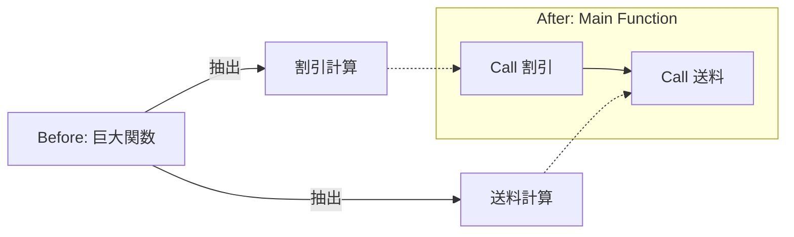
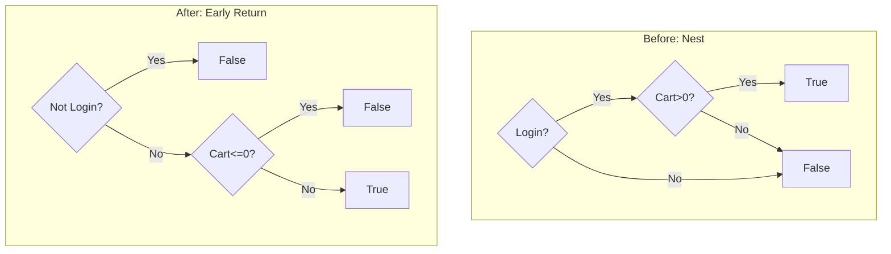

# 第03章：まずは最強の基本技！関数抽出＆引数化✂️🧩

この章は「重複を消すなら、まずこれ！」っていう王道セットだよ〜😊💖
（最近のTypeScriptは、次世代の高速化（6.0→7.0）に向けて準備が進んでて、エディタのリファクタ体験もますます重要になってきてる感じ！🚀✨）([Microsoft for Developers][1])

---

# 3-1. この章のゴール🎯✨

読み終わるころには…

* 重複した処理を「関数に切り出して」1か所にまとめられる✂️✅
* 違う部分だけを「引数」にして、コピペを増やさずに済む🧩✨
* “ネスト地獄”を「早期return」でスッキリできる🚪🌿
* AIの提案をそのまま採用せず、「良し悪し」を判断できる🤖🧠✨

---

# 3-2. まず超大事：DRYで消したいのは「同じ知識」📚🧠

DRYって「同じコード」だけじゃなくて、

* 同じ計算ルール🧮
* 同じ条件の考え方（判定）👀
* 同じ手順（手続き）🧾

みたいな **“同じ知識”** が複数に散らばるのが怖いんだよね😱💦
だから第3章は、その散らばった知識を「関数」に集める練習をするよ✂️✨

---

# 3-3. 関数抽出のやり方（いちばん安全な手順）🧯✅

## 手順A：いきなり切らない（先に“挙動の確認ポイント”を作る）📝✨

やることはこれだけ！

* 「この入力なら、この出力」みたいな例を3つ作る（メモでOK）📝
* できれば実行して、今の動きを確認✅

リファクタって「動きは変えない」作業だから、ここが命綱だよ〜🥺🛟

---

## 手順B：切り出す範囲を決める（コツ：1ルール＝1関数）📌✨

「ここからここまで」って迷ったら👇

* 1つの意味（ルール）にまとまってる？
* 名前をつけられる？（動詞で言える？）

例：

* 「送料を決める」🚚
* 「割引後の小計を出す」💸
* 「入力チェックする」✅

---

## 手順C：まずは“そのまま”関数にする（引数化は後でもOK）✂️➡️🧩

最初は、**切り出して動く状態**を作るのが優先😊✨
引数化で迷うのは“次のステップ”でOKだよ〜！

---

# 3-4. VS Codeの「Extract function」を使う（超ラク）🪄✨

やり方はシンプル！

1. 切り出したいコードを範囲選択🖱️
2. 「クイックフィックス（Ctrl+.）」を開く✨
3. リファクタ系の中から「Extract function」を選ぶ✂️

この流れはVS Codeの公式ドキュメントにも載ってるよ〜📘✨([Visual Studio Code][2])

さらに、**リファクタだけ見たい**なら「Refactor（Ctrl+Shift+R）」も便利😊([Visual Studio Code][3])
ショートカットは自分好みに割り当てもできるよ🎮（Extract function専用の割り当て例も公式にある）([Visual Studio Code][4])

---

# 3-5. 例題：重複3か所 → 1か所へ✂️✅

## Before（WET：同じロジックが3回😵）

```ts
type MemberType = "member" | "guest" | "vip";

function calcTotal(subtotal: number, memberType: MemberType): number {
  // ① 割引（会員10% / VIP15% / ゲスト0%）※切り捨て
  let discounted = subtotal;
  if (memberType === "member") discounted = Math.floor(subtotal * 0.9);
  if (memberType === "vip") discounted = Math.floor(subtotal * 0.85);

  // ② 送料（割引後が5000以上で無料、未満は500）
  let shipping = 0;
  if (discounted >= 5000) shipping = 0;
  else shipping = 500;

  // ③ さらに別の場所でも同じ送料判定が必要になった…（例）
  const shippingForGift = discounted >= 5000 ? 0 : 500;

  return discounted + shipping + shippingForGift;
}
```

（ここでは「送料ルール」が2か所、増えそうな匂いがムンムン…😇🔥）

---

## After（DRY：送料の知識を1関数に集約✨）

```ts
type MemberType = "member" | "guest" | "vip";

function calcTotal(subtotal: number, memberType: MemberType): number {
  const discounted = calcDiscountedSubtotal(subtotal, memberType);
  const shipping = calcShipping(discounted);
  const shippingForGift = calcShipping(discounted);
  return discounted + shipping + shippingForGift;
}

function calcDiscountedSubtotal(subtotal: number, memberType: MemberType): number {
  if (memberType === "member") return Math.floor(subtotal * 0.9);
  if (memberType === "vip") return Math.floor(subtotal * 0.85);
  return subtotal; // guest
}

function calcShipping(discountedSubtotal: number): number {
  if (discountedSubtotal >= 5000) return 0;
  return 500;
}
```

ポイントはこれ〜👇😍✨

* 「送料」という知識が1か所（calcShipping）に集まった🚚✅
* 条件のネストが減って読みやすい（早期return）🚪🌿
* 関数の引数名が “何を渡すか” を説明してくれてる📛✨

TypeScriptは関数の書き方・戻り値の考え方（void/return型など）も公式ハンドブックにまとまってるよ📘([TypeScript][5])



---

# 3-6. 引数化のコツ：「違うのはどこ？」を1個ずつ数える🧩🔍

## ✅ 引数にしていいもの（だいたいこれ）

* 数値・文字列・真偽値などのデータ🎛️
* “条件の境界” になる値（例：5000）📏
* 処理の種類（例：memberType）🧑‍🤝‍🧑

## ⚠️ ありがち失敗：引数が増えすぎて読めない😵‍💫

引数が4〜5個を超えてきたら黄色信号🚦💛
その時は「オブジェクトで渡す」や「そもそも関数を分ける」を疑うよ〜🧠✨

---

# 3-7. 早期return（ガード節）で分岐をスッキリ🚪🌿✨

## Before（ネストで迷子😵）

```ts
function canCheckout(isLoggedIn: boolean, cartCount: number): boolean {
  if (isLoggedIn) {
    if (cartCount > 0) {
      return true;
    } else {
      return false;
    }
  } else {
    return false;
  }
}
```

## After（読む順番が気持ちいい😍）

```ts
function canCheckout(isLoggedIn: boolean, cartCount: number): boolean {
  if (!isLoggedIn) return false;
  if (cartCount <= 0) return false;
  return true;
}
```



「ダメな条件を先に返す」だけで、脳の負担がめっちゃ減るよ〜🧠💖

---

# 3-8. ミニ演習（手を動かすと一気に身につく！）🧪✨

## 演習1：同じ送料判定が3回ある🚚

**課題**：送料判定を1関数にして、呼び出す形にしてね✂️
**ヒント**：「5000以上で0、それ以外500」

---

## 演習2：“違う部分だけ”引数で渡す🧩

同じログ整形があるとするよ〜👇
**課題**：「ラベルだけ違う」なら引数化して1関数に！

---

## 演習3：ネストifを早期returnに🚪

入力チェックのifが深い関数を、ガード節で薄くしてね🌿

---

## 解答例（1つの型）✅💖

```ts
function calcShipping(discountedSubtotal: number): number {
  return discountedSubtotal >= 5000 ? 0 : 500;
}

function formatLog(label: string, value: number): string {
  return `[${label}] value=${value}`;
}

function validateName(name: string): string {
  if (name.trim().length === 0) return "名前が空だよ";
  if (name.length > 20) return "名前が長すぎるよ";
  return "OK";
}
```

---

# 3-9. AI活用（“丸投げ”じゃなくて“相棒”にする🤖💞）

Copilot/AIはリファクタ相談めっちゃ得意！
でも「採用するか」は人間の仕事〜🧠✨
（GitHub公式も“リファクタの考え方/進め方”をガイドしてるよ）([GitHub Docs][6])

## そのまま使えるプロンプト例💬✨

* 「このコードの重複を関数抽出で消したい。挙動は変えないで、差分だけ出して」🤖
* 「関数名の候補を5つ。動詞から始めて、短く、意図が伝わる感じで」📛
* 「この関数のテスト観点（入力→期待出力）を5つ作って」🧪
* 「引数が多すぎない形に整理して。理由も一言で」🧩

## AI案を採用する前のチェック✅

* 出力（挙動）が変わってない？🧯
* “同じ知識”が1か所に集まった？📚
* 関数名だけで何するか分かる？📛
* 引数の意味が説明できる？🧩

---

# 3-10. よくある落とし穴（ここ避けるだけで上手くなる！）⚠️🐣

* ❌ まだ1回しか出てないのに早すぎ共通化（未来予測で外す）🔮💦
* ❌ なんでも「utils」に入れて迷子🗺️
* ❌ 引数が増えすぎて、呼び出し側が読めない😵‍💫
* ✅ 迷ったら「1ルール＝1関数」「名前がつくか」を思い出す📌✨

---

# 3-11. 章末チェックリスト📋💖

* [ ] 重複を見つけたら、まず“挙動確認ポイント”を作れる📝
* [ ] Extract functionで1か所に寄せられる✂️
* [ ] 違う部分だけ引数化できる🧩
* [ ] 早期returnでネストを浅くできる🚪🌿
* [ ] AIの提案をチェックして採用/不採用を決められる🤖✅

---

次は第4章で「魔法の文字列」を卒業して、定数・辞書・ユニオン型でDRYをさらに強化していくよ〜🏷️✨😆

[1]: https://devblogs.microsoft.com/typescript/progress-on-typescript-7-december-2025/?utm_source=chatgpt.com "Progress on TypeScript 7 - December 2025"
[2]: https://code.visualstudio.com/docs/languages/typescript?utm_source=chatgpt.com "TypeScript in Visual Studio Code"
[3]: https://code.visualstudio.com/docs/editing/refactoring?utm_source=chatgpt.com "Refactoring"
[4]: https://code.visualstudio.com/docs/configure/keybindings?utm_source=chatgpt.com "Keyboard shortcuts for Visual Studio Code"
[5]: https://www.typescriptlang.org/docs/handbook/2/functions.html?utm_source=chatgpt.com "Documentation - More on Functions"
[6]: https://docs.github.com/en/enterprise-cloud%40latest/copilot/tutorials/refactor-code?utm_source=chatgpt.com "Refactoring code with GitHub Copilot"
