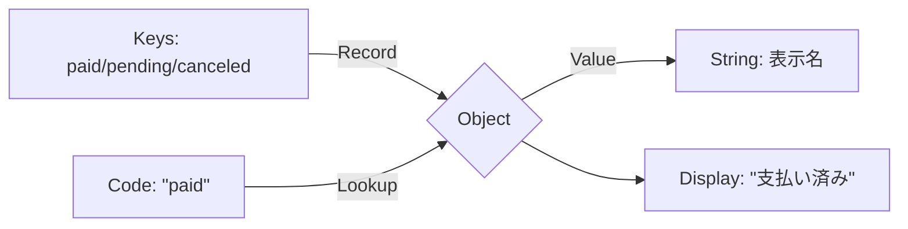

# 第04章：魔法の文字列を卒業！定数・辞書・ユニオン型でDRY🏷️✨

## 4-1. 「魔法の文字列」ってなに？🪄😵


たとえば、アプリのあちこちにこんなのが散らばってる状態👇

* "paid" / "pending" / "canceled"
* "user" / "admin"
* "theme"（localStorageのキー）
* "/api/orders"（URL）
* "SUBMIT_CLICK"（イベント名）

これ、いわゆる **魔法の文字列（意味を持った文字列がベタ書きで散らばってる状態）** だよ〜😇💦
ヤバい理由はシンプル！

* **タイポが死ぬほど怖い**（"paied" とか…気づきにくい😱）
* **変更が地獄**（仕様で "pending" → "awaiting" に変わったら全箇所探す羽目👀💥）
* **同じ意味が複数の表現になる**（"PAID" と "paid" が混在して混乱🤯）

ここでDRYの出番！✨
「同じ知識（＝状態名、キー名、URLなど）を1か所に集める」ことをやるよ💪💖

---

## 4-2. この章のゴール🎯💗

この章が終わると、こうなれるよ👇✨

* 文字列コピペをやめて、**定数**でまとめられる📌
* 対応表（ステータス→表示名など）を **辞書（Record）** で1か所管理できる🗂️
* 使える値を **ユニオン型** で縛って、タイポをコンパイルで止められる🛡️✨

ちなみに今のTypeScript最新版は 5.9 系が “latest” 扱いになってるよ（npmでも確認できる）📦✨ ([npmjs.com][1])

---

## 4-3. まずは定数で「散らばり」を止血しよう🩹📌

### パターンA：とにかく一旦まとめる（超現実的）😌

1か所に集めるだけでも、事故率が激減するよ✨

```ts
// constants/status.ts
export const STATUS_PAID = "paid";
export const STATUS_PENDING = "pending";
export const STATUS_CANCELED = "canceled";
```

ただし！これだけだと、TypeScript的にはただの string 扱いになりやすい（型が強くならない）ことがあるの🥺
そこで次！

---

## 4-4. as const で「リテラル型」に固定しよう🧷✨

### パターンB：定数の“集合”を作る（おすすめ💖）

オブジェクトにまとめて、最後に as const を付けるのが超よくある型安全パターンだよ〜！✨
as const は「型の世界でも定数っぽく固定する」ための仕組みだよ🧠✨ ([TypeScript][2])

```ts
// domain/status.ts
export const OrderStatus = {
  Paid: "paid",
  Pending: "pending",
  Canceled: "canceled",
} as const;
```

これで何が嬉しいの？😊
OrderStatus.Paid の型が "paid" になって、ただの string じゃなくなるの！🎉

---

## 4-5. ユニオン型で「使っていい値」だけに縛る🛡️💫


次に、OrderStatus からユニオン型を自動生成しちゃうよ✨

```ts
// domain/status.ts
export const OrderStatus = {
  Paid: "paid",
  Pending: "pending",
  Canceled: "canceled",
} as const;

export type OrderStatusValue = typeof OrderStatus[keyof typeof OrderStatus];
```

これで OrderStatusValue はこうなる👇
"paid" | "pending" | "canceled"

文字列リテラル型＋ユニオン型って、文字列で enum っぽいことができる王道のやつ！😆✨ ([TypeScript][3])

### 使う側はこうなる💖

```ts
import { OrderStatus, type OrderStatusValue } from "./domain/status";

function setStatus(orderId: string, status: OrderStatusValue) {
  // ...
}

setStatus("A001", OrderStatus.Paid);     // OK 😊
setStatus("A001", "paied");             // コンパイルで止まる😇✨
```

---

## 4-6. 辞書（Record）で「対応表」を1か所にまとめる🗂️✨

次は「ステータス→表示名」みたいな対応表あるあるね！💡

### 例：表示ラベルを辞書化する📛✨

```ts
import { type OrderStatusValue } from "./domain/status";

export const StatusLabel: Record<OrderStatusValue, string> = {
  paid: "支払い済み",
  pending: "保留中",
  canceled: "キャンセル",
};
```

ここが気持ちいいポイント💖

* ステータスを増やしたら、辞書側が **足りない** って怒られる😆
* タイポキー（"pendng" とか）も弾ける🛡️

Record は「キーの集合」と「値の型」をセットで縛れる便利ユーティリティ型だよ✨ ([TypeScript][4])



---

## 4-7. satisfies で「辞書の型チェック」と「推論の美味しさ」を両取り🍰✨

TypeScriptには satisfies って演算子があって、
「型に合ってるか検証するけど、値そのものの型推論は崩さない」っていう良いとこ取りができるよ〜！😳✨ ([TypeScript][5])

```ts
import { type OrderStatusValue } from "./domain/status";

export const StatusLabel = {
  paid: "支払い済み",
  pending: "保留中",
  canceled: "キャンセル",
} satisfies Record<OrderStatusValue, string>;
```

これ、地味に便利なのは👇

* 「Recordとして成立してるか」はチェックされる✅
* でも StatusLabel.paid は "支払い済み"（リテラル）として残りやすい✨
  → あとで別の型推論に使いたい時に嬉しい💖

---

## 4-8. “変更に強い”DRYにするコツ（超大事）🧠🔧

### ✅ コツ1：値をベタ書きしたくなったら「それ、知識？」って自問する🤔

* ただの表示用文章？ → その場でもOKなこと多い
* 状態・キー・URL・イベント名？ → だいたい「知識」なので1か所へ🏷️✨

### ✅ コツ2：同じ理由で変わるもの同士をまとめる📦

* OrderStatus（注文の状態）
* UserRole（権限）
* StorageKey（localStorageのキー）
* ApiPath（APIパス）

「なんでもconstants.ts」みたいに巨大化させると迷子になるから、ドメインごとにファイル分けがオススメだよ〜🗺️💕

---

## 4-9. ミニ演習💪💖（ステータス散らばりを救え！）

### お題😆📝

こんなコードがあるとする👇

```ts
function canCancel(status: string) {
  return status === "pending";
}

function renderBadge(status: string) {
  if (status === "paid") return "✅";
  if (status === "pending") return "🕒";
  if (status === "canceled") return "❌";
  return "？";
}
```

### やること🎯

1. OrderStatus（as const）を作る
2. OrderStatusValue を作る
3. canCancel の引数を OrderStatusValue にする
4. バッジを辞書（Record or satisfies）にする

### できあがり例（答えの一例）✨

```ts
export const OrderStatus = {
  Paid: "paid",
  Pending: "pending",
  Canceled: "canceled",
} as const;

export type OrderStatusValue = typeof OrderStatus[keyof typeof OrderStatus];

export function canCancel(status: OrderStatusValue) {
  return status === OrderStatus.Pending;
}

export const StatusBadge = {
  paid: "✅",
  pending: "🕒",
  canceled: "❌",
} satisfies Record<OrderStatusValue, string>;

export function renderBadge(status: OrderStatusValue) {
  return StatusBadge[status];
}
```

---

## 4-10. AI活用🤖💖（“いい感じにDRY化”させる質問テンプレ）

Copilot/AIに投げると強い聞き方を置いとくね✨
（答えを丸のみせず、最後は自分で「知識が1か所になってる？」をチェック！🧠）

* 「このファイル内の magic string を列挙して、定数化候補を提案して」
* 「as const のオブジェクト＋ユニオン型にして、既存コードが壊れないように最小変更で直して」
* 「Record を使って、キーの漏れがコンパイルで検出できる形にして」
* 「satisfies を使う版と使わない版で、推論の違いも説明して」

GitHub Copilotは、提案・チャット・検索系の支援ができるよ（機能の全体像）🧩✨ ([GitHub Docs][6])

---

## 4-11. 章まとめ🎀✨

この章の合言葉はこれっ👇😆💕

* **文字列が“知識”なら、散らすな！1か所に置け！**🏷️
* **as const + ユニオン型で、タイポをコンパイルで止める！**🛡️
* **Record / satisfies で、対応表の漏れをコンパイルで炙り出す！**🔥

次の章（型でDRY🧠🧱）に行くと、ここで作った「型安全な定義」をもっと強く使い回せるようになるよ〜！💖

[1]: https://www.npmjs.com/package/typescript?utm_source=chatgpt.com "TypeScript"
[2]: https://www.typescriptlang.org/docs/handbook/2/everyday-types.html?utm_source=chatgpt.com "Documentation - Everyday Types"
[3]: https://www.typescriptlang.org/docs/handbook/literal-types.html?utm_source=chatgpt.com "Handbook - Literal Types"
[4]: https://www.typescriptlang.org/docs/handbook/utility-types.html?utm_source=chatgpt.com "Documentation - Utility Types"
[5]: https://www.typescriptlang.org/docs/handbook/release-notes/typescript-4-9.html?utm_source=chatgpt.com "Documentation - TypeScript 4.9"
[6]: https://docs.github.com/en/copilot/get-started/features?utm_source=chatgpt.com "GitHub Copilot features"
