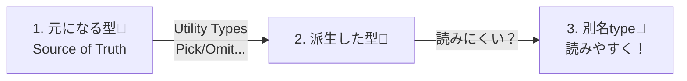
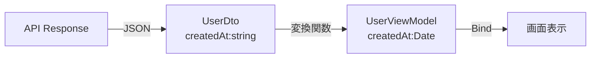

# 第05章：TypeScriptならでは！型でDRY（形の重複を減らす）🧠🧱

この章はね、**「同じような型（Userっぽい形とか）をコピペしないで済むようにする」**のがテーマだよ〜！💖
コードのDRYだけじゃなくて、**“データの形（型）”もDRYにできる**のがTypeScriptの強みなの✨

ちなみに今のTypeScript最新版は **5.9.3**（npm上のLatest）だよ〜📦✨ ([npmjs.com][1])
Utility Types（Pick/Omit/Partialなど）は公式でまとまってるから、ここをベースに学ぶのが安心💓 ([TypeScript][2])

---

## 5-1. まず「型の重複」ってどんな地獄？😇🔥


たとえば、こんなのよくある👇

* APIから来る `User`
* 画面に出す `UserCard`
* 一覧に出す `UserRow`
* 更新用 `UserUpdateInput`

で、それぞれを**コピペで作りがち**…😱

```ts
// 😭 ありがちなWET（コピペ）例
type User = {
  id: string;
  name: string;
  email: string;
  avatarUrl: string;
  createdAt: string;
};

type UserCard = {
  id: string;
  name: string;
  avatarUrl: string;
};

type UserRow = {
  id: string;
  name: string;
  email: string;
};

type UserUpdateInput = {
  name?: string;
  email?: string;
  avatarUrl?: string;
};
```

これ、最初は動くけど…

* `User` に `displayName` を追加したら？🤔
* `createdAt` の型を `string` → `Date` にしたら？🤯

**直す場所が増えて、事故りやすい**の〜〜〜！💥💦

---

## 5-2. 型DRYの基本戦略はこれだけ！🎯✨


型DRYは、だいたいこの3つで勝てるよ💪💕

1. **“元になる型” を1個決める（ソース・オブ・トゥルース）**👑
2. **派生は Utility Types で作る（Pick/Omit/Partial/Readonly/Record）**🧩
3. **派生が読みづらくなったら “別名type” を付けて読みやすくする**📛✨

公式のUtility Types一覧はここが本家だよ📚 ([TypeScript][2])



---

## 5-3. type と interface の使い分け（超入門でOK）🧁✨

ここは“ざっくり”でOK〜！😊

* **interface**：オブジェクトの形を表すのが得意（拡張しやすい）
* **type**：ユニオン（`A | B`）とか、Pick/Omitで合成するとき便利

迷ったら、まずは **typeで統一でも全然OK**👌💖
（チームのルールがあればそれに合わせよ〜）

---

## 5-4. Pick / Omit：必要な形だけ切り出す✂️✨


### ✅ Pick：欲しいプロパティだけもらう

```ts
type User = {
  id: string;
  name: string;
  email: string;
  avatarUrl: string;
  createdAt: string;
};

type UserCard = Pick<User, "id" | "name" | "avatarUrl">;
type UserRow  = Pick<User, "id" | "name" | "email">;
```

### ✅ Omit：いらないのを除外する

「新規作成のときは `id` と `createdAt` は不要」みたいなやつ！

```ts
type UserCreateInput = Omit<User, "id" | "createdAt">;
```

---

## 5-5. Partial / Readonly：更新や扱いを安全にする🛡️✨


### ✅ Partial：更新（PATCH）的なときに便利

```ts
type UserUpdateInput = Partial<Pick<User, "name" | "email" | "avatarUrl">>;
```

ただし注意！⚠️
**Partialを広くかけすぎると「何でもundefinedで良い世界」になって事故る**😱💦
「更新できる項目だけ」に絞るのがコツだよ🧠✨

### ✅ Readonly：変更しないデータだよ〜の意思表示

```ts
type UserViewModel = Readonly<User>;
```

---

## 5-6. Record：対応表・辞書を“型で”固定する🗂️✨

第4章の“辞書DRY”と相性が最高〜！💞
Recordは公式Utility Typesにもあるよ📚 ([TypeScript][2])

```ts
type Status = "paid" | "pending" | "canceled";

type StatusLabelMap = Record<Status, string>;

const STATUS_LABEL: StatusLabelMap = {
  paid: "支払い済み💖",
  pending: "保留中⏳",
  canceled: "キャンセル😢",
};
```

* キーの書き忘れ → **コンパイルで怒られる**😤✨
* 変なキー追加 → **それも怒られる**😤✨

---

## 5-7. 「入力DTO」「画面表示用」「保存用」で形がズレる問題📦😵‍💫


ここ、現場あるある〜〜〜！！😭💦
でもズレるのは悪じゃないよ🙆‍♀️✨

**大事なのは**
✅ それぞれの目的が違うなら、型が違ってOK
✅ ただし“コピペ”じゃなくて、**派生で作る**のがDRY

例：APIのレスポンス（DTO）→ 画面用（ViewModel）で `Date` にしたい、みたいなとき👇

```ts
// APIから来る形（DTO）
type UserDto = {
  id: string;
  name: string;
  createdAt: string; // APIは文字列で来ること多いよね
};

// 画面で使いたい形（ViewModel）
type UserViewModel = Omit<UserDto, "createdAt"> & {
  createdAt: Date;
};

// 変換関数（型と処理をセットにすると迷子になりにくい！）
function toUserViewModel(dto: UserDto): UserViewModel {
  return {
    ...dto,
    createdAt: new Date(dto.createdAt),
  };
}
```



---

## 5-8. 「型は型から作る」も強い！（Creating Types from Types）🧩✨


TypeScript公式もここを超大事にしてるよ〜📚 ([TypeScript][3])
たとえば `keyof` とか `typeof` とかで、**“手で書く型”を減らす**の！

```ts
const userFields = ["id", "name", "email"] as const;
type UserField = typeof userFields[number]; // "id" | "name" | "email"
```

こうすると「フィールド名のユニオン型」を手で作らなくて済む✨

### おまけ：satisfies（型チェックしつつ推論は壊さない）✨

`satisfies` は公式のリリースノートにも載ってる便利なやつだよ🧡 ([TypeScript][4])

```ts
type Status = "paid" | "pending" | "canceled";

const STATUS_LABEL = {
  paid: "支払い済み💖",
  pending: "保留中⏳",
  canceled: "キャンセル😢",
} satisfies Record<Status, string>;
```

---

## 5-9. ミニ演習（いちばん大事！）📝💪✨

### 演習A：似た型を3つ → 共通型＋Pick/Omitで整理しよう🏷️

**お題（WET）👇**

```ts
type ProductCard = {
  id: string;
  name: string;
  price: number;
  imageUrl: string;
};

type ProductRow = {
  id: string;
  name: string;
  price: number;
};

type ProductCreateInput = {
  name: string;
  price: number;
  imageUrl: string;
};
```

**やること🎯**

1. まず `Product` を作る
2. Card/Row/Createを Pick/Omit で作る

**解答例👇（まずは見てマネでOK！）**

```ts
type Product = {
  id: string;
  name: string;
  price: number;
  imageUrl: string;
};

type ProductCard = Pick<Product, "id" | "name" | "price" | "imageUrl">;
type ProductRow = Pick<Product, "id" | "name" | "price">;
type ProductCreateInput = Omit<Product, "id">;
```

---

## 5-10. AI活用コーナー🤖💖（“型DRY”は相談が超効く！）

### ① コピペ型を貼って、DRY案を出してもらう✨

* プロンプト例💬
  「この型定義がコピペだらけです。`Pick` / `Omit` / `Partial` を使ってDRYにしてください。読みやすい別名typeも提案して。」

### ② “Partialの範囲”を相談する🧠

* プロンプト例💬
  「更新API（PATCH）用の型にしたい。`Partial<User>`は危ない気がするので、更新可能項目だけに絞った安全な型を作って。」

### ③ 仕上げにチェックしてもらう✅

* プロンプト例💬
  「この型の派生、読みづらくなってきた。別名typeを付けて読みやすくして。責務が分かれるなら分けてOK。」

GitHub Copilot側も、チャットやコンテキストのまとめ機能がどんどん増えてるので、**“型の相談相手”として使うのはかなりアリ**だよ〜🧠✨ ([GitHub Docs][5])

---

## 5-11. よくある落とし穴（ここ回避できると強い！）🐙⚠️


* **なんでも `Partial<T>` にしちゃう** → バグの温床😇
* **DTOと画面用の型を同一にしようとしすぎる** → 変更が連鎖して泣く😭
* **Pick/Omitをその場で長々書いて読めなくなる** → 別名type付けよ📛✨
* **“たまたま似てる”だけを共通化** → 第8章の「やりすぎ注意」に直結😵‍💫

---

## 5-12. まとめ🎀✨（この章で持ち帰るもの）

✅ **元になる型を1個決めて、派生はPick/Omit/Partial/Readonly/Recordで作る**
✅ **DTO / 画面 / 保存で形が違ってもOK。ただしコピペはしない**
✅ **型の派生が読みにくくなったら、別名typeで読みやすくする**

次の第6章（条件分岐のDRY）では、`isXxx` みたいな **ガード関数＋型** が超効いてくるよ〜🛡️✨
「判定ロジック」も「型」も、まとめてスッキリさせよっ💖

[1]: https://www.npmjs.com/package/typescript?utm_source=chatgpt.com "TypeScript"
[2]: https://www.typescriptlang.org/docs/handbook/utility-types.html?utm_source=chatgpt.com "Documentation - Utility Types"
[3]: https://www.typescriptlang.org/docs/handbook/2/types-from-types.html?utm_source=chatgpt.com "Documentation - Creating Types from Types"
[4]: https://www.typescriptlang.org/docs/handbook/release-notes/typescript-4-9.html?utm_source=chatgpt.com "Documentation - TypeScript 4.9"
[5]: https://docs.github.com/en/copilot/get-started/features?utm_source=chatgpt.com "GitHub Copilot features"
