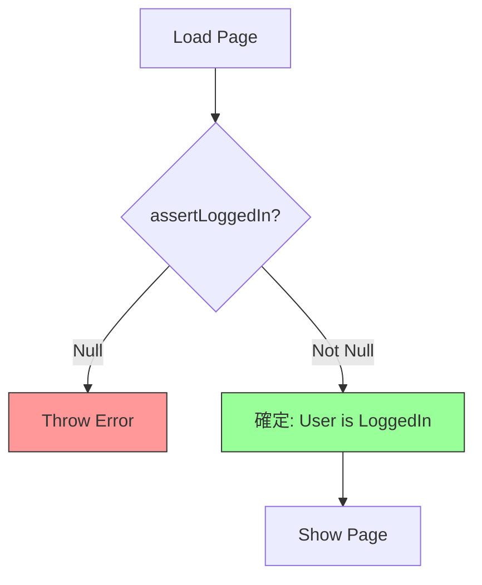

# 第06章：条件分岐のDRY（同じifが増える地獄を止める）🌪️➡️🌿

## 0) この章のゴール🎯✨

「同じ条件チェック（＝同じルール）」がコードのあちこちに散らばって、あとで変更が地獄になるのを止めます😇
この章が終わると、こんな力がつくよ💪💖

* ✅ 「条件（if）＝知識（ルール）」だって気づける
* ✅ 条件を **1か所** に集める（ガード関数・判定関数）
* ✅ TypeScriptの **ナローイング**（型が賢くなるやつ）も一緒に使える🧠✨
* ✅ 条件が増えても崩れにくい形（Union＋網羅チェック）にできる🙆‍♀️

※ちなみに現時点のTypeScript最新版は npm 上で **5.9.3** として配布されています。([npmjs.com][1])

---

## 1) まず知ってほしい：ifは「分岐」だけじゃない🧠🪄

if文って、見た目はただの分岐だけど…
本質は **「ルール（知識）の判定」** なんだよね👀✨

たとえば👇

* 「会員は10%引き」
* 「合計5000円以上なら送料無料」
* 「管理者だけこの操作OK」
* 「ステータスがPAIDのときだけ発送できる」

これ全部、**仕様＝知識** だよね📌
だから同じifが増えるってことは…

> ✅ 同じ知識が複数箇所にコピーされてる（＝DRY違反）
> ってことになりやすいの🥹💦

---

## 2) よくある“同じif増殖”パターン3つ😱📛

### パターンA：同じ条件が散らばる（変更で死ぬ）💀

「送料無料条件」が 3か所にある、とかね🫠

### パターンB：条件式が長くて毎回コピペ（読みづらい）📄

`user && user.role === "admin" && user.plan !== "free" && ...` みたいなやつ😵‍💫

### パターンC：条件の意味が毎回ちょっと違う（バグ温床）🐛

「A画面では `>= 5000` だけど、B画面では `> 5000`」みたいな微妙差…😇

---

## 3) テク①：まずは「条件に名前をつける」📛✨（最速で効く！）

同じ条件が出てきたら、まずこれだけでも世界が変わるよ🌍💖

### ❌ WET（意味が読めない＆コピペしがち）

```ts
if (subtotal >= 5000 && user.isMember) {
  // ...
}

if (subtotal >= 5000 && user.isMember) {
  // ...
}
```

### ✅ DRY（条件に“名前”がつくと読みやすい！）

```ts
const isFreeShipping = subtotal >= 5000 && user.isMember;

if (isFreeShipping) {
  // ...
}

if (isFreeShipping) {
  // ...
}
```

ポイントはこれ👇

* **条件の意味が一瞬で分かる**👀✨
* 変更が入っても **1か所直せばOK**🔧
* 「何を満たすとtrueなの？」が説明しやすい📝

---

## 4) テク②：ガード関数（isXxx）で条件を“1か所化”🛡️✨


ここからが第6章のメインディッシュ🍽️💖
**条件チェックを関数にして、散らばりを根絶**しよう！

### 4-1) まずは普通の判定関数でOK🙆‍♀️

```ts
function isFreeShippingEligible(subtotal: number, isMember: boolean) {
  return isMember && subtotal >= 5000;
}

// 使う側
if (isFreeShippingEligible(subtotal, user.isMember)) {
  // 送料無料処理
}
```

「送料無料ルール」が **この関数に集約**されるのが最高👍✨

---

### 4-2) TypeScriptらしく：型ガード（type predicate）で“型も絞る”🧠✨

TypeScriptは、条件によって型を絞り込む（ナローイング）機能があるよね🧩
その中でも **自分で作れる最強フォーム**が「型ガード関数」💪

Type predicate（`x is Type`）の形で書くと、ifの中で型が確定するよ✨([TypeScript][2])

例：支払い方法がユニオンのとき👇

```ts
type Payment =
  | { kind: "card"; last4: string }
  | { kind: "bank"; accountId: string }
  | { kind: "cash" };

function isCardPayment(p: Payment): p is { kind: "card"; last4: string } {
  return p.kind === "card";
}

function showPaymentLabel(p: Payment) {
  if (isCardPayment(p)) {
    // ここでは p.kind は "card" に確定してる✨
    return `CARD **** ${p.last4}`;
  }
  return p.kind.toUpperCase();
}
```

これのうれしさ👇😍

* ifの中で **補完が強くなる**✨
* 「カードのときだけ使えるプロパティ」が安全に使える🛡️

---

## 5) テク③：アサーション関数で「ここから先は安全」宣言🚨✅

ときどき「条件を満たさないなら例外で止めたい」場面があるよね🔥
そういうときは **assertion functions** が便利！
（TypeScriptの `asserts` を使うやつ）([TypeScript][3])

```ts
type User = { id: string } | null;

function assertLoggedIn(user: User): asserts user is { id: string } {
  if (user === null) throw new Error("ログインしてください🙇‍♀️");
}

function loadMyPage(user: User) {
  assertLoggedIn(user);
  // ここから先 user は { id: string } に確定✨
  return `loading... userId=${user.id}`;
}
```



使いどころは👇

* 「nullなら止める」
* 「想定外なら止める」
* 「ここから先は絶対この型！」ってしたいとき💡

---

## 6) テク④：条件が増えるなら「判別可能Union＋switch＋網羅チェック」🧱✨


ifが増える理由って、だいたい **状態（ステータス）が増える**からなの🥹
そこで効くのがこれ👇

* **判別可能（discriminated）Union**
* `switch` で分岐
* `never` を使った **網羅チェック**（漏れたらコンパイルで怒られる）💥([TypeScript][4])

```ts
type OrderStatus =
  | { type: "PAID" }
  | { type: "SHIPPED"; trackingNo: string }
  | { type: "CANCELLED"; reason: string };

function assertNever(x: never): never {
  throw new Error("Unhandled case: " + JSON.stringify(x));
}

function getStatusLabel(s: OrderStatus) {
  switch (s.type) {
    case "PAID":
      return "支払い完了💳✨";
    case "SHIPPED":
      return `発送済み📦✨ 追跡: ${s.trackingNo}`;
    case "CANCELLED":
      return `キャンセル😢 理由: ${s.reason}`;
    default:
      return assertNever(s); // ← ここが網羅チェック🔥
  }
}
```

これの強さ👇

* ステータスが増えたとき、**対応漏れがコンパイルで発覚**する💥
* 「どんな状態があるか」が型で見える👀✨
* 条件が散らばりにくい（switchに集まる）📌

---

## 7) どこに置く？おすすめ最小ファイル構成📁✨

「条件のDRY」は、置き場所を決めるとさらに強いよ💪

* `src/domain/rules/`：ビジネスルール（判定）
* `src/domain/guards/`：型ガード・アサーション
* `src/ui/`：画面側（なるべく判定を書かない）

例👇

```txt
src/
  domain/
    rules/
      shipping.ts
      discount.ts
    guards/
      userGuards.ts
  ui/
    cartView.ts
```

ルールは **UIから剥がす**と、マジで散らばりが止まる🧼✨

---

## 8) ミニ演習🎓✨：「同じifが3回ある」→「判定を1回に」🎯

### お題：送料無料と割引（わざと散らしてある）😈

```ts
type User = { isMember: boolean };
type Cart = { subtotal: number };

function calcA(user: User, cart: Cart) {
  if (user.isMember && cart.subtotal >= 5000) {
    return cart.subtotal; // shipping 0
  }
  return cart.subtotal + 500;
}

function showBadge(user: User, cart: Cart) {
  if (user.isMember && cart.subtotal >= 5000) {
    return "送料無料🎉";
  }
  return "";
}

function logShipping(user: User, cart: Cart) {
  if (user.isMember && cart.subtotal >= 5000) {
    console.log("shipping:0");
  } else {
    console.log("shipping:500");
  }
}
```

### ステップ1：条件を関数にする🛡️

```ts
function isFreeShipping(user: User, cart: Cart) {
  return user.isMember && cart.subtotal >= 5000;
}
```

### ステップ2：全部それを使う✨

```ts
function calcA(user: User, cart: Cart) {
  return isFreeShipping(user, cart) ? cart.subtotal : cart.subtotal + 500;
}

function showBadge(user: User, cart: Cart) {
  return isFreeShipping(user, cart) ? "送料無料🎉" : "";
}

function logShipping(user: User, cart: Cart) {
  console.log(isFreeShipping(user, cart) ? "shipping:0" : "shipping:500");
}
```

💡ここで大事なのは
**「同じ条件式」を消すことより、「同じルール（意味）」を1か所にすること**だよ😊✨

---

## 9) AI活用コーナー🤖💖（“丸投げ禁止”の上手い使い方）

AIは「候補出し」が超得意✨ でも「採用判断」はあなたがやるのがコツ🧠

### 使えるお願い文（コピペOK）💌

* 「このファイル内で、同じ条件式が繰り返されてる箇所を列挙して、1つの関数にまとめる案を出して」
* 「この条件式に“意味が分かる名前”を10個出して。短くて読みやすいのがいい」
* 「ユニオン型にしてswitchで網羅チェックできる形に変えて」
* 「この判定関数に対するテスト観点を箇条書きで出して（境界値・例外・組み合わせ）」

GitHub Copilot側にも「タスクの文脈をまとめて使う」系の機能が増えてきてるので、ルールの説明文（仕様）を一緒に渡すと精度が上がるよ📌([GitHub Docs][5])

---

## 10) まとめ🎀✨（第6章で覚える合言葉）

* ✅ **同じifが増えたら、それは同じルールが散らばってるサイン**🚨
* ✅ まずは **条件に名前**（変数）📛
* ✅ 本命は **判定関数／ガード関数**で1か所化🛡️
* ✅ 状態が増えるなら **discriminated union＋switch＋網羅チェック**🧱

次の章（第7章）は「try/catchコピペ地獄」脱出編🚨🧯
条件を片づけられた今、エラーも同じノリでキレイにできるよ〜😆💖

[1]: https://www.npmjs.com/package/typescript?utm_source=chatgpt.com "typescript"
[2]: https://www.typescriptlang.org/docs/handbook/advanced-types.html?utm_source=chatgpt.com "Documentation - Advanced Types"
[3]: https://www.typescriptlang.org/docs/handbook/release-notes/typescript-3-7.html?utm_source=chatgpt.com "Documentation - TypeScript 3.7"
[4]: https://www.typescriptlang.org/docs/handbook/unions-and-intersections.html?utm_source=chatgpt.com "Handbook - Unions and Intersection Types"
[5]: https://docs.github.com/en/copilot/get-started/features?utm_source=chatgpt.com "GitHub Copilot features"
