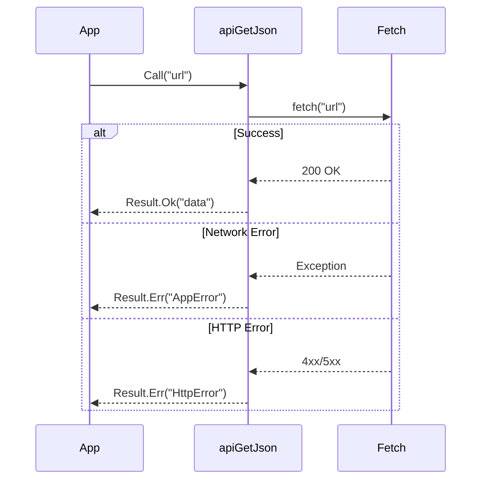

# 第07章：エラー処理のDRY（try/catchコピペ地獄から脱出）🚨🧯

この章のテーマはズバリ👇
**「エラー処理は“処理”じゃなくて“ルール（知識）”だから、1か所に寄せよう」** です😊💖

---

## 0. まず“最新版の前提”だけ軽く押さえるよ📌✨

* いまの安定版TypeScriptは **5.9.3**（npmのLatestが5.9.3）です📦✨ ([npmjs.com][1])
* 次の大きな流れとして **TypeScript 6.0（橋渡し）→ 7.0（ネイティブ移行）** が進行中です🚀 ([Microsoft for Developers][2])
* try/catchの `catch (e)` は **unknownで受ける**のが安全派（TSにはそれ用の設定がある）です🛡️ ([TypeScript][3])

---

## 1. あるある：try/catchが増殖して“直す場所が地獄”😱🌀

たとえば、画面のあちこちでAPIを叩くたびに…

* 毎回 `try/catch`
* 毎回 `console.error`
* 毎回「ユーザー向けメッセージを整形」
* 毎回「通信失敗／HTTPエラー／中断（キャンセル）…の判定」

…これ、**ぜんぶ同じ知識（ルール）** だよね？🤔
だからDRY的には「1か所に寄せたい」✨

---

## 2. ゴール：呼び出し側は“成功したら使う、失敗したら表示”だけにする🎯💡

理想👇

* APIを呼ぶ場所は **try/catchを書かない**（または最小限）
* エラーの分類・整形・ログは **共通関数** に任せる
* 画面側は **Result（成功/失敗）を見るだけ** ✅❌

---

## 3. 準備①：catchは unknown で受けて“ちゃんと絞り込む”🛡️🔍

TypeScriptには `useUnknownInCatchVariables` というオプションがあって、catchの変数を unknown にできます（この方が安全）🧠✨ ([TypeScript][3])

### ✅ 絞り込みの基本パターン（これ超よく使う！）

```ts
function isError(e: unknown): e is Error {
  return e instanceof Error;
}
```

---

## 4. 準備②：アプリで使う“エラーの形”を決める（AppError）🏷️✨

ポイントは **「エラーを“分類”できるようにする」** こと😊
コピペ地獄は、分類が毎回バラバラだから起きるの💦

### 4-1. HTTPエラー用のErrorクラス（あると便利）🌐

```ts
export class HttpError extends Error {
  constructor(
    public readonly status: number,
    public readonly url: string,
    message = `HTTP Error: ${status}`,
    options?: ErrorOptions
  ) {
    super(message, options);
    this.name = "HttpError";
  }
}
```

> `ErrorOptions` の `cause` を使うと「元のエラー」を保持したまま言い換えできるよ🧷✨ ([MDN Web Docs][4])

### 4-2. アプリ用の統一エラー型（ここがDRYの心臓💓）

```ts
export type AppError =
  | { kind: "http"; status: number; url: string; message: string; cause?: unknown }
  | { kind: "abort"; message: string; cause?: unknown }
  | { kind: "network"; message: string; cause?: unknown }
  | { kind: "parse"; message: string; cause?: unknown }
  | { kind: "unknown"; message: string; cause?: unknown };
```

---

## 5. 本丸①：unknown → AppError に“正規化”する🧼✨（toAppError）


ここでやることは3つ👇

1. `AbortError`（キャンセル）を特別扱い
2. `HttpError`（HTTPステータス）を特別扱い
3. それ以外をいい感じに分類

※ `fetch` を `AbortController.abort()` で止めると、`AbortError` という名前の例外で失敗するのが仕様だよ🧯 ([MDN Web Docs][5])

```ts
import { HttpError, type AppError } from "./errors";

function isDomAbortError(e: unknown): boolean {
  return e instanceof DOMException && e.name === "AbortError";
}

export function toAppError(e: unknown): AppError {
  if (isDomAbortError(e)) {
    return { kind: "abort", message: "通信をキャンセルしました", cause: e };
  }

  if (e instanceof HttpError) {
    return {
      kind: "http",
      status: e.status,
      url: e.url,
      message: `サーバーエラー（${e.status}）`,
      cause: e.cause,
    };
  }

  if (e instanceof SyntaxError) {
    return { kind: "parse", message: "データの解析に失敗しました", cause: e };
  }

  if (e instanceof TypeError) {
    // fetchのネットワーク失敗などがTypeErrorになるケースがある
    return { kind: "network", message: "ネットワークに接続できませんでした", cause: e };
  }

  if (e instanceof Error) {
    return { kind: "unknown", message: e.message || "不明なエラーです", cause: e };
  }

  return { kind: "unknown", message: "不明なエラーです", cause: e };
}
```

---

## 6. 本丸②：ユーザー向け文言とログ向け情報を“分けて”DRYにする📝✨

「画面に出す文章」と「調査用ログ」は役割が違うよね😊
これを毎回その場で書くと、必ずブレる💦

```ts
import type { AppError } from "./errors";

export function toUserMessage(err: AppError): string {
  switch (err.kind) {
    case "abort":
      return "キャンセルしたよ🙂";
    case "network":
      return "通信できなかったよ…Wi-Fiとか確認してみてね📶";
    case "http":
      return "サーバーが混み合ってるみたい。少し待ってもう一回やってみてね🕒";
    case "parse":
      return "受け取ったデータが壊れてたみたい…ごめんね🙏";
    case "unknown":
      return "ごめん、うまくいかなかった…もう一回試してみて🙏";
  }
}

export function toLogObject(err: AppError): Record<string, unknown> {
  return {
    kind: err.kind,
    message: err.message,
    ...(err.kind === "http" ? { status: err.status, url: err.url } : {}),
    cause: err.cause,
  };
}
```

---

## 7. 本丸③：Result型で try/catch を“画面から消す”✅❌✨


Resultの形はシンプルでOK！

```ts
export type Result<T, E> =
  | { ok: true; value: T }
  | { ok: false; error: E };

export const ok = <T>(value: T): Result<T, never> => ({ ok: true, value });
export const err = <E>(error: E): Result<never, E> => ({ ok: false, error });
```

---

## 8. 本丸④：fetchを薄いラッパで包む（エラー処理を1か所へ）🌐🧯✨

### 8-1. “JSONを取る”だけの共通関数（これで勝ち🏆）

```ts
import { err, ok, type Result } from "./result";
import { HttpError, type AppError } from "./errors";
import { toAppError } from "./toAppError";

export async function apiGetJson<T>(
  url: string,
  init?: RequestInit
): Promise<Result<T, AppError>> {
  try {
    const res = await fetch(url, init);

    if (!res.ok) {
      throw new HttpError(res.status, url, `HTTP ${res.status}`);
    }

    const data = (await res.json()) as T;
    return ok(data);
  } catch (e: unknown) {
    return err(toAppError(e));
  }
}
```



### 8-2. 呼び出し側は超スッキリ😍✨

```ts
import { apiGetJson } from "./api";
import { toLogObject, toUserMessage } from "./formatError";

type User = { id: number; name: string };

export async function loadUsers(signal?: AbortSignal) {
  const r = await apiGetJson<User[]>("/api/users", { signal });

  if (!r.ok) {
    console.error("loadUsers failed", toLogObject(r.error));
    alert(toUserMessage(r.error)); // 本当はトースト等でもOK
    return;
  }

  console.log("users:", r.value);
}
```

---

## 9. キャンセル（中断）もDRYに含める💨🧷

キャンセルを入れると「配信中にボタン連打」みたいな場面で超助かるよ😊

`AbortController.abort()` すると `fetch` は `AbortError` で落ちるのが仕様！ ([MDN Web Docs][5])

```ts
const controller = new AbortController();

const p = loadUsers(controller.signal);

// 途中で中止
controller.abort();
```

> `toAppError()` が `AbortError` を `kind: "abort"` にしてるから、
> 画面表示もログも「キャンセルは普通の失敗と違うよね🙂」って扱いにできる✨

---

## 10. ミニ演習（手を動かすよ〜！）✍️💖

### 演習A：try/catchコピペを“1個だけ”にする✂️

1. 画面にAPI呼び出しが3か所ある想定で、全部に try/catch が書かれてるコードを用意
2. `apiGetJson()` を作って try/catch を1か所に集約
3. 呼び出し側は `if (!r.ok)` のみで処理

**チェック**✅

* エラーメッセージを1回変えるだけで、全画面に反映される？😍

---

### 演習B：HTTP 404のときだけメッセージを変える🎯

* `toUserMessage()` の `http` 分岐で `status === 404` を特別扱いしてみよ〜

```ts
case "http":
  if (err.status === 404) return "見つからなかったよ（404）🔍";
  return "サーバーが混み合ってるみたい。少し待ってね🕒";
```

---

### 演習C：原因（cause）を保ったまま“言い換え”する🧷✨

`new Error("…", { cause: e })` が使えるよ！ ([MDN Web Docs][6])

例：`apiGetJson` の中で、`HttpError` を投げるときに cause を入れる等、工夫してみてね😊

---

## 11. AIの使いどころ🤖💖（“丸投げ”じゃなく“共同作業”）

GitHub Copilotは「提案」「チャット」「検索」など色々できるよ🧠✨ ([GitHub Docs][7])

### 使えるプロンプト例（そのまま貼ってOK）📎

* 「このプロジェクトのエラーを `http/network/abort/unknown` に分類したい。最小の型設計案を出して」
* 「fetchの共通ラッパを作りたい。HTTPエラーとAbortErrorを区別してResultで返して」
* 「toUserMessageの文言を“やさしい日本語”で5パターン出して（短めで）」
* 「ログに残すべき項目（kind/status/url/causeなど）のおすすめを理由付きで」

### でも最終チェックはここ！✅

* **キャンセルを“エラー扱い”しすぎてない？**（UX悪化しがち💦）
* **unknownを雑に `as Error` してない？**（本当にErrorとは限らない😇）
* **ログに個人情報を入れてない？**（特にURLやレスポンス丸ごと注意⚠️）

---

## 12. よくある落とし穴（ここ踏む人多い！）🕳️😵‍💫

* **全部catchして握りつぶす**
  → バグが消えるんじゃなくて“隠れる”だけ😱
* **ユーザー向けメッセージに技術情報を出す**
  → statusやstackは基本ログへ🧾
* **共通化しすぎて、逆に何が起きたか分からない**
  → `kind` は少なめから始めよ（増やすのは後でOK）🌱

---

## 13. まとめ🎀✨

この章でやったことはこれ👇

* try/catchのコピペをやめて **エラー処理を1か所に寄せた** 🧯✨
* `unknown` をちゃんと扱い、**正規化（toAppError）** した 🧼
* **Result型**で、画面側を「成功/失敗の分岐だけ」にした ✅❌
* キャンセル（AbortError）も含めて、**“例外のルール”をDRYにした** 💨✨ ([MDN Web Docs][5])

---

次の章（第8章）は、ここで作った共通化を**やりすぎて事故るパターン**を回避する話だよ🐙⚠️💕

[1]: https://www.npmjs.com/package/typescript?utm_source=chatgpt.com "TypeScript"
[2]: https://devblogs.microsoft.com/typescript/progress-on-typescript-7-december-2025/?utm_source=chatgpt.com "Progress on TypeScript 7 - December 2025"
[3]: https://www.typescriptlang.org/tsconfig/useUnknownInCatchVariables.html?utm_source=chatgpt.com "useUnknownInCatchVariables - TSConfig Option"
[4]: https://developer.mozilla.org/ja/docs/Web/JavaScript/Reference/Global_Objects/Error/cause?utm_source=chatgpt.com "Error: cause - JavaScript - MDN Web Docs - Mozilla"
[5]: https://developer.mozilla.org/ja/docs/Web/API/AbortController/abort?utm_source=chatgpt.com "AbortController: abort() メソッド - Web API | MDN"
[6]: https://developer.mozilla.org/ja/docs/Web/JavaScript/Reference/Global_Objects/Error/Error?utm_source=chatgpt.com "Error() コンストラクター - JavaScript - MDN Web Docs - Mozilla"
[7]: https://docs.github.com/en/copilot/get-started/features?utm_source=chatgpt.com "GitHub Copilot features"
