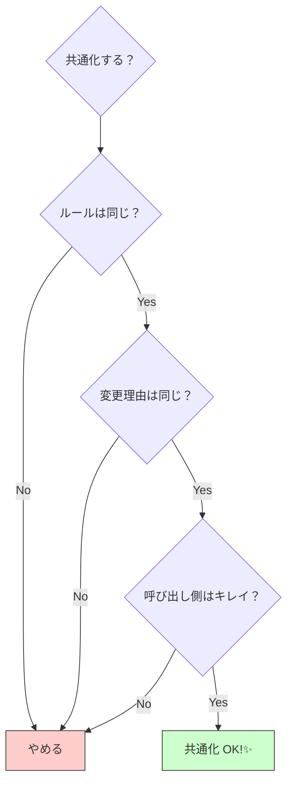

# 第08章：DRYの落とし穴（やりすぎ注意！）🐙⚠️

（＝「共通化したのに、逆に読めない😭」を防ぐ章だよ〜！）

---

## 8-0. この章のゴール🎯💖

この章を終えると…

* 「共通化すべき重複」と「残すべき重複」を見分けられる👀✨
* “やりすぎDRY”のサインを、コード見てすぐ気づける🚨
* 共通化する前にチェックする「判断チェックリスト📋」を自分で回せる🧠✨

---

## 8-1. まず大事な誤解をほどくね🧻💡

DRYって「同じコードを1行たりとも書くな！」じゃなくて、**“同じ知識（ルール）を複数に置かない”**が本体だよ〜📚✨ ([ウィキペディア][1])

だから、**コードが似てても “ルールが別” なら、無理に1つにしない方が安全**なことがあるの🥺🫶
逆に、**見た目が違っても “同じルール” なら、1か所に寄せた方が安全**だったりするよ！

---

## 8-2. DRYのやりすぎで起きる「あるある地獄」😵‍💫🕳️

ここからが本題！「共通化しすぎ」で起きる事故、超よくあるやつ👇

### あるある①： “たまたま似てるだけ” を統一して崩壊💥


* 例：送料計算と割引計算が「%っぽい」からって同じ関数にまとめる
* 結果：条件分岐が増えまくって、**読めない・直せない**😇

### あるある②：万能utilsが巨大化して迷子🗺️🐙


* `utils.ts` に何でも入る
* いつの間にか **神（God）オブジェクト/クラス**っぽくなる😱 ([ウィキペディア][2])

### あるある③：共通化のための引数が増えすぎる🎛️😵


* `options` が10個
* `isFoo`, `shouldBar` みたいなフラグ地獄
* 呼び出し側が「結局これ何してるの？」ってなる

### あるある④：型でDRYしようとして型パズル🧩🌀

* ジェネリクス + 条件型 + mapped type が合体
* 未来の自分（と仲間）が詰む😭
  （TypeScriptは最新でも強いけど、強い＝複雑にしやすい、でもあるの…！ ([npmjs.com][3])）

---

## 8-3. “やりすぎDRY” を見抜く7つのサイン🚨👀


共通化した関数（or モジュール）が、こうなってきたら黄色信号だよ〜⚠️

1. **名前がぼんやり**してきた

* `process()` / `handle()` / `doThing()` とか🫠

2. **引数が増え続ける**（3〜4個を超えて増殖）
3. **booleanフラグ**が増える（`isX`, `useY`, `enableZ`）
4. **if/switchが増える**（共通化した中で分岐が増殖）
5. **呼び出し側が読みにくい**（何が起きるか分からない）
6. **修正すると別機能が壊れる**（関係ないものが巻き込まれる）
7. **「これ将来もっと分かれる予感」**がする（勘、大事🥺✨）

---

## 8-4. 判断のコアはこれだけ💎（3つの質問）


共通化する前に、まずこの3問だけは自分に聞いてね☺️🫶

### Q1. 「同じルール？」それとも「似てるだけ？」🤔

* 例：

  * “割引” と “送料” はどっちも金額をいじるけど、**ルール（知識）が別**なことが多い

### Q2. 「変更理由」は同じ？🧭

* 変更理由が同じなら、寄せる価値が高い✨
* 変更理由が違うなら、寄せるほど事故る💥

### Q3. それ、共通化したら呼び出し側が読みやすい？📖

* 共通化して **中だけキレイ**でも、
  呼び出し側が **呪文**になるなら負け😭



---

## 8-5. 迷ったら「Rule of Three」＋「AHA」でOK🙆‍♀️✨


### ✅ Rule of Three（3回出たら考える）

「2回は様子見、3回目で抽象化を検討」みたいな目安だよ〜🧠 ([ウィキペディア][4])

### ✅ AHA（Avoid Hasty Abstractions：早すぎる抽象化を避けよ）💡

「似てるっぽい」で急いでまとめず、**“必要性が叫び出すまで”ちょい待つ**考え方だよ！ ([Kent C. Dodds][5])

---

## 8-6. 例で体感しよ！「悪いDRY」「良いDRY」🧪✨

### 例1：「似てるから統一」→ 分岐地獄 😇


#### ❌ “悪いDRY” 例（統一しすぎ）

```ts
type Mode = "discount" | "shipping";

function calcAmount(base: number, mode: Mode, options: {
  percent?: number;
  min?: number;
  max?: number;
  freeShippingOver?: number;
}) {
  if (mode === "discount") {
    const p = options.percent ?? 0;
    const discounted = base - base * (p / 100);
    return Math.max(options.min ?? 0, Math.min(options.max ?? discounted, discounted));
  }

  // shipping
  if (options.freeShippingOver != null && base >= options.freeShippingOver) return 0;
  return Math.max(options.min ?? 0, options.max ?? base);
}
```

見た目は「1つにまとまった」けど…

* modeで分岐
* optionsが増殖
* 送料と割引のルールが混ざる
  → 未来に変更が来たらほぼ詰む😭

#### ✅ “良いDRY” 例（ルール単位で分ける）

```ts
function calcDiscountedPrice(base: number, percent: number) {
  return base - base * (percent / 100);
}

function calcShippingFee(subtotal: number, freeOver: number, standardFee: number) {
  return subtotal >= freeOver ? 0 : standardFee;
}
```

* ルールが別なら、**関数も別**でいいの😊✨
* 共通化は「同じ知識」のところだけにするのがコツ！

---

### 例2：「万能utils」→ 神になって終わる🐙

#### ❌ ありがち

* `utils.ts` に `formatDate`, `calcTax`, `fetchJson`, `sleep`, `parseCsv`…
  → 便利だけど、どんどん増えて探せない🫠

#### ✅ コツ（超シンプルでOK）

* **用途でフォルダを分ける**（例：`domain/`, `ui/`, `infra/` みたいに）
* もしくは最小で

  * `money/`（金額ルール）
  * `date/`（日付）
  * `http/`（通信）
    みたいに“話題ごと”に分ける✨
    （神オブジェクト化はアンチパターンとして有名だよ〜([ウィキペディア][2])）

---

### 例3：型でDRYしすぎて読めない🧩😭

#### ❌ “型の共通化” が目的化するとこうなる

* 「全部Genericでいけるよね？」
* 「条件型で自動推論させよ！」
  → 数週間後、誰も直せない型パズル完成🎉（うれしくない）

#### ✅ ルール

* “型の再利用”は、**読める範囲で**やる
* 迷ったら、**型は少し重複してもOK**（AHAの気持ち💡 ([Kent C. Dodds][5])）

---

## 8-7. VS Codeで「安全にDRYを試す」小ワザ🛟✨

共通化って、怖いのは「戻せない」ことだよね🥺
でもVS Codeには、リファクタ支援があるよ〜！

* **Extract（関数/定数）**：選択 → 電球💡（または `Ctrl + .`）
* **Rename Symbol**：`F2` で名前を安全に変更
  （VS Codeのリファクタ機能として紹介されてるよ ([Visual Studio Code][6])）

※そして、Gitでコミットを小さく切ると最強🫶（戻せる安心感）

---

## 8-8. AI（Copilot/Codex等）で“やりすぎ”を検査する🤖🔍

AIは共通化アイデア出すの得意だけど、**やりすぎ案も平気で出す**よ😂
だから、こう聞くのがコツ！

### そのまま使えるプロンプト例🪄

* 「この共通化、**Wrong Abstraction**になりそうな点ある？」
* 「呼び出し側の可読性が落ちてない？**具体例で**評価して」
* 「引数が増えた理由を“変更理由”で説明して。説明できなかったら分割案を出して」
* 「Rule of Three的に、今は抽象化すべき？まだ複製のまま？理由付きで」

Copilotにも“リファクタの相談”用のガイドがあるよ ([GitHub Docs][7])

---

## 8-9. ここで作るもの：判断チェックリスト📋✨（保存版）

共通化の前に、これを上から順に✅してね！

### ✅ DRY判断チェックリスト（ミニ版）

* ⬜ これは **同じ知識（ルール）**？（見た目が似てるだけじゃない？） ([ウィキペディア][1])
* ⬜ 変更理由は同じ？（誰が・いつ・なぜ変える？）
* ⬜ 呼び出し側は読みやすい？（呪文になってない？）
* ⬜ 分岐やフラグが増えそう？（増えそうなら分ける）
* ⬜ 今はまだ2回目？（3回目まで待つのもアリ） ([ウィキペディア][4])
* ⬜ 共通化した結果、引数や条件分岐が増えてない？

  * 増えてたら「不適切な抽象化」かも…！ ([Sandi Metz][8])
* ⬜ “万能utils” に押し込めてない？（神化の入口） ([ウィキペディア][2])

---

## 8-10. ミニ演習（15〜25分）🧁✨

### お題：どっちを選ぶ？（共通化 or 残す）

次の2つ、あなたならどうする？🥺

#### ケースA：ほぼ同じに見える

* 商品の割引（クーポン%）
* 会員割引（会員ランク%）

👉 質問：**「%で引く」って同じだけど、ルールは同じ？**

* クーポンは仕様変更されがち、会員割引は固定かも…？
* 変更理由が違うなら、分けた方が楽なことあるよ💡

#### ケースB：見た目は違うけど同じ知識っぽい

* 画面Aと画面Bで「ステータス表示の文言」が違う書き方で散らばってる
  👉 質問：**“ステータス文言ルール”は同じ？**
* 同じなら「辞書（Record）＋型」で1か所に寄せるのがDRY✨

---

## 8-11. まとめ🎀✨

* DRYは「コードを1つに」じゃなくて「知識（ルール）を1つに」だよ ([ウィキペディア][1])
* 迷ったら **Rule of Three** と **AHA** で落ち着いてOK🫶 ([ウィキペディア][4])
* 共通化が “分岐・フラグ・引数増殖” を呼び始めたら、**いったん戻す勇気**も正解🙆‍♀️ ([Sandi Metz][8])

---

次は第9章で、わざとちょいWETな状態から「DRY改善を1周」するまとめプロジェクトに入ると、判断力が一気に育つよ〜🎯💖

[1]: https://en.wikipedia.org/wiki/Don%27t_repeat_yourself?utm_source=chatgpt.com "Don't repeat yourself"
[2]: https://en.wikipedia.org/wiki/God_object?utm_source=chatgpt.com "God object"
[3]: https://www.npmjs.com/package/typescript?activeTab=versions&utm_source=chatgpt.com "typescript"
[4]: https://en.wikipedia.org/wiki/Rule_of_three_%28computer_programming%29?utm_source=chatgpt.com "Rule of three (computer programming)"
[5]: https://kentcdodds.com/blog/aha-programming?utm_source=chatgpt.com "AHA Programming 💡"
[6]: https://code.visualstudio.com/docs/editing/refactoring?utm_source=chatgpt.com "Refactoring"
[7]: https://docs.github.com/en/copilot/tutorials/refactor-code?utm_source=chatgpt.com "Refactoring code with GitHub Copilot"
[8]: https://sandimetz.com/blog/2016/1/20/the-wrong-abstraction?utm_source=chatgpt.com "The Wrong Abstraction"
