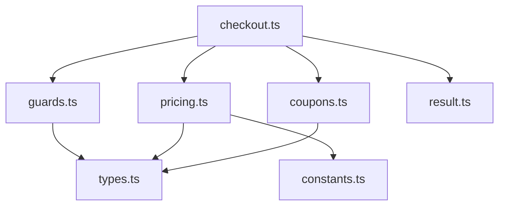

# 第09章：まとめプロジェクト（DRY改善を1周する）🎯🛠️🎉

この章は「DRYを“知識”じゃなくて“手順”として身につける」回だよ〜！💖
カート計算（割引・送料・クーポン）を、**重複だらけ（WET）→ すっきり（DRY）**に直していくよ🧹✨

---

## 0) 最新メモ（2026/01/12時点）🗓️✨

* TypeScript は **5.9 系が “latest” 扱い**として案内されてるよ📌 ([TypeScript][1])
* VS Code は **December 2025 (version 1.108)** が **2026/01/08 リリース**として出てるよ🧡 ([Visual Studio Code][2])
* Copilot は **Chat（VS Code内のチャット）**や、**agent mode（タスクを自律的に進める）**みたいな機能が公式に案内されてるよ🤖✨ ([Visual Studio Code][3])
* TypeScript は 5.9 の次に **6.0 → 7.0** を見据えた話も出てる（方針の話）よ🔭 ([Microsoft for Developers][4])

---

## 1) この章のゴール💪🎯


最終的に、あなたができるようになること👇✨

* 重複を見つけて「種類」を言える🏷️👀
* **テストで守りながら**安全にまとめられる🧪🛡️
* “まとめた結果”が**読みやすく**なるように整えられる📚✨
* 「あえて残す重複」も、理由を書いて判断できる📝🌿

---

## 2) 題材：カート計算（割引・送料・クーポン）🛒💳

よくあるやつ👇

* 小計 subtotal 💰
* 会員ランク割引（例：Goldは10%）👑
* クーポン（例：WELCOMEで500円引き、FREESHIPで送料0）🎫
* 送料（例：500円、ただし一定額以上で無料）🚚
* 例外（不正クーポン、期限切れ、金額がおかしい…）🚨

ここ、**重複が爆増しがち**でDRYの練習に最高なの🥹✨

---

## 3) プロジェクトの形（完成イメージ）🏗️✨

最終的にファイルはこんな雰囲気にするよ👇

* `src/constants.ts` … 文字列・数値の定義を1か所へ🏷️
* `src/types.ts` … 型をDRYに整理🧱
* `src/guards.ts` … 条件チェック（isXxx）を集約🛡️
* `src/pricing.ts` … 小計/割引/送料の計算を分ける🧮
* `src/coupons.ts` … クーポン処理を分離🎫
* `src/result.ts` … 成功/失敗の形を統一✅❌
* `src/checkout.ts` … 司令塔（読みやすい！）🎮✨



---

## 4) まずは“WETな初期コード”を用意しよう😈📄

下のコードは「わざと」重複まみれだよ！安心してね😂

### `src/checkout.wet.ts`（スタート地点）

```ts
type MemberRank = "GUEST" | "SILVER" | "GOLD";
type CouponCode = "WELCOME" | "FREESHIP" | "VIP" | "NONE";

type CartItem = {
  sku: string;
  name: string;
  price: number;
  qty: number;
};

type CheckoutInput = {
  items: CartItem[];
  memberRank: MemberRank;
  coupon: CouponCode;
};

export function checkoutWet(input: CheckoutInput) {
  // ❶ 小計計算（このあと別の場所でも似たのが出る…）
  let subtotal = 0;
  for (const it of input.items) {
    if (it.qty <= 0) throw new Error("qty must be > 0");
    if (it.price < 0) throw new Error("price must be >= 0");
    subtotal += it.price * it.qty;
  }

  // ❷ 会員割引（ifが増えがち…）
  let memberDiscount = 0;
  if (input.memberRank === "GOLD") {
    memberDiscount = Math.floor(subtotal * 0.1);
  } else if (input.memberRank === "SILVER") {
    memberDiscount = Math.floor(subtotal * 0.05);
  } else {
    memberDiscount = 0;
  }

  // ❸ クーポン割引（WELCOME/VIPの計算がベタ書き）
  let couponDiscount = 0;
  if (input.coupon === "WELCOME") {
    couponDiscount = 500;
  } else if (input.coupon === "VIP") {
    couponDiscount = Math.floor(subtotal * 0.15);
  } else {
    couponDiscount = 0;
  }

  // ❹ 送料（条件があちこちに増えるやつ）
  let shipping = 500;
  if (subtotal - memberDiscount - couponDiscount >= 5000) {
    shipping = 0;
  }
  if (input.coupon === "FREESHIP") {
    shipping = 0;
  }

  // ❺ 合計（似た式が増殖しがち）
  const total = Math.max(0, subtotal - memberDiscount - couponDiscount) + shipping;

  return {
    subtotal,
    memberDiscount,
    couponDiscount,
    shipping,
    total,
    message: "ok",
  };
}
```

---

## 5) 手順①：まず“テスト”で安全網を張る🧪🛡️

DRY改善はコードを動かしながら直すのが勝ち！✨
最初に「今の挙動」をテストで固定しちゃおう📌

### テスト観点（最低これだけでOK）✅

* 通常ケース：GUEST + NONE
* 会員割引：SILVER / GOLD
* クーポン：WELCOME / VIP / FREESHIP
* 境界：送料無料ライン 5000 の前後
* エラー：qty <= 0 / price < 0

### AI活用🤖💡（コピペ用プロンプト）

* 「この関数に対して、境界値を含むテストケースを10個列挙して。期待値も一緒に」
* 「送料無料条件と割引の組み合わせでバグりやすいパターンを教えて」

---

## 6) 手順②：重複に“ラベル”を貼る🏷️👀

WETコードを見ながら、付箋を貼る気持ちでやるよ〜！💖

### ラベル例（第2章の復習）

* 📄コードの重複：小計計算や合計式がコピペされそう
* 🧠ルールの重複：送料無料条件、割引率、丸め方
* 🏷️データの重複：`500`, `5000`, `"GOLD"` など散らばる
* 🚨例外の重複：qty/priceのチェック、エラーメッセージ

ここでのコツは👇
**「同じ理由で変わる？」**を自分に聞くことだよ🧠✨
（例：送料無料ラインが変わったら、何か所直す？😱）

---

## 7) 手順③：関数抽出＆引数化（第3章）✂️🧩

最初の勝ち筋はこれ！
「小計」「割引」「送料」を関数に分けるだけで一気に読みやすくなるよ📚✨

### 目標

* `calcSubtotal(items)`
* `calcMemberDiscount(subtotal, rank)`
* `calcCouponDiscount(subtotal, coupon)`
* `calcShipping(net, coupon)` ← “net” は割引後金額みたいな名前にするのがオススメ💡

### AI活用🤖💬

* 「今のコードを、責務ごとに関数に分割して。命名は読みやすさ重視で3案」
* 「関数分割した後に、引数が多すぎるならどう整理する？」

---

## 8) 手順④：定数・対応表・ユニオン型（第4章）🏷️🗂️

ここで “魔法の数字/文字列” を卒業するよ🎓✨

### まとめたいもの例

* 送料：`500`
* 送料無料ライン：`5000`
* 割引率：GOLD 0.1 / SILVER 0.05
* クーポンの定義：WELCOME 500 / VIP 0.15 / FREESHIP special

#### ポイント💡

* 数字を1か所に集めると、**仕様変更が秒速**になる🚀
* クーポンは `Record<CouponCode, ...>` で “対応表” にするとキレイ🗂️

---

## 9) 手順⑤：TypeScriptで“型のDRY”（第5章）🧠🧱

このプロジェクト、完成版ではだいたいこうなる👇

* 入力：`CheckoutInput`
* 出力：`CheckoutSummary`
* 計算途中：`PricingBreakdown`
* エラー：`CheckoutError`

### DRYのコツ

* 似た型が増えたら、まず「共通の核」を作る🧩
* `Pick` / `Omit` で用途別の形にする✨

### AI活用🤖

* 「この型、将来 “配送先” が追加されても崩れにくい設計にして」
* 「Pick/Omitで整理できるところを提案して」

---

## 10) 手順⑥：条件分岐のDRY（第6章）🛡️🌿

ifが散らばると、仕様が“分裂”するのが怖い😵‍💫
だから **判定はガード関数へ**✨

例：

* `isFreeShipping(net, coupon)`
* `isValidCoupon(coupon)`（将来、期限や対象SKUを足すときに効く💖）
* `isVipEligible(memberRank)` とかもアリ👑

---

## 11) 手順⑦：エラー処理のDRY（第7章）🚨🧯

この題材だと、エラーはよくこうなる👇

* qtyが0以下
* priceが負
* クーポンが不正（今回は union だから少ないけど、現実は文字列入力が多い😭）

おすすめはどっちか（好きな方でOK）🍀

* A) `throw` するなら：`CheckoutError` を作って整形を1か所へ
* B) `Result` っぽく返すなら：`{ ok: true, value } | { ok:false, error }` に統一✅❌

Copilotの agent mode を使うなら、
「CheckoutError導入→置換→テスト通す」みたいにタスク単位で任せやすいよ🤖✨ ([GitHub Docs][5])

---

## 12) 手順⑧：あえて“消さない重複”もOK（第8章）🐙⚠️📝

ここが第9章のいちばん大事ポイントかも💖

### 例：残してOKな重複

* 1〜2行の式が、**読んだ方が早い**とき（無理に関数化しない）
* 呼び出し側が `calcA(calcB(calcC(...)))` みたいに暗号になるとき
* “似てるけどルールが違う” もの（将来別々に変わりそう）

### ミニ提出物（自分用でOK）📄✨

`DRY_DECISIONS.md` を作って、こう書く👇

* 残した重複：〇〇
* 残した理由：変更理由が別／読みやすさ優先／今は早い抽象化、など

---

## 13) 最終チェックリスト✅🎉

最後にこれを満たしたらクリアだよ〜！💮💖

* [ ] 仕様変更（例：送料無料ライン）を **1か所**直せばOKになった？🔧
* [ ] 割引率やクーポン定義が **散らばってない**？🏷️
* [ ] “判定” と “処理” が分かれてて読める？👀
* [ ] テストがあって、安心して触れる？🧪
* [ ] 残した重複に理由が書けてる？📝✨

---

## 14) AI活用チートシート🤖💖（そのまま投げてOK）

* 「このファイルの重複を、コード/ルール/データ/例外に分類して一覧化して」
* 「関数抽出の候補と、引数化の設計案を3つ。読みやすさ重視で」
* 「定数化すべき値を全部列挙して。命名案も」
* 「ガード関数にすべき条件と、その関数名案を出して」
* 「リファクタ後も挙動が変わってないことを保証するテストケースを追加して」
* 「“やりすぎ抽象化”になってる箇所があれば指摘して」

---

## まとめ🎀✨

第9章でやったのは、これ👇
**見つける🏷️ → 守る🧪 → 分ける✂️ → 集める🏷️ → 型で固める🧱 → 判定をまとめる🛡️ → 例外を整える🚨 → 判断を書く📝**

ここまで1周できたら、DRYはもう “実戦スキル” だよ〜！🎉💖

---

もしよければ次は、あなたが作りたい題材（注文管理・在庫・ユーザー権限とか）にこの第9章の手順を“そのまま移植”した版も作れるよ🛠️✨

[1]: https://www.typescriptlang.org/download/?utm_source=chatgpt.com "How to set up TypeScript"
[2]: https://code.visualstudio.com/updates?utm_source=chatgpt.com "December 2025 (version 1.108)"
[3]: https://code.visualstudio.com/docs/copilot/chat/copilot-chat?utm_source=chatgpt.com "Get started with chat in VS Code"
[4]: https://devblogs.microsoft.com/typescript/progress-on-typescript-7-december-2025/?utm_source=chatgpt.com "Progress on TypeScript 7 - December 2025"
[5]: https://docs.github.com/en/copilot/get-started/features?utm_source=chatgpt.com "GitHub Copilot features"
