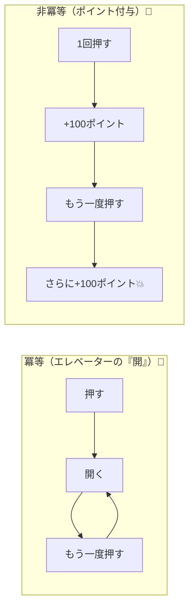
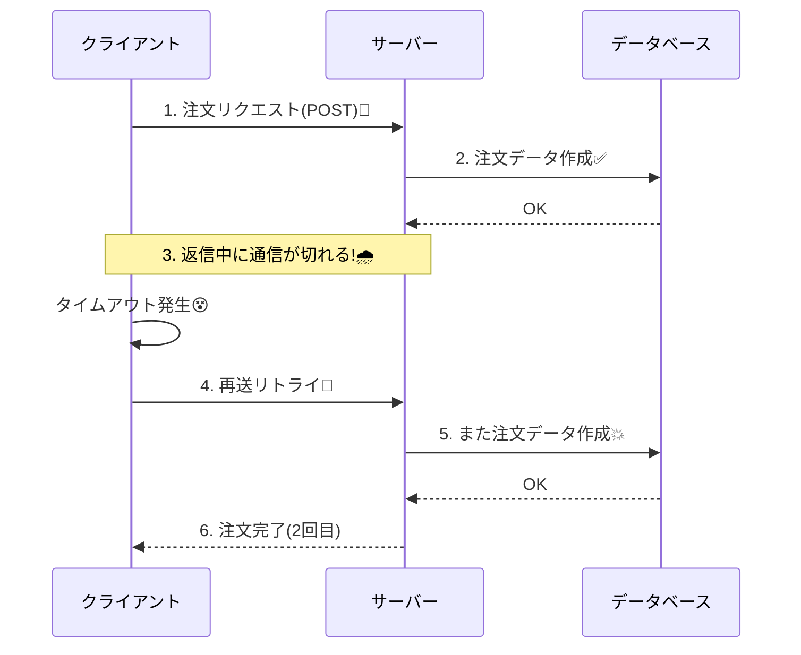
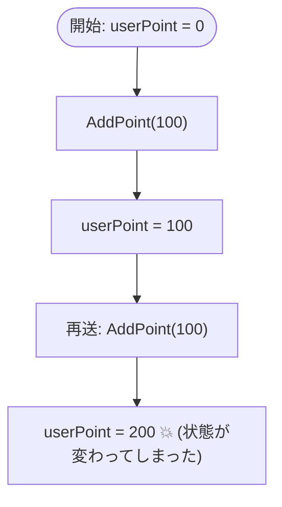

# 第01章：冪等性ってなに？まずは超ざっくり掴む🔁


## 1) まず一言でいうと…🌸

**冪等性（Idempotency）**って、超ざっくり言うと👇
**「同じお願い（同じリクエスト）が何回きても、結果が壊れないようにする性質」**です😊✨

* 1回でも10回でも、**最終的に“同じ状態”に落ち着く**のが理想💡
* とくにWeb/APIの世界では「再送（リトライ）」が普通に起きるので、めちゃ大事になります📶⏳

📌ちなみにHTTPの標準（RFC 9110）でも、**同じリクエストを繰り返しても“効果が1回と同じ”**なものを「冪等」と扱います🧠🔁 ([RFCエディタ][1])

---

## 2) たとえ話で直感をつかもう🍰✨


冪等性は「連打」や「再送」に強い設計のことです💪🔁



### ✅ 例A：エレベーターの「開」ボタン🚪

* 1回押しても、10回押しても、**開くのは“開く”**（状態が同じ）
  → これ、冪等っぽい😊

### ❌ 例B：ポイント付与ボタン「+100」🎁

* 1回押す → +100
* 10回押す → +1000 💥
  → これ、冪等じゃない😭（連打で壊れる代表）

---

## 3) 「壊れる」って具体的に何が起きるの？💥😵‍💫

冪等性がないと、こういう事故が起きます👇（現場あるある🥹）

* **多重課金**💳💳💳（同じ決済が2回通る）
* **二重予約**📅📅（同じ席が2人に確保される）
* **在庫マイナス**📦➖（出庫処理が2回走る）
* **メール二重送信**📧📧（「登録完了」が2通届く）
* **ポイント二重付与**🎁🎁（ユーザー歓喜→運営青ざめる😇）

---

## 4) 「同じリクエストが2回くる」って、なんで起きるの？📶⌛

ポイントはこれ👇
**ネットワークやアプリは、成功しても“成功って伝わらない”ことがある**んです🌧️

よくある流れ（超リアル）👇

1. クライアント（ブラウザ/アプリ）がPOST送る📨
2. サーバー側は処理成功✅（注文作成できた！）
3. でも途中でタイムアウト/通信切れで、クライアントは失敗だと思う😵
4. クライアントが再送（リトライ）🔁
5. サーバーが同じ処理をもう1回…💥（二重注文）



イメージ図🍀

* 1回目：✅ 成功（ただし返事が届かなかった）
* 2回目：🔁 再送
* 結果：😇「同じ注文が2回作られた」

---

## 5) “冪等”の判定はここを見る👀🔍

初心者がまず見るポイントはこれだけでOKです😊

### ✅ 冪等っぽい（安全寄り）✨

* 「**この状態にする**」🧊（指定状態に落ち着く）

  * 例：プロフィールを「この内容で上書きする」
  * 例：在庫を「残り10に設定する」

### ❌ 冪等じゃない（危険寄り）💣

* 「**増やす/減らす/追加する/送る**」📈📉📩

  * 例：ポイントを加算する
  * 例：注文を追加する
  * 例：メールを送る（送信自体が副作用）

---

## 6) ミニ体験：冪等じゃない処理ってこう壊れる🔁💥（C#イメージ）

「連打で増える」タイプは、冪等じゃない代表です😵‍💫
（ここでは“わざと危ない例”です⚠️）

```csharp
// イメージ用（超ざっくり）
// 「ポイントを増やす」処理は、同じリクエストが2回来たら2回増えちゃう…！

int userPoint = 0;

void AddPoint(int amount)
{
    userPoint += amount; // ←副作用（状態が変わる）
}

// 例：同じ操作が2回実行されたら…？
AddPoint(100);

Console.WriteLine(userPoint); // 200 😇（本当は100にしたかったのに）
```



この時点での理解はこれでOKです✅

* **同じ操作が2回走ったら、結果が増える/変わる** → 冪等じゃない💥
* **同じ操作が2回走っても、最終状態が同じ** → 冪等っぽい✨

---

## 7) ミニ演習📝✨（5分）

### 演習①：ボタン連打で起きる事故を3つ書こう🔁💥

例の型👇（この型で3つ！）

* 「〇〇ボタンを連打 → △△が二重に発生 → 結果××で困る😭」

（例）

* 決済ボタン連打 → 二重課金 → 返金対応地獄💳🔥

### 演習②：「冪等っぽい / 冪等じゃない」を仕分けよう🧠

次を **安全寄り✨ / 危険寄り💣** に分けてみてね👇

* A：メールを送る📧
* B：プロフィールを上書きする👤
* C：在庫を1減らす📦➖
* D：在庫を10に設定する📦=10

---

## 8) 小テスト🎓🌸（答えは下にあるよ👇）

**Q1.** 「同じリクエストが2回くる」原因としてありがちなのは？📶
A. サーバーが絶対に速いから
B. タイムアウトや通信切れで成功が伝わらないから
C. 画面がかわいいから

**Q2.** 冪等じゃない処理に多い動詞はどれ？💣
A. 上書きする
B. 設定する
C. 追加する

**Q3.** 「ポイント+100」は冪等？🔁
A. はい
B. いいえ

---

## 9) AI活用🤖✨（コピペでOK）

開発にAIが使える前提なら、こういう使い方が強いです💪🌸

* 事故例を出してもらう🎯

  * 「二重送信で起きる事故例を、EC/予約/決済で各3つ。初心者向けに！」
* 自分の処理が“冪等っぽいか”診断してもらう🔍

  * 「この処理は冪等ですか？同じ入力が2回来たとき、状態はどう変わりますか？」
* “危険な動詞”を見つけてもらう💣

  * 「このコードの副作用ポイント（増やす/減らす/追加/送信）を列挙して、危険度もつけて」

---

## 10) まとめ🎀

* 冪等性＝**同じ要求が何回きても壊れない**🔁✨
* 壊れる事故は **二重課金/二重予約/在庫崩壊** など💥
* まずは「増やす/追加する/送る」が危険、 「上書き/指定状態」は安全寄り🧠🌸

---

## 小テストの答え✅

* **Q1：B**（成功してても返事が届かない→再送が起きる📶⌛）
* **Q2：C**（追加・加算は連打に弱い💣）
* **Q3：B**（2回実行されたら200になっちゃう😇）

📌補足：2026年1月時点では、C#の最新は **C# 14** で、**.NET 10** 上でサポートされます🔁✨（Visual Studio 2026にも同梱） ([Microsoft Learn][2])

[1]: https://www.rfc-editor.org/rfc/rfc9110.html?utm_source=chatgpt.com "RFC 9110: HTTP Semantics"
[2]: https://learn.microsoft.com/en-us/dotnet/csharp/whats-new/csharp-14?utm_source=chatgpt.com "What's new in C# 14"
