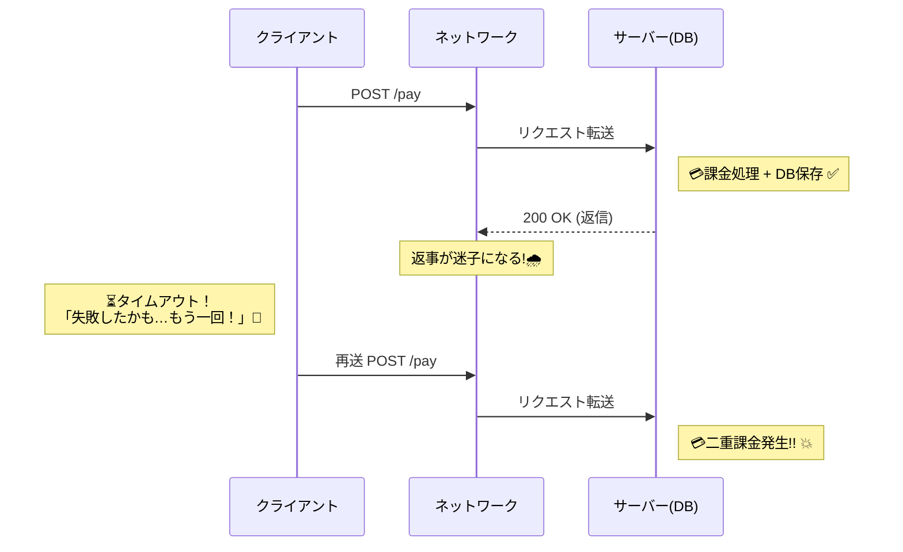

# 第02章：なぜ現代は冪等性が必須？（ネットは信用しない）🌧️


## この章のゴール🎯✨

* **「再送（リトライ）」は“例外”じゃなくて“日常”**だと腹落ちする😇
* **タイムアウト＝失敗じゃない**（成功してるのに、失敗っぽく見える）を説明できる🎤
* だからこそ **冪等性が必要になる理由**を、事故の流れで理解する💥

---

# 1) まず結論：ネットは“たまに嘘つく”📶😵

現代のアプリは、通信の途中に「失敗っぽいイベント」がめちゃくちゃ起きます。

* 電波が弱い／地下鉄／エレベーター🚇📵
* Wi-Fiが一瞬切れる（カフェあるある）☕📡
* サーバーが混んでて返事が遅い🐢
* 途中の仕組み（プロキシ・ゲートウェイ等）が返事を落とす🧱

こういう時、**「もう一回送るね！」（リトライ）**が、ユーザー操作でも自動でも発生します。
そして、**冪等性がないと“同じ処理が2回走る”**のが最悪パターンです💣

---

# 2) 「タイムアウト＝失敗じゃない」ってどういうこと？⏳❌→✅

タイムアウトは、ざっくり言うと **「返事が時間内に帰ってこなかった」**だけ。
**サーバー側で処理が完了してる可能性**が普通にあります😇

## 事故が起きる王道ストーリー💥（超重要）



ポイントはここ👇

* クライアントは「失敗した」と思い込む（返事がないから）
* でもサーバーは「成功してる」かもしれない
* その状態で再送されると、**二重課金・二重注文・二重予約**が起きる💸💥

この“成功してるか不明”な状態を、よく **「結果が不確実（ambiguous）」**って呼びます。
HTTPの仕様でも、失敗時に再試行が起こりうる前提で語られています。 ([RFCエディタ][1])

---

# 3) リトライ（再送）はどこで起きるの？🧩🔁

「ユーザーが連打した時だけ」じゃありません。むしろ **いろんな層が勝手に頑張る**ので、重なります😵‍💫

## A. ユーザー操作の再送👆👆

* ボタン連打（支払い・保存ボタンあるある）🖱️💥
* 画面が固まったと思って更新🔄
* アプリが「通信失敗→もう一回」で自動再送📱

## B. クライアント側の自動リトライ🤖

.NETでも「一時的な失敗（transient error）」に備えて **リトライを組み込む**のが一般的です。
たとえば `HttpClient` 周りは、回復性のための仕組み（リトライ等）を組み合わせる例が公式にもあります。 ([Microsoft Learn][2])

さらに、クラウド設計ガイドでも「一時的障害は起きるから、適切なリトライ戦略を持とう」という流れが定番です。 ([Microsoft Learn][3])

## C. 通信の途中（中継）の世界でも起きる🧱🌐

HTTPの世界では、状況次第で **同じリクエストが再送される**のは想定内です。
「安全だと分かっているなら POST を自動で再試行してもよい」みたいな話も出てきます（設計や設定によって）。 ([tex2e.github.io][4])

## D. gRPCみたいなRPCでも起きる📞🔁

gRPCには「透明なリトライ（安全が確実な時だけ）」があったり、ポリシーを設定するとより積極的に再試行できます。
そして “ヘッジング” だと **同じ要求を複数に投げる**ことすらあります（最初に返ってきたのを採用）。 ([gRPC][5])

つまり結論：
**「1回送ったつもり」が、現実では2回以上届く可能性がある**😇🔁

---

# 4) ミニ実験：同じPOSTを2回送ったら、2回増える😵‍💫🧪

「痛みで覚える」やつです💥
まずは **冪等性ゼロ**の例を見ます。

## 4-1) 超ミニAPI（わざと危険）🧨

```csharp
using System.Collections.Concurrent;

var builder = WebApplication.CreateBuilder(args);
var app = builder.Build();

// ざっくり「注文」が溜まっていく（DBのつもり）
var orders = new ConcurrentBag<string>();

app.MapPost("/orders", () =>
{
    // 本当は「注文作成 + 決済 + メール送信」みたいな副作用が入る想定🥶
    var id = Guid.NewGuid().ToString("N");
    orders.Add(id);

    return Results.Ok(new
    {
        orderId = id,
        totalOrders = orders.Count
    });
});

app.Run();
```

## 4-2) 2回叩いてみる🔁🔁

PowerShellでも `curl` でも、RESTクライアントでもOK。

```bash
curl -X POST http://localhost:5000/orders
curl -X POST http://localhost:5000/orders
```

結果の `totalOrders` が **1 → 2** って増えたら成功（＝事故）💥
この状態でタイムアウト再送が混ざると、**勝手に2回注文**みたいなことが起きます😵

---

# 5) この章のまとめ🔖✨

* タイムアウトは **「返事が遅かった」だけ**で、成功してる可能性がある⏳✅
* 回復性のために **リトライは各所で起こる**（ユーザー・クライアント・中継・RPC）🔁
* だから **「同じ要求が複数回届く」前提で設計する＝冪等性が必須**💣➡️🛡️

---

# ミニ演習📝🌸

## 演習1：「タイムアウト＝失敗じゃない」ケースを説明してみよう🎤

次の流れを、友だちに説明するつもりで2〜3行で書いてね😊

* 「支払いAPIを呼ぶ」
* 「タイムアウトした」
* 「もう一回押した」
* 「二重課金が起きた」

💡ヒント：**“成功してるのに返事が届かなかった”**を入れる！

## 演習2：あなたの経験から“再送が起きそうな場面”を3つ挙げる🔍

例：通信が不安定な場所、ボタン連打、アプリの自動再試行…など📱📶

---

# AI活用🤖✨（コピペで使える）

* 「タイムアウトで二重実行になる流れを、初心者向けに“図解っぽく”説明して」
* 「“成功してるか不明”な状態が起きるケースを、EC/予約/決済でそれぞれ3つ」
* 「このAPIが冪等性なしで危ない理由を、女子大生向けにやさしく説明して」

---

# 小テスト✅🎓

## Q1. タイムアウトが意味するものはどれ？

A. サーバーが必ず失敗した
B. 返事が時間内に返らなかっただけ（成功してる可能性もある）
C. ネットが必ず切断された

## Q2. 「同じ要求が2回届く」原因になり得るものは？（複数選択）

A. ユーザーの連打
B. クライアントの自動リトライ
C. 途中の仕組み（プロキシ等）
D. どれも起きない（安心！）

## Q3. 冪等性がないと起きやすい事故は？

A. 二重課金
B. 二重注文
C. 二重予約
D. 全部

## Q4. “回復性のためのリトライ”が増えると、冪等性の重要度は？

A. 下がる
B. 上がる

## Q5. gRPCの「ヘッジング」がやっていることに近いのは？

A. 同じ要求を複数に送って、早い返事を採用する
B. 1回送ったら絶対に再送しない

---

## 解答✅

Q1:B / Q2:A,B,C / Q3:D / Q4:B / Q5:A

[1]: https://www.rfc-editor.org/rfc/rfc9110.html?utm_source=chatgpt.com "RFC 9110: HTTP Semantics"
[2]: https://learn.microsoft.com/en-us/dotnet/fundamentals/networking/http/httpclient-guidelines?utm_source=chatgpt.com "Guidelines for using HttpClient"
[3]: https://learn.microsoft.com/en-us/azure/well-architected/design-guides/handle-transient-faults?utm_source=chatgpt.com "Recommendations for handling transient faults"
[4]: https://tex2e.github.io/rfc-translater/html/rfc9110.html?utm_source=chatgpt.com "HTTP Semantics (RFC 9110) 日本語訳"
[5]: https://grpc.io/docs/guides/retry/?utm_source=chatgpt.com "Retry"
