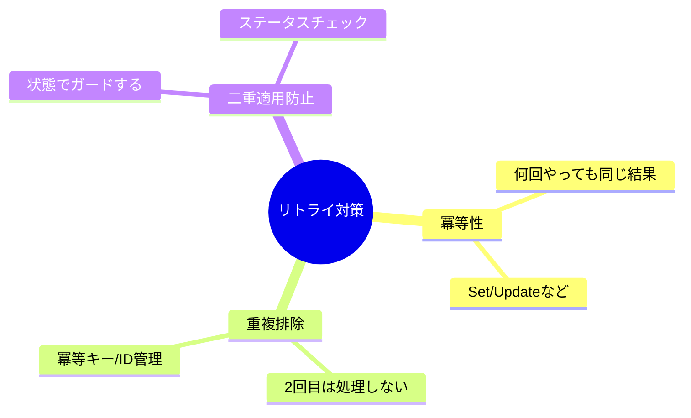
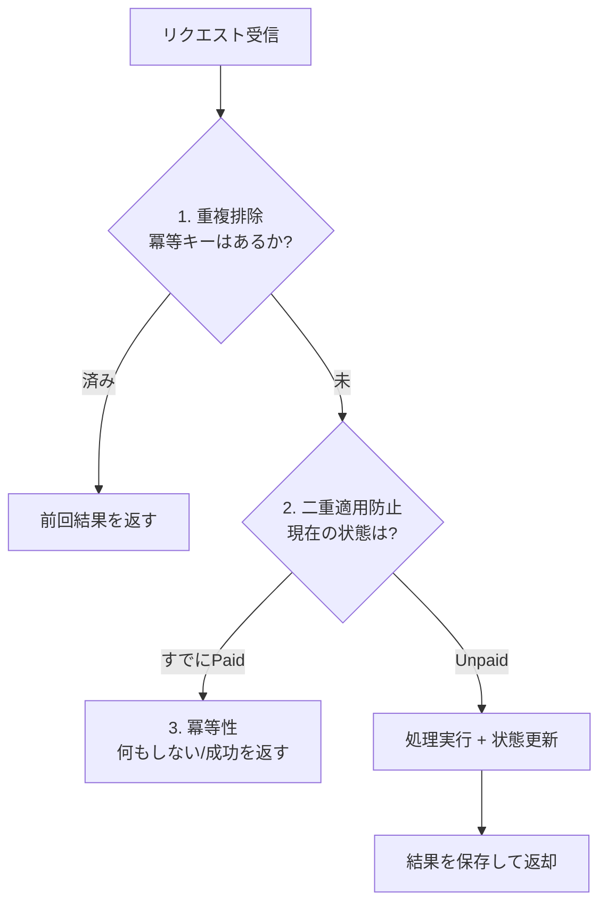

# 第03章：「冪等」っぽい言葉の整理（混ざると事故る）🧠


## この章でできるようになること🎯✨

* 「冪等性」「重複排除」「二重適用防止」を、**混ぜずに**説明できるようになる📣
* 「いま起きてる事故は、どの言葉の不足なのか」を判断できるようになる🔍
* 実装方針の会話で、ズレにくくなる（ここ超大事）🤝🌸

---

## まず結論：3つは“似てるけど役割が違う”🧩🔁

**同じリクエストが2回以上きたとき**をイメージしてね🧠✨

* **冪等性（Idempotency）**：何回やっても、最終結果が同じになる🔁✅
* **重複排除（Deduplication）**：同じものは1回しか処理しない🚫🔁
* **二重適用防止（Double-apply prevention）**：同じ処理を2回“適用”しないように状態で止める🚦🛡️

似てるけど、守ってる場所が違うよ〜！🌷



---

## 用語① 冪等性（Idempotency）ってなに？🔁✅

### 定義（やさしめ）📘

**同じ操作を何回繰り返しても、意図した最終状態（結果）が変わらないこと**だよ😊
HTTPの世界でも「同じリクエストを何回送っても、意図した効果が1回と同じなら冪等」って定義されてるの🌐✨ ([RFCエディタ][1])

### 例（直感でつかむ）🍰

* ✅ **冪等になりやすい**

  * 「住所をこの値に**更新**する」📮✍️（“上書き”）
  * 「注文ステータスを **Paid にする**」💳✅（“この状態にする”）
* ⚠️ **冪等になりにくい**

  * 「ポイントを **+10 する**」➕🎯（“加算”は増え続ける）
  * 「注文を **新規作成**する」🛒🆕（同じ操作で増えちゃう）

### 大事な注意（ここで混乱が起きる！）⚠️🌀

* 冪等＝「副作用ゼロ」じゃないよ😳
  ログが増える、監査記録が増える、アクセス回数が増える…みたいな“周辺の変化”はありえる。
  重要なのは **“意図した効果が同じ”** という点だよ📌 ([RFCエディタ][1])

---

## 用語② 重複排除（Deduplication）ってなに？🚫🔁

### 定義（やさしめ）📘

**同じ要求（同じIDのリクエスト）を、2回目以降は処理しない**ことだよ🧾✨
よくあるのが **Idempotency Key（冪等キー）** を使う方式🔑🎫

* クライアントがヘッダーなどで「このリクエストのID」を渡す
* サーバーが「このID、前に処理した？」を見て

  * 処理済みなら **前回の結果を返す**📮
  * 未処理なら **処理して結果を保存**🗃️

決済みたいな世界だと、冪等キーが強く推奨されてたり、キーの扱いルール（保持期間や、同じキーでパラメータが違うとエラー等）が書かれてるよ🧠💳 ([docs.stripe.com][2])

### 例（わかりやすい）🎮

* 「注文作成（POST）」は本来、同じものを2回投げると2件できがち🛒🛒💥
  → **冪等キーで重複排除**すると、2回目は“作らず”に前回結果を返せる📮✨

---

## 用語③ 二重適用防止（Double-apply prevention）ってなに？🚦🛡️

### 定義（やさしめ）📘

**同じ処理が2回走っても、状態（ステータス）を見て2回目の適用を止める**ことだよ😊

ポイントはここ👇

* 重複排除：**そもそも処理を2回走らせない**🚫
* 二重適用防止：処理が走っても、**2回目は状態で弾く**🚦

### 例（状態遷移で止める）📌

* 「支払い確定」💳✅

  * まだ未払い → Paid にする（OK）
  * すでに Paid → 何もしない（OK）
    この「すでにその状態なら止める」が二重適用防止の王道だよ👑✨



---

## 3つの違いを1枚で整理📋✨


| 用語     | 何を守る？🛡️      | 典型の手段🔧                     | ありがちな事故💥     |
| ------ | ------------- | --------------------------- | ------------- |
| 冪等性    | 最終結果が変わらない🔁✅ | “上書き”/“指定状態”設計（例：Set / PUT） | 加算・追加で増え続ける   |
| 重複排除   | 同じ要求は1回だけ🚫🔁 | 冪等キー、リクエストID、処理済み記録         | タイムアウト再送で二重作成 |
| 二重適用防止 | 同じ適用を2回しない🚦  | 状態遷移ガード、トランザクション            | 並行実行で2回適用される  |

---

## ここが混ざると事故る！よくある勘違い7選😵‍💫💥

1. **「POSTは冪等じゃない」＝絶対ムリ、ではない**
   → POSTでも冪等キーなどで“冪等っぽく”できる（でもHTTP仕様上“保証されない”のは事実）📌 ([MDN Web Docs][3])
2. **冪等＝「1回しか処理しない」ではない**
   → それは重複排除寄り🚫🔁
3. **重複排除＝「状態ガード」だと思ってる**
   → 似てるけど別。状態ガードは二重適用防止🚦
4. **冪等＝「副作用ゼロ」だと思ってる**
   → “意図した効果”が同じ、が本筋📌 ([RFCエディタ][1])
5. **「同じ入力なら同じ出力」＝冪等**（惜しい！）
   → 出力じゃなくて「サーバー側の意図した効果」が基準だよ🌐 ([RFCエディタ][1])
6. **「二重適用防止」だけで全部いける**
   → “同時に2つ来る”と、状態確認の瞬間が競合して負けることがある🏎️💥（後の章で倒す！）
7. **「キーがあれば全部OK」**
   → キーの保存・期限・同じキーでパラメータ違い…運用がある🧹⏳ ([docs.stripe.com][2])

---

## C#ミニ実験：3つの違いを“動き”で見る👀✨

### 1) まず「冪等じゃない」例：加算は増え続ける➕💥

```csharp
using System;
using System.Collections.Generic;

class Program
{
    static void Main()
    {
        var points = new Dictionary<string, int>();

        AddPoints(points, "user-1", 10);
        AddPoints(points, "user-1", 10); // 同じ処理をもう一回

        Console.WriteLine(points["user-1"]); // 20 になっちゃう😵‍💫
    }

    static void AddPoints(Dictionary<string, int> points, string userId, int amount)
    {
        points.TryGetValue(userId, out var current);
        points[userId] = current + amount;
    }
}
```

### 2) 「二重適用防止」例：状態を見て2回目を止める🚦✅

```csharp
using System;

public enum PaymentStatus { Unpaid, Paid }

public class Order
{
    public string Id { get; }
    public PaymentStatus Status { get; private set; } = PaymentStatus.Unpaid;

    public Order(string id) => Id = id;

    // 二重適用防止：すでにPaidなら何もしない
    public void MarkAsPaid()
    {
        if (Status == PaymentStatus.Paid) return; // 🚦ここがガード
        Status = PaymentStatus.Paid;
    }
}

class Program
{
    static void Main()
    {
        var order = new Order("order-1");

        order.MarkAsPaid();
        order.MarkAsPaid(); // もう一回きてもOK✨

        Console.WriteLine(order.Status); // Paid ✅
    }
}
```

### 3) 「重複排除」例：同じリクエストIDは1回しか処理しない🚫🔁

```csharp
using System;
using System.Collections.Generic;

public class Deduplicator
{
    private readonly HashSet<string> _processed = new();

    // true: 初回なので処理してOK / false: 2回目以降なので処理しない
    public bool TryBegin(string requestId) => _processed.Add(requestId);
}

class Program
{
    static void Main()
    {
        var dedup = new Deduplicator();

        var requestId = "req-123";

        if (dedup.TryBegin(requestId))
            Console.WriteLine("処理するよ✅");
        else
            Console.WriteLine("重複だから処理しないよ🚫");

        if (dedup.TryBegin(requestId))
            Console.WriteLine("処理するよ✅");
        else
            Console.WriteLine("重複だから処理しないよ🚫");
    }
}
```

---

## ミニ演習✍️🌸（答えは下に例つき）

### 演習1📝

次の操作は「冪等」？「冪等じゃない」？理由も1行で😊

1. `SetNickname("mikan")`
2. `AddNicknameHistory("mikan")`
3. `DeleteUser("u-1")`

### 演習2🧠

「注文作成API」で二重送信が来たとき、あなたなら

* 重複排除（冪等キー）
* 二重適用防止（状態ガード）
  どっちを先に考える？一言で理由も✨

### 演習3🔍

「冪等性」「重複排除」「二重適用防止」を、それぞれ**1行のたとえ話**で書いてみよう🍓

---

## 演習の答え例（チェック用）✅✨

### 演習1の例

1. 冪等✅：同じニックネームに上書きするだけ
2. 冪等じゃない⚠️：履歴が増える（追加＝増殖）
3. 冪等寄り✅：削除済みをもう一回削除しても“意図した効果”は同じ（ただし実装次第） ([RFCエディタ][1])

### 演習2の例

* まず重複排除（冪等キー）🔑：**「作成」系は増える**から、2回目を作らせないのが効きやすい🛒🚫

### 演習3の例

* 冪等性：何回押しても“最終状態”が同じボタン🔁✅
* 重複排除：同じ整理券は1回しか使えない🎫🚫
* 二重適用防止：すでに到着済みなら改札を通さない🚦🚉

---

## 小テスト（5問）🧪✨

### Q1

「同じ操作を2回しても最終結果が同じ」はどれ？
A. 重複排除　B. 冪等性　C. 二重適用防止

### Q2

「同じ requestId は2回目以降処理しない」はどれ？
A. 重複排除　B. 冪等性　C. 安全性

### Q3

`AddPoints(+10)` が危ない理由は？
A. CPUが熱い　B. 加算で増え続ける　C. 文字列だから

### Q4

HTTPで冪等なメソッドとして扱われる代表は？
A. POST　B. PUT　C. PATCH ([MDN Web Docs][3])

### Q5

「冪等＝副作用ゼロ」は？
A. 正しい　B. 間違い ([RFCエディタ][1])

---

## 小テスト解答✅

* Q1：B
* Q2：A
* Q3：B
* Q4：B
* Q5：B

---

## AI活用🤖✨（Copilot / Codex に投げると強いプロンプト集）

* 「冪等性・重複排除・二重適用防止を、注文APIの例でそれぞれ3パターンずつ説明して」🛒🔁
* 「この処理は“冪等”ですか？“重複排除”が必要ですか？理由も1行で」🔍
* 「AddPoints を冪等に寄せる設計案を2つ出して（上書き型・状態型）」➕➡️✅
* 「状態遷移ガードの実装で、抜けがちな条件を列挙して」🚦
* 「リトライ/タイムアウトで二重実行になる流れを、会話形式でやさしく説明して」📶⌛
* 「“同じキーでパラメータが違う”問題が起きる例と対策を出して」🔑⚠️ ([docs.stripe.com][2])

[1]: https://www.rfc-editor.org/rfc/rfc9110.html?utm_source=chatgpt.com "RFC 9110: HTTP Semantics"
[2]: https://docs.stripe.com/api/idempotent_requests?utm_source=chatgpt.com "Idempotent requests | Stripe API Reference"
[3]: https://developer.mozilla.org/en-US/docs/Glossary/Idempotent?utm_source=chatgpt.com "Idempotent - Glossary - MDN Web Docs - Mozilla"
