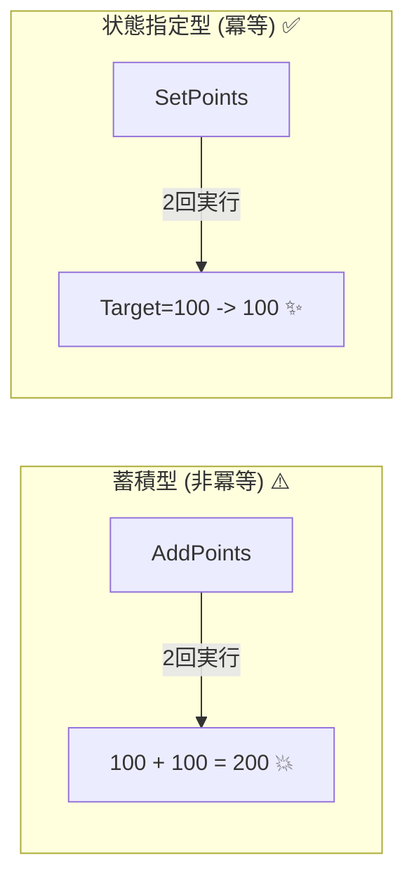

# 第04章：副作用ってなに？（冪等性の敵）💣


## この章のゴール🎯

この章が終わったら、こんなことができるようになります😊✨

* 「副作用って結局なに？」を、**自分の言葉で説明**できる🗣️
* コードやAPIを見て、**副作用ポイントを嗅ぎ分け**られる👃🔍
* 「同じリクエストがもう1回来たら…？」を想像して、**事故りそうな場所**を見つけられる🚨💥

---

## 4.1 副作用ってなに？（1行で）🧠

**副作用（side effect）**は、ざっくり言うと👇

> **処理の結果が「戻り値」だけじゃなくて、外の世界（状態）まで変えちゃうこと**🌍🔧

たとえば…👀

* DBのレコードを追加・更新する🗃️✍️
* 在庫を減らす📦⬇️
* メールを送る📧➡️
* 決済を走らせる💳⚡
* ファイルを書き込む🗂️🖊️
* キューにメッセージを投げる📬🌀

こういうの、ぜんぶ副作用の仲間です🙋‍♀️

---

## 4.2 なんで副作用が「冪等性の敵」なの？😵‍💫

冪等性って「同じ操作を何回やっても、結果が同じ」でしたよね🔁✨
でも副作用があると、同じ操作を繰り返したときに…

* 1回目：課金💳✅
* 2回目：また課金💳✅✅（えっ…）
* 3回目：さらに課金💳✅✅✅（地獄）

みたいに、**“積み上がる”事故**が起きがちです💥💥💥

つまり副作用は悪者というより、
**「繰り返しに弱い爆弾になりやすい」**って感じです💣😇

---

## 4.3 「増やす/追加する」は危険、「指定状態にする」は安全寄り🆚✨


副作用の中でも、特に事故りやすいのがこのパターン👇

### 危険寄り（積み上がる）⚠️

* `Add` / `Increment` / `Append` / `Create` / `Charge`
* 例：ポイントを**加算**する、注文を**新規作成**する、メールを**送信**する📧

同じ操作が2回来たら、だいたい2回分の結果になります😵‍💫

### 安全寄り（指定状態にする）✅

* `Set` / `Replace` / `Upsert` / `Put`っぽい発想
* 例：ポイントを「**100にする**」みたいに“目標状態”を指定する🎯

同じ操作が2回来ても、状態が同じになりやすいです😊



---

## 4.4 C#で「副作用あり/なし」を体感しよう🧪✨

### 例1：副作用なしに近い（計算だけ）➕

```csharp
int CalcTotalPrice(int unitPrice, int count)
{
    return unitPrice * count; // 外の状態は変えない😊
}
```

これは何回呼んでも、同じ引数なら同じ結果です🔁✅
（超冪等っぽい！）

---

### 例2：副作用あり（加算は危険）💥

```csharp
async Task AddPointsAsync(Guid userId, int add)
{
    var user = await _db.Users.FindAsync(userId);
    user.Points += add;               // 状態が「増える」⬆️
    await _db.SaveChangesAsync();     // DBに反映🗃️
}
```

同じリクエストが2回来たら…
ポイントが2回分増えます😵‍💫💥

---

### 例3：副作用はあるけど「指定状態」だから冪等に寄せやすい✨

```csharp
async Task SetPointsAsync(Guid userId, int target)
{
    var user = await _db.Users.FindAsync(userId);
    user.Points = target;             // 目標状態にする🎯
    await _db.SaveChangesAsync();
}
```

同じ `target=100` が2回来ても、結果はずっと100です🔁✅
（※DB更新は副作用だけど、“積み上がらない”のがポイント！）

---

## 4.5 Web APIだと、HTTPメソッドの性格と副作用が関係する🌐🔁

HTTPには「安全（safe）」と「冪等（idempotent）」の考え方があります📚✨

* **安全（safe）**：サーバー状態を変えることを“意図してない”メソッド
  → `GET/HEAD/OPTIONS/TRACE` が安全と定義されています。([RFCエディタ][1])
* **冪等（idempotent）**：同じリクエストを何回しても、意図した効果が同じ
  → 安全メソッドに加えて `PUT` と `DELETE` は冪等とされています。([RFCエディタ][1])

ただしここ、超大事ポイント💡
**「安全」＝「副作用ゼロ」ではありません**🙅‍♀️
たとえばログ記録みたいな副作用は普通に起きます（仕様でもそういうニュアンスが書かれてます）。([tex2e.github.io][2])

そして実務の設計ガイドでも、
`GET/PUT/DELETE`（状況により `PATCH` も）は、**繰り返しても同じ状態になるよう実装しよう**とされています。([Microsoft Learn][3])

---

## 4.6 「副作用センサー」チェックリスト✅👀

コードやAPIを見たら、ここを見ます🔍✨
YESが多いほど「冪等性の敵」になりやすいです💣

### A. 状態が変わる？🧊➡️🔥

* DBの `INSERT/UPDATE/DELETE` がある？🗃️
* コレクションに `Add` / `Remove` してる？➕➖
* カウンタを `++` / `+=` してる？🔢⬆️

### B. 外部に出ていく？🌍➡️🌍

* メール/通知/Pushを送る？📧📱
* 決済/在庫/配送など“現実世界”を動かす？💳📦🚚
* 外部APIを呼ぶ？🤝🌐

### C. 「1回だけ」を期待してない？🎯

* 「これ1回しか来ないよね？」前提の処理になってない？😇
* リトライ・二重送信が来たらどうなる？🔁📶

---

## 4.7 ミニ演習📝🔍（手を動かす）

### 演習1：副作用ハンティング🕵️‍♀️

自分の過去コード（または今作ってるAPI）から、以下を3つ探してメモしてみよう✍️✨

* 「増やす/追加する」系の処理（`+=`, `Add`, `Create` など）を1つ
* 外部I/O（メール、外部API、ファイル、キューなど）を1つ
* 「指定状態にする」系（`=`で目標状態にする、Upsertっぽい）を1つ

それぞれに「同じリクエストが2回来たらどうなる？」を1行で書く🔁📝

---

### 演習2：「増やす」を「指定状態」に寄せる🧠✨

次のどれかを選んで、設計を言い換えてみよう💡

* `AddPoint(userId, +10)` → ？？？（目標状態にできる？）
* `CreateOrder()` → ？？？（注文IDを指定できる？）
* `SendWelcomeEmail()` → ？？？（“送ったかどうか”を記録して制御できる？）

この章では“完全実装”じゃなくてOK🙆‍♀️
まずは「指定状態の発想」に慣れるのが目的だよ😊🌸

---

## 4.8 AI活用（Copilot/Codex）🤖✨

副作用って、慣れるまで見落としやすいのでAIに“ツッコミ役”してもらうのが強いです💪😆

### 使えるプロンプト例🪄

* 「このメソッドの副作用を列挙して。冪等性の観点で危険度もつけて」
* 「このAPIが二重送信されたときに起きる事故を、具体例で3つ出して」
* 「`Add` している処理を ‘指定状態にする’ 設計に変換する案を2つ出して」
* 「外部API呼び出しがある。タイムアウト→リトライで二重実行になる流れを図解っぽく説明して」

---

## 4.9 小テスト📝🎓（解答つき）

### Q1 ✅/❌

`Points += 10` は、副作用になりやすい。
**答え：✅**（状態が増える＝繰り返しで積み上がる）

### Q2 ✅/❌

DBに保存する処理はすべて「冪等にできない」。
**答え：❌**（`Set` みたいに目標状態なら冪等に寄せやすい✨）

### Q3 ✅/❌

「安全（safe）」なHTTPメソッドは、副作用が絶対に起きない。
**答え：❌**（ログなど副作用は起きうる。安全は“意図された副作用がない”のニュアンス。([tex2e.github.io][2])）

### Q4 ✅/❌

同じ `PUT` を何回送っても同じ状態になるべき、というのは一般的な設計ガイドに書かれている。
**答え：✅**([Microsoft Learn][4])

### Q5（1行で）✍️

「副作用は悪い」ではなく「副作用が〇〇だと危険」
**答え例：**「**積み上がる**副作用だと危険」💥

---

## まとめ🎁✨

* 副作用＝**外の世界（状態）を変えること**🌍
* 冪等性の敵になりやすいのは、特に **“増やす/追加する”系**💣
* **“指定状態にする”発想**に寄せると、繰り返しに強くなる🎯✅
* Web APIではHTTPの性格（safe / idempotent）も意識すると設計しやすい🌐🔁([RFCエディタ][1])

[1]: https://www.rfc-editor.org/rfc/rfc9110.html?utm_source=chatgpt.com "RFC 9110: HTTP Semantics"
[2]: https://tex2e.github.io/rfc-translater/html/rfc9110.html?utm_source=chatgpt.com "HTTP Semantics (RFC 9110) 日本語訳"
[3]: https://learn.microsoft.com/en-us/azure/architecture/best-practices/api-implementation?utm_source=chatgpt.com "Web API Implementation - Azure Architecture Center"
[4]: https://learn.microsoft.com/en-us/azure/architecture/best-practices/api-design?utm_source=chatgpt.com "Best practices for RESTful web API design - Azure"
