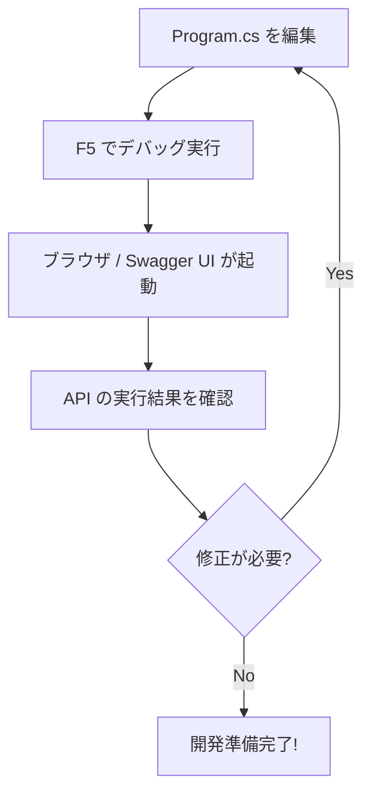
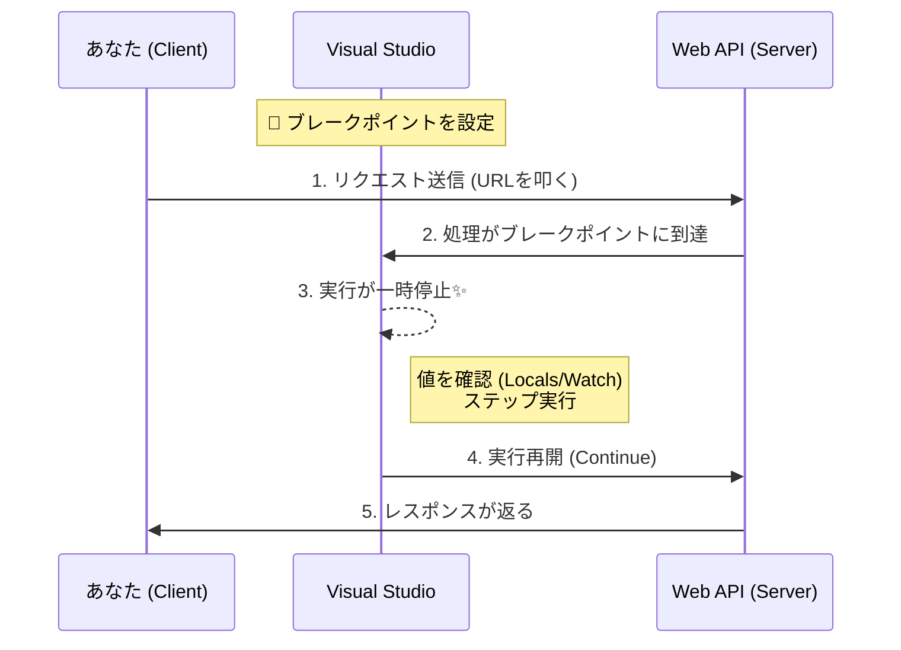

# 第05章：開発環境セットアップ（Windows＋VS）🪟🛠️


## この章のゴール🎯

* C#で **Web API をローカルで動かせる** ようになる✨
* **ブレークポイントで止めて**、リクエストが来た瞬間の中身を見られる👀🔍
* **APIを1個作って動作確認**（ブラウザ or Swagger/Scalar UI でOK）✅

---

# 5-1. まず「最新版」の基準をそろえる📌✨

## .NET（SDK）はどれ使う？🤔

* **.NET 10（LTS）** が安定枠でおすすめ🌿（SDK 10.0.102 / 2026-01-13 リリース）([Microsoft][1])
* 参考：**.NET 9（STS）** は短めサポートの「新しめ枠」だよ（SDK 9.0.310 / 2026-01-20 リリース）([Microsoft][1])

> 冪等性の教材は「長く使える土台」が大事なので、ここでは **.NET 10（LTS）** で進めるのが気持ちいいよ〜🔁🧱

## Visual Studio（VS）は？🧩

* **Visual Studio 2026** のリリースノートが公開されていて、最新版として扱えるよ🆕([Microsoft Learn][2])

---

# 5-2. Visual Studio 2026 で Web API プロジェクトを作る🛠️✨

## ① インストール（必要なWorkload）📦

Visual Studio Installer で、だいたいこれを入れるとOK👇

* **ASP.NET and web development**（Web API 作るのに必須）🌐
* （余裕があれば）**.NET desktop development**（デバッグや周辺が便利）🧰

※ VS のインストール中に .NET SDK も一緒に入ることが多いよ👌

---

# 5-3. 新規プロジェクト作成（最短ルート）🚀

## ① VS起動 → 新規作成

* 「新しいプロジェクトの作成」→ **ASP.NET Core Web API** を選ぶ🌟

## ② 設定のおすすめ（ここ重要！）✅

* ターゲット（Framework）：**.NET 10.0** を選ぶ🟣([Microsoft][1])
* HTTPS：ON（ローカルでもHTTPSで練習できる🔒）
* OpenAPI：ON（APIの見た目確認が楽になる✨）([Microsoft Learn][3])

> 補足：最近のテンプレは「最小限の API（Minimal APIs）」がデフォルトになりやすいよ（`dotnet new webapi` も基本は Minimal APIs を作る）([Microsoft Learn][4])

---

# 5-4. 動かしてみる（F5でOK）▶️🟢

## ① 起動

* 上の ▶️（https） を選んで **F5**（デバッグ実行）
* 起動したらブラウザが開いて、何か表示されたら成功🎉

* 起動したらブラウザが開いて、何か表示されたら成功🎉



## ② API確認の定番：OpenAPI/Swagger/Scalar どれ？🤹‍♀️

今どきはここがちょい分岐するよ👇

* **Swagger UI（Swashbuckle系）**

  * 「昔からの定番」。テンプレに最初から入ってることが多い📘
  * `UseSwagger()` / `UseSwaggerUI()` が見えたらそれ🌈([Microsoft Learn][3])

* **Scalar（OpenAPIの対話UI）**

  * .NET 10 の OpenAPI と組み合わせて使える、最近の選択肢✨
  * 公式ドキュメントでも案内されてるよ🆕([Microsoft Learn][5])

> どっちでもOK！この章のゴールは「APIが叩けて、レスポンスが見える」ことだよ📮✅

---

# 5-5. 最低限のエンドポイントを1個足す（動く手応え💓）

`Program.cs` に「疎通用のGET」を足すと、あとが楽〜🌟

```csharp
app.MapGet("/ping", () => Results.Ok(new { ok = true, at = DateTimeOffset.Now }));
```

## 確認方法（どれでもOK）✅

* ブラウザで `https://localhost:xxxx/ping` を開く🌐
* Swagger/Scalar の画面から `GET /ping` を実行する🧪
* （あとでやる）curl や HTTP ファイルから叩く📮

---

# 5-6. デバッグ入門（ブレークポイントが正義）🧠🔍

## ① ブレークポイントを置く

* `MapGet("/ping"...` の行の左側をクリックして赤丸🔴

## ② もう一回叩く

* `/ping` を叩く → VSが止まる✨
* 見る場所はここ👇

  * **Locals（ローカル変数）**：今の値が見える
  * **Call Stack**：どこから来たか分かる
  * **Watch**：気になる式を監視できる👀

> 冪等性の勉強は「2回リクエストが来たとき、中で何が起きた？」を追うのが超大事🔁🔥
> だからデバッグに慣れると勝ち確だよ〜🏆



---

# 5-7. VS Code + dotnet CLI 版（軽くやりたい人向け）🪶✨

## ① プロジェクト作成

```powershell
mkdir IdempotencyPlayground
cd IdempotencyPlayground
dotnet new webapi
```

> `dotnet new webapi` は、基本的に **Minimal APIs の Web API** を作るよ（オプションで切替もできる）([Microsoft Learn][4])

## ② 実行

```powershell
dotnet run
```

## ③ 叩く（例）

```powershell
curl -k https://localhost:5001/ping
```

---

# 5-8. よくある詰まりポイント集（ここだけ見れば助かる🧯）😵‍💫

## HTTPS証明書でコケる🔒💥

* ありがち症状：ブラウザが「安全ではありません」みたいに言う
* 対策の定番（CLIの場合）：

```powershell
dotnet dev-certs https --trust
```

## ポートが競合する🚪💥

* ありがち症状：起動時に「既に使用されています」
* 対策：別アプリを閉じる／起動ポートを変える（`launchSettings.json` など）

## Swagger/Scalar が見つからない🤔

* テンプレや設定で **OpenAPIがOFF** になってることがある
* 公式の OpenAPI ドキュメント生成・利用手順のページが最新だよ📚([Microsoft Learn][3])

---

# 5-9. ミニ演習（10分）⏱️📝

## 演習A：疎通確認✅

1. `GET /ping` を追加
2. ブラウザ or Swagger/Scalar で叩く
3. `ok:true` が返ってくるのを確認🎉

## 演習B：デバッグ体験🔴

1. `/ping` にブレークポイント
2. 叩いて止まる
3. `DateTimeOffset.Now` が毎回変わるのを観察👀

---

# 5-10. 小テスト（答えは自分の言葉でOK）🧠✨

1. Web API を作るテンプレとして選んだのは何？
2. F5 実行と Ctrl+F5 実行の「体感の違い」は？（デバッグできた？）
3. `/ping` を2回叩いたとき、何が同じで、何が変わった？🔁

---

# 5-11. AI活用（Copilot/Codex）おすすめの使い方🤖💞

## 使うと爆速になるプロンプト例🪄

* 「`/ping` を追加して、現在時刻も返して。Minimal API で。」
* 「OpenAPI の画面で `GET /ping` が見えるように、設定も含めて修正して」([Microsoft Learn][3])
* 「ブレークポイントで止める位置と、観察ポイント（Locals/Watch/Call Stack）をコメントで入れて」

## AIに任せきりにしないコツ🧷

* 生成されたコードは **“どこが入口で、どこが出口か”** だけは必ず目で追う👀
* 冪等性は「2回目の動き」が本体なので、**ログや保存処理の場所**を説明できる状態にするのが大事🔁🧠

---

## 参考（この章の内容に直結する公式ページ）📚✨

* .NET 9 / .NET 10 の最新SDK情報（リリース日つき）([Microsoft][1])
* ASP.NET Core の Minimal API チュートリアル（.NET 10 表示あり）([Microsoft Learn][6])
* `dotnet new webapi` テンプレの挙動（Minimal API が基本）([Microsoft Learn][4])
* ASP.NET Core の OpenAPI（生成・利用、Scalar など）([Microsoft Learn][3])

[1]: https://dotnet.microsoft.com/en-us/download?utm_source=chatgpt.com "Download .NET (Linux, macOS, and Windows) | .NET"
[2]: https://learn.microsoft.com/en-us/visualstudio/releases/2026/release-notes?utm_source=chatgpt.com "Visual Studio 2026 Release Notes"
[3]: https://learn.microsoft.com/ja-jp/aspnet/core/fundamentals/openapi/aspnetcore-openapi?view=aspnetcore-10.0&utm_source=chatgpt.com "OpenAPI ドキュメントを生成する - ASP.NET Core"
[4]: https://learn.microsoft.com/ja-jp/dotnet/core/tools/dotnet-new-sdk-templates?utm_source=chatgpt.com "'dotnet new' の .NET の既定のテンプレート - .NET CLI"
[5]: https://learn.microsoft.com/ja-jp/aspnet/core/fundamentals/openapi/using-openapi-documents?view=aspnetcore-10.0&utm_source=chatgpt.com "生成された OpenAPI ドキュメントを使用する"
[6]: https://learn.microsoft.com/en-us/aspnet/core/tutorials/min-web-api?view=aspnetcore-10.0&utm_source=chatgpt.com "Tutorial: Create a Minimal API with ASP.NET Core"
