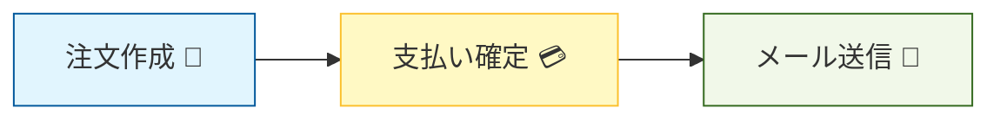
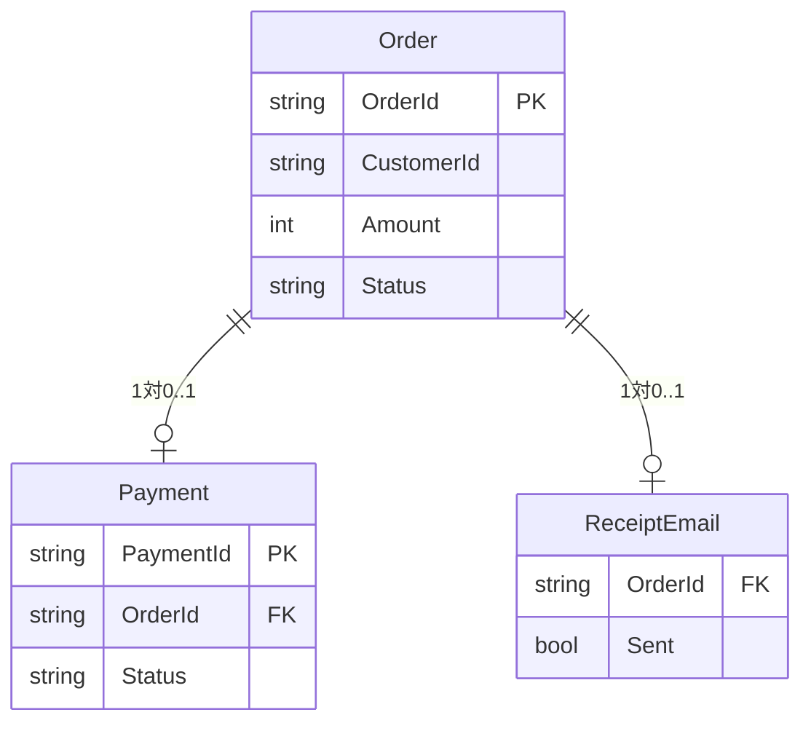
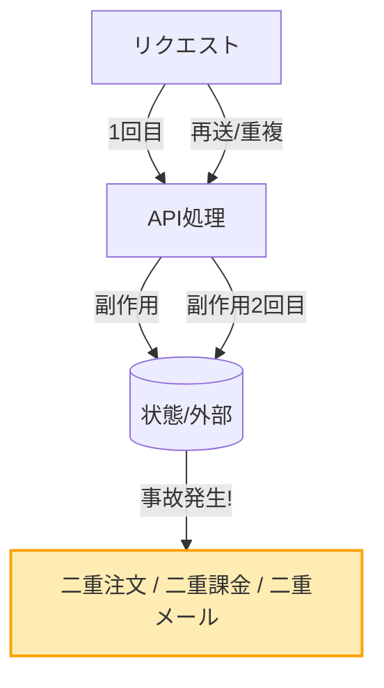

# 第06章：教材用ミニドメインを決める（注文APIでいくよ）🛒


## 6.1 なんで「題材固定」が大事なの？🧭

冪等性って、**単語だけ覚えても**あんまり身につかないんだよね…💦
同じ題材（ミニドメイン）でずっと進めると、

* 「どこが壊れやすいのか」👀💥
* 「どう守るのが自然か」🛡️
* 「どの設計判断が効いてくるか」🧠✨

が、章をまたいでつながっていくよ〜🔁🌸

---

## 6.2 今回のミニドメイン：注文→支払い→メール📦💳📧

この教材では、**注文API**を題材にするよ🛒
理由はシンプルで、冪等性の敵（副作用）が全部入りだから！💣✨

### ✅ ざっくり業務フロー（教材用）

```
注文を作る 🛒  →  支払いを確定する 💳  →  レシートメールを送る 📧
```



* 注文作成：同じリクエストが2回来たら「注文が2個できる」危険😵‍💫
* 支払い確定：同じリクエストが2回来たら「二重課金」危険🔥
* メール送信：同じリクエストが2回来たら「同じメールが2通」地味に困る😂

---

## 6.3 「壊れやすい操作」をわざと選ぶ（＝学びが濃くなる）💥

冪等性の学習では、あえてこういう“事故りやすい”操作を含めるのがコツだよ🧪✨

* **増える系**：注文が増える、在庫が減る、ポイントが増える 📈📉
* **外部I/O系**：決済を叩く、メールを送る、外部APIに登録する 🌐📧💳
* **状態遷移系**：未払い→支払い済み、発送前→発送済み 🚦📦

今回はこの中でも、特にインパクトが強い **「支払い確定」** と **「注文作成」** を中心にするよ💳🛒

---

## 6.4 登場キャラ（データ）を決めよう👤📦

ミニドメインは、最小でOK！むしろ小さい方が勝ち🏆✨
今回はこれだけで進めるよ👇

### 🧩 エンティティ（ざっくり）

* **Order（注文）**

  * `OrderId`（注文ID）
  * `CustomerId`（購入者ID）
  * `Amount`（合計金額）
  * `Status`（注文状態：Created / Paid / Cancelled…）🚦
* **Payment（支払い）**

  * `PaymentId`（支払いID）
  * `OrderId`
  * `Status`（Pending / Confirmed / Failed…）💳
* **ReceiptEmail（レシートメール）**

  * `OrderId`
  * `Sent`（送った？）📧✅

> ポイント：**冪等性の説明に必要な最小限**だけ残すのがコツだよ😊🌱



---

## 6.5 今回のAPI境界（どこまでを“APIの責任”にする？）🧱

教材では、いきなり「本物の決済」や「本物のメール」まではやらず、**外部っぽい処理を“それっぽく”疑似実装**して進めるよ🧪✨
（でも“壊れ方”は本物と同じにするのがミソ💥）

* 決済：`FakePaymentGateway` みたいな疑似ゲートウェイ（後で差し替え可能）💳
* メール：`FakeEmailSender` みたいな疑似送信📧

---

## 6.6 エンドポイントを決める（この教材の主役たち）🎬✨

ここで「教材で扱うAPI」を固定しちゃうよ🧷

### ✅ エンドポイント案（必要最小限）

1. **注文作成**

* `POST /orders`
* 目的：注文を1件作る🛒

2. **支払い確定（副作用が強い！）**

* `POST /orders/{orderId}/payments/confirm`
* 目的：支払いを“確定”させる💳🔥

3. （オマケ）**レシートメール送信（外部I/O）**

* `POST /orders/{orderId}/emails/receipt`
* 目的：メール送信📧

> 現実の決済APIでは、リトライや二重送信に備えて **Idempotency-Key（冪等キー）** を受け付ける設計がよくあるよ。たとえば Stripe も「同じキーなら同じ結果を返す」方式で、ステータスコードとレスポンス本文を保存して再利用する仕組みを説明してるよ。 ([Stripe Docs][1])

---

## 6.7 リクエスト/レスポンスの形を軽く決める🧾✨

ここでは“設計の迷子防止”のために、最低限だけ決めるよ🧭

### 🛒 注文作成（例）

* リクエスト：商品と金額（超シンプル）
* レスポンス：`OrderId` と `Status`

### 💳 支払い確定（例）

* リクエスト：支払い方法トークン（ダミーでもOK）
* レスポンス：`PaymentStatus` と `PaidAt`

### 📧 レシートメール

* リクエスト：基本なし（あってもメール宛先くらい）
* レスポンス：受け付けたことが分かればOK（例：202）

---

## 6.8 “事故”を先に想像しておく（第7章が楽になる）😵‍💫➡️😎

この教材でわざと起こす事故はこれ👇💥



* `POST /orders` を2回送る
  → 注文が2件できる（増える）🛒🛒
* `POST /payments/confirm` を2回送る
  → 二重課金（最悪）💳💳🔥
* `POST /emails/receipt` を2回送る
  → メール2通（地味に信用落ちる）📧📧😇

ここまでを“同じ題材で”体験し続けるから、冪等化の手段（冪等キー、一意制約、状態遷移ガード…）が腹落ちしやすくなるよ🔁✨

---

## 6.9 ミニ演習📝💡（5〜10分）

### 演習1：危険操作を2つ選ぶ🎯

次の中から「二重実行されたらヤバい」操作を2つ選んで、理由を1行で書こう😊

* A. 注文作成🛒
* B. 支払い確定💳
* C. レシートメール送信📧
* D. 注文の参照（GET）🔍

### 演習2：事故メモを書く📝💥

「もし二重実行されたら何が起きる？」を、各操作について1行で書こう✍️

---

## 6.10 小テスト（理解チェック）✅✨

1. 「注文API」を題材にするメリットはどれ？
   A. 画面が派手だから
   B. 副作用の種類が多く、冪等性の学びが濃いから
   C. GETが多いから

2. “副作用が強い”操作の例はどれ？
   A. GETで一覧取得
   B. 支払い確定
   C. 説明文の表示

3. 二重送信で「最悪」になりやすいのはどれ？
   A. 二重課金
   B. 文字化け
   C. 画面の色が変わる

**答え：1)B  2)B  3)A** 🎉

---

## 6.11 AI活用プロンプト集🤖✨（コピペOK）

* 「注文APIのミニドメインで、登場エンティティと状態遷移を超シンプルに提案して」🧠
* 「`POST /orders` と `POST /orders/{id}/payments/confirm` のリクエスト/レスポンス案を、初心者向けにJSONで」🧾
* 「二重送信で起きる事故を、この題材（注文→決済→メール）で列挙して。重大度もつけて」💥
* 「最小APIで、ヘッダー/ボディの入力チェック（DataAnnotations）を使った例を出して」✅
  ※ .NET 10 の最小APIは、クエリ/ヘッダー/ボディに対して DataAnnotations での検証サポートが入ってるよ。 ([Microsoft Learn][2])

---

## 6.12 この章のゴール🎯✨

* 教材で使う題材を「注文API」に固定できた🛒
* 副作用が強い“危険操作”を意識できた💳📧
* 次章で「わざと事故る実装」を作る準備ができた😵‍💫➡️✅

[1]: https://docs.stripe.com/api/idempotent_requests?utm_source=chatgpt.com "Idempotent requests | Stripe API Reference"
[2]: https://learn.microsoft.com/en-us/aspnet/core/fundamentals/minimal-apis?view=aspnetcore-10.0&utm_source=chatgpt.com "Minimal APIs quick reference"
