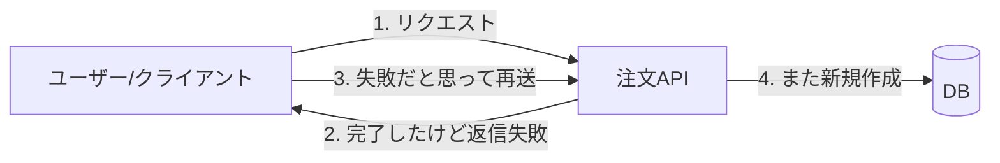
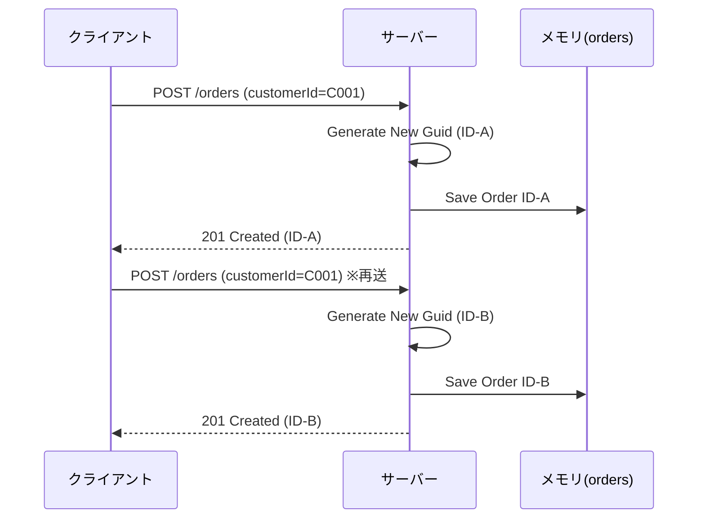
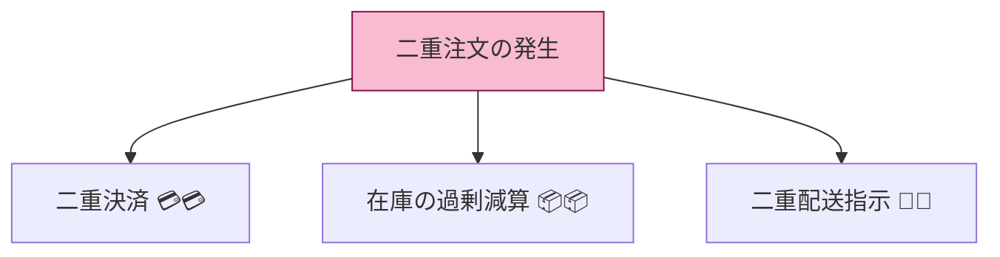

# 第07章：事故を体験する（冪等じゃない実装をわざと作る）😵‍💫


## この章のゴール🎯

* **同じPOSTを2回送るだけで、注文が2回作られてしまう**のを自分の目で確認する👀💥
* 「なんでこうなるの？」を**言葉にできる**ようになる🗣️✨
* 次の章（冪等化の全体マップ）で「直したい！」って気持ちを作る🔥

> ちなみに本日時点の最新は **.NET 10（LTS）**＋**Visual Studio 2026**（GA）で、C#は **C# 14** が最新だよ〜🧁✨ ([Microsoft for Developers][1])

---

## 7.1 事故シナリオ（現場で“よくある”やつ）📶⌛

「注文作成」みたいな**増える系の操作**は、二重送信が来ると壊れやすい😇💣

* ユーザーがボタン連打👆👆👆
* 送信後に画面が固まって見えて、もう一回押す😵‍💫
* ネットが微妙で、クライアントが自動リトライ🔁
* サーバーがタイムアウト返したけど、実は裏で成功してた（そして再送で2回目が走る）🥶

今日は、この事故を**わざと**起こすよ💥



---

## 7.2 “冪等じゃない”注文APIを作る🛒💥

### A）コマンドで最短作成（おすすめ）⚡

`dotnet new webapi` は、何も指定しないと **最小限のAPI（Minimal API）** が作られるよ（コントローラ無しが基本）🧩 ([Microsoft Learn][2])

```bash
mkdir OrderApi
cd OrderApi
dotnet new webapi -n OrderApi
cd OrderApi
```

### B）Visual Studioで作る🪟🛠️

* 「ASP.NET Core Web API」テンプレートを選ぶ
* “Controllers を使う/使わない”みたいな選択肢が出たら、**最小限のAPI寄り**の方を選ぶ（後で `Program.cs` をそのまま貼り替えるだけでもOK）✨

---

## 7.3 まず“雑な実装”を貼る（事故るために必要）😈

`Program.cs` を **まるごと** これに置き換えてね👇

```csharp
using System.Collections.Concurrent;

var builder = WebApplication.CreateBuilder(args);
var app = builder.Build();

// 「DBのつもりの置き場」（今回は簡単にメモリ）🧺
var orders = new ConcurrentDictionary<Guid, Order>();

app.MapPost("/orders", (CreateOrderRequest req) =>
{
    // 超・雑：毎回新しい注文を作る（＝二重送信で二重作成）💥
    var order = new Order(
        Id: Guid.NewGuid(),
        CustomerId: req.CustomerId,
        ProductId: req.ProductId,
        Quantity: req.Quantity,
        CreatedAt: DateTimeOffset.UtcNow
    );

    orders[order.Id] = order;

    Console.WriteLine($"[CREATED] orderId={order.Id} customer={order.CustomerId} product={order.ProductId} qty={order.Quantity}");

    // 201 Created + Location（新規作成の「基本形」）📮✅
    return Results.Created($"/orders/{order.Id}", order);
});

app.MapGet("/orders", () => orders.Values.OrderBy(o => o.CreatedAt));

app.MapGet("/orders/{id:guid}", (Guid id) =>
{
    return orders.TryGetValue(id, out var order)
        ? Results.Ok(order)
        : Results.NotFound();
});

app.Run();

record CreateOrderRequest(string CustomerId, string ProductId, int Quantity);

record Order(Guid Id, string CustomerId, string ProductId, int Quantity, DateTimeOffset CreatedAt);
```

> `201 Created` は「作ったよ！」の意味で、作ったリソースの場所を Location で示すのが定番だよ📮 ([Microsoft Learn][3])

---

## 7.4 動かす▶️ & 事故らせる🔁💥


### ① 起動▶️

```bash
dotnet run
```

起動ログに `Now listening on: https://localhost:xxxx` みたいなのが出るから、それをベースURLとして使うよ🧭

---

### ② 同じ注文を“2回”送る（ここが事故ポイント）😵‍💫

PowerShell でいくよ〜🪄

```powershell
# ここは起動ログのURLに合わせてね（例）
$base = "https://localhost:7123"

$body = @{
  customerId = "C001"
  productId  = "PIZZA"
  quantity   = 1
} | ConvertTo-Json

# 1回目
Invoke-RestMethod -Method Post -Uri "$base/orders" -ContentType "application/json" -Body $body

# 2回目（同じ内容でもう一回）
Invoke-RestMethod -Method Post -Uri "$base/orders" -ContentType "application/json" -Body $body
```

✅ たぶん **orderId が2つ**返ってくるはず！
つまり…**同じ注文が2個できた**🎉（うれしくない）



---

### ③ “増えてる証拠”を見る👀🧾

```powershell
Invoke-RestMethod -Method Get -Uri "$base/orders"
```

* さっきの注文が **2件** 並んでたら成功（事故成功）💥👏
* コンソールログにも `[CREATED] ...` が **2行** 出てるはず🧾

---

## 7.5 何が起きた？（事故の正体）🧠💣

この実装は、毎回こうしてる👇

* リクエストが来たら
  → **新しい `Guid.NewGuid()` を作って**
  → **新しい注文を保存して**
  → **201で返す**

つまりサーバー目線では、

* 「同じ内容っぽいけど…それって同じ注文の再送なの？それとも別の注文なの？」🤔
  を判断する材料がゼロ。

だから **2回送られたら2回作る**。めちゃ自然に壊れる😇

---

## 7.6 “最悪ケース”に育つとこうなる😇🔥

今日の事故（注文2個）を放置すると、現場ではこうなることがあるよ👇

* 決済が二重課金💳💳💥
* 在庫が2回減る📦📦⬇️
* 確認メールが2通飛ぶ📧📧😱
* 配送指示が2回出て、返品地獄📦🔁🫠

この章は「痛みで覚える」が目的だから、ここまで体験できたら満点💯✨



---

## 7.7 ミニ演習📝🌸

1. いまのAPIで「二重送信が来たら何が壊れる？」を **3つ** 書く✍️💥
2. 同じPOSTを **10回** 送って、注文が10件になるのを確認する🔁🔁🔁
3. `Console.WriteLine` に、`CreatedAt` も出すようにして「ほぼ同時」を観察する⌛👀
4. 「注文」以外に壊れやすい操作を2つ挙げる（例：予約、ポイント付与）🧠✨

---

## 7.8 小テスト（サクッと確認）✅🧁

1. 今日の実装で、同じPOSTが2回来たらどうなる？
2. それはなぜ？（サーバーが何を判断できないから？）
3. “増える系”の操作が危ないのはなぜ？
4. 201 Created の意味は？
5. 「同じ操作の再送」を見分けるために必要そうな情報は何？（次章のヒント🔑）

---

## 7.9 AI活用🤖💖（コピペで使える）

* 「この `POST /orders` が二重送信されたときの最悪ケースを、決済・在庫・メール観点で列挙して」
* 「このコードが冪等じゃない理由を、初心者向けに比喩で説明して」
* 「このAPIに“事故が起きた証拠”を残すログ項目を提案して（最低10個）」
* 「同じリクエストが2回来たとき、どう設計すれば1回に収束できそう？候補を5つ（まだ実装しなくてOK）」

---

## 次章につながるメモ🗺️✨

「事故の原因」は超シンプルで、**“同じ操作だと判定する仕組みが無い”** だけ。
次の章では、その直し方の地図（王道5パターン）を持つよ〜🔁🔑

[1]: https://devblogs.microsoft.com/dotnet/announcing-dotnet-10/?utm_source=chatgpt.com "Announcing .NET 10"
[2]: https://learn.microsoft.com/ja-jp/dotnet/core/tools/dotnet-new-sdk-templates?utm_source=chatgpt.com "'dotnet new' の .NET の既定のテンプレート - .NET CLI"
[3]: https://learn.microsoft.com/en-us/aspnet/core/tutorials/min-web-api?preserve-view=true&view=aspnetcore-10.0 "Tutorial: Create a Minimal API with ASP.NET Core | Microsoft Learn"
