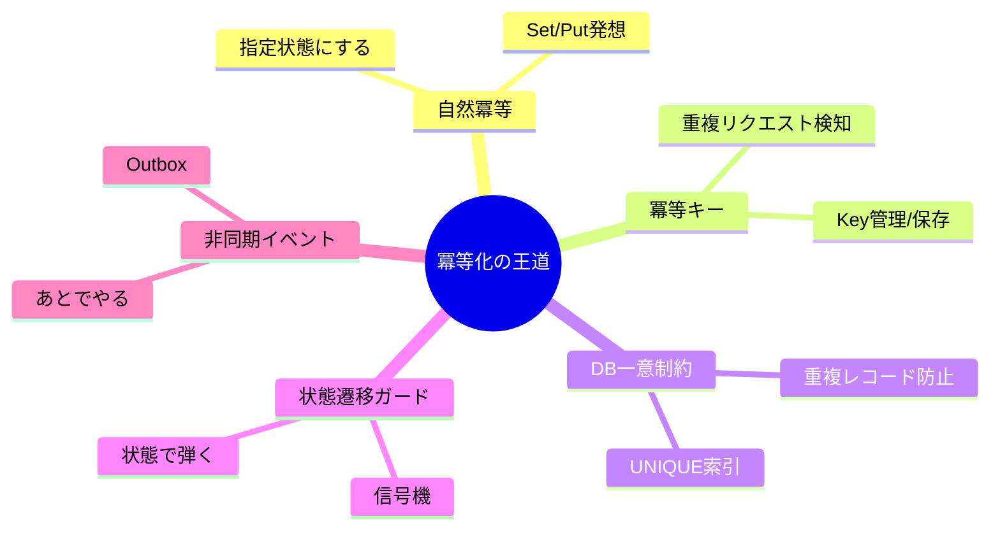
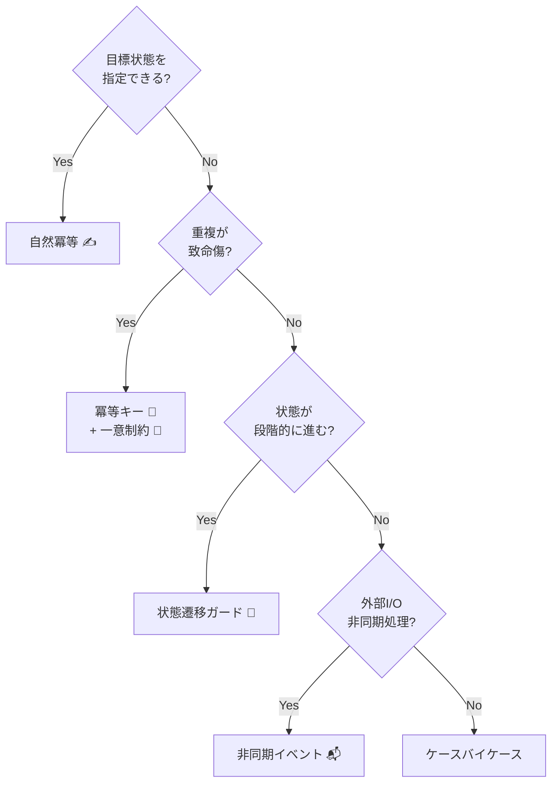
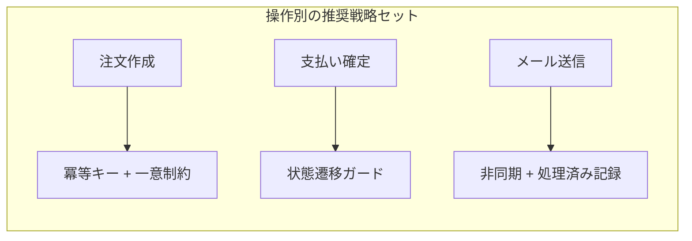

# 第08章：冪等化の全体マップ（5つの王道）🗺️✨


## この章のゴール🎯

この章では「冪等化って、結局どれを選べばいいの？😵」を**迷わず選べる**ようにするために、冪等化の王道を**5つの地図**として整理します🔁✨
そして、題材（注文API🛒）に当てはめて「この操作はこの戦略が合う！」まで言えるようになります😊

---

## まずは地図！冪等化の王道5つ🗺️🔁

冪等化って、突き詰めると「同じ要求が何回きても、サーバーの“最終的な結果”が壊れない」ことでしたね🌸
HTTPの仕様でも「**同じリクエストを複数回**しても、**意図した効果が1回と同じ**なら冪等」と定義されています📘✨ ([RFCエディタ][1])

冪等化の王道はこの5つ👇

1. **自然冪等（指定状態にする）** ✍️🔁
2. **冪等キー（Idempotency Key）** 🔑🎫
3. **DB一意制約（Unique制約）** 🗃️🧷
4. **状態遷移ガード（ステートで止める）** 🚦🛑
5. **非同期・イベント（Outbox/Queueなど）** 📬⚡



> ✅ 実務では「2〜4を組み合わせる」ことが多いです
> （例：冪等キー＋DB一意制約＋状態遷移ガード）💪✨

---

## 0.5秒でわかる！5つのキャラ紹介😺✨

### ① 自然冪等：**“こうしてね”型**✍️

* 「増やす」じゃなく「**この状態にする**」
* 例：`SetStatus(Paid)`、`UpdateAddress(...)`
* **同じ入力なら何回やっても同じ結果**になりやすい🎯

### ② 冪等キー：**“同じチケットなら同じ結果”型**🔑

* `Idempotency-Key`（または独自ヘッダ/ボディ）で「この操作のチケット🎫」を渡す
* サーバーは「同じキーなら**二重実行しない**」を保証する
* `POST` の冪等化の王道🔥
  （HTTPの `Idempotency-Key` ヘッダは標準化が進行中で、`POST/PATCH` を冪等にする目的が明記されています📌） ([IETF Datatracker][2])

### ③ DB一意制約：**“DBが門番”型**🗃️🧷

* 「同じものは1件しか入れさせない」
* レース（同時2回）にめちゃ強い💥
* 例：`Orders(ClientRequestId)` を UNIQUE にする

### ④ 状態遷移ガード：**“信号機”型**🚦

* 状態が `Created -> Paid -> Shipped` みたいに進むとき
* 「もう `Paid` なら、再度 `Paid` はOK（変化なし）／二重課金はNG」みたいに止める🛑

### ⑤ 非同期・イベント：**“あとで安全にやる”型**📬

* メール送信✉️、外部API呼び出し🤝、重い処理🐘
* 「Outbox」「処理済み記録」などで重複を潰す
* “配信は重複する前提”で設計するのがコツ🌧️

---

## まず最初に覚える：HTTPの冪等メソッド感覚🌐✨

HTTPの仕様では、ざっくりこう覚えると便利です👇

* **安全（Safe）**：`GET` など（サーバー状態を変えない想定）
* **冪等（Idempotent）**：`PUT` `DELETE` と safe なメソッド（複数回やっても効果が同じ） ([RFCエディタ][1])

ただし注意⚠️
`DELETE` は「最終的に消えてる」なら冪等だけど、**レスポンスが毎回同じになるとは限らない**（最初は 200、次は 404 など）こともあります。冪等は“サーバーへの意図した効果”が同じ、がポイントです😊 ([RFCエディタ][1])

---

## 5つの王道をちゃんと使い分けるコツ🧭✨

### 判断軸A：その操作は「指定状態」？それとも「一回しかやりたくない」？🤔

* **指定状態（上書き）**なら → **自然冪等**が最有力✍️
* **一回しかやりたくない（作成・課金・送信）**なら → **冪等キー / DB一意制約 / 状態遷移ガード**が本命🔑🗃️🚦

### 判断軸B：「同時に来る」可能性ある？🏎️💥

* ある → **DB一意制約**を中心に守るのが強い🧷
* ない（単一スレ/単一プロセスで確実）ならロックもありだけど、基本はDBが安心😊

### 判断軸C：外部I/O（メール・決済・他社API）ある？✉️💳🤝

* ある → **非同期・イベント（Outbox等）**も検討📬
* “外に出る”ほど事故が高いので、記録と再試行の設計が超大事🔥

---

## 「3分診断」どれを選ぶ？🕒🧠（超ざっくりフロー）

以下を上から順に答えるだけで、だいたい決まります👇😊

1. **目標状態を指定できる？**（例：ステータスを Paid にする）

* YES → **自然冪等**が第一候補✍️🔁
* NO → 次へ

2. **“作成”や“課金”みたいに、同じことを2回やると死ぬ？💥**

* YES → **冪等キー** + **DB一意制約** を軸にする🔑🧷
* NO → 次へ

3. **状態が段階的に進む？（Created→Paid→Shipped）**

* YES → **状態遷移ガード**で二重適用を止める🚦
* NO → 次へ

4. **外部に送る・非同期で処理する？**

* YES → **非同期・イベント**（Outbox/処理済み記録）📬
* NO → ケース次第（でも②③が多い）✨



---

## 題材（注文API🛒）に当てはめてみよう！🗺️✨

ここではこの3操作を想定します👇

* ① 注文作成（Create Order）🛒
* ② 支払い確定（Confirm Payment）💳
* ③ メール送信（Send Email）✉️

### ① 注文作成（POST）🛒


**おすすめセット：冪等キー🔑 + DB一意制約🧷**

* “同じ注文作成”が2回走ると、注文が2つできちゃう😱
* `Idempotency-Key`（または `ClientRequestId`）で「この作成は同一だよ」をサーバーが判断できるようにする🎫
* さらに **DBの UNIQUE** で同時2回でも1件に収束させる🛡️

> `Idempotency-Key` はHTTP標準化が進んでいて、`POST/PATCH` の冪等化に使う目的が明確です🔑✨ ([IETF Datatracker][2])

### ② 支払い確定（状態変更）💳

**おすすめセット：状態遷移ガード🚦 +（必要なら冪等キー🔑）**

* 支払いは「増やす」じゃなく「Paidにする」が自然冪等寄り✨
* でも怖いのは **二重課金** 💥
  → 状態が `Paid` なら再実行は “何もしない（or 同じ結果を返す）” にする

### ③ メール送信（外部副作用）✉️

**おすすめセット：非同期・イベント📬 + 処理済み記録✅（発展）**

* メールは「二重送信」が一番やらかしやすい😂
* “送信要求”をイベントにして、送信側で「このMessageIdは処理済み？」を見て重複を潰すのが王道💪



---

## ちょい実装イメージ（超ミニ）👩‍💻✨

### 冪等キーの基本（考え方）🔑🎫

* クライアントが `Idempotency-Key` を送る
* サーバーは

  1. 「このキー、初めて？」→ なら処理して結果を保存
  2. 「このキー、見たことある！」→ なら **前回の結果を返す**

（※ “前回の結果を返す” までやると、体験として「冪等になった！」が分かりやすいです😊）

C#の雰囲気だけ（疑似コード）👇

```csharp
// ざっくりイメージ（詳細は第10章以降でガッツリやるよ🔧）
var key = Request.Headers["Idempotency-Key"].ToString();

var existing = await db.IdempotencyRequests.SingleOrDefaultAsync(x => x.Key == key);
if (existing != null)
{
    return Results.Json(existing.StoredResponseBody, statusCode: existing.StoredStatusCode);
}

// ここで「初回だけ」注文作成
var order = CreateOrder(...);

// 結果を保存（同じキーなら再利用）
db.IdempotencyRequests.Add(new IdempotencyRequest(key, storedResponse...));
await db.SaveChangesAsync();

return Results.Created($"/orders/{order.Id}", order);
```

ポイント💡

* **同時に2つ来たら？** → ここにDB一意制約🧷が効いてくる（第18章で体験するやつ！🔥）
* HTTPの冪等定義は“効果”なので、レスポンス再利用は実装方針だけど、実務でめちゃ便利です😊 ([RFCエディタ][1])

---

## ミニ演習📝🖍️（地図を塗ろう！）

### 演習1：3操作に「王道」を割り当てよう🗺️

次の3つに、合う戦略を1〜2個選んでください👇

* 注文作成（POST）🛒 → （　　）
* 支払い確定（ステータス変更）💳 → （　　）
* メール送信（外部）✉️ → （　　）

🎀ヒント：

* “作成”は二重が致命傷💥
* “状態”は信号機🚦
* “外部”は非同期📬

### 演習2：あなたのAPIにも当てはめよう🔁✨

あなたのサービスで「二重実行されたら困る操作」を2つ書いて、
それぞれに「王道どれ？」を付けてみてね😊

---

## よくある落とし穴トップ7🕳️😇

1. **“冪等＝GETだけ”と思う** → `POST` も設計で冪等化できるよ🔑
2. **アプリ内ロックだけで安心する** → 複数台だと効かないことが多い🔒💥
3. **DB一意制約を避ける** → レース対策でめちゃ強い🧷
4. **状態遷移のルールが曖昧** → “二重課金”みたいな事故が起きる🚦💳
5. **外部I/Oを同期で雑にリトライ** → 二重送信・二重課金の温床😱
6. **冪等キーの保存期限（TTL）を考えない** → いつかテーブルが肥大化🧹
7. **ログにキーを出さない** → 事故調査が地獄になる🔍🔥

---

## 小テスト（5問）🧠📝

Q1. 「冪等」とは“レスポンスが毎回同じ”のこと？（○/×）
Q2. `PUT` が冪等とされる理由を一言で言うと？✍️
Q3. 同時に2リクエストが来るとき、強い守りになりやすいのはどれ？
A) アプリ内ロック　B) DB一意制約　C) 気合い
Q4. “メール送信”みたいな外部副作用は、どの王道が相性いい？📬
Q5. `Idempotency-Key` は何のための“チケット”？🎫

### こたえ🎀

A1. ×（冪等は“サーバーへの意図した効果”が同じこと📘） ([RFCエディタ][1])
A2. “指定した状態にする（上書き）”ので同じ要求を何回しても効果が同じになりやすい✨ ([RFCエディタ][1])
A3. B（DBが門番🧷）
A4. 非同期・イベント（Outbox/処理済み記録など）📬
A5. 「同じ操作の再送だよ」を示すチケット🔑（同じキーなら二重実行しない） ([IETF Datatracker][2])

---

## AI活用🤖✨（この章で超効く使い方）

* 「この操作（文章で説明）に最適な冪等化戦略を、理由つきで提案して」🧠
* 「注文作成／支払い確定／メール送信に、5つの王道を割り当てて」🗺️
* 「冪等キー方式の落とし穴を初心者向けに7つ」😇
* 「状態遷移ガードを“信号機”の比喩で説明して」🚦

---

## まとめ🎁✨

* 冪等化は「闇の奥義」じゃなくて、**王道5つの地図🗺️**で整理できる😊
* 実務で強いのはだいたいこの組み合わせ👇

  * **作成系（POST）**：冪等キー🔑 + DB一意制約🧷
  * **状態遷移**：状態遷移ガード🚦（＋必要なら冪等キー）
  * **外部副作用**：非同期・イベント📬（＋処理済み記録✅）

次章は **戦略① 自然冪等（“上書き型”の発想）✍️🔁** で、「増やす」から「この状態にする」へ変換する練習に入ります🌸

[1]: https://www.rfc-editor.org/rfc/rfc9110.html?utm_source=chatgpt.com "RFC 9110: HTTP Semantics"
[2]: https://datatracker.ietf.org/doc/draft-ietf-httpapi-idempotency-key-header/?utm_source=chatgpt.com "The Idempotency-Key HTTP Header Field - Datatracker - IETF"
