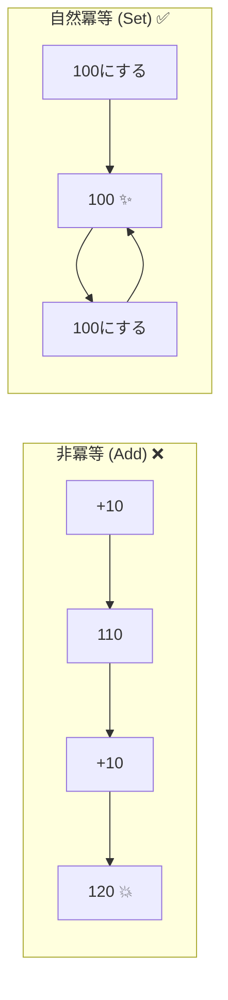
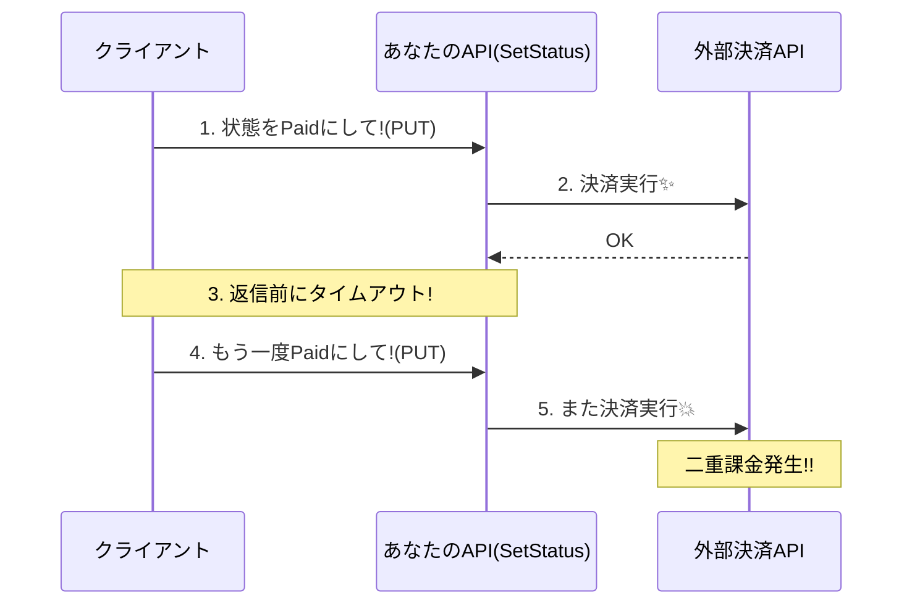

# 第09章：戦略① 自然冪等（“上書き型”の発想）✍️🔁


## 9.1 この章のゴール🎯✨


この章が終わると、こんなことができるようになるよ😊🌸

* 「増やす／追加する」みたいな**壊れやすい操作**を見つけられる👀💥
* それを「**この状態にする（上書きする）**」に言い換えて、**自然に冪等**な設計に寄せられる✍️🔁
* HTTPの **PUT** が“冪等っぽい”理由を、感覚じゃなく説明できるようになる🌈

---

## 9.2 自然冪等ってなに？（最短で理解）🧠💡


**自然冪等（Natural Idempotency）**は、ざっくり言うと👇

> 何回リクエストが来ても、
> **最終状態が同じになる**ように「上書き型」で設計すること🔁

ポイントは「**増分（+10）**」じゃなくて「**目標状態（100点にする）**」を送ることだよ😊✨

* ✅ `SetPoint(100)` → 何回来ても 100 のまま 😌✨



---

## 9.3 「増やす」→「この状態にする」変換ルール🧩🪄


壊れやすい動詞を見たら、まずこの変換を疑うと強いよ💪🌸

| 壊れやすい（副作用が増える）💣         | 上書き型（自然冪等に寄せる）✍️🔁               |
| ------------------------ | -------------------------------- |
| Add / Increment / Append | Set / Replace / Upsert           |
| Create（サーバーがID採番）        | Put with ID（IDを指定して作る/置き換える）     |
| Charge / Send / Notify   | MarkAsPaid / RecordSent（状態を記録する） |

💡コツ：
「**操作**」じゃなく「**状態**」をAPIに頼む感じにする😊

---

## 9.4 HTTPでいうと、PUTが“上書き型”🧷🌐


HTTPの仕様では、**PUT は冪等**なメソッドとして扱われるよ🔁
同じ内容で何回送っても、サーバーに起きる“意図した効果”が1回と同じなら冪等、って定義なんだ😊✨ ([RFCエディタ][1])

ざっくり感覚だと👇

* **POST**：だいたい「増える・作る」（冪等じゃないことが多い）
* **PUT**：だいたい「置き換える・この状態にする」（冪等にしやすい） ([RFCエディタ][1])

※もちろん「PUTなら絶対安全」ではなくて、**中身の設計が上書き型になってるか**が本体だよ🧠✨

---

## 9.5 ハンズオン①：`AddPoint` を `SetPoint` に作り替える🧪🎮

ここは“体で覚える”ゾーン💥😆
同じリクエストを連打しても壊れないのを確認しよ〜🔁✅

### (1) 最小のAPIを用意する🛠️

`IdempotencyDemo` みたいなWeb APIプロジェクトを作って、`Program.cs` をこんな感じにするよ👇

```csharp
using System.Collections.Concurrent;
using System.ComponentModel.DataAnnotations;

var builder = WebApplication.CreateBuilder(args);

// .NET 10 の Minimal API には「組み込みバリデーション」があるよ✅
// DataAnnotations を付けると、NG入力は自動で 400 を返せる（便利！）
builder.Services.AddValidation();

var app = builder.Build();

var points = new ConcurrentDictionary<Guid, int>();

// ❌ 非冪等：増える（2回呼ばれたら2回増える）
app.MapPost("/users/{userId:guid}/points/add", (Guid userId, AddPointRequest req) =>
{
    var current = points.GetOrAdd(userId, 0);
    var next = current + req.Delta;
    points[userId] = next;

    return Results.Ok(new { userId, points = next });
});

// ✅ 自然冪等：上書き（何回呼んでも「この値にする」）
app.MapPut("/users/{userId:guid}/points", (Guid userId, SetPointRequest req) =>
{
    points[userId] = req.Points;
    return Results.Ok(new { userId, points = points[userId] });
});

app.Run();

public record AddPointRequest([Range(-1000, 1000)] int Delta);

public record SetPointRequest(
    [Range(0, 1_000_000)] int Points
);
```

この **`AddValidation()`** と、`[Range]` みたいな属性での検証は、.NET 10 の Minimal API の新しめ機能として案内されてるよ✅ ([Microsoft Learn][2])

（ついでに）.NET 10 / C# 14 が “今どきの基準” としてまとまってるのも押さえとくと安心🌸 ([Microsoft for Developers][3])

### (2) 起動して、同じリクエストを連打する🔁🔥

サーバーを `http://localhost:5000` で動かすとテストしやすいよ👇

```powershell
dotnet run --urls http://localhost:5000
```

まずは **非冪等（Add）** を連打💥

```powershell
$id = [guid]::NewGuid()

curl.exe -X POST "http://localhost:5000/users/$id/points/add" `
  -H "Content-Type: application/json" `
  -d "{\"delta\":10}"

curl.exe -X POST "http://localhost:5000/users/$id/points/add" `
  -H "Content-Type: application/json" `
  -d "{\"delta\":10}"
```

👉 2回目でポイントがさらに増えてたら、**「二重実行で壊れる」**が確認できたね😵‍💫💥

次に **自然冪等（Set / PUT）** を連打✅

```powershell
for ($i=0; $i -lt 3; $i++) {
  curl.exe -X PUT "http://localhost:5000/users/$id/points" `
    -H "Content-Type: application/json" `
    -d "{\"points\":100}"
}
```

👉 何回やっても **必ず 100**。これが「上書き型」✨😌

---

## 9.6 ハンズオン②：注文ドメインに落とす（“状態にする”）🛒📦

教材の注文ドメインで考えると、自然冪等に寄せやすいのはこういうやつ👇

### 例A：注文の配送先を「この住所にする」🏠✍️

* ✅ `PUT /orders/{orderId}/shipping-address`

  * body：`{ "postalCode": "...", "address1": "...", ... }`
  * 同じ住所で何回送っても最終状態は同じ😌

### 例B：注文ステータスを「この状態にする」🚦✨

* ✅ `PUT /orders/{orderId}/status`

  * body：`{ "status": "Paid" }` とか
  * すでに `Paid` なら、そのまま `Paid` を返す（増えない）🔁✅

💡ここでの大事ポイント

* “やったこと（操作）”じゃなく、**“今こうなってて（状態）”**を作る
* 同じリクエストが2回来ても、**同じ状態に収束**する

---

## 9.7 よくある落とし穴（自然冪等にしたつもりが壊れる）⚠️🕳️


### 落とし穴1：上書きの中に「増分」が混ざってる😇💣

例：`SetPoint` のつもりで body に `delta` が残ってる

* ✅ 対策：入力は **目標状態だけ** にする（Points のみ、みたいに）✍️

### 落とし穴2：PUTなのに「毎回新しいIDを作る」😱

* PUTは冪等であることが期待されやすいけど、**中身が増殖系だと意味がない**
* 仕様上、PUTは冪等メソッドとして扱われるから、なおさら事故りやすい😵‍💫 ([RFCエディタ][1])

### 落とし穴3：外部副作用（決済/メール）を“上書き”では吸収できない💳📧


* 「状態をPaidにする」は上書きでも、**決済APIを2回叩いたら二重課金**は起きうる💥
* こういうところは、次の戦略（冪等キーなど）が必要になりがち🔑✨



---

## 9.8 ミニ演習📝🌸

### 演習1：変換チャレンジ（設計）✍️

次のメソッド名を「上書き型」に言い換えてみてね👇

* `AddItemToCart`
* `IncrementLoginCount`
* `SendWelcomeMail`

（ヒント：Set/Replace/Mark/Record を使うと強いよ✨）

### 演習2：API設計（HTTP）🌐

次の要件を自然冪等にして、エンドポイント案を2つ書いてみてね📝

* 「ユーザーの通知設定を更新する」🔔
* 「配送先住所を登録する」🏠

---

## 9.9 小テスト（答え付き）📚✅

**Q1.** `AddPoint(+10)` が冪等じゃないのはなぜ？🤔
**A.** 同じリクエストが2回来ると、結果が +20 みたいに増えて、最終状態が変わるから💥

**Q2.** 自然冪等のコアは「操作」ではなく何を送ること？🎯
**A.** **目標状態**（この値にする／この状態にする）を送ること✍️✨

**Q3.** HTTPの仕様で冪等とされるメソッドの例を1つ言ってね🔁
**A.** たとえば **PUT**（ほかに DELETE や safe methods も）だよ✅ ([RFCエディタ][1])

---

## 9.10 AI活用🤖✨（この章の使いどころ）

### そのまま使えるプロンプト例💬

* 「この `POST` を自然冪等（上書き型）に寄せる設計案を2つ出して。エンドポイント案（HTTPメソッド/パス/body）もセットで」🧠✨
* 「`Add`/`Increment`/`Append` が混ざってる処理を見つけて、`Set`/`Replace` への変換案を提案して」🔍✍️
* 「このAPIは“目標状態”入力になってる？なってないならどう直す？」✅🔁

[1]: https://www.rfc-editor.org/rfc/rfc9110.html?utm_source=chatgpt.com "RFC 9110: HTTP Semantics"
[2]: https://learn.microsoft.com/en-us/aspnet/core/release-notes/aspnetcore-10.0?view=aspnetcore-10.0 "What's new in ASP.NET Core in .NET 10 | Microsoft Learn"
[3]: https://devblogs.microsoft.com/dotnet/announcing-dotnet-10/?utm_source=chatgpt.com "Announcing .NET 10"
