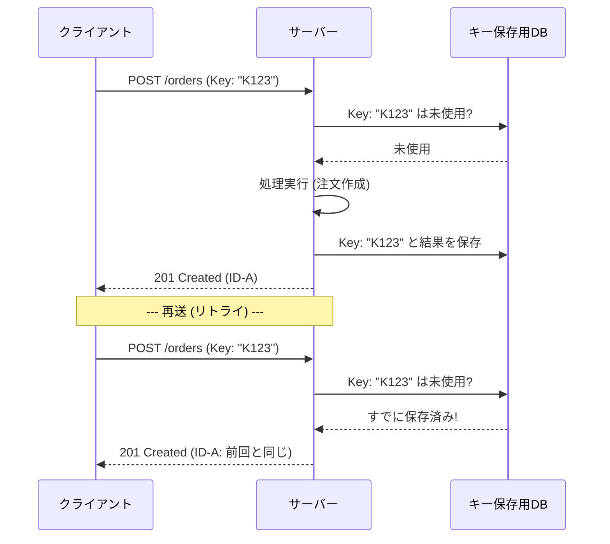
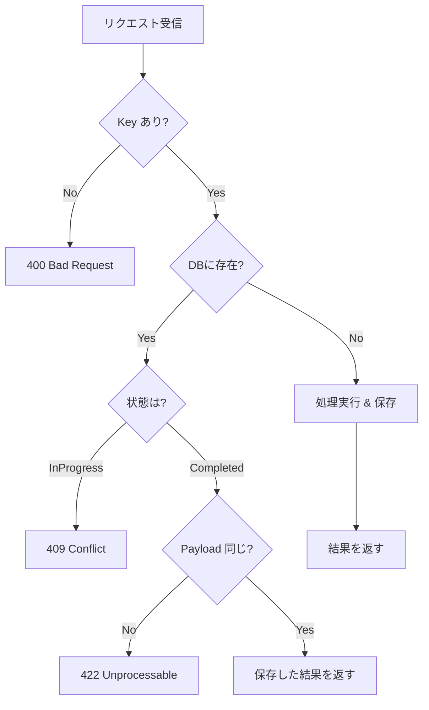

# 第10章：戦略② 冪等キーとは？（仕組みのコア）🔑✨


## 10.1 まず1分でイメージしよう😊🎫


冪等キー（Idempotency Key）は、ひとことで言うと **「この操作は1回だけってことにしてね！」のチケット🎫** です。

たとえば注文作成（POST）を送ったあとに…

* ユーザーがボタン連打しちゃった😵‍💫
* 通信が不安定でアプリが自動リトライした📶
* サーバーがタイムアウトして“失敗っぽく見えた”けど、実は成功してたかも…⌛💦

こういう **「同じ操作がもう1回飛んでくる世界」** で、サーバー側が同じチケットを見て
✅ **「あ、これ前やったやつだ。前回と同じ結果返すね！」**
ってできるようにする仕組みです🔁✨



---

## 10.2 冪等キー方式が向いてる場面🧨➡️🛡️

特に刺さるのはこのへん👇

* **作成系POST**：注文作成、予約作成、会員登録など🛒📅
* **課金・支払い確定**：二重課金がシャレにならない💳💥
* **メール送信・通知送信**：同じ通知が2通いくと地味に信用落ちる📩😇
* **外部API連携が絡む処理**：失敗に見えて再送したら…が頻発🤝⚡

「増える」「送る」「確定する」みたいな **副作用モリモリ** に強いのが冪等キーです💪🔥

---

## 10.3 仕組みの全体像（ざっくりフロー）🗺️🔁


### クライアント側（アプリ/フロント）📱🧑‍💻


1. 操作を1回ぶん開始する瞬間に **冪等キーを生成**（例：UUID）🔑
2. APIに **`Idempotency-Key` ヘッダー**で送る📮
3. もしタイムアウト等で再送するなら、**同じキーで再送**する🔁

### サーバー側（API）🖥️🧠


受け取った `Idempotency-Key` を見て、だいたいこう👇

* 初回（未使用）👉 普通に処理して、**結果をキーと一緒に保存**して返す✅
* 2回目（同じキー）👉 **前回と同じ結果を返す**🔁
* もし「同じキーなのに中身（payload）が違う」👉 **エラーにする**🚫
* もし「同じキーで処理中にもう1回来た」👉 **衝突としてエラーにする**⚔️

この考え方は、IETFの標準化ドラフトでも「POST/PATCHをフォールトトレラントにする」用途として整理されています。([IETF Datatracker][1])



---

## 10.4 HTTPとしての“約束事”📜🔑（ここ超大事！）


### ① ヘッダー名は `Idempotency-Key` 🔑

`Idempotency-Key` は **HTTPヘッダー**で運ぶのが定番で、IETFドラフトでもこの名前で定義されています。([IETF Datatracker][1])

### ② 値は「ユニーク」で「別payloadに使い回さない」🚫

* キーは **ユニークであること**
* そして **別のリクエスト内容（payload）に同じキーを使わないこと** が強く推奨されています🙅‍♀️([IETF Datatracker][1])
* 生成方法は **UUID（RFC4122）みたいなランダムIDが推奨**です🎲([IETF Datatracker][1])

### ③ “同じキー”のときの代表的な応答ルール🧾

IETFドラフトでは、典型ケースのエラー指針がこう書かれています👇([IETF Datatracker][1])

* 必須なのにキーがない 👉 **400 Bad Request**（Problem Detailsで説明）
* 同じキーを **別payloadで再利用** 👉 **422 Unprocessable Content**
* 同じキーで **処理中に再送（並行）** 👉 **409 Conflict**

（Problem Details は `application/problem+json` で返す形が例示されています📦）([IETF Datatracker][1])

---

## 10.5 “教材用”のAPI仕様例（注文作成）🛒📮

### エンドポイント

* `POST /orders`

### リクエスト（例）

* Header：`Idempotency-Key: "8e03978e-40d5-43e8-bc93-6894a57f9324"` 🔑
  ※ IETFドラフトでは Structured Headers の **String** として扱うので、例はダブルクォート付きで書かれています📝([IETF Datatracker][1])
* Body（例）

```json
{
  "customerId": "C123",
  "items": [
    { "productId": "P001", "qty": 2 },
    { "productId": "P777", "qty": 1 }
  ]
}
```

### レスポンス（例）

* 初回：`201 Created` + `orderId` を返す✅
* 同じキーで再送：**同じ `orderId` を返す**🔁✨

---

## 10.6 C#で“最小の冪等キー”を実装してみる🧪✨（まずは理解優先）

ここでは **DBなし（メモリ）** で「仕組み」を掴みます😊
（本番で強くする方法は、あとでDB一意制約や保存戦略で固めます🛡️）

### 実装の方針🧠

* `Idempotency-Key` がない 👉 400
* 同じキーがある

  * fingerprint（payloadのハッシュ）が違う 👉 422
  * 処理中 👉 409
  * 完了済み 👉 **保存したレスポンスを返す**🔁
* 初回 👉 処理して保存✅

### サンプルコード（Minimal API）🔧

```csharp
using System.Collections.Concurrent;
using System.Security.Cryptography;
using System.Text;
using System.Text.Json;

var builder = WebApplication.CreateBuilder(args);
var app = builder.Build();

var store = new ConcurrentDictionary<string, Entry>();

app.MapPost("/orders", async (HttpRequest req) =>
{
    // 1) Idempotency-Key 取得
    if (!req.Headers.TryGetValue("Idempotency-Key", out var rawKey) || rawKey.Count == 0)
    {
        return Results.Problem(
            title: "Idempotency-Key is missing",
            detail: "This operation requires Idempotency-Key.",
            statusCode: 400);
    }

    // Structured Header string っぽく "..." で来ることもあるので軽く正規化
    var key = rawKey.ToString().Trim();
    if (key.Length >= 2 && key.StartsWith("\"") && key.EndsWith("\""))
        key = key[1..^1];

    // 2) ボディを読み、fingerprint（ハッシュ）を作る
    req.EnableBuffering();
    using var reader = new StreamReader(req.Body, Encoding.UTF8, leaveOpen: true);
    var body = await reader.ReadToEndAsync();
    req.Body.Position = 0;

    var fingerprint = Sha256Hex(body);

    // 3) 既存チェック
    if (store.TryGetValue(key, out var existing))
    {
        if (!string.Equals(existing.Fingerprint, fingerprint, StringComparison.Ordinal))
        {
            return Results.Problem(
                title: "Idempotency-Key is already used",
                detail: "Do not reuse the same key across different payloads.",
                statusCode: 422);
        }

        if (existing.State == EntryState.InProgress)
        {
            return Results.Problem(
                title: "A request is outstanding for this Idempotency-Key",
                detail: "A request with the same Idempotency-Key is being processed.",
                statusCode: 409);
        }

        // 完了済み → 保存した結果をそのまま返す
        return Results.Text(existing.ResponseJson, "application/json", statusCode: existing.StatusCode);
    }

    // 4) 初回 → まず InProgress を登録（簡易）
    var inProgress = new Entry(fingerprint);
    if (!store.TryAdd(key, inProgress))
    {
        // 競合したら再度呼び出し側に任せる（簡易）
        return Results.Problem(title: "Conflict", detail: "Please retry.", statusCode: 409);
    }

    try
    {
        // 5) 本来の処理（仮）
        var orderId = $"O-{Guid.NewGuid():N}";
        var responseObj = new { orderId, createdAt = DateTimeOffset.UtcNow };

        var json = JsonSerializer.Serialize(responseObj);

        // 6) 結果保存
        inProgress.MarkCompleted(statusCode: 201, responseJson: json);

        return Results.Text(json, "application/json", statusCode: 201);
    }
    catch (Exception ex)
    {
        // 失敗も保存するかどうかは方針次第（ここでは保存しない簡易）
        store.TryRemove(key, out _);
        return Results.Problem(title: "Server Error", detail: ex.Message, statusCode: 500);
    }
});

app.Run();

static string Sha256Hex(string s)
{
    var bytes = Encoding.UTF8.GetBytes(s);
    var hash = SHA256.HashData(bytes);
    return Convert.ToHexString(hash);
}

enum EntryState { InProgress, Completed }

sealed class Entry
{
    public string Fingerprint { get; }
    public EntryState State { get; private set; } = EntryState.InProgress;
    public int StatusCode { get; private set; }
    public string ResponseJson { get; private set; } = "{}";

    public Entry(string fingerprint) => Fingerprint = fingerprint;

    public void MarkCompleted(int statusCode, string responseJson)
    {
        StatusCode = statusCode;
        ResponseJson = responseJson;
        State = EntryState.Completed;
    }
}
```

### ここで覚えるポイント💡

* 「同じキー + 同じpayload」なら同じ結果🔁
* 「同じキー + 違うpayload」は事故なので止める🚫（422）
* 「処理中に同じキー」は衝突として扱う⚔️（409）

この3つの考え方は、IETFドラフトの“Enforcement / Error Handling”の整理と一致します。([IETF Datatracker][1])

---

## 10.7 動作確認（PowerShell）🧪🪟

同じ `Idempotency-Key` で2回叩くと、2回目は **同じ `orderId`** が返ってくるのが理想です🔁✨

```powershell
$k = '"' + [guid]::NewGuid().ToString() + '"'
$headers = @{ "Idempotency-Key" = $k }

$body = @{
  customerId = "C123"
  items = @(
    @{ productId = "P001"; qty = 2 },
    @{ productId = "P777"; qty = 1 }
  )
} | ConvertTo-Json -Depth 5

Invoke-RestMethod -Method Post -Uri "http://localhost:5000/orders" -Headers $headers -Body $body -ContentType "application/json"
Invoke-RestMethod -Method Post -Uri "http://localhost:5000/orders" -Headers $headers -Body $body -ContentType "application/json"
```

---

## 10.8 よくある落とし穴（先に潰しておく）🕳️💥


1. **リトライごとに新しいキーを作っちゃう** 👉 冪等にならない😵‍💫
2. **別payloadに同じキーを使い回す** 👉 サーバーは422で止めたい🚫([IETF Datatracker][1])
3. **キーが短すぎ/規則的すぎ** 👉 推測されやすい＆衝突しやすい😇（UUID推奨🎲）([IETF Datatracker][1])
4. **同時リクエスト（並行）を考えてない** 👉 2回作成が起きる🏎️💥（409の扱いを決める）([IETF Datatracker][1])
5. **結果を保存しない** 👉 “同じ結果を返す”ができなくなる📮❌
6. **fingerprintを持たない** 👉 同じキーで中身違いを見逃す危険⚠️（ドラフトでもfingerprintの考え方あり）([IETF Datatracker][1])
7. **アプリ内メモリだけで本番に行く** 👉 複数台で崩壊しやすい😇（後章でDB/制約で固める🛡️）

---

## 10.9 ミニ演習✍️😊（設計→確認まで）

### 演習A：仕様を書いてみよう📝

次の4つを1行ずつ決めて書く✍️

* 冪等キーの場所（Header名）🔑
* “同じキー”のとき **何を同じに返すか**（ステータス/ボディ）📮
* “同じキー + 違うpayload”のときどうするか🚫（422にする？）
* “処理中に再送”のときどうするか⚔️（409にする？）

### 演習B：テストしてみよう🧪

* 同じキーで2回送って、`orderId` が同じになるか確認🔁
* 同じキーで **qtyだけ変えて** 送って、422になるか確認🚫

---

## 10.10 小テスト（サクッと確認）✅💡

1. 冪等キーは「何のためのチケット」？🎫
2. 同じキーで **違うpayload** を送ったら、なぜ危険？😵‍💫
3. “処理中に同じキーが再送”のとき、どういう問題が起きやすい？🏎️💥
4. 冪等キーの生成にUUIDがよく使われる理由は？🎲
5. “同じキーなら同じ結果を返す”ために、サーバー側は最低限なにを保存する必要がある？🗃️

---

## 10.11 AI活用（Copilot / Codex）🤖✨

そのまま貼って使えるプロンプト例だよ📌

* **実装ひな形を作らせる**
  「ASP.NET Core Minimal APIで、POST /orders を Idempotency-Key で冪等化して。
  409/422/400 を ProblemDetails で返す。メモリ実装でOK。テストもしやすい構造にして。」

* **落とし穴レビュー**
  「この冪等キー実装コードをレビューして。並行実行・キー再利用・保存データの観点で指摘して。」

* **テスト生成（xUnit）**
  「同じ Idempotency-Key で2回POSTして同じレスポンスになること、payload違いで422になることを検証するxUnitテストを書いて。」

---

### （豆知識）いまの“最新C#”メモ🗒️✨

C# は **C# 14** が最新で、**.NET 10** 上でサポートされています。([learn.microsoft.com][2])

[1]: https://datatracker.ietf.org/doc/html/draft-ietf-httpapi-idempotency-key-header-07 "
            
                draft-ietf-httpapi-idempotency-key-header-07
            
        "
[2]: https://learn.microsoft.com/en-us/dotnet/csharp/whats-new/csharp-14 "What's new in C# 14 | Microsoft Learn"
