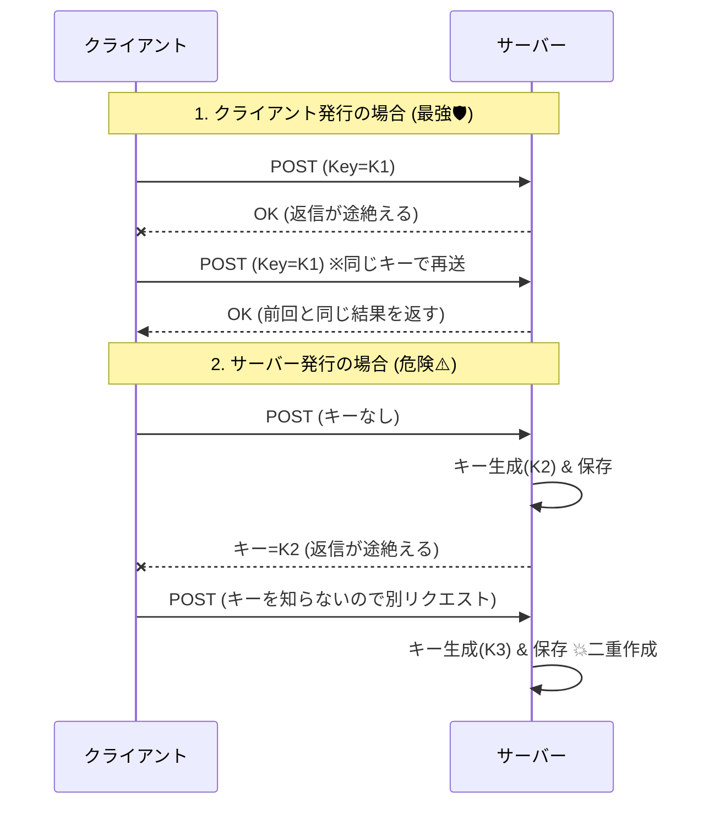
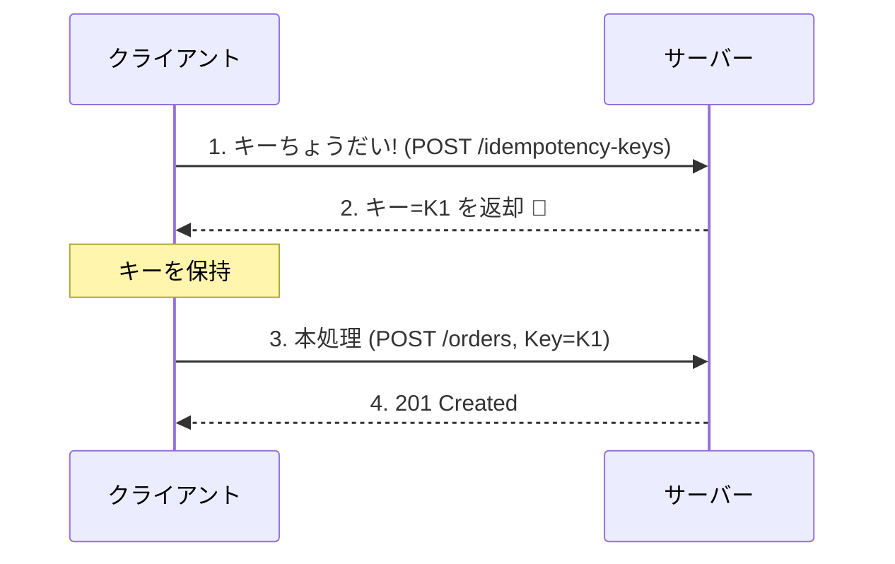

# 第11章：冪等キーをどこで作る？（クライアント発行 vs サーバー発行）🤔


## この章のゴール🎯✨

* 「冪等キーって、誰が作るのが正解なの？」に自信を持って答えられる🙆‍♀️
* **クライアント発行 / サーバー発行**のメリデメを、事故パターン込みで理解する💥
* 自分のAPI（例：注文作成）に合う方針を、理由つきで決められる✅

---

# まず超大事な結論💡🔁

**“リトライ（再送）で同じ結果にしたい”なら、基本はクライアント発行が強い**です💪
なぜなら、冪等キーは「同じ操作のやり直し」を見分ける札（チケット）で、**再送時に同じ札を出せる側（=クライアント）が持っているのが自然**だからです🎫✨ ([IETF Datatracker][1])

---

# なんで「どこで作るか」がそんなに重要なの？😵‍💫📶

一番起きやすい事故がこれ👇

## 事故シナリオ（タイムアウトの罠）⏳💥

1. クライアントが `POST /orders` を送る📮
2. サーバーは**実は成功**して注文を作った✅
3. でもネットが不安定で、クライアントは**タイムアウト扱い**になる😢
4. クライアントが「失敗した」と思って**同じ操作をもう一回送る**🔁

ここで…

* **サーバー発行**で、最初のレスポンス（キー）が届いてなかったら：クライアントは同じキーを知らない → 再送が別扱いになり、二重作成しがち😱



この「成功してるのに失敗に見える」問題に強いのが、クライアント発行の良さです🛡️✨（実例として、Stripeも「クライアントが冪等キーを生成する」前提で説明しています） ([Stripe Docs][2])

---

# 選択肢A：クライアント発行（おすすめ寄り）📱💻✨

## どんな感じ？😊

* クライアントが **UUID などのランダム文字列**を作る🎲
* リクエストヘッダーに `Idempotency-Key` を付けて送る📮
* 再送するときも **同じキーをそのまま使う**🔁

IETFの仕様ドラフトでも、冪等キーは「**クライアントが生成するユニーク値**」で、UUIDが推奨されています🧾✨ ([IETF Datatracker][1])

## 👍 強み

* タイムアウト・通信断でも、同じキーで再送できる📶🛡️
* 「二重クリック」「自動リトライ」に強い🖱️🔁
* 仕様が素直（“同じ操作”の印を付けるだけ）🎫

## 👀 注意点（ここで事故りがち！）💥

* **再送なのに毎回新しいキーを作っちゃう**
  → それ、冪等じゃなくて「毎回別注文」をお願いしてるのと同じ😇
* **同じキーを別の内容（別payload）で使い回す**
  → IETFドラフトでも「別payloadで再利用しない」ことが明確に書かれています🧨 ([IETF Datatracker][1])

---

# 選択肢B：サーバー発行（条件つきでアリ）🧾🏢

## よくある誤解😇

「サーバーが受け取ったあとにキーを発行して返せばいいじゃん！」

…って思いがちだけど、**そのレスポンスが届かなかったら終わり**です😵‍💫
クライアントはキーを知らないので、再送時に同じキーを出せません📛

## ✅ サーバー発行が活きるパターン

**“先にキーを受け取ってから本処理する”**みたいな2段階ならアリです🙆‍♀️

例：

1. `POST /idempotency-keys` → サーバーがキーを発行して返す🎫
2. `POST /orders`（ヘッダーにそのキーを付ける）→ 本処理📮

こうすると、クライアントは「再送用の札」を先に持てるので、通信が不安定でも戦いやすいです🛡️



---

# 比較表でスッキリ整理🧠✨

| 観点          | クライアント発行 🧑‍💻    | サーバー発行 🏢              |
| ----------- | ----------------- | ---------------------- |
| タイムアウト後の再送  | 強い💪（同じキーで再送できる）  | 弱い😢（キー受け取れてないと再送できない） |
| 実装の分かりやすさ   | まあ簡単（UUID生成して付ける） | 2段階にすると増える🧩           |
| クライアント管理の手間 | 少しある（キーを保持する）     | 少ない（ただし2段階なら増える）       |
| 実務の採用例      | 多い（決済系など）💳       | 限定的（2段階トークン方式など）       |

「POSTを安全にするには冪等キーを導入しよう」という一般的なベストプラクティスでも、同じキーで再送して同じ結果を返す考え方が前提です🔁 ([Postman Blog][3])

---

# 判断のコツ（ミニフローチャート）🧭✨

* 「通信が不安定でも再送したい？」
  → Yes ✅ → **クライアント発行が基本**
* 「クライアントがキーを保持できない/したくない？」
  → Yes ✅ → **サーバー発行（ただし2段階方式）**を検討
* 「そもそも自然冪等（PUT的に“同じIDで作る”）にできる？」
  → Yes ✅ → それが一番スッキリ（ただしこの章は冪等キー話なので補足ね😊）

---

# ミニ演習①：今回の教材（注文作成）ならどっち？🛒✅

次の前提で考えてみよう🌸

* ブラウザ or アプリから注文作成ボタンを押す🖱️📱
* タイムアウトが起きうる📶
* “同じ注文”が二重に作られたら困る😱

## 書くこと📝

* 採用：クライアント発行 / サーバー発行（2段階）
* 理由：事故シナリオ（タイムアウト→再送）にどう勝つかを1行で✨

---

# ミニ演習②：C#で冪等キーを作って「同じキーで再送」してみる🔁🧪

## 1) クライアント側：キー生成＆リクエスト送信（HttpClient）📮

```csharp
using System.Net.Http.Headers;
using System.Text;
using System.Text.Json;

// 1回の「注文作成操作」に対して、キーは1個だけ作る（再送でも同じキーを使う）
var idempotencyKey = Guid.NewGuid().ToString(); // UUIDでOK（推奨されがち）
var order = new { customerId = "C001", amount = 1200 };

using var http = new HttpClient { BaseAddress = new Uri("https://localhost:5001") };

async Task<HttpResponseMessage> SendAsync()
{
    var req = new HttpRequestMessage(HttpMethod.Post, "/orders");
    req.Headers.TryAddWithoutValidation("Idempotency-Key", idempotencyKey);

    var json = JsonSerializer.Serialize(order);
    req.Content = new StringContent(json, Encoding.UTF8, "application/json");

    return await http.SendAsync(req);
}

// 1回目
var res1 = await SendAsync();
var body1 = await res1.Content.ReadAsStringAsync();

// 2回目（同じキーで再送）
var res2 = await SendAsync();
var body2 = await res2.Content.ReadAsStringAsync();

Console.WriteLine($"1st: {(int)res1.StatusCode} {body1}");
Console.WriteLine($"2nd: {(int)res2.StatusCode} {body2}");
Console.WriteLine($"Same body? {body1 == body2}");
```

ポイント✨

* **再送（2回目）でも idempotencyKey を変えない**のが命です🔁💓
* IETFドラフトでも「キーはユニーク」「別payloadで使い回さない」「UUID推奨」って流れです🧾 ([IETF Datatracker][1])
* Stripeも「クライアントがキーを生成」して「同じ結果（成功も失敗も）を返す」方式です📮 ([Stripe Docs][2])

---

# よくある落とし穴トップ5💣😇

1. **再送のたびに新しいキーを作る**（＝冪等化できてない）🔁❌
2. **同じキーで別の内容を送る**（＝危険、サーバー側で弾くのが推奨）🧨 ([IETF Datatracker][1])
3. キーを短すぎる/推測しやすいものにする（連番とか）🔢❌
4. 「キーが無いときはサーバーが勝手に作る」で安心しちゃう（再送で困る）😵‍💫
5. 「同時に2リクエスト来た」ケースを忘れる（これは次の並行章で地獄を見る🏎️💥）

---

# AI活用🤖💬（Copilot/Codex向け）

* 「注文作成の“操作単位”で冪等キーを生成・保持する設計案を3つ出して（Web/アプリ別）」
* 「“キーの使い回し”事故が起きるコード例を作って、レビュー観点も書いて」
* 「Idempotency-Key を必須にする場合のエラーレスポンス設計案（400/422/409）を比較して」
  IETFドラフトには、ヘッダー必須時の400や、別payload再利用時の422案なども載っています🧾 ([IETF Datatracker][1])

---

# 小テスト（3問）🐣📝

## Q1：冪等キーを再送のたびに作り直すとどうなる？😇

**A：** 冪等にならず、再送が別操作扱いになる（注文が増える可能性）💥

## Q2：「サーバー発行」が活きるのはどんな設計？🧩

**A：** 先にキー（トークン）を発行してクライアントが保持し、その後の本処理で使う“2段階方式”🎫➡️📮

## Q3：同じ冪等キーを別payloadで使い回すのはOK？🧨

**A：** ダメ🙅‍♀️（別payloadで再利用しないのが前提。弾く設計が推奨） ([IETF Datatracker][1])

---

# まとめ🎀🔁

* 冪等キーは「同じ操作の札」🎫
* **再送で同じ札を出せる**のが超重要 → だから基本は **クライアント発行**が強い💪✨ ([IETF Datatracker][1])
* サーバー発行は **2段階方式**にできるなら選択肢になる🧩
* 次章では「その札（キー）をどこに保存して、どうやって同じ結果を返すか」へ進むよ🗃️📮

[1]: https://datatracker.ietf.org/doc/draft-ietf-httpapi-idempotency-key-header/ "
            
    
        draft-ietf-httpapi-idempotency-key-header-07 - The Idempotency-Key HTTP Header Field
    

        "
[2]: https://docs.stripe.com/api/idempotent_requests "docs.stripe.com"
[3]: https://blog.postman.com/rest-api-best-practices/?utm_source=chatgpt.com "REST API Best Practices: A Developer's Guide to Building ..."
