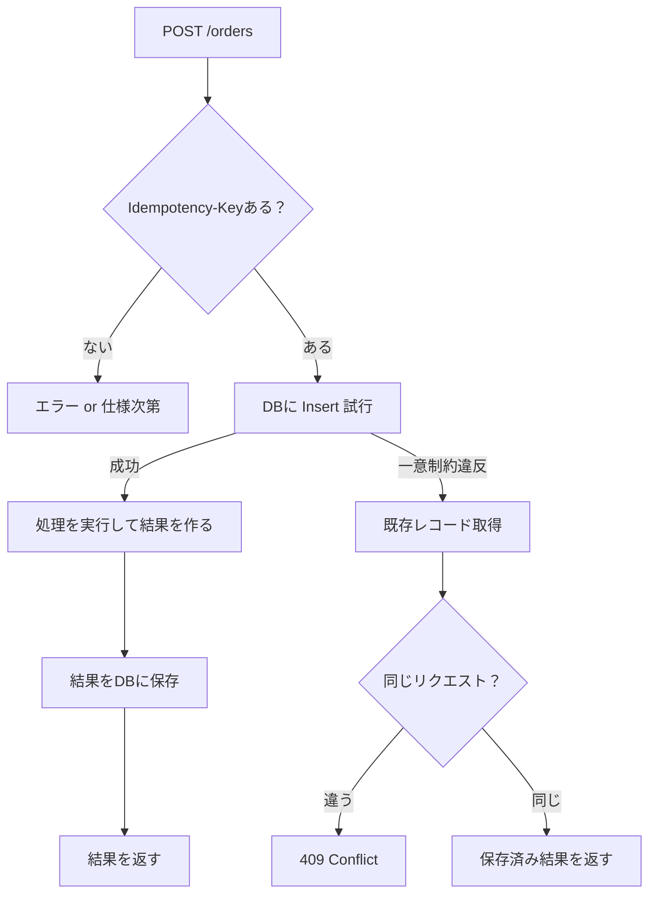
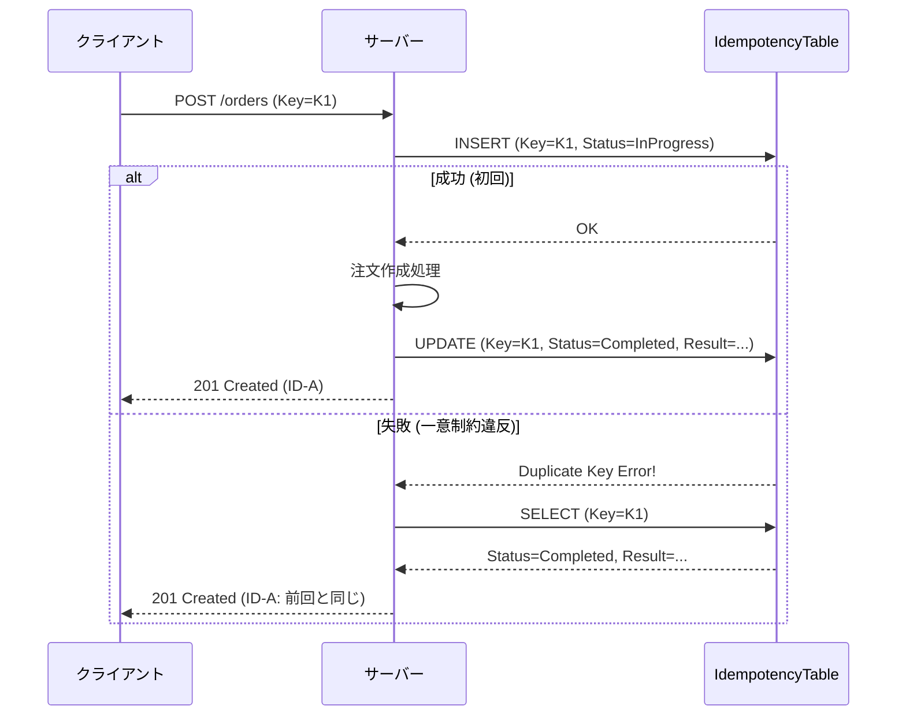

# 第12章：冪等キーの保存（まずDBでやる）🗃️🛡️


## この章でできるようになること 🎯✨

* **Idempotency-Key（冪等キー）** をDBに保存して、同じリクエストが何回きても **「1回分の結果」だけ返せる** ようにする🔁
* **一意制約（ユニーク制約）** を使って「同じキーは1回だけ」を **DBの力で保証** できるようになる💪🧱
* **同じキーなのに中身が違う**（危険！）ケースを検出して止められるようになる⚠️🚫

> `Idempotency-Key` は、POST/PATCHみたいな「本来は冪等じゃない」操作を“安全にリトライ可能”にするための仕組みとして広く使われています📮✨ ([MDN ウェブドキュメント][1])

---

## 12.1 まずDB保存がいちばん早い理由 🏃‍♀️💨

キャッシュ（Redis等）より先にDBでやると嬉しいこと👇

* **永続化**される（サーバー再起動でも消えない）🧊
* **一意制約＋トランザクション**で、並行アクセスでも「1回だけ」を作りやすい🛡️
* 監査っぽく「いつ・誰が・何を」も残せる🕵️‍♀️✨

Stripeみたいな決済系でも、**冪等キーで“二重実行”を防ぐ**のが王道です💳🔁 ([Stripe Docs][2])

---

## 12.2 仕組みの全体像（超ざっくり図）🗺️✨



ポイントはココ👇

* **最初にInsertして席を取る**🎟️
* ダブったら **既存の結果を返す**📦

---

## 12.3 テーブル設計：IdempotencyRequests 🧾✨

### 最小でも欲しいカラム（おすすめ）✅

* `Id`（主キー）
* `ClientId`（誰のキーか）👤
* `Key`（Idempotency-Key本体）🔑
* `Method`（POSTなど）📮
* `Path`（/ordersなど）🧭
* `RequestHash`（同じキーで中身違いを検知）🧠
* `Status`（InProgress/Completedなど）🚦
* `ResponseStatusCode`（201とか）📌
* `ResponseBodyJson`（返したい本文）📦
* `CreatedAt` / `CompletedAt`（運用で効く）⏰

> **同じキーなのに別内容**は超危険⚠️
> → `RequestHash` を残して「別内容なら409で止める」が安全です🧱✨（Stripe系も“同じキーは同じ内容で使う”のが基本思想） ([Stripe Docs][2])

---

## 12.4 一意制約（ユニーク制約）の貼り方 🧷🛡️

この章のキモ！💥
**「同じ (ClientId, Key) は1件だけ」** にします。

SQL Serverではユニーク制約とユニークインデックスは実質かなり近く、どちらでも「重複を防ぐ」目的を達成できます🔒 ([Microsoft Learn][3])

EF Core側では「Uniqueなインデックス」を作るのが手早いです✨ ([Microsoft Learn][4])

---

## 12.5 実装：EF Core 10 + Web API（サンプル）🧑‍💻✨

この章は **EF Core 10（.NET 10世代）** で書きます🧱✨ ([Microsoft Learn][5])

### 12.5.1 エンティティ定義 🧩

```csharp
using System.ComponentModel.DataAnnotations;

public sealed class IdempotencyRequest
{
    public long Id { get; set; }

    [MaxLength(100)]
    public required string ClientId { get; set; }   // 例: ユーザーID / APIキーID

    [MaxLength(128)]
    public required string Key { get; set; }        // Idempotency-Key

    [MaxLength(10)]
    public required string Method { get; set; }     // POST 等

    [MaxLength(256)]
    public required string Path { get; set; }       // /orders 等

    [MaxLength(64)]
    public required string RequestHash { get; set; } // SHA-256(先頭64桁など)

    [MaxLength(20)]
    public required string Status { get; set; }     // InProgress / Completed

    public int? ResponseStatusCode { get; set; }
    public string? ResponseBodyJson { get; set; }

    public DateTimeOffset CreatedAt { get; set; }
    public DateTimeOffset? CompletedAt { get; set; }
}

public sealed class Order
{
    public Guid Id { get; set; }
    public required string CustomerId { get; set; }
    public DateTimeOffset CreatedAt { get; set; }
}
```

---

### 12.5.2 DbContext と一意制約 🧱🔒

```csharp
using Microsoft.EntityFrameworkCore;

public sealed class AppDbContext : DbContext
{
    public DbSet<Order> Orders => Set<Order>();
    public DbSet<IdempotencyRequest> IdempotencyRequests => Set<IdempotencyRequest>();

    public AppDbContext(DbContextOptions<AppDbContext> options) : base(options) {}

    protected override void OnModelCreating(ModelBuilder modelBuilder)
    {
        modelBuilder.Entity<IdempotencyRequest>()
            .HasIndex(x => new { x.ClientId, x.Key })
            .IsUnique();

        modelBuilder.Entity<IdempotencyRequest>()
            .HasIndex(x => new { x.CreatedAt });

        modelBuilder.Entity<Order>()
            .HasKey(x => x.Id);
    }
}
```

---

### 12.5.3 リクエストハッシュ（同じキーで別内容を弾く）🧠🧷

```csharp
using System.Security.Cryptography;
using System.Text;
using System.Text.Json;

public static class RequestHashing
{
    private static readonly JsonSerializerOptions JsonOpts = new()
    {
        PropertyNamingPolicy = JsonNamingPolicy.CamelCase
    };

    public static string Hash(string method, string path, object body)
    {
        var json = JsonSerializer.Serialize(body, JsonOpts);
        var raw = $"{method}\n{path}\n{json}";
        var bytes = SHA256.HashData(Encoding.UTF8.GetBytes(raw));
        // 64文字のHexにして保存（全部でもOK）
        return Convert.ToHexString(bytes);
    }
}
```

---

## 12.6 いちばん大事：Insertで“席取り”してから実処理する🎟️➡️🛒


「先に実処理して、後でキー保存」だと…
ほぼ同時に2発来た時に **両方実行されてから保存** みたいな事故が起きがち😇💥
だから👇

* **最初に Insert を試す**
* 失敗したら **既存を見て返す**



---

## 12.7 API実装（POST /orders）📮🛒

### 12.7.1 DTO

```csharp
public sealed record CreateOrderRequest(string CustomerId);

public sealed record CreateOrderResponse(Guid OrderId, DateTimeOffset CreatedAt);
```

### 12.7.2 Program.cs（最小構成サンプル）

```csharp
using Microsoft.AspNetCore.Mvc;
using Microsoft.EntityFrameworkCore;
using System.Text.Json;

var builder = WebApplication.CreateBuilder(args);

// DbContext: SQL Server 例（接続文字列は appsettings.json 等へ）
builder.Services.AddDbContext<AppDbContext>(opt =>
    opt.UseSqlServer(builder.Configuration.GetConnectionString("Default")));

var app = builder.Build();

app.MapPost("/orders", async (
    [FromBody] CreateOrderRequest req,
    HttpContext http,
    AppDbContext db) =>
{
    var key = http.Request.Headers["Idempotency-Key"].ToString();
    var clientId = http.Request.Headers["X-Client-Id"].ToString();

    if (string.IsNullOrWhiteSpace(clientId))
        return Results.BadRequest(new { message = "X-Client-Id が必要です🙏" });

    if (string.IsNullOrWhiteSpace(key))
        return Results.BadRequest(new { message = "Idempotency-Key が必要です🙏" });

    var method = http.Request.Method.ToUpperInvariant();
    var path = http.Request.Path.ToString();
    var reqHash = RequestHashing.Hash(method, path, req);

    await using var tx = await db.Database.BeginTransactionAsync();

    // ① まず席取り（Insert）
    var ticket = new IdempotencyRequest
    {
        ClientId = clientId,
        Key = key,
        Method = method,
        Path = path,
        RequestHash = reqHash,
        Status = "InProgress",
        CreatedAt = DateTimeOffset.UtcNow
    };

    db.IdempotencyRequests.Add(ticket);

    try
    {
        await db.SaveChangesAsync();
    }
    catch (DbUpdateException)
    {
        // ② すでに同じキーがある → 既存を見に行く
        var existing = await db.IdempotencyRequests
            .SingleAsync(x => x.ClientId == clientId && x.Key == key);

        // 同じキーで別内容は危険なので止める⚠️
        if (!string.Equals(existing.RequestHash, reqHash, StringComparison.Ordinal))
            return Results.Conflict(new { message = "同じIdempotency-Keyで内容が違います⚠️（別のキーを使ってね）" });

        // すでに完了済みなら、保存済み結果を返す📦
        if (existing.Status == "Completed" && existing.ResponseBodyJson is not null)
        {
            return Results.Content(
                existing.ResponseBodyJson,
                "application/json",
                System.Text.Encoding.UTF8,
                statusCode: existing.ResponseStatusCode ?? 200);
        }

        // まだ処理中っぽい（この扱いの作り込みは次の章でやる）🌀
        return Results.Conflict(new { message = "処理中です🌀 少し待って同じキーで再送してね" });
    }

    // ③ ここまで来たら「このキーは自分が初回の担当」✨
    var order = new Order
    {
        Id = Guid.NewGuid(),
        CustomerId = req.CustomerId,
        CreatedAt = DateTimeOffset.UtcNow
    };

    db.Orders.Add(order);
    await db.SaveChangesAsync();

    var response = new CreateOrderResponse(order.Id, order.CreatedAt);

    // ④ 結果を保存（この章のテーマ！）🗃️
    ticket.Status = "Completed";
    ticket.ResponseStatusCode = 201;
    ticket.ResponseBodyJson = JsonSerializer.Serialize(response);
    ticket.CompletedAt = DateTimeOffset.UtcNow;

    await db.SaveChangesAsync();
    await tx.CommitAsync();

    return Results.Created($"/orders/{order.Id}", response);
});

app.Run();
```

---

## 12.8 動作確認（同じキーで同じ結果になる！）🔁✅

### 12.8.1 1回目（新規作成）🛒✨

* `Idempotency-Key: AAA...`
* 結果：`201 Created`、`orderId = 123...` が返る

### 12.8.2 2回目（同じキーで再送）🔁📮

* **同じ** `Idempotency-Key` と **同じ** body
* 結果：**同じ `orderId`** が返る（＝二重作成されない）🎉

### 12.8.3 NG例（同じキーで別内容）⚠️

* `Idempotency-Key` は同じなのに `CustomerId` を変えた
* 結果：`409 Conflict`（危険なので止める）🚫

---

## 12.9 よくある落とし穴集 🕳️😵‍💫

### 落とし穴1：キーの“範囲”が広すぎる🌍

同じキーが別ユーザーでぶつかると地獄…
✅ 対策：`(ClientId, Key)` をセットで一意にする👤🔑

### 落とし穴2：結果を保存しない（キーだけ保存）📌

キーだけだと「2回目に何返すの？」ってなる💦
✅ 対策：**レスポンス（少なくともID）を保存**して返せるようにする📦

### 落とし穴3：保存するレスポンスに個人情報を入れすぎる🔐

✅ 対策：**必要最小限**（注文IDなど）にする🧊
（“レスポンス再利用の注意”は次章以降でさらに深掘りするよ📚）

### 落とし穴4：DB例外の扱いを雑にして全部飲み込む🍽️

✅ 対策：この章のサンプルはシンプル重視だけど、実務では「何の例外か」ログで追えるようにする🔎

---

## 12.10 ミニ演習（手を動かすやつ）🧪✨

1. `IdempotencyRequests` に `ExpiresAt` カラムを追加してみよう⏳
2. 一意制約を `(ClientId, Key, Method, Path)` に変えると何が嬉しい？ 1行で書こう📝
3. `ResponseBodyJson` の代わりに「OrderIdだけ保存」に変えてみよう（サイズ削減）📦➡️🧊

---

## 12.11 小テスト（5問）📝🌸

1. DB保存方式で、最初にやるべきなのは「処理の実行」？それとも「席取りInsert」？🎟️
2. 一意制約は何を防ぐために貼る？🔒
3. 同じIdempotency-Keyで内容が違うとき、なぜ危険？⚠️
4. `ClientId` をキーに含めるのはなぜ？👤
5. `Idempotency-Key` はどんなHTTPメソッドを“安全にリトライ”できるようにする狙いがある？📮

**答え**✅

1. 席取りInsert（先にInsertして「1回だけ」を確保）
2. 同じキーの重複登録（＝二重実行）
3. 別リクエストが“同じチケット”を奪い合うから（結果がズレる）
4. ユーザー間衝突を防ぐため
5. 本来は冪等でない `POST/PATCH` などを、キーで冪等化する狙いがある ([MDN ウェブドキュメント][1])

[1]: https://developer.mozilla.org/en-US/docs/Web/HTTP/Reference/Headers/Idempotency-Key?utm_source=chatgpt.com "Idempotency-Key header - HTTP - MDN Web Docs"
[2]: https://docs.stripe.com/api/idempotent_requests?utm_source=chatgpt.com "Idempotent requests | Stripe API Reference"
[3]: https://learn.microsoft.com/en-us/sql/relational-databases/indexes/create-unique-indexes?view=sql-server-ver17&utm_source=chatgpt.com "Create a unique index - SQL Server"
[4]: https://learn.microsoft.com/en-us/ef/core/modeling/indexes?utm_source=chatgpt.com "Indexes - EF Core"
[5]: https://learn.microsoft.com/en-us/ef/core/what-is-new/ef-core-10.0/whatsnew?utm_source=chatgpt.com "What's New in EF Core 10"
