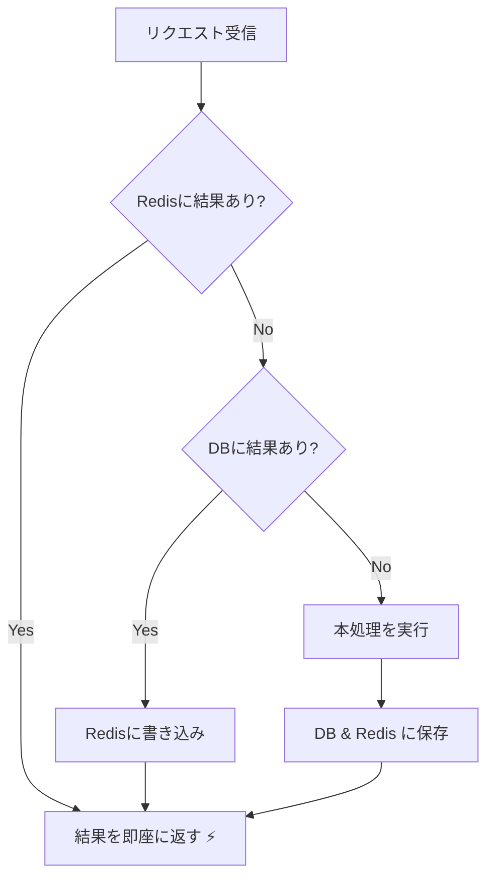
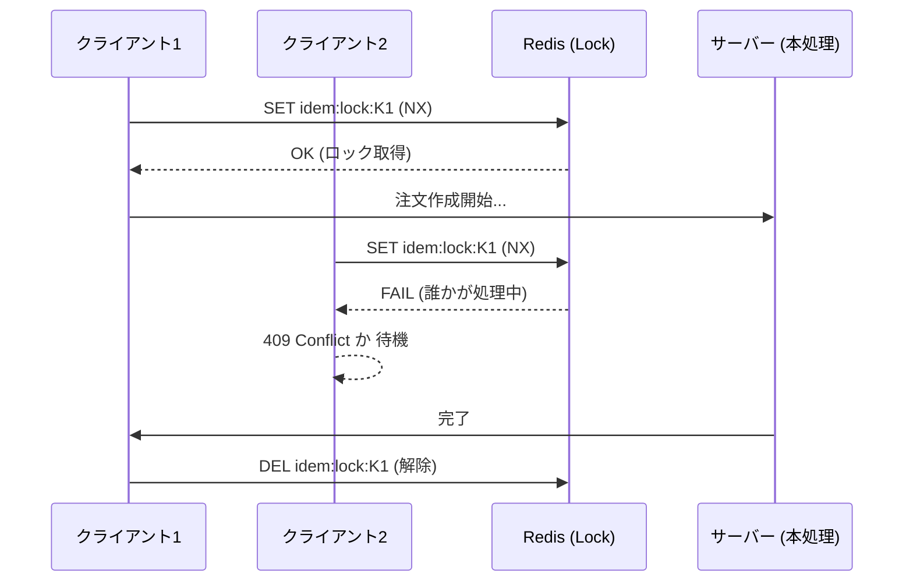

# 第13章：冪等キー保存（Redis/キャッシュ等）発展⚡


## 13.1 この章でできるようになること🎯✨

* Redis（分散キャッシュ）で **冪等キーの保存・再利用** をする目的がわかる🔁
* **DB方式 vs Redis方式** のメリデメを、理由つきで説明できるようになる📊
* ASP.NET Core で **「同じIdempotency-Keyなら同じ結果」** を返すミニ実装ができる🛠️
* **Redisならではの落とし穴（揮発・TTL・並行・運用）** を避けられるようになる🧯

---

## 13.2 Redis / 分散キャッシュって何？🧊🏎️

分散キャッシュは、複数台のWebサーバーで **同じキャッシュを共有** できる仕組みだよ📦
「1台のメモリに貯める」のと違って、サーバーを増やしてもキャッシュが共有できるのが強み✨ ([Microsoft Learn][1])

Redisは、その分散キャッシュの代表格で **超高速（メモリ中心）** なストアだよ⚡
.NETだと `StackExchange.Redis` が定番クライアントで、Redis互換サーバーにも広く対応してるよ（例：Redis/Valkey/Garnetなど）🔌 ([NuGet][2])

---

## 13.3 まず結論：Redisは「速い」けど「正しさの最終防衛ライン」にはしにくい🧊⚠️

冪等性って、どちらかというと **速度より正しさが大事** な分野だよね🔒
Redisは速いけど、運用次第でこうなる可能性があるよ👇

* メモリ逼迫で **古いキーが消える（eviction）** 😱
* フェイルオーバー等で **一時的に読み書きが不安定** 🌀
* TTLや掃除が雑だと **想定より早く消える／残り続ける** 🧹⏳

なのでおすすめは「Redisだけで完結」より、
**“DBを本命”にしてRedisで高速化**（二層構え）にする設計が多いよ🥐✨

---

## 13.4 DB方式 vs Redis方式 比較表📊✨

| 観点     | DB保存（第12章）🗃️            | Redis保存（第13章）⚡            |
| ------ | ------------------------ | ------------------------- |
| 速度     | 普通（最適化次第）🚶              | 速い（基本メモリ）🏎️              |
| 耐久性    | 強い（永続）🧱                 | 弱くなりがち（揮発/運用依存）🫧         |
| 正しさの担保 | 一意制約・トランザクションが強い🛡️      | 設計しないと「消えたら負け」になりがち⚠️     |
| TTL/掃除 | 仕組みは自分で作る🧹              | TTLが得意（自然に期限切れ）⏳          |
| 運用     | DBだけで完結しやすい🙂            | Redis運用が増える（監視/容量/障害対応）🧯 |
| 向く用途   | **正しさ最優先**（課金・在庫・予約）💳📦 | **短時間の再送対策**（連打・リトライ吸収）🔁 |

---

## 13.5 Redisが刺さるケース✅ / やめたほうがいいケース⚠️

### ✅ Redisが刺さる（気持ちよく効く）✨

* 同じリクエストが **短時間に集中** して来る（連打・自動リトライ）📱🔁
* 冪等キーの保持が **数分〜数時間** で十分（超長期保持しない）⏳
* “2回目以降は前回レスポンスを返す” を **高速化** したい📮⚡

### ⚠️ Redisだけに寄せるのは危ない（特に初心者は要注意）😵

* 課金・在庫・予約など **ミスが致命傷** の領域💥
* “数日〜数ヶ月保持したい” みたいな **長TTL前提** 🗓️
* Redis障害時に「二重実行してもOK」みたいな **逃げ道がない** 😭

---

## 13.6 設計パターン3つ（おすすめ順）🥇🥈🥉

### 🥇 パターンA：DB本命 + Redis高速化（二層）🍰

1. Redisに結果があれば即返す⚡
2. なければDBを見る🗃️
3. DBにあったらRedisにも載せる（次から速い）✨

→ **正しさはDB、速度はRedis** のいいとこ取り💕



### 🥈 パターンB：Redisで「処理中ロック」®️だけやる🔒

* Redisの `SET NX`（= まだ無ければセット）で「今処理してるよ」を表現
* 結果保存はDB、またはRedis（状況次第）

→ **並行実行の暴走** を抑えるのに強い🏎️💥

### 🥉 パターンC：Redis完結（結果も全部Redis）⚡

* 超高速だけど、運用や障害時の設計が難しい😇
* 初学者教材では「知っておく」止まりが安全🧯

---

## 13.7 実装ハンズオン：ASP.NET Core + Redisで冪等キーを保存する🛠️✨

### 13.7.1 使うライブラリ（本日時点の代表例）📦

* `Microsoft.Extensions.Caching.StackExchangeRedis`（分散キャッシュ実装） ([NuGet][3])
* `StackExchange.Redis`（Redisクライアント本体） ([NuGet][2])

> メモ：`IDistributedCache` は便利だけど、**冪等の“ロック（SET NX）”** は直接 `StackExchange.Redis` を使うのが分かりやすいよ🔑

---

### 13.7.2 Redisをローカルで起動（Dockerがラク）🐳🪟

Docker Desktop を使うと、Windowsでもサクッと動くよ✨

```powershell
docker run --name redis -p 6379:6379 -d redis:8
```

---

### 13.7.3 依存パッケージ追加📦✨

```powershell
dotnet add package Microsoft.Extensions.Caching.StackExchangeRedis
dotnet add package StackExchange.Redis
```

---

### 13.7.4 appsettings.json（接続文字列だけ）🔌

```json
{
  "ConnectionStrings": {
    "Redis": "localhost:6379"
  }
}
```

---

### 13.7.5 実装の考え方（超重要）🧠🔑

今回はキーを2種類に分けるよ👇

* `idem:res:{key}` … **結果（レスポンス）** を保存📮
* `idem:lock:{key}` … **処理中ロック**（並行実行の暴走止め）🔒

そして流れはこう👇

1. `idem:res` があれば、それを返す（再利用）🔁
2. なければ `idem:lock` を `SET NX` で取りに行く🔒
3. 取れた人だけ本処理 → 結果を `idem:res` に保存📮
4. 取れなかった人は「処理中」を返す（または少し待って再取得）🌀



---

### 13.7.6 Program.cs（Minimal APIサンプル）🧪✨

```csharp
using System.Security.Cryptography;
using System.Text;
using System.Text.Json;
using Microsoft.Extensions.Caching.Distributed;
using StackExchange.Redis;

var builder = WebApplication.CreateBuilder(args);

// Distributed Cache (Redis)
builder.Services.AddStackExchangeRedisCache(options =>
{
    options.Configuration = builder.Configuration.GetConnectionString("Redis");
    options.InstanceName = "IdemDemo:"; // prefix
});

// Redis client (for SET NX lock)
builder.Services.AddSingleton<IConnectionMultiplexer>(sp =>
{
    var cs = builder.Configuration.GetConnectionString("Redis") ?? "localhost:6379";
    return ConnectionMultiplexer.Connect(cs);
});

builder.Services.AddSingleton<RedisIdempotencyStore>();
builder.Services.AddSingleton<OrderService>();

var app = builder.Build();

app.MapPost("/orders", async (HttpContext ctx, CreateOrderRequest req, RedisIdempotencyStore idem, OrderService orders) =>
{
    // 1) Idempotency-Key header
    if (!ctx.Request.Headers.TryGetValue("Idempotency-Key", out var keyValues) ||
        string.IsNullOrWhiteSpace(keyValues.ToString()))
    {
        return Results.BadRequest(new { message = "Idempotency-Key header is required." });
    }

    var idemKey = keyValues.ToString().Trim();

    // 2) request hash (same key used for different body = NG)
    var requestHash = HashRequest(req);

    // 3) if cached response exists -> return it
    var cached = await idem.TryGetCachedResponseAsync(idemKey);
    if (cached is not null)
    {
        if (!string.Equals(cached.RequestHash, requestHash, StringComparison.Ordinal))
        {
            return Results.Conflict(new { message = "Same Idempotency-Key used with a different request body." });
        }
        return Results.Text(cached.Body, contentType: cached.ContentType, statusCode: cached.StatusCode);
    }

    // 4) try acquire "in-progress" lock (SET NX)
    var token = Guid.NewGuid().ToString("N");
    var lockResult = await idem.TryBeginAsync(idemKey, token, requestHash);

    if (!lockResult.Acquired)
    {
        // someone else is processing (or already processed but not yet visible)
        // if request hash differs, return Conflict early
        if (lockResult.LockedRequestHash is not null &&
            !string.Equals(lockResult.LockedRequestHash, requestHash, StringComparison.Ordinal))
        {
            return Results.Conflict(new { message = "Same Idempotency-Key is currently used by another request with different body." });
        }

        // "processing" response (simple)
        ctx.Response.Headers["Retry-After"] = "1";
        return Results.StatusCode(StatusCodes.Status409Conflict);
    }

    try
    {
        // 5) perform the real side effect
        var created = await orders.CreateOrderAsync(req);

        var response = new CachedResponse(
            RequestHash: requestHash,
            StatusCode: StatusCodes.Status201Created,
            ContentType: "application/json; charset=utf-8",
            Body: JsonSerializer.Serialize(created)
        );

        // 6) save result to redis with TTL
        await idem.SaveCachedResponseAsync(idemKey, response);

        return Results.Text(response.Body, contentType: response.ContentType, statusCode: response.StatusCode);
    }
    finally
    {
        // 7) release lock safely (delete only if token matches)
        await idem.EndAsync(idemKey, token);
    }
});

app.Run();

static string HashRequest<T>(T obj)
{
    var json = JsonSerializer.Serialize(obj);
    var bytes = SHA256.HashData(Encoding.UTF8.GetBytes(json));
    return Convert.ToHexString(bytes);
}

public sealed record CreateOrderRequest(string CustomerId, int Amount);
public sealed record OrderCreated(string OrderId, string CustomerId, int Amount, DateTimeOffset CreatedAt);

public sealed class OrderService
{
    public async Task<OrderCreated> CreateOrderAsync(CreateOrderRequest req)
    {
        // demo: pretend DB write / external call
        await Task.Delay(300);
        return new OrderCreated(
            OrderId: Guid.NewGuid().ToString("N"),
            CustomerId: req.CustomerId,
            Amount: req.Amount,
            CreatedAt: DateTimeOffset.UtcNow
        );
    }
}

public sealed record CachedResponse(string RequestHash, int StatusCode, string ContentType, string Body);

public sealed class RedisIdempotencyStore
{
    private readonly IDistributedCache _cache;
    private readonly IDatabase _db;

    // results keep longer, lock is short
    private static readonly TimeSpan ResultTtl = TimeSpan.FromHours(24);
    private static readonly TimeSpan LockTtl = TimeSpan.FromMinutes(2);

    public RedisIdempotencyStore(IDistributedCache cache, IConnectionMultiplexer mux)
    {
        _cache = cache;
        _db = mux.GetDatabase();
    }

    private static string ResKey(string idemKey) => $"idem:res:{idemKey}";
    private static string LockKey(string idemKey) => $"idem:lock:{idemKey}";

    public async Task<CachedResponse?> TryGetCachedResponseAsync(string idemKey)
    {
        var json = await _cache.GetStringAsync(ResKey(idemKey));
        if (string.IsNullOrWhiteSpace(json)) return null;
        return JsonSerializer.Deserialize<CachedResponse>(json);
    }

    public async Task SaveCachedResponseAsync(string idemKey, CachedResponse response)
    {
        var json = JsonSerializer.Serialize(response);
        await _cache.SetStringAsync(
            ResKey(idemKey),
            json,
            new DistributedCacheEntryOptions { AbsoluteExpirationRelativeToNow = ResultTtl }
        );
    }

    public async Task<(bool Acquired, string? LockedRequestHash)> TryBeginAsync(string idemKey, string token, string requestHash)
    {
        // lock value = "token|hash"
        var value = $"{token}|{requestHash}";

        var acquired = await _db.StringSetAsync(
            LockKey(idemKey),
            value,
            expiry: LockTtl,
            when: When.NotExists
        );

        if (acquired) return (true, null);

        // someone has the lock -> read hash to detect mismatch
        var existing = await _db.StringGetAsync(LockKey(idemKey));
        if (!existing.HasValue) return (false, null);

        var parts = existing.ToString().Split('|', 2);
        return (false, parts.Length == 2 ? parts[1] : null);
    }

    public async Task EndAsync(string idemKey, string token)
    {
        // delete lock only if token matches (avoid deleting someone else's lock)
        const string lua = """
        if redis.call("GET", KEYS[1]) then
          local v = redis.call("GET", KEYS[1])
          local token = string.match(v, "^(.-)|")
          if token == ARGV[1] then
            return redis.call("DEL", KEYS[1])
          end
        end
        return 0
        """;

        await _db.ScriptEvaluateAsync(lua, new RedisKey[] { LockKey(idemKey) }, new RedisValue[] { token });
    }
}
```

---

### 13.7.7 動作確認（PowerShellで“連打”再現）🔁🧪

同じ `Idempotency-Key` で2回叩くよ👇

```powershell
$k = "demo-001"
$body = '{ "customerId": "C001", "amount": 1200 }'

# 1回目（作成される）
Invoke-RestMethod -Method Post "http://localhost:5000/orders" `
  -Headers @{ "Idempotency-Key" = $k } `
  -ContentType "application/json" `
  -Body $body

# 2回目（同じ結果が返るのが理想！）
Invoke-RestMethod -Method Post "http://localhost:5000/orders" `
  -Headers @{ "Idempotency-Key" = $k } `
  -ContentType "application/json" `
  -Body $body
```

さらに「同じキーで別ボディ」をやると `409 Conflict` になるはずだよ🧨✨（事故防止！）

---

## 13.8 Redis方式の落とし穴10個🕳️😵‍💫

1. **TTL短すぎ**：再送が来た頃に消えてる⏳
2. **TTL長すぎ**：メモリを食い続ける🍔
3. **キーの粒度ミス**：エンドポイントやテナントを混ぜると地獄🌀
4. **同じキーで別ボディ**：別注文が同じ結果として返る😱
5. **ロック無し**：並行で2回実行される🏎️💥
6. **ロックTTL短すぎ**：処理中にロックが切れて別リクエストが走る🧨
7. **ロック削除が雑**：他人のロックを消してしまう（トークン必須）🔑
8. **レスポンス保存が重い**：大きいJSONを入れると辛い📦
9. **個人情報の保存**：キャッシュに残るものは最小限に🫣
10. **セキュリティ更新放置**：Redisはセキュリティ修正が入るので、更新をサボると危険になりやすいよ🧯（例：8.0系でもセキュリティ修正が案内されてる） ([Redis][4])

---

## 13.9 1分で説明チャレンジ🎤💡

次を「1分で」言えたら勝ち🏆✨

* Redis方式は **短時間の重複を速く潰す** のが得意⚡
* でもRedisは **消える/揺れる可能性** があるから、正しさ最優先ならDBが本命🗃️
* 実装は **結果キャッシュ + 処理中ロック（SET NX）** がセット🔒📮

---

## 13.10 小テスト📝🌸

**Q1.** Redisで冪等キー保存をする一番のメリットは？
A) 一意制約が強い　B) とにかく速い　C) 永続化が簡単

**Q2.** 「同じIdempotency-Keyで別のリクエストボディ」が危険なのはなぜ？😱

**Q3.** ロック削除にトークンが必要な理由は？🔑

---

## 13.11 章末課題🎁✨

次を満たすように改造してみよう💪

* `409 Processing` のとき、**1秒待ってから結果を再取得** する（最大3回）⏳🔁
* 結果保存に `OrderId` だけじゃなく、**Locationヘッダ相当**（例：`/orders/{id}`）も返せるようにする📍
* TTLを「1時間」に変えて、動きを確認する（短すぎ問題も観察👀）

---

## 13.12 AI活用プロンプト集🤖✨

* 「この冪等実装、並行実行で壊れるパターンを列挙して🌀」
* 「RedisのSET NXロックで、期限切れ時に起きる事故を説明して😵」
* 「同じIdempotency-Keyで別ボディを弾く方法を3つ提案して🔑」
* 「このコードを“読みやすい命名”にして、責務分割して（Service/Store）🧩」
* 「Redis障害時のフォールバック案（DBを見る等）を設計して🧯」

---

[1]: https://learn.microsoft.com/en-us/aspnet/core/performance/caching/distributed?view=aspnetcore-10.0&utm_source=chatgpt.com "Distributed caching in ASP.NET Core"
[2]: https://www.nuget.org/packages/stackexchange.redis?utm_source=chatgpt.com "StackExchange.Redis 2.10.1"
[3]: https://www.nuget.org/packages/microsoft.extensions.caching.stackexchangeredis?utm_source=chatgpt.com "Microsoft.Extensions.Caching.StackExchangeRedis 10.0.2"
[4]: https://redis.io/docs/latest/operate/oss_and_stack/stack-with-enterprise/release-notes/redisce/redisos-8.0-release-notes/?utm_source=chatgpt.com "Redis Open Source 8.0 release notes | Docs"
