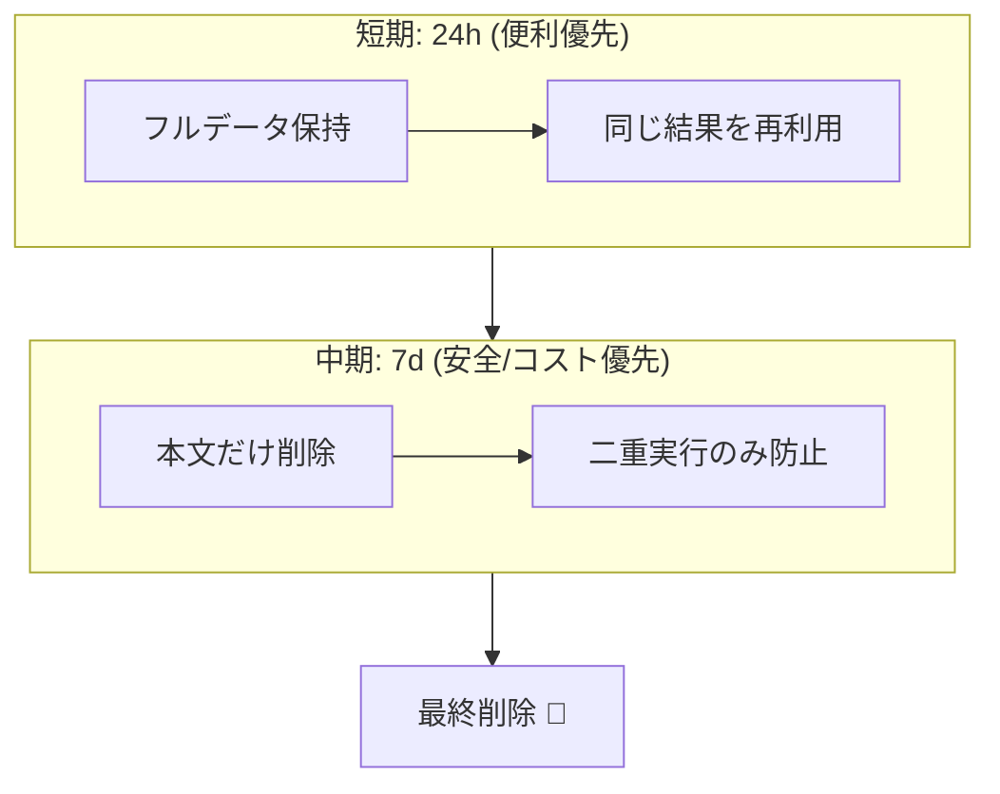

# 第14章：キーの寿命（TTL）とお掃除（データ肥大化対策）🧹⏳


## この章のゴール🎯

* 冪等キー（Idempotency Key）を **どれくらいの期間だけ有効にするか（TTL）** を、根拠つきで決められるようになる😊
* 保存データが増えすぎて **DBが重くなる事故** を防げるようになる💥
* **安全なお掃除（削除・間引き・アーカイブ）** のやり方を身につける🧼✨

---

# 1) TTLってなに？🕰️

TTL（Time To Live）は、ざっくり言うと

* 「この冪等キーは、**この期限までは同じ結果として扱う**」
* 「期限を過ぎたら、**古い冪等キーとして扱わない（またはエラー）**」

という“寿命”のことだよ🔑⏳

## TTLがないと起こること😇

冪等キーを保存し続けると…

* テーブルが **肥大化**（容量＆インデックスも増える）📈
* 検索・挿入・削除が **じわじわ遅くなる**🐢
* バックアップが重い、復旧が遅い、運用コストが増える💸
* レスポンスを保存している場合は、**個人情報や機密の保持期間** が長くなりがち⚠️

なので、TTLとお掃除は「冪等キー方式の必須パーツ」だよ🧩✨

---

# 2) TTLを決める “実務のものさし” 📏✨

TTLは「なんとなく」で決めると、だいたい事故る😵‍💫
だから、次の順で決めるのが安定だよ✅

## 2-1. まずは “リトライが起きうる時間” を想像する📶

* ユーザーの連打（秒〜数十秒）👆👆👆
* ネットワーク不安定（数十秒〜数分）🌧️
* クライアントの自動リトライ（数分〜数時間）🔁
* モバイルで一旦圏外→復帰（数分〜数時間）📱

## 2-2. 次に “ビジネス的に危険な重複期間” を考える💳🛒

* 決済・課金：**短くても必ず守りたい**（二重課金は地獄）🔥
* 注文作成：同じ注文が翌日に再送されても困る？どう困る？🤔
* 予約：二重予約は取り返しがつかないことが多い📅💥

## 2-3. 最後に “運用・コスト・データ保持” を合わせる🧾

* レスポンスを保存するなら、保持期間が長いほどリスク＆容量が増える⚠️
* 監査ログや問い合わせ対応の都合で、最低限の情報だけ長めに残したいこともある📌

---

# 3) よくあるTTLの目安（業界の例つき）🧠✨

「絶対こう！」はないけど、実例を“物差し”にすると決めやすいよ😊

* **24時間**：決済系でよく見る“短め基準”
  Stripe では、冪等キーを **少なくとも24時間** で扱う前提があり、古いキーは自動的に取り除ける（prune）考え方が示されてるよ。([Stripe Docs][1])
* **7日**：もう少し長めに守りたい基準
  Adyen では、冪等キーが **最低7日間有効** と明記されてるよ。([Adyen Docs][2])
* **“サーバーが保存している間だけ有効”**：API提供側は有効期間を明示してね、という考え方
  Idempotency-Key のIETFドラフトでも、サーバー側が **有効期限ポリシーを定めてドキュメント化すべき** とされてるよ。([IETF Datatracker][3])

> つまり「24時間〜7日」あたりが“現実的な範囲”になりやすい、ってことだね🔁✨

---

# 4) TTLを短くしすぎる vs 長くしすぎる😇💥

## 短すぎ事故（例：TTL 10分）⏱️💣

* ちょっとした障害でリトライが遅れただけで、同じキーが“新規扱い”になって二重実行😱
* 問い合わせ対応で「昨日の再送なのに別注文になった…」みたいな混乱が起きる🌀

## 長すぎ事故（例：TTL 180日）📦💥

* テーブルが太り続けて、インデックスが肥大化＆性能劣化🐢
* レスポンス保存してると、個人情報の保持が長くなって怖い😵
* 「同じキーをうっかり再利用」した時の影響が長期間残る（思わぬ衝突）⚠️

---

# 5) 超おすすめ：保存を “2段階” にする設計🧽🧺


現場でめちゃくちゃ効く考え方👇

## ステップA：短期（例：24時間）📮✅

* **同じキーなら同じレスポンスを返す**（結果再利用）
* ここが一番“便利で強い”💪

## ステップB：中期（例：7日）🧾🔒

* **レスポンス本文は捨てる**（容量＆機密リスクを下げる）
* でも **“このキーは使われた”** という最小情報（注文ID/状態など）は残して、二重実行だけは防ぐ

この方式だと、

* 便利さ（短期）と
* 安全＆コスト（中期）
  を両取りしやすいよ✨



---

# 6) DB設計（最小構成）🗃️✨

冪等キー保存テーブル例（教材用の形）👇

* `Id`（PK）
* `IdempotencyKey`（ユニーク）🔑
* `CreatedAtUtc`（作成時刻）🕰️
* `ExpiresAtUtc`（キーの有効期限＝TTL終わり）⏳
* `Status`（InProgress / Succeeded / Failed など）🚦
* `ResponseStatusCode`（任意）
* `ResponseBodyJson`（任意：短期だけ保存したいとき）📦
* `RequestHash`（同じキーで別内容を投げた時に弾く用）🧷

## インデックスの超重要ポイント📌

* `IdempotencyKey` は **UNIQUE**（重複登録をDBで止める）🛡️
* `ExpiresAtUtc` に **INDEX**（期限切れ掃除が速くなる）🚀

---

# 7) C#実装：期限切れをお掃除する🧹（定期バッチ）

ここでは「期限切れレコードを定期的に消す」一番わかりやすい形にするよ😊

## 7-1. EF Core エンティティ例🧩

```csharp
public enum IdempotencyStatus
{
    InProgress = 0,
    Succeeded = 1,
    Failed = 2
}

public sealed class IdempotencyRecord
{
    public long Id { get; set; }

    public string IdempotencyKey { get; set; } = default!;

    public DateTimeOffset CreatedAtUtc { get; set; }
    public DateTimeOffset ExpiresAtUtc { get; set; }

    public IdempotencyStatus Status { get; set; }

    public int? ResponseStatusCode { get; set; }
    public string? ResponseBodyJson { get; set; }

    // 同じキーで別payloadを投げたら弾くための指紋
    public string RequestHash { get; set; } = default!;
}
```

## 7-2. DbContext 設定（ユニーク制約＆インデックス）🛡️

```csharp
using Microsoft.EntityFrameworkCore;

public sealed class AppDbContext : DbContext
{
    public DbSet<IdempotencyRecord> IdempotencyRecords => Set<IdempotencyRecord>();

    protected override void OnModelCreating(ModelBuilder modelBuilder)
    {
        var e = modelBuilder.Entity<IdempotencyRecord>();

        e.HasIndex(x => x.IdempotencyKey).IsUnique();
        e.HasIndex(x => x.ExpiresAtUtc);

        e.Property(x => x.IdempotencyKey).HasMaxLength(255);
        e.Property(x => x.RequestHash).HasMaxLength(128);
    }
}
```

## 7-3. お掃除サービス（BackgroundService）🧹✨

ポイントは **ExecuteDeleteAsync** を使って、1件ずつ読み込まずに“まとめて削除”すること！（速い＆軽い）
EF Core では ExecuteDelete/ExecuteDeleteAsync が公式に案内されてるよ。([Microsoft Learn][4])

```csharp
using Microsoft.EntityFrameworkCore;
using Microsoft.Extensions.Hosting;
using Microsoft.Extensions.Logging;

public sealed class IdempotencyCleanupService : BackgroundService
{
    private readonly IServiceScopeFactory _scopeFactory;
    private readonly ILogger<IdempotencyCleanupService> _logger;

    // 例：1時間ごとに掃除
    private static readonly TimeSpan Interval = TimeSpan.FromHours(1);

    public IdempotencyCleanupService(IServiceScopeFactory scopeFactory, ILogger<IdempotencyCleanupService> logger)
    {
        _scopeFactory = scopeFactory;
        _logger = logger;
    }

    protected override async Task ExecuteAsync(CancellationToken stoppingToken)
    {
        using var timer = new PeriodicTimer(Interval);

        while (await timer.WaitForNextTickAsync(stoppingToken))
        {
            try
            {
                await CleanupAsync(stoppingToken);
            }
            catch (OperationCanceledException) when (stoppingToken.IsCancellationRequested)
            {
                // 終了時は静かに抜ける
            }
            catch (Exception ex)
            {
                _logger.LogError(ex, "Idempotency cleanup failed 😵");
            }
        }
    }

    private async Task CleanupAsync(CancellationToken ct)
    {
        var now = DateTimeOffset.UtcNow;

        using var scope = _scopeFactory.CreateScope();
        var db = scope.ServiceProvider.GetRequiredService<AppDbContext>();

        var deleted = await db.IdempotencyRecords
            .Where(x => x.ExpiresAtUtc <= now)
            .ExecuteDeleteAsync(ct);

        if (deleted > 0)
        {
            _logger.LogInformation("Idempotency cleanup 🧹 deleted={Deleted} at={Now}", deleted, now);
        }
    }
}
```

## 7-4. 登録（DI）📌

```csharp
builder.Services.AddHostedService<IdempotencyCleanupService>();
```

---

# 8) “2段階掃除” をやるなら（ちょい実務っぽい）🧽🧺

* まず **本文（ResponseBodyJson）だけ先に捨てる**（短期）
* その後で **レコード自体を削除**（中期）

例：

* 本文保持：24時間
* キー保持：7日

```csharp
private static readonly TimeSpan BodyRetention = TimeSpan.FromHours(24);
private static readonly TimeSpan KeyRetention  = TimeSpan.FromDays(7);

private async Task CleanupTwoPhaseAsync(AppDbContext db, CancellationToken ct)
{
    var now = DateTimeOffset.UtcNow;

    // ①本文を捨てる（容量＆機密対策）
    var pruneBefore = now - BodyRetention;

    await db.IdempotencyRecords
        .Where(x => x.CreatedAtUtc <= pruneBefore && x.ResponseBodyJson != null)
        .ExecuteUpdateAsync(s => s.SetProperty(x => x.ResponseBodyJson, (string?)null), ct);

    // ②キーの寿命を過ぎたら削除
    var deleteBefore = now - KeyRetention;

    await db.IdempotencyRecords
        .Where(x => x.CreatedAtUtc <= deleteBefore)
        .ExecuteDeleteAsync(ct);
}
```

この“二段階”は、
Stripe（24時間）と Adyen（7日）みたいな「短期と中期の基準差」を、うまく設計に落とし込みやすいよ🧠✨([Stripe Docs][1])

---

# 9) テスト観点🧪✅（地味だけど超大事）

* TTL内：同じキーは **同じ結果**（または処理中）を返す🔁
* TTL外：ポリシー通りに動く（例：キー期限切れエラー、または新規扱い）⏳
* 掃除後：DBが肥大化しない（期限切れが消える）🧹
* 監視：掃除が止まったら気づける（ログ/メトリクス）🚨

---

# 10) ミニ演習📝🌸

## 演習1：TTLを決めよう（根拠つき）🧠

題材：注文作成API（POST /orders）🛒
次の3つを埋めてみてね👇

* TTL：◯時間 / ◯日
* 理由（リトライ・ビジネス・運用の観点で各1行）
* “TTL外のキー再送” が来た時の方針（エラーにする？新規扱い？）

## 演習2：掃除の頻度を決めよう⏱️

* 1分ごと / 1時間ごと / 1日1回
  どれにする？
  「削除対象が多い時」「少ない時」も想像して理由を書こう✍️

---

# 11) 小テスト🎓✨（答えつき）

## Q1. TTLを決めるとき、一番最初に考えるべきは？

A. DBの空き容量
B. クライアントが再送しうる時間（リトライ窓）
C. 開発者の好み

✅答え：**B**（まずは“再送が起きる現実”に合わせるのが基本だよ📶）

## Q2. TTLを長くしすぎると起こりやすい問題は？（複数選択）

A. DBが肥大化して遅くなる
B. 個人情報の保持が長くなりがち
C. 冪等性が強くなりすぎて安全になるだけ

✅答え：**A と B**（Cは“安全だけ”じゃ済まないのが落とし穴😵）

## Q3. “有効期限ポリシーをドキュメント化すべき” という考え方は？

✅答え：サーバー側が有効期限を定めて公開するのが望ましい、という方向性（IETFドラフト）だよ📌([IETF Datatracker][3])

---

# 12) AI活用🤖✨（Copilot/Codex向けプロンプト例）

* 「IdempotencyRecord に TTL（ExpiresAtUtc）を持たせて、期限切れを ExecuteDeleteAsync で削除する BackgroundService を作って。例外処理とログも入れて」🧹
* 「レスポンス本文だけ先に削除→後でレコード削除、の2段階クリーンアップ案をC#で」🧽
* 「TTL外の再送が来た時のAPI設計案（HTTPステータスとレスポンス例）を3案」📮
* 「IdempotencyKey の再利用事故が起きるパターンを5つ。防止策も」🔒

---

# まとめ✨

* TTLは「DBを守るため」だけじゃなく、**冪等性の成立条件そのもの** だよ🔁
* 目安は **24時間〜7日** あたりが現実的になりやすい（実例あり）📏([Stripe Docs][1])
* 掃除は **ExpiresAtUtc にINDEX**＋**まとめて削除（ExecuteDeleteAsync）** が気持ちよく強い🧹🚀([Microsoft Learn][4])
* 余裕があれば **“2段階掃除”**（本文だけ先に捨てる）で、容量＆リスクをさらに下げられる🧽🧺

---

## 補足メモ📝

今どきのC#学習・実務は .NET の最新LTS（例：.NET 10）前提で進めると、長期サポート面でも安心だよ🛡️([Microsoft Learn][5])

[1]: https://docs.stripe.com/api/idempotent_requests?utm_source=chatgpt.com "Idempotent requests | Stripe API Reference"
[2]: https://docs.adyen.com/development-resources/api-idempotency?utm_source=chatgpt.com "API idempotency"
[3]: https://datatracker.ietf.org/doc/html/draft-ietf-httpapi-idempotency-key-header-01?utm_source=chatgpt.com "draft-ietf-httpapi-idempotency-key-header-01"
[4]: https://learn.microsoft.com/en-us/ef/core/saving/execute-insert-update-delete?utm_source=chatgpt.com "ExecuteUpdate and ExecuteDelete - EF Core"
[5]: https://learn.microsoft.com/ja-jp/lifecycle/products/microsoft-net-and-net-core?utm_source=chatgpt.com "Microsoft .NET および .NET Core - Microsoft Lifecycle"
