# 第15章：結果の再利用①（成功時に同じレスポンスを返す）📮✅


## 1. この章でできるようになること🎯✨

* 同じ `Idempotency-Key` で **POST が複数回来ても**、**1回目の成功結果（レスポンス）をそのまま返す** 🔁✅
* 「二重送信で二重作成！」を **“レスポンス再利用”で止める** 🛑🧾
* 「同じキーなのに中身が違う！」を **409 Conflict で検知**できるようにする⚠️

※HTTPの世界では、冪等性は「サーバー状態が同じ効果になる」ことが本筋で、レスポンスが完全一致しなくても“冪等”と言える場合があります。でも **Idempotency-Key方式では「同じ結果を返す」運用がとても多い**です💡 ([Destan Sarpkaya's personal website][1])

---

## 2. なぜ「同じ成功レスポンスを返す」の？🤔📮

二重送信が起きると、クライアント側ではこんな気持ちになります😵‍💫

* 「注文できたの？できてないの？（タイムアウトしたし…）」⌛
* 「もう一回押していい？（怖い…）」😇
* 「押し直したら2回注文されるの最悪…」💥

そこでサーバー側が、

* 1回目：注文作成して **201 Created** を返す🎉
* 2回目：DBに保存しておいた **“前回の成功レスポンス”をそのまま返す**📮

こうしておくと、クライアントは **安心してリトライ**できます✨
（Stripe などのAPIでも、冪等キーで安全にリトライできることが説明されています） ([Stripe ドキュメント][2])

---

### ざっくり全体図🗺️✨

```mermaid
sequenceDiagram
    participant C as クライアント
    participant S as サーバー
    participant DB as IdempotencyStore

    C->>S: POST /orders (Key=K1, Payload=P1)
    S->>DB: Key=K1 検索
    DB-->>S: なし
    S->>S: 注文作成 (ID: 123)
    S->>DB: Key=K1, PayloadHash=H1, Response={orderId: 123} 保存
    S-->>C: 201 Created {orderId: 123}

    Note over C, S: --- 再送 (リトライ) ---

    C->>S: POST /orders (Key=K1, Payload=P1)
    S->>DB: Key=K1 検索
    DB-->>S: あり (PayloadHash=H1, Response={orderId: 123})
    S->>S: Hash一致を確認 ✅
    S-->>C: 201 Created {orderId: 123} (保存結果を再利用)
```



`Idempotency-Key` ヘッダーは IETF で標準化ドラフトも進んでいます（POST/PATCH をフォールトトレラントにする目的） ([IETF Datatracker][3])

---

## 4. 実装方針（教材の型）🧱✨

この章では、いちばん分かりやすい「保存して返す」型にします👇

* DBに `IdempotencyRequests` テーブル（または同等）
* 主キー（または一意制約）＝ `IdempotencyKey` 🔑
* 保存するもの：

  * `RequestHash`（同じキーで内容が違うのを検知）🧠
  * `StatusCode`（例：201）📌
  * `ContentType`（例：application/json）🏷️
  * `ResponseBody`（JSON文字列）🧾
  * `CreatedAt / CompletedAt` ⏳

エラー形式は Problem Details を使うとスッキリします（ASP.NET Coreの公式ドキュメントでも扱いがあります） ([Microsoft Learn][4])

---

## 5. 実装（ASP.NET Core Minimal API + EF Core）🛠️✨

### 5.1 エンティティ📦

```csharp
using System.ComponentModel.DataAnnotations;

public sealed class Order
{
    public Guid Id { get; set; } = Guid.NewGuid();
    [MaxLength(64)]
    public string CustomerId { get; set; } = "";
    public string ItemsJson { get; set; } = "[]";
    public DateTimeOffset CreatedAt { get; set; } = DateTimeOffset.UtcNow;
}

public sealed class IdempotencyRequest
{
    // Idempotency-Key をそのまま主キーにする（わかりやすさ優先）
    [Key]
    [MaxLength(128)]
    public string IdempotencyKey { get; set; } = "";

    [MaxLength(128)]
    public string RequestHash { get; set; } = "";

    public int StatusCode { get; set; }
    [MaxLength(128)]
    public string ContentType { get; set; } = "application/json; charset=utf-8";

    // 大きくなりすぎ注意（この章では学習用に文字列保存）
    public string ResponseBody { get; set; } = "";

    public DateTimeOffset CreatedAt { get; set; } = DateTimeOffset.UtcNow;
    public DateTimeOffset? CompletedAt { get; set; }
}
```

---

### 5.2 DbContext🗃️

```csharp
using Microsoft.EntityFrameworkCore;

public sealed class AppDbContext : DbContext
{
    public DbSet<Order> Orders => Set<Order>();
    public DbSet<IdempotencyRequest> IdempotencyRequests => Set<IdempotencyRequest>();

    public AppDbContext(DbContextOptions<AppDbContext> options) : base(options) { }
}
```

---

### 5.3 リクエスト/レスポンスDTO🧾

```csharp
public sealed record CreateOrderRequest(
    string CustomerId,
    string[] Items
);

public sealed record CreateOrderResponse(
    Guid OrderId,
    string Message
);
```

---

### 5.4 Program.cs（コア：成功レスポンスを保存→再利用）🔑📮

ポイントは3つだけ👇✨

* `Idempotency-Key` を読む
* `RequestHash` を作って照合する
* 初回成功時のレスポンスを保存して、次回はそれを返す

```csharp
using System.Security.Cryptography;
using System.Text;
using System.Text.Json;
using Microsoft.AspNetCore.Mvc;
using Microsoft.EntityFrameworkCore;

var builder = WebApplication.CreateBuilder(args);

builder.Services.AddDbContext<AppDbContext>(opt =>
    opt.UseSqlite("Data Source=app.db"));

builder.Services.AddProblemDetails(); // Problem Details を使う

var app = builder.Build();

app.UseExceptionHandler(); // 例外→Problem Details（簡易）
app.MapPost("/orders", async (
    HttpRequest http,
    AppDbContext db,
    CreateOrderRequest body) =>
{
    // 1) Idempotency-Key を必須にする（教材では必須運用）
    if (!http.Headers.TryGetValue("Idempotency-Key", out var keyValues))
    {
        return Results.Problem(
            title: "Idempotency-Key is required",
            statusCode: StatusCodes.Status400BadRequest,
            detail: "ヘッダーに Idempotency-Key を付けてね🔑");
    }

    var idempotencyKey = keyValues.ToString().Trim();
    if (string.IsNullOrWhiteSpace(idempotencyKey) || idempotencyKey.Length > 128)
    {
        return Results.Problem(
            title: "Invalid Idempotency-Key",
            statusCode: StatusCodes.Status400BadRequest,
            detail: "Idempotency-Key が空 or 長すぎるよ⚠️");
    }

    // 2) RequestHash を作る（同じキーで内容が違う事故を検知）
    //    ※一旦「DTOを正規化してJSON化→SHA256」でOK
    var canonicalJson = JsonSerializer.Serialize(body, new JsonSerializerOptions
    {
        PropertyNamingPolicy = JsonNamingPolicy.CamelCase,
        WriteIndented = false
    });

    var requestHash = Sha256Hex(canonicalJson);

    // 3) 既にキーが存在するなら、保存済み成功レスポンスを返す（再利用）📮
    var existing = await db.IdempotencyRequests
        .AsNoTracking()
        .SingleOrDefaultAsync(x => x.IdempotencyKey == idempotencyKey);

    if (existing is not null)
    {
        // 同じキーなのに中身が違う → 仕様違反として 409
        if (!string.Equals(existing.RequestHash, requestHash, StringComparison.Ordinal))
        {
            return Results.Problem(
                title: "Idempotency-Key reuse with different request",
                statusCode: StatusCodes.Status409Conflict,
                detail: "同じ Idempotency-Key で別内容が来たよ💥（キー使い回し事故）");
        }

        // 成功レスポンスをそのまま返す✨
        return Results.Content(
            content: existing.ResponseBody,
            contentType: existing.ContentType,
            statusCode: existing.StatusCode);
    }

    var idem = new IdempotencyRequest
    {
        IdempotencyKey = idempotencyKey,
        RequestHash = requestHash,
        CreatedAt = DateTimeOffset.UtcNow,
    };

    db.IdempotencyRequests.Add(idem);
    await db.SaveChangesAsync();

    // 5) 本来のビジネス処理（注文作成）🛒
    var order = new Order
    {
        CustomerId = body.CustomerId,
        ItemsJson = JsonSerializer.Serialize(body.Items)
    };

    db.Orders.Add(order);
    await db.SaveChangesAsync();

    // 6) 成功レスポンスを作って保存する（ここが第15章の主役！）📮✅
    var responseObj = new CreateOrderResponse(order.Id, "注文を作成したよ🎉");
    var responseJson = JsonSerializer.Serialize(responseObj, new JsonSerializerOptions
    {
        PropertyNamingPolicy = JsonNamingPolicy.CamelCase
    });

    // 保存（2回目以降の再利用用）
    idem.StatusCode = StatusCodes.Status201Created;
    idem.ContentType = "application/json; charset=utf-8";
    idem.ResponseBody = responseJson;
    idem.CompletedAt = DateTimeOffset.UtcNow;

    await db.SaveChangesAsync();

    return Results.Content(
        content: responseJson,
        contentType: idem.ContentType,
        statusCode: idem.StatusCode);
});

app.Run();

static string Sha256Hex(string text)
{
    var bytes = Encoding.UTF8.GetBytes(text);
    var hash = SHA256.HashData(bytes);
    return Convert.ToHexString(hash); // 例: "A1B2..."
}
```

> HTTPメソッドの冪等性（GET/PUT/DELETE等）と、POSTを冪等に“寄せる”設計の背景はHTTP仕様でも整理されています ([RFCエディタ][5])

```mermaid
flowchart TD
    Start[リクエスト受信] --> CheckExist{キーがDBにある?}
    CheckExist -- Yes --> HashMatch{Hash一致?}
    HashMatch -- No --> Conflict[409 Conflict 警告]
    HashMatch -- Yes --> ReturnStored[保存した成功結果を返す]
    CheckExist -- No --> Process[本処理を実行]
    Process --> Save[結果とHashを保存]
    Save --> Return[結果を返す]
```



---

## 6. 動作確認（同じキー→同じ成功レスポンス）🔁✅

### 6.1 1回目：注文作成🎉

```bash
curl -i -X POST "http://localhost:5000/orders" ^
  -H "Content-Type: application/json" ^
  -H "Idempotency-Key: demo-001" ^
  -d "{\"customerId\":\"C001\",\"items\":[\"apple\",\"banana\"]}"
```

期待：`201 Created` と `orderId` が返る📮

---

### 6.2 2回目：同じキー＆同じ内容で再送🔁

```bash
curl -i -X POST "http://localhost:5000/orders" ^
  -H "Content-Type: application/json" ^
  -H "Idempotency-Key: demo-001" ^
  -d "{\"customerId\":\"C001\",\"items\":[\"apple\",\"banana\"]}"
```

期待：**1回目と同じ `201` と同じ本文（同じorderId）** が返る✅✨
（注文が増えないのが大事！）

---

### 6.3 同じキーで中身を変えてみる（事故検知）💥

```bash
curl -i -X POST "http://localhost:5000/orders" ^
  -H "Content-Type: application/json" ^
  -H "Idempotency-Key: demo-001" ^
  -d "{\"customerId\":\"C001\",\"items\":[\"orange\"]}"
```

期待：`409 Conflict`（Problem Details）⚠️
「キーを使い回した」事故を検知できたら勝ち🏆

---

## 7. レスポンス保存の注意点（超大事）🔐📦

### 7.1 個人情報・機密情報は保存しない/減らす🙅‍♀️🔒

* 住所・氏名・メール・トークン・カード情報…は危険⚠️
* 学習用はOKでも、実務は **“保存するレスポンスを最小化”** が基本✨

  * 例：`orderId` だけ保存して、レスポンスは作り直す（推奨）👍

### 7.2 サイズ肥大化に注意📦💦

* `ResponseBody` を丸ごと保存するとDBが育ちます🌱→🌳
* TTL（保持期間）や掃除は第14章の続きで必須🧹⏳

### 7.3 マルチテナント/ユーザー混在は要注意👥⚠️

* 「同じキーでもユーザーが違う」ケースがあると最悪😇
* 実務では `UserId + Key` の組み合わせで一意にする設計が多いです

---

## 8. よくある落とし穴あるある😵‍💫🪤

* ✅ **キーは毎回ユニーク**（注文1回につき1キー）
* ✅ **同じキーは同じ内容でのみ再送**
* ⚠️ キーが短すぎて衝突（例：`1`, `2` とか）💥
* ⚠️ “成功レスポンスだけ”再利用するのに、失敗レスポンスも保存して混乱🌀

  * 失敗/処理中/タイムアウト設計は次章でガッツリやるよ📘

---

## 9. ミニ演習📝✨

### 演習1：`Location` ヘッダーも“同じに”してみよう📌

* 1回目の成功で `/orders/{id}` を Location に付ける
* 2回目も同じ Location を返す
* ヒント：`Results.Created(...)` を使う/ヘッダーも保存する案を考える

### 演習2：レスポンス保存を「orderIdだけ保存」に改造しよう🛠️

* `ResponseBody` を保存せず `OrderId` だけ保存
* 再送時はDBから注文を読み出してレスポンスを組み立てる
* 目的：個人情報やサイズ肥大を減らす🔐📉

---

## 10. 小テスト（理解チェック）🎓✅

### Q1 🔑

Idempotency-Key を使う目的として最も近いのはどれ？

1. APIの速度を上げるため
2. POST/PATCH などを安全にリトライできるようにするため
3. ログを見やすくするため

### Q2 📮

同じ Idempotency-Key で同じリクエストが来たとき、この章の方針は？

1. 毎回新しい注文を作る
2. 1回目の成功レスポンスを保存して、2回目以降はそれを返す
3. 常に 204 を返す

### Q3 💥

同じ Idempotency-Key なのにリクエスト内容が違ったら？

1. そのまま処理してOK
2. 409 Conflict などで「キー使い回し事故」を知らせる
3. 古いほうを消して新しい内容で上書きする

**答え**：Q1=2 / Q2=2 / Q3=2 ✅

---

## 11. AI活用コーナー🤖✨（コピペで使えるプロンプト）

* 「ASP.NET Core Minimal APIで、Idempotency-KeyをDB保存して成功レスポンスを再利用する実装例を、EF Core + SQLiteで出して。キー使い回し（内容違い）は409で返して」
* 「この実装のセキュリティ上の注意点（PII、キー衝突、マルチテナント、TTL）をチェックリストにして」
* 「ResponseBodyを保存しない設計（orderIdだけ保存→再構築）にリファクタ案を出して」

---

## 12. まとめ🔁✅

* **成功レスポンスを保存して返す**と、二重送信やタイムアウトでも安全にリトライできる📮✨
* `RequestHash` を持つと「同じキーなのに中身違い」を検知できて事故が減る💥→🛡️
* 実務では **レスポンス丸保存は注意（PII/サイズ/TTL）**。最小化が基本🔐📦

（次章では「処理中・失敗・タイムアウト」の設計で、実務の揉めポイントを片付けます🌀⚠️）

[1]: https://destan.dev/blog/tech/idempotent-response-codes.html?utm_source=chatgpt.com "Idempotent Endpoints: Different Responses, Same Server State"
[2]: https://docs.stripe.com/api/idempotent_requests?utm_source=chatgpt.com "Idempotent requests | Stripe API Reference"
[3]: https://datatracker.ietf.org/doc/draft-ietf-httpapi-idempotency-key-header/?utm_source=chatgpt.com "The Idempotency-Key HTTP Header Field"
[4]: https://learn.microsoft.com/en-us/aspnet/core/fundamentals/error-handling-api?view=aspnetcore-10.0&utm_source=chatgpt.com "Handle errors in ASP.NET Core APIs"
[5]: https://www.rfc-editor.org/rfc/rfc9110.html?utm_source=chatgpt.com "RFC 9110: HTTP Semantics"
