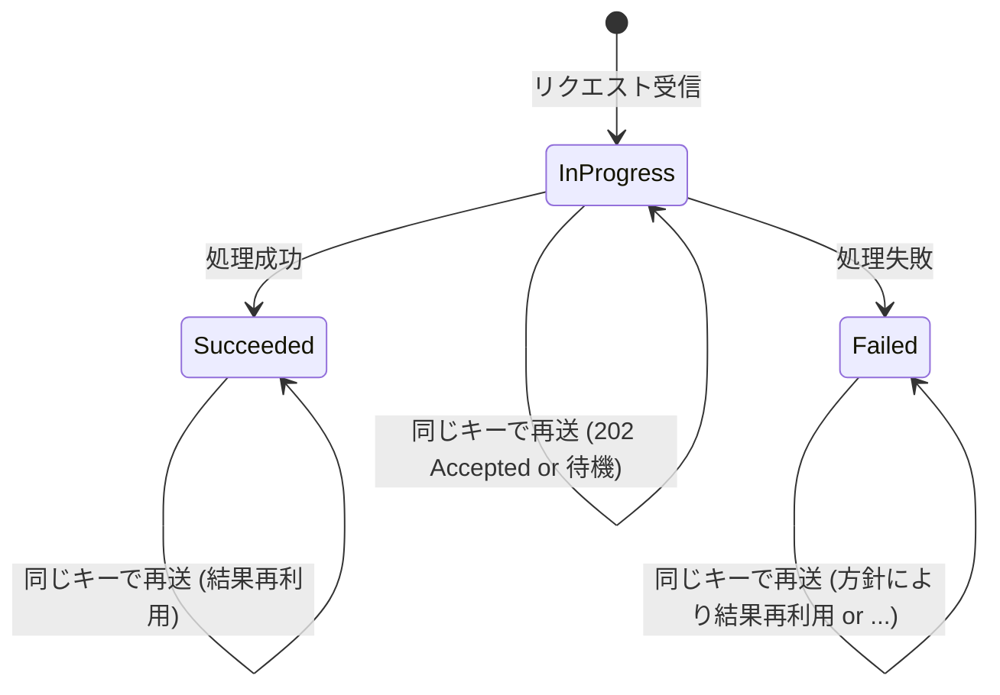
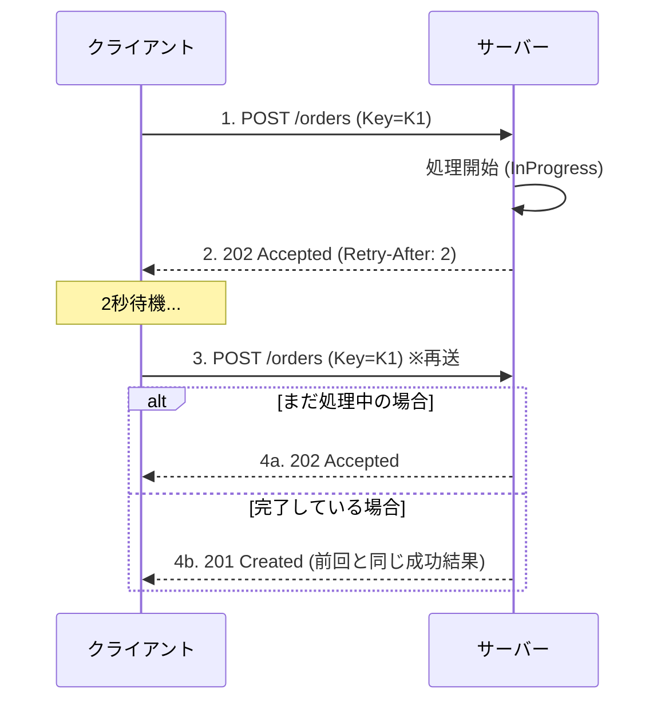

# 第16章：結果の再利用②（処理中・失敗・タイムアウトの設計）🌀⚠️


## 16.0 この章のゴール🎯

この章では、**同じ冪等キー（Idempotency-Key）** が再送されたときに、

* ✅ まだ処理中ならどう返す？
* ❌ 失敗した結果は「同じ失敗」を返す？それとも「やり直し」させる？
* ⏳ タイムアウトで結果が分からないとき、どう安全にする？

…この“実務で揉めがちな3点セット”を、迷わず設計できるようにします😊✨

---

## 16.1 まず大前提：冪等キーは「同じ試行のチケット」🎫🔑

冪等キー（`Idempotency-Key`）は、HTTP の非冪等になりがちな操作（POST/PATCHなど）を“リトライ安全”にするための仕組みとして広く使われます。 ([IETF Datatracker][1])

ここで大事な考え方はこれ👇

* **同じキー = 同じ試行（同じ注文作成の“1回分”）**
* **やり直したいなら、新しいキー = 新しい試行**

つまり、**同じキーで結果が変わるのは基本NG**です（クライアントが混乱するし、二重実行の温床😵‍💫）。

---

## 16.2 状態を3つに分けると一気に分かりやすい🧠✨


冪等キーの保存テーブル（第12章）に、最低でもこの状態を持たせます👇

1. **InProgress（処理中）** 🌀
2. **Succeeded（成功）** ✅
3. **Failed（失敗）** ❌

そして、同じキーが来たときの返し方はこう整理できます👇

* ✅ 成功 → **前回の成功レスポンスをそのまま返す**（第15章の続き）
* 🌀 処理中 → **“処理中”を返す（or 待つ）**
* ❌ 失敗 → **“失敗も再利用するか？”を方針で決める**



---

## 16.3 「処理中（InProgress）」をどう返す？3つの定番パターン🌀📮

### パターンA：2回目以降は“待って”同じ成功を返す（同期で吸収）⏳


**考え方**：
同じキーの2回目が来たら、1回目の処理が終わるまで待って、終わったら同じレスポンスを返す。

**メリット**✅

* クライアントは楽（最終結果が返ってくる）
* 202などの“処理中レスポンス設計”が不要

**デメリット**⚠️

* 待ちが長いと、サーバーの同時処理枠（スレッド/接続）が詰まりやすい
* タイムアウトの設定次第で泥沼（待ってたのに結局タイムアウト😇）

---

### パターンB：**202 Accepted + Retry-After** で「処理中」を返す（おすすめ）🌸


HTTPの `202 Accepted` は「受け取ったけど、まだ完了してないよ」を表せます。 ([MDNウェブドキュメント][2])
さらに `Retry-After` ヘッダーで「次は何秒後に来てね」を伝えられます。 ([MDNウェブドキュメント][3])

**返し方（例）**👇

* ステータス：`202 Accepted`
* ヘッダー：`Retry-After: 2`
* ボディ：処理中 + ポーリング先URL

```json
{
  "status": "processing",
  "message": "ただいま処理中だよ🌀 少し待って同じキーで再送してね🙏",
  "pollUrl": "/api/idempotency/9f0c8d7d-...."
}
```



**メリット**✅

* サーバーが詰まりにくい（待たせない）
* “長い処理”や“外部API待ち”と相性◎
* タイムアウト設計が綺麗になる✨

**デメリット**⚠️

* クライアントが“再問い合わせ（ポーリング）”を実装する必要あり

---

### パターンC：409 Conflict で「今それ処理中！」を返す😤

`409 Conflict` は「今の状態と衝突して処理できない」を表します。 ([MDNウェブドキュメント][4])
ただ、**“処理中”は衝突というより状態通知**なので、APIの雰囲気としてはパターンBの方が馴染みやすいことが多いです🌸

ちなみに実在サービスでも「処理済み or 処理中」をエラーコードで返す例があります（例：Adyenのエラーコード 704）。 ([docs.adyen.com][5])

---

## 16.4 「失敗結果」を再利用する？方針は2択＋中間案❌🔁

### 方針①：失敗も含めて“最初の結果を丸ごと保存して再生”🎥（強い）

例として Stripe は、**最初のレスポンスのステータスコードとボディを、成功/失敗に関係なく保存して再送時に同じ結果を返す**方針を明記しています（`500` も含む）。 ([Stripe ドキュメント][6])

**メリット**✅

* 「同じキー = 同じ結果」が徹底されて超分かりやすい
* タイムアウトや通信切れでも二重実行を起こしにくい（安全寄り）

**デメリット**⚠️

* 一時的な障害で `500` を踏むと、そのキーはずっと `500`（キーを変えない限り）
* “同じ注文をもう一度やりたい”場合は、クライアントが新キーを出す必要あり

---

### 方針②：成功だけ再利用。失敗は“状況によりやり直しOK”🔁


**よくある中間ルール**はこれ👇

* **4xx（入力ミス/バリデーション）**：失敗を保存して再利用（同じミスを繰り返しても同じエラーを返す）📝
* **5xx（サーバー障害）/タイムアウト**：

  * “処理が本当に失敗した”と断言できないなら、**InProgress扱いにして 202**（→ 後で確定させる）🌀
  * 断言できるなら Failed を保存して再利用（ただし運用は要注意）⚠️

**ポイント**💡
5xxやタイムアウトは、**実際には成功してるのに失敗に見える**ことがあるのが怖いところです（＝二重実行の地雷）💣

---

## 16.5 タイムアウトの“3種類”を切り分けよう⏳🧠


### (1) クライアントが先に待てなくなった（クライアント側タイムアウト）📱⌛

* サーバーは処理を続けていて、**実は成功してる**かもしれない
* だからクライアントは **同じキーで再送** が正解🔁✅

### (2) 途中で通信が切れた（ネットワーク断）📶💥

* これも結果が分からない代表
* 同じキーで再送して、サーバー側で結果を再利用できるのが理想✨

### (3) サーバー側のタイムアウト / リソース不足（503など）🖥️💦

* `503 Service Unavailable` は「今処理できない」系の代表です ([MDNウェブドキュメント][7])
* この場合も `Retry-After` がセットされることがあります ([MDNウェブドキュメント][3])

---

## 16.6 実装設計：Idempotencyテーブルに“状態＋レスポンス保存”を持たせる🗃️🛡️

### 16.6.1 追加するカラム（最小構成）🧾✨

* `Key`（ユニーク）
* `RequestHash`（同じキーで別リクエストを防ぐ）
* `State`（InProgress / Succeeded / Failed）
* `ResponseStatusCode`
* `ResponseBody`
* `ResponseContentType`
* `CreatedAt`, `CompletedAt`

> ✅ **同じキー + 違うリクエスト**は危険なので、`RequestHash` で必ず弾きます（不正利用にも強くなるよ🔒）

---

### 16.6.2 「同じキーなのに内容が違う」を 409 で止める🚫


`409 Conflict` は“状態の衝突”の表現として使いやすいです。 ([MDNウェブドキュメント][4])

```json
{
  "title": "Idempotency conflict",
  "status": 409,
  "detail": "同じIdempotency-Keyが、別のリクエスト内容で使われました😵‍💫"
}
```

---

## 16.7 ハンズオン：処理中(202) → 完了後に同じ結果を返す🧪🔁

### ステップ1：わざと処理を遅くする🐢

例：注文確定で `Task.Delay(5000)` を入れる（デモ用）

### ステップ2：同じキーで2回叩く🔁

Windowsの `curl` 例（改行継続は `^` ）👇

```bash
curl -i -X POST "http://localhost:5000/api/orders/confirm" ^
  -H "Content-Type: application/json" ^
  -H "Idempotency-Key: 9f0c8d7d-1111-2222-3333-444444444444" ^
  -d "{\"orderId\":123,\"amount\":5000}"
```

すぐ同じコマンドをもう一回実行👉
すると2回目は `202 Accepted` が返ってくる想定（処理中）🌀

### ステップ3：少し待って、同じキーで再送🔁

* まだ処理中ならまた `202`
* 終わっていれば `200/201`（成功）＋**前回と同じボディ**✅

---

## 16.8 ミニ演習📝✨

### 演習1：あなたのAPIの「処理中レスポンス」を設計しよう🌀

次を決めてね👇

* 処理中は `202`？ `409`？ どっち？
* `Retry-After` は何秒にする？
* ボディに何を入れる？（status / pollUrl / message など）

### 演習2：失敗結果の再利用ポリシーを1枚にまとめよう❌

おすすめフォーマット👇

* 4xx：再利用する？（する/しない）
* 5xx：再利用する？（する/しない/場合による）
* タイムアウト：InProgressに寄せる？ Failedにする？（理由も！）

---

## 16.9 小テスト（サクッと）✅💡

1. 同じ冪等キーで、**別のリクエスト内容**が来た。返すならどれが自然？
   A. 200 OK / B. 202 Accepted / C. 409 Conflict / D. 500 Internal Server Error

2. `202 Accepted` が表す意味として正しいのは？ ([MDNウェブドキュメント][2])
   A. 完了した / B. 受理したが完了していない / C. 不正なリクエスト / D. リソースが作成された

3. `Retry-After` は何を伝えるヘッダー？ ([MDNウェブドキュメント][3])
   A. 何秒後にリトライしてね / B. どのユーザーか / C. 暗号化方式 / D. 署名情報

---

## 16.10 AI活用プロンプト集🤖✨（コピペOK）

* 「冪等キー方式で、処理中(InProgress)を返すAPIレスポンス案を3つ。HTTPステータス、Retry-After、ボディ例つきで」
* 「失敗結果を再利用する/しないの判断基準を、4xx/5xx/タイムアウトで表にして」
* 「“クライアントがタイムアウトしたけどサーバーは成功してた”を、図解っぽい文章で説明して」
* 「このAPIの状態遷移（NotFound→InProgress→Succeeded/Failed）を、初心者向けに1枚の説明にして」

[1]: https://datatracker.ietf.org/doc/html/draft-ietf-httpapi-idempotency-key-header-07?utm_source=chatgpt.com "draft-ietf-httpapi-idempotency-key-header-07"
[2]: https://developer.mozilla.org/ja/docs/Web/HTTP/Reference/Status/202?utm_source=chatgpt.com "202 Accepted - HTTP - MDN Web Docs"
[3]: https://developer.mozilla.org/en-US/docs/Web/HTTP/Reference/Headers/Retry-After?utm_source=chatgpt.com "Retry-After header - HTTP - MDN Web Docs"
[4]: https://developer.mozilla.org/en-US/docs/Web/HTTP/Reference/Status/409?utm_source=chatgpt.com "409 Conflict - HTTP - MDN Web Docs - Mozilla"
[5]: https://docs.adyen.com/development-resources/error-codes?utm_source=chatgpt.com "Error codes and messages"
[6]: https://docs.stripe.com/api/idempotent_requests?utm_source=chatgpt.com "Idempotent requests | Stripe API Reference"
[7]: https://developer.mozilla.org/ja/docs/Web/HTTP/Reference/Status/503?utm_source=chatgpt.com "503 Service Unavailable - HTTP - MDN Web Docs"
